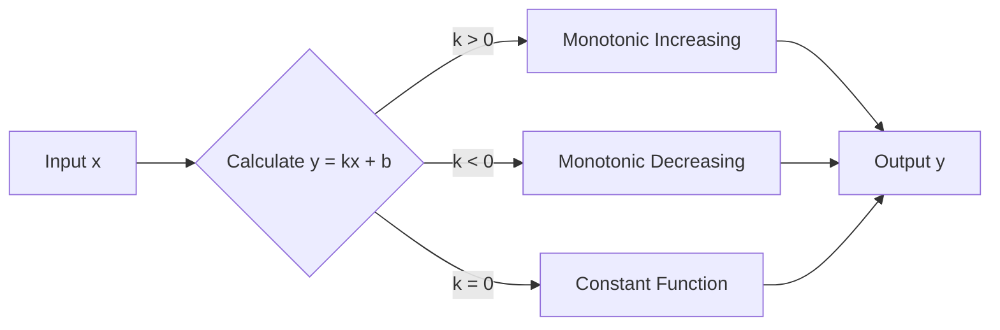
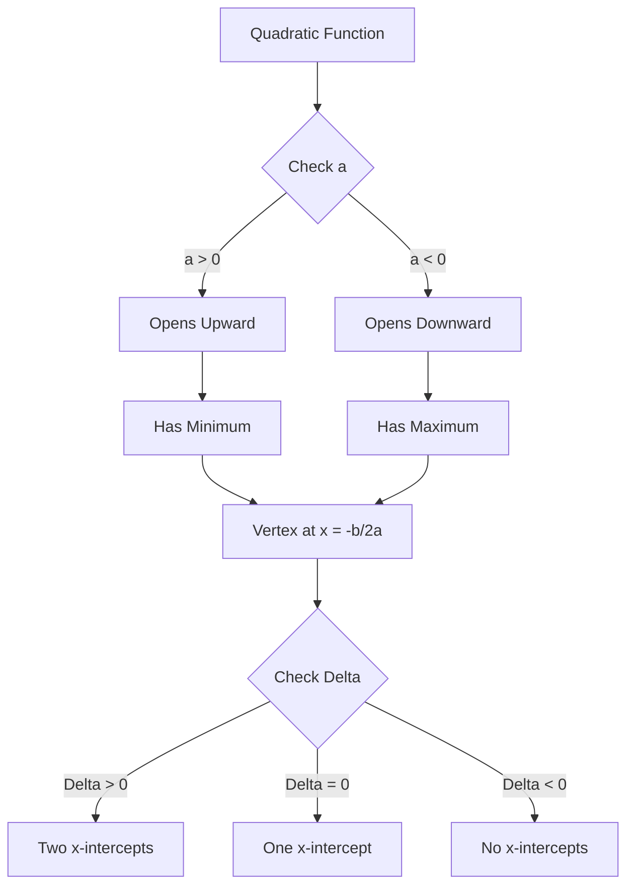
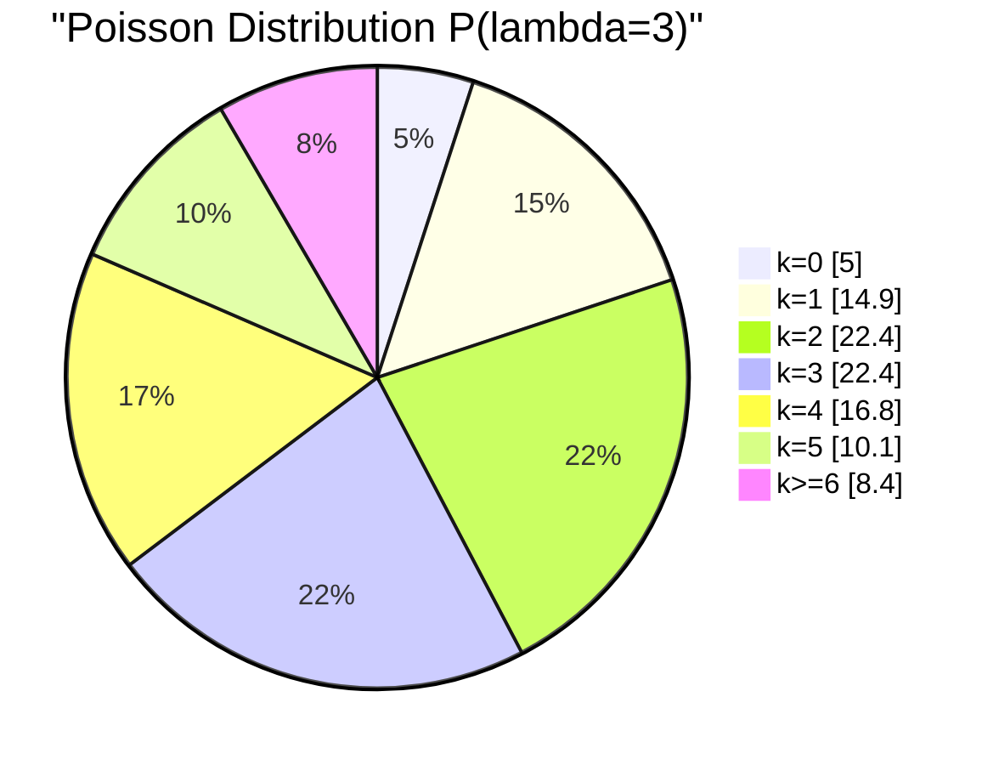
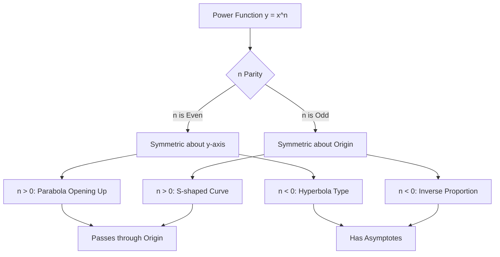
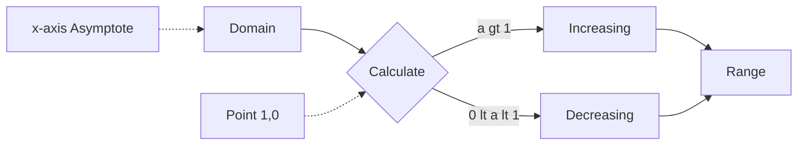
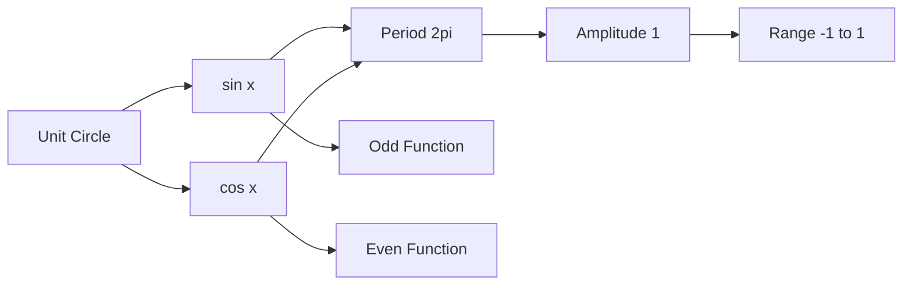
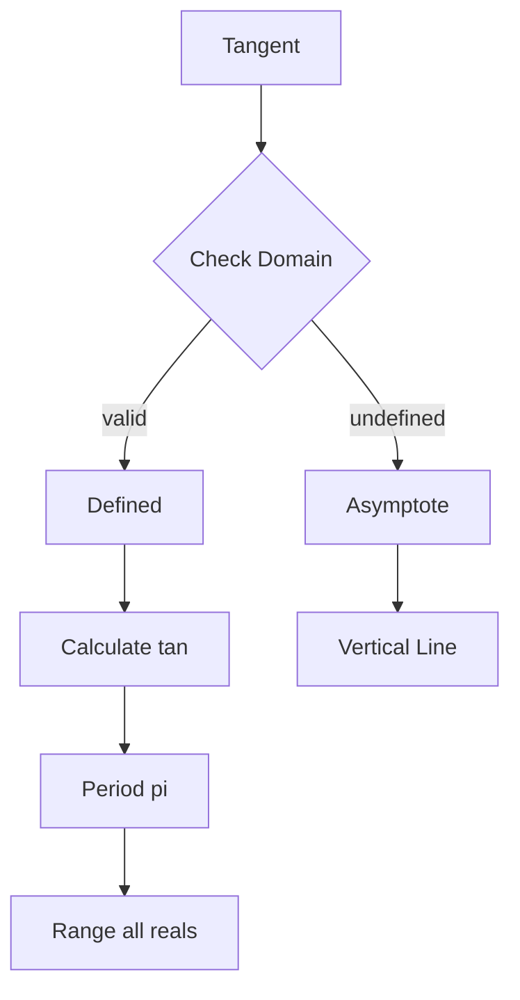

本文使用 Mermaid 流程图来展示常见数学函数的关键特性和关系，帮助你直观理解它们的性质。

## 1. 一次函数 (Linear Function)

**公式**: $y = kx + b$

一次函数是最简单的线性关系，图像是一条直线。

**特点**:
- 斜率 $k$ 决定增减性
- 截距 $b$ 决定与 y 轴交点
- 定义域和值域都是 $\mathbb{R}$

---

## 2. 二次函数 (Quadratic Function)

**公式**: $y = ax^2 + bx + c$

二次函数的图像是抛物线，具有对称性。

**特点**:
- 开口方向由 $a$ 决定
- 顶点坐标：$(-\frac{b}{2a}, \frac{4ac-b^2}{4a})$
- 判别式 $\Delta = b^2 - 4ac$ 决定与 x 轴交点个数

---

## 3. 泊松过程 (Poisson Process)

**概率质量函数**: $P(X=k) = \frac{\lambda^k e^{-\lambda}}{k!}$

泊松分布描述单位时间内事件发生次数的概率分布。

**特点**:
- 参数 $\lambda$ 表示平均发生率
- 离散型分布，取值范围为自然数
- 当 $\lambda$ 较大时近似正态分布
- 常用于建模稀有事件（如电话呼叫、放射性衰变）

---

## 4. 幂函数 (Power Function)

**公式**: $y = x^n$

幂函数根据指数 $n$ 的不同呈现不同的形态。

### 4.1 偶次幂 vs 奇次幂对比

**特点**:
- $n > 0$: 过原点，在第一象限单调递增
- $n < 0$: 双曲线型，有渐近线
- $n$ 为偶数：关于 y 轴对称
- $n$ 为奇数：关于原点对称

---

## 5. 对数函数 (Logarithmic Function)

**公式**: $y = \log_a(x)$

对数函数是指数函数的反函数。

**特点**:
- 定义域：$(0, +\infty)$
- 值域：$(-\infty, +\infty)$
- 必过点 $(1, 0)$
- x 轴是垂直渐近线
- 底数 $a > 1$ 时单调递增

---

## 6. 三角函数 (Trigonometric Functions)

### 6.1 正弦与余弦的关系

### 6.2 正切函数特性

**特点**:
- **正弦/余弦**: 周期 $2\pi$，振幅 1，有界
- **正切**: 周期 $\pi$，有垂直渐近线，无界
- 都是周期性函数
- 广泛应用于物理波动、振动等领域

---

## 总结对比

| 函数类型 | 公式 | 定义域 | 值域 | 特性 |
|---------|------|--------|------|------|
| 一次函数 | $y = kx + b$ | $\mathbb{R}$ | $\mathbb{R}$ | 直线，单调 |
| 二次函数 | $y = ax^2 + bx + c$ | $\mathbb{R}$ | 取决于 a | 抛物线，对称 |
| 泊松分布 | $P(X=k) = \frac{\lambda^k e^{-\lambda}}{k!}$ | $\mathbb{N}$ | $[0, 1]$ | 离散，概率 |
| 幂函数 | $y = x^n$ | 取决于 n | 取决于 n | 多样性强 |
| 对数函数 | $y = \log_a(x)$ | $(0, +\infty)$ | $\mathbb{R}$ | 增长缓慢 |
| 三角函数 | $y = \sin(x), \cos(x), \tan(x)$ | $\mathbb{R}$ | $[-1, 1]$ 或 $\mathbb{R}$ | 周期性 |

---

## 学习建议

1. **理解几何意义**: 通过图像直观感受函数的变化趋势
2. **掌握关键特征**: 零点、极值点、对称性、周期性
3. **实际应用**: 将抽象函数与现实问题联系起来
4. **对比学习**: 比较相似函数的异同点

> 💡 **提示**: Mermaid 图表使用 `graph` 和 `pie` 类型，这些图表在构建时被渲染为静态 SVG，支持亮色和暗色主题自动切换。如果需要更精确的函数图像绘制，建议使用专业的数学绘图工具如 Desmos、GeoGebra 或 Python 的 Matplotlib。
