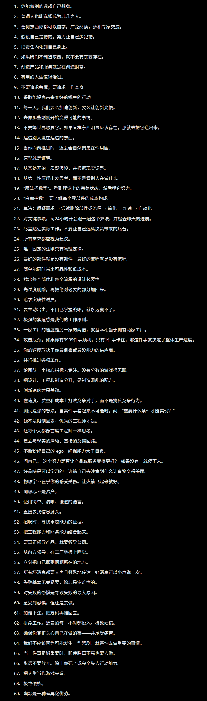

# 人生方程式

- 做一个属于自己的产品

- rust、python、c语言、r语言、go语言必学语言

- 合成生物学方向

- 金融投资

- 3d建模

- 设计师

- 摄影师

- 工程师

## 术法道
贪官要奸，清官要更奸
要不然你整不住比你坏的，他一定会弄你。
如果自己解决不了，你要找第三个人来进行协助（要是他佩服的人）
能力的尽头是解决谁的问题（问题有很多类，情绪问题，机器问题，利益问题）
提升的关键是服务的好坏（你服务不好别人不高兴，不会再来，你服务好，有回头客，那就是提升机会）
工艺有两种设计工艺和过程工艺
如果无法具有机械，那么就需要有产品专利，或者技术专利
如果产品无法用现有设备进行生产，处理方法就只有改造工具
如果具有生产设备，想盈利就必须要有**工艺**
如果只有工艺，没有生产设备，我们必须要找代工厂
工艺的产生需要实验工厂，来检验工艺的完整性和有效性
产品的盈利要看是否符合市场（创新工具，工具可以进行售卖（效率问题），创新产品，产品可以售卖（供求）
工程师解决的主要问题主要两种（创新，效率和供求问题）-解决问题
笼络人心-投其所好-处理问题

## 问题
不同的人有不同的行为模式，有的人骂你是因为你做不到他的标准，记住他抛出的问题（他为什么生气），这个行为要改适应它，只能犯一次错误，不要第二次。
人不喜欢三番四次的踩在他的雷区，而你唯一要做的事情是记住别人的雷区，如果别人不喜欢一次雷区也是致命的，但是泛泛之交雷区不要有第二次，因为你和他不是太熟。越是熟悉越要做的太好，有的时候做事不能太随便，随意。对于之后的处世问题是相当致命的。养成习惯

## 宅基地
房屋阳台和窗户在南面和东面，门面在坐西朝东，或坐北朝南。

## 认清你自己

对于人的成长，可以用简单的几句话来说，一个人的未来发展是由先天和后天~基因和生存环境，用马克思主义的观点来说，人是社会关系的总和，这就又说明了一点，你出生环境本身是一开始就有的，变相的来说在固定化的固有套路里面，他决定了人在社会关系里的下线namely机会更多，而反之对比机会机会少的人群，他的成长会更加艰难，经验不一定会比家境优越的更多。

-也就证明了一点，在最终走向的过程中，先天为确定因素，后天为不确定因素，你会感觉到一个应该还有一个未知的东西在先天和后天之中以作为桥梁的作用，我称为成长过渡态，有的人会发现，有的人不会发现。过渡态的产生有两种：不是兴趣就是耻辱。只有这样在两者之间挂钩上关系，才能成为最终的完美形态。而为什么不是兴趣就是耻辱呢？是因为做你感兴趣的事，多巴胺会推动人去探索，而耻辱会让人反思，而从中得到经验，碌碌无为的人，大概率没法认清到自己喜欢什么，不喜欢什么。我总结得出-当人足够了解自己并进行调整，就会有一个最优解的状态，这个状态就是人生方程式的最优解。所以**认清自己是关键**

镜子很脏的时候，你并不会以为是自己的脸脏。那为什么别人说出糟糕的话语时，你就要觉得糟糕的是自己呢？我们终其一生不是为了要满足每个人，只要你喜欢，每一秒都是豆蔻年华。我们不需要活在他人的言语下，外界的声音只是参考，不喜欢就不要参考，听歌吹风自愈阅己其己悦己。不纠结旁人的眼光，不困扰于无谓的评价，心有繁花，何惧浮言。往后余生以自己的步调前行，手心自暖，向阳而生，做最舒展的自己就好。

别人拥有的，不是你失去的。

不要和陌生人说话不要同情任何一个陌生人不论小孩老人

## 人的差异性

根据主观经验：我得出了一个结论，人有鲜明的独特性质，而这个独特性质是抓住一个人的核心，以及地域性差异的发展区别。
一个人最长的一块板他有两面性，骄傲和自信，而怎么用到他无外乎两种方式.

    - 赞扬，求教。容易把控

    - 任务分配，容易放心

换句话说就是专业的人做专业的事

地域性的差异发展，指的是每个地域都有他的特有属性。
such as 长沙的宣传工作做的很好，那么去长沙学习宣传策略是plausible的，福建的经商做的很好，那么学习福建的经商策略是feasible的，温州的资源利用结构是powerful的，however，学习温州的资源利用是extraordinary well的。

但是要总结共性问题：只有一点，吃饭就是吃饭，睡觉就是睡觉，扫地就是扫地，仅此而已。这才是最本质的成长途径。还要再加上一条，生亦有涯而学无涯，切记吾尝终日而思矣，不如须臾之所学也。

# 重大时间记录
今天是2026年7月5日15:11:30，我意识到我也走向了和曾国藩科举不入的最后关头，要找到那个突破口。
考研失利，数学基础不好，读书如牛饮水，囫囵吞枣。未学明白理清楚，只知读书，并未其理解其中的含义。-死读书

# 我的性格
人总是特立独行，我对你好是真的，我不喜欢你也是真，在我喜欢你的时候，应该要接受，在我不喜欢你的时候你做什么都是错的，帮你是那个时候的事情，现在不喜欢你是现在的事，你做错了一些事，我极度记仇，你不问，你不清楚，你不说，那就是你的问题，拖延从来解决不了问题。
要拎的清楚，要选的对。不要让小脑控制大脑，你有道理，我有道理。有的时候不需要理由

# 名人的共性
有一部分名人和企业家的共性，在年少时必然有过及其自卑或自我感觉屈辱的故事。安永全，李明博，毛泽东，李在明，马斯克等，这些都是个例，但是可以提取出共性，极度好强，或在年轻时期一定有拿的出手的能力，读书或专业能力极强，至少在某些领域名列前茅，他们体验过在顶端的众星捧月，极大推动自信的进步，但伴随着就是生活中极大屈辱或自卑的事情，在年少18-24岁之前，极大促进年少的目标定位，有的人为了从政，从商，至少不甘于人下，会极大突出其个人的某一方面的特性，但其负面也会伴随。但是负面的影响会在早年试错过程得到解决，并在成长过程中形成习惯（我又名为生活节奏），导致其后的生长过程中，会比普通人，缩短不必要的试错过程

# 我的自卑
我极大需要自由，又需要秩序性，我的生活环境（伴随着两种富爸爸和穷爸爸），好的我体验过，我有极大的自负感，坏的一直在经历，伴随的是自卑感，我最大的需求就是自由，不依附别人的自由，我讨厌所有不符合我规律的事情，我认为我做的就是对的，凡是不合理的事情就是错误的，因为本身就是如此，我无法摆脱原生家庭的束缚，我也无法逃脱自身的束缚，懒惰，厌恶，三心二意，无人规劝的事实，有人说，有人帮，但就是无法行动，我厌恶自己，在需要提升自己的时候，不努力，在清楚需要什么的时候，不懂的奋进。我深陷我的内心泥潭里，我要爬出我的弱点，极大暴露我的缺陷，我需要愤怒

1.广东之旅，衣服发霉，一身臭味，女生的远离，那时候刚好是考研失利，和其他室友去面试的时候，我在逃避问题，我要是那时候知道湖南梅雨季会让衣服发臭，我就不会出去，可我闻到了，还是出去了，我极其厌恶自己，因为我有过好的，但是没有人告诉我，导致我之后一定会变成衣冠禽兽（喷香水），我会开始关注外貌和外形

2.我小时候的错事，我应该即时处理我的烂摊子，那时候的无知，又我行我素，也许因为这样，我对一些事物的感知能力比其他要强。尤其是清楚，我很清楚的知道那时候的我不知道自卑，但是那时候一定会有，现在的我在悔恨。-我的家庭没有告诉我应该整理内务

3.对于不知道的事情故作知道，对于没有做过的事情过做清楚，导致事情的发生后的懊悔，我应该要学会说自己知道的事情，而不是一知半解的事情。说话可以不用废话，说重点，不用铺垫。

4.我发现我对力量的掌握不是很出众，可以说是发泄，没轻没重，我一定会脱手，羽毛球，网球，我最惊险的时候是羽毛球脱手，我争强好胜，我也必定会脱手。无可厚非，因此要进行调整的事情是进行系统训练或不难么激进。但是一定要学会四两拨千斤。
除此之外，我明确了一点，既然自卑，就没有必要找对象，只有这样才是最优解。在没有之前找对象不过是互相伤害

总结下来我要学的东西很多，而且一定要改，**关于习惯**

# 关于依附和借助的思考-关于行为
良禽择木而栖，前提是有能力的人才会选择君主

在现在社会里，依附关系的盛行变得越来越畸形，当三这个问题的出现是因为没有能力的女性依附有能力的男性，或许不一定是这个，现在的择偶关系变得需要通过找到优质男性来承担女性自己没有能力的特点，一部分不是绝对，因为相对男性，较少会体现自己的脆弱性。女性一般会表现出脆弱的一面引起男性的注意，而男性也会因为自己的雄性基因展示自身的强大，来进行求偶。在这种依附关系里，伴随着的是你的生杀大权在别人手上，你没有和别人谈判的资格，如果想清楚这一点，所有行为都是合理的。

而借助这个动词是因为，在环境不允许你进步的时候，你需要寻找一个很好的成长环境来激励你，只要身处那个环境，你伴随着的一定是见识，和远见，你会逼你自己，但是别把这个关系变成依附，你会死在里面。

所有的事件发生和行为发生都有前提和原因，所有问题的出现都是前期过程中出现的问题，如果你不够努力和方法的错误都不能够让你提前醒悟。