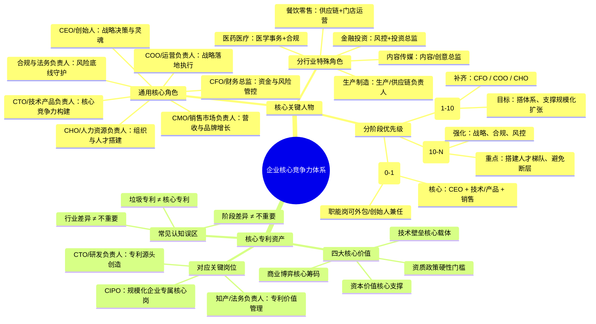

# 企业核心要素：关键人物与核心专利

企业的长期竞争力由 “核心人才” 与 “核心资产” 共同构成：关键人物是战略落地、经营运转的核心载体，核心专利是技术驱动型企业的护城河级战略资产，二者相辅相成，共同决定企业的发展上限与抗风险能力。

## 一、企业核心关键人物

企业关键人物没有统一标准答案，会随行业属性、发展阶段、业务规模动态变化，但从通用经营逻辑来看，以下 7 类角色是企业发展到一定阶段后的核心配置，不同阶段的优先级存在显著差异。

### （一）通用核心关键角色（按底层重要性排序）

1. **创始人 / 首席执行官（CEO）**
    
    企业的最高决策者与灵魂人物，核心职责是制定长期战略方向、搭建核心团队、整合内外部资源、拍板重大经营决策、塑造企业文化。其认知高度与决策能力直接决定企业的发展上限，尤其在创业早期，企业的生死几乎完全绑定创始人的判断力与资源整合能力。
    
2. **首席财务官（CFO / 财务总监）**
    
    企业的资金与风险管控核心，负责现金流管理、财务预算核算、融资与资本运作、税务筹划、成本控制与财务风险预警。现金流是企业的血液，绝大多数企业倒闭的直接原因都是资金链断裂；CFO 同时也是企业对接资本市场、控制经营成本的核心角色，是企业生存底线的守护者。
    
3. **首席运营官（COO / 运营总负责人）**
    
    战略落地的核心执行者，负责将顶层战略拆解为可落地的业务目标，搭建标准化业务流程与管理体系，统筹日常经营活动，协调各部门协同作战。很多企业战略方向正确但最终失败，核心问题就出在执行落地环节，COO 的价值就是打通 “从战略到结果” 的最后一公里。
    
4. **技术 / 产品负责人（CTO / 研发 / 产品总监）**
    
    企业核心竞争力的构建者，主导产品研发、技术迭代、技术团队管理与核心技术难题攻关。对于科技、互联网、制造、医药等产品驱动型企业，技术与产品能力是企业的护城河，直接决定产品的差异化优势与市场壁垒。
    
5. **市场销售负责人（CMO / 销售总监）**
    
    企业营收的核心发动机，负责制定营销策略、搭建销售体系、拓展客户渠道、完成业绩目标、建设品牌资产。企业的所有价值最终都需要通过营收变现，没有稳定的获客与转化能力，再好的产品也无法支撑企业持续生存。
    
6. **人力资源负责人（CHO/HR 总监）**
    
    组织能力的搭建者，负责核心人才招聘、人才培养体系建设、薪酬绩效设计、组织架构优化、企业文化落地。企业竞争的本质是人才竞争，尤其在快速扩张期，能否招募、留存、激活核心人才，直接决定企业的扩张速度与稳定性。
    
7. **合规与法务负责人**
    
    企业风险底线的守护者，负责合同审核、知识产权保护、合规体系搭建、法律纠纷处理、监管政策应对。在金融、医疗、教育、跨境电商等强监管行业，合规能力是生命线，一次严重的合规事故就可能直接导致企业停业。
    

### （二）不同发展阶段的优先级差异

- **初创期（0-1 验证阶段）**：核心目标是跑通商业模式、活下来，最关键的仅 3 类角色：创始人（CEO）+ 技术 / 产品负责人 + 销售负责人。财务、HR、法务可通过外包或创始人兼任解决，无需设置全职核心岗。
- **成长期（1-10 扩张阶段）**：核心目标是规模化复制、快速增长，必须补齐三大核心职能岗：CFO（管资金、做融资）、COO（搭体系、提效率）、CHO（招人才、建组织）。该阶段团队快速扩张，缺少专业职能负责人很容易陷入管理混乱。
- **成熟期（10-N 稳态阶段）**：核心目标是稳定增长、防控风险，需要强化战略、合规、风控类角色，同时搭建各条线的人才梯队，避免单一核心人物离职造成业务断层。

### （三）不同行业的特殊关键角色

- 生产制造行业：生产厂长 / 供应链负责人（决定产能、品质与成本控制）
- 餐饮零售行业：供应链负责人 + 门店运营负责人
- 金融投资行业：风控负责人 + 投资总监
- 内容传媒行业：内容 / 创意总监
- 医药医疗行业：医学事务负责人 + 合规负责人

## 二、核心专利的战略价值与对应角色

核心专利不属于 “关键人物” 范畴，但它是技术驱动型企业的核心战略资产，其战略价值甚至高于很多普通管理岗位，是企业长期生存的 “压舱石”，其价值落地同样依赖对应的核心岗位。

### （一）核心专利的核心价值

1. **技术壁垒的核心载体**
    
    真正的核心专利（基础专利、卡位专利）可以直接封锁竞品的技术路线，让对手无法绕开技术方案生产同类产品。比如药企的化合物核心专利、芯片的架构专利，是企业独家盈利、维持高毛利的根本前提；没有专利保护的技术优势，很容易被快速模仿消解。
    
2. **商业博弈的核心筹码**
    
    专利不仅是防守工具，更是进攻与谈判的武器。企业可以通过专利许可收取稳定收益，通过交叉授权化解侵权风险，通过专利诉讼打击竞品、争夺市场份额。全球很多科技巨头的核心盈利板块之一，就是专利运营与许可。
    
3. **资本价值的核心支撑**
    
    一级市场融资、IPO 上市、并购估值中，核心专利都是核心尽调项与估值加分项。尤其硬科技企业，有没有高价值的核心专利组合，直接决定企业的估值天花板，也是投资人判断技术壁垒的核心依据。
    
4. **资质与政策的硬性门槛**
    
    高新技术企业、专精特新、政府科研项目、税收减免等资质与政策红利，核心专利都是硬性准入条件；在跨境贸易、海外市场拓展中，专利也是规避侵权风险、合规入场的必备凭证。
    

### （二）负责核心专利的关键人物

核心专利的产出与运营，牢牢绑定两个核心岗位；规模以上硬科技企业会设立专门的**首席知识产权官（CIPO）** 进入核心管理层，直接向 CEO 汇报：

- **CTO / 研发负责人**：专利的源头创造者。核心专利的质量，本质取决于研发负责人的技术判断力、研发路线规划能力，以及对行业技术卡点的理解 —— 只有研发方向踩中行业核心赛道，产出的专利才具备壁垒价值，而非凑数的低质量专利。
- **知识产权 / 法务负责人**：专利的价值管理者。负责专利布局策略、全球申请、权利要求打磨、侵权风险排查、维权诉讼、许可交易等专业工作，能把研发成果转化为真正有法律效力、有商业价值的专利资产，避免 “研发做了十年，专利一攻就破”。

### （三）常见的认知误区

市场上 “专利不重要” 的观点，本质是三个认知偏差导致的：

1. **阶段差异≠不重要**：初创期企业优先跑通商业模式、活下来，暂缓专利布局是优先级选择，不代表专利本身没有价值；一旦企业进入扩张期、面临竞品竞争或融资，专利的价值会立刻凸显。
2. **垃圾专利≠核心专利**：大量为了凑资质、拿补贴申请的低质量专利，确实没有实际壁垒，很容易被规避，但这是专利质量问题，不是专利本身的问题。核心专利的定义，就是 “别人绕不开、能卡脖子、能变现” 的高价值专利。
3. **行业差异≠不重要**：纯贸易、纯服务、模式驱动型的企业，专利权重确实很低，但这是行业属性决定的；对所有依赖技术差异化的行业，核心专利都是生命线级别的资产。

