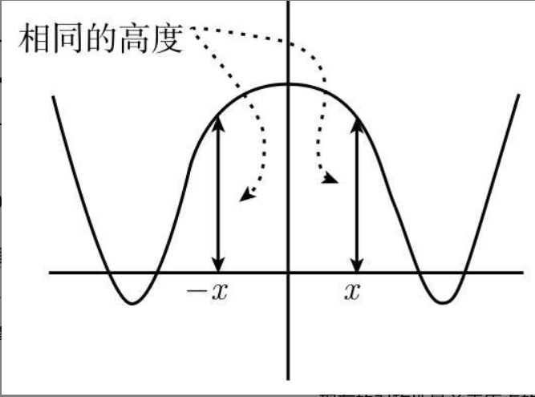
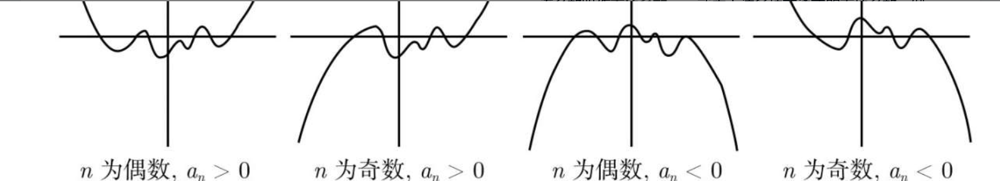
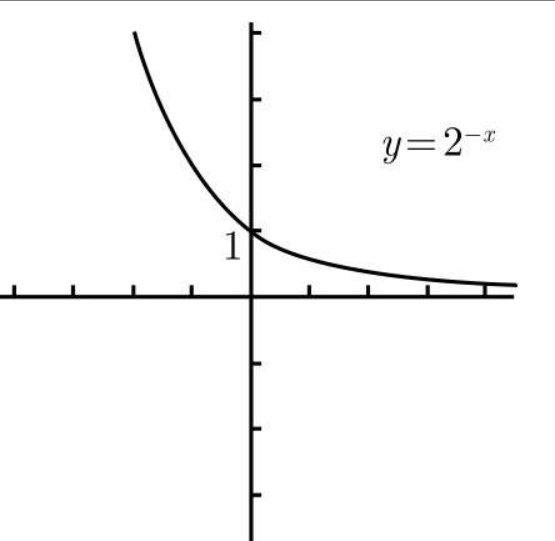
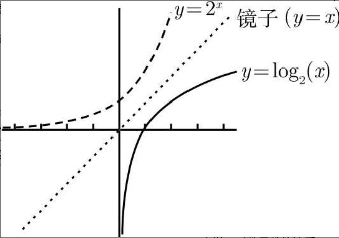
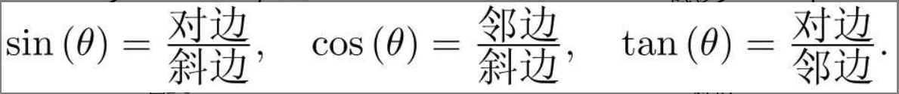
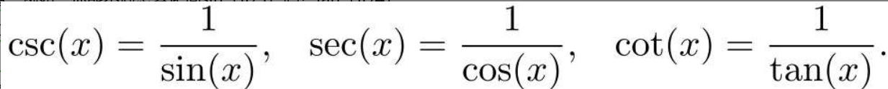
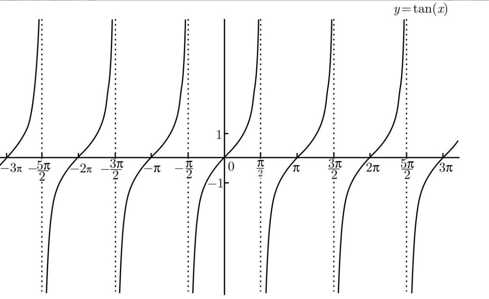

### **《普林斯顿微积分读本(修订版)》**
  
###  **1.1 函数**

- 函数是将一个对象转化为另一个对象的规则．起始对象称为输入，来自称为定义域的集合．返回对象称为输出，来自称为上域的集合。  
    
- **一个函数必须给每一个有效的输入指定唯一的输出。**  
    
- 如果$g(x)=x^2$，其定义域仅为非负数，但其上域仍是所有实数R，那么其值域还是非负数的集合．当平方每一个非负数时，结果仍然包括所有的非负数。  
    
- 像(a, b)这种形式表示的区间称作开区间。  
    
- 有时候，函数的定义中包括了定义域．  
    
- **(1)分数的分母不能是零。**

- **(2)不能取一个负数的平方根(或四次根，六次根，等等).**

- **(3)不能取一个负数或零的对数．(还记得对数函数吗？若忘了，请看看第9章！) ** 
    
- 这个集合可以写作$(-8, 13] / \{2\}$，这里的反斜杠表示“不包括”.  
    
- 函数的图像非常重要：它真正地展示了函数“看起来是什么样子的”．  
    
- 什么是函数f的图像呢？它是所有坐标为$(x, f(x))$的点的集合，其中x在f的定义域中．  
    
- 这里的关键思想是，你不可能有两个点有相同的x坐标  
    
- 可以分割并改变上半圆和下半圆，只要不违反垂线检验就行了  
    
- 垂线检验通过，所以这确实是一个函数的图像。  
    

  

###  **1.2 反函数**

  

- 如果你选一个实数y，那么应该赋予f什么样的输入才能得到这个输出y呢？  
    
- 例如$f(x)=x^2$(其定义域为R)，我们的问题是x取何值时会输出64．很显然，有两个x值：8和-8．另外，如果$g(x)=x^3$，对于相同的问题，这时只有一个x值，就是4  
    
- 在理想状况下，仅有一个x值满足$f(x)=y$．如果上述理想状况对于值域中的每一个y来说都成立，  
    
- **从输出y出发，这个新的函数发现一个且仅有一个输入x满足$f(x)=y$．**这个新的函数称为f的反函数，并写作$f^{-1}$ 
    
- 从一个函数f出发，使得对于在f值域中的任意y，都只有唯一的x值满足$f(x)=y$．也就是说，不同的输入对应不同的输出．  
    
- 现在，我们就来定义反函数$f^{-1}$.

- (2)$f^{-1}$的定义域和f的值域相同。

- (3)$f^{-1}$的值域和f的定义域相同。

- (4)$f^{-1}(y)$的值就是满足$f(x)=y$的x．所以，如果$f(x)=y$，那么$f^{-1}(y)=x$.  
    
- 变换$f^{-1}$就像是f的撤销按钮：如果你从x出发，并通过函数f将它变换为y，那么你可以通过在y上的反函数$f^{-1}$来撤销这个变换的效果，取回x.  
    
- 最好的方法也许是看一下函数图像．我们想要在f值域中选择y，并且希望只有一个x值满足$f(x)=y$．这就意味着通过点$(0,y)$的水平线应该和图像仅有一次相交，且交点为点$(x,y)$．  
    
- 如果是那样，获得反函数唯一的方法就是对定义域加以限制  
    
- **水平线检验：如果每一条水平线和一个函数的图像相交至多一次，那么这个函数就有一个反函数．**如果即使只有一条水平线和图像相交多于一次，那么这个函数就没有反函数．  
    
- **没有一条水平线和$%$y=f(x)$相交多于一次，所以f有一个反函数 ** 
    
- 如果通过$y=x^2$来求解x，其中y为正，那么就会出现两个解：$ x=\sqrt{y}$和$ x=-\sqrt{y}$.结果你不知道该取哪一个。  
    
- 在$f(x)=x^3$的例子中，有$f(x)=x^3$，所以$x=\sqrt[3]{y}$．这就意味着，$f^{-1}(y)=\sqrt[3]{y}$．如果你觉得变量y刺眼，可以将它改写为x，写成$f^{-1}(y)=\sqrt[3]{x}$当然了  
    
- **基本思想是，在图像上画一条$y=x$的直线，然后将这条直线假想为一个双面的镜子．反函数就是原始函数的镜面反射．**  
    
- 原始函数f在$y=x$这面“镜子”中被反射，从而得到反函数  
    
- 最后要处理第三个问题：如果水平线检验失败因而没有反函数，那应该怎么办呢？我们面临的问题是，对于相同的y有多个x值．解决此问题的唯一方法是：除了这多个x值中的一个，我们放弃所有其他值．也就是说，必须决定要保留哪一个x值，然后放弃剩余的值  
    
- 这条新的(实线的)曲线将定义域缩减为$[0,\infty)$，并且满足水平线检验，所以它有反函数．更确切地说，定义在定义域$[0,\infty)$上的函数h有反函数，其中$h(x)=x^2$ 
    
- 为了找到反函数的方程，我们必须在方程$y=x^2$中解出x．很明显，问题的解就是$x=\sqrt{y}$或$x=-\sqrt{y}$，但是我们需要哪一个呢？  
    
- 它也满足$j(x)=x^2$，但只是在这个定义域上才成立．  
    
- 这说明了垂线检验和水平线检验之间的联系，即水平线被镜子$y=x$反射后会变成垂线。  
    
- 如果f有反函数，那么对于在f定义域中的所有x,$f^{-1}(f(x))=x$成立；同样，对于在f值域当中的所有y，都有$f(f^{-1}(y))=y$.  
    
- 例如$f(x)=x^3$,f的反函数由$f^{-1}(f(x))=\sqrt[3]{x}$ = $y=\sqrt[3]{x}$ = $x=\sqrt[3]{y}$给出  
    
- 不要忘记，反函数就像是撤销按钮．我们使用x作为f的输入，然后给出输出到$f^{-1}$；这撤销了变换并让我们取回了x这个原始的数  
    
- 换句话说，反函数的反函数就是原始函数。  
    
- 但由于粗心大意而把函数继续看成是g而不是先前小节中那样的h．我们便会说$g^{-1}(x)=\sqrt{x}$．如果你真要计算$g(g^{-1}(x))$，你就会发现它是$(\sqrt{x})^2$，即等于x，只要x≥0.(当然，不是这样的话，从一开始你就无法取得平方根．)  
    
- 以便提醒自己要更加小心．不过在实践中，数学家们在限制定义域时经常不会改变字母！所以把这种情形总结如下对大家是很有帮助的。  
    
- $f^{-1}(f(x))$可能不等于x；事实上，$f^{-1}(f(x))=x$仅当x在限制的定义域中才成立。  
    

  

###  **1.3 函数的复合**

  

- 后一个例子需要特别注意小括号，若写成$g(x+5)=x+5^2$就是错的，因为x+25并不等于$(x+5)^2$．所以在替换过程中如果拿不准，  
    
- 唯一不需要加小括号的情况是，当函数是指数函数时，如$h(x)=3^x$，你可以写成$h(x^2+6)=3^{x^2+6}$．不需要加小括号是因为你已经将$x^2+6$写成上标了。  
    
- 鉴于我们可将$f(x)$的计算分解成前后相继的两个独立的计算，我们也就可以将这些计算各描述成一个函数．  
    
- 你可先将x输入到函数g进行求平方运算，接着不必返回g的结果而直接让g将其结果作为函数h的输入  
    
- **$f=h◦g$，这里的圈表示“与……的复合”，即f是g与h的复合．换言之，f是g与h的复合函数** 
    
- 我承认这确实容易让人搞混，但我也没办法——你只能试着去接受。  
    
- 同样，你需要练习该过程的逆过程．例如，假定你开始于函数  
    
- 利用复合符号，可以写成$f =m◦k◦j◦h◦g$.这并不是函数f的唯一分解形式  
    
- 或许最初(包含j和h)的分解较好一点，因为它将f分解成更多的基本形式，  
    
- 函数的复合并不是把它们相乘  
    
- 先求哪个值都没关系，这与复合函数不同  
    
- 函数的乘积和复合是不同的，且函数的复合与函数顺序有关系，而函数的乘积与函数顺序无关。  
    
- 那么如何画$y=(x-1)^2$的图像呢？就像画$y=x^2$的图像一样，只是用$x-1$来代替x．所以可将函数$y=x^2$的图像向右平移1个单位，  
    

  

###  **1.4 奇函数和偶函数**

  

- 对所有的x，有$f(-x)=f(x)$．也就是说，将x作为f的输入和将$-x$作为输入，会得到一样的结果  
    
- 如果对f定义域里的所有x有$f(-x)=f(x)$，则f是偶函数．这个等式对某些x值成立是不够的，**它必须对定义域里的所有x都成立**。  
    
- 当对f定义域内所有x都有$f(-x)=-f(x)$时，f是奇函数。  
    
- 一般而言，一个函数可能是奇的，可能是偶的，也可能非奇非偶．要记住这一点，大多数函数是非奇非偶的．另一方面，只有一个函数是既奇又偶的，它就是非常单调的对所有x都成立的f(x)=0(我们称之为零函数)．它为什么是唯一的既奇又偶的函数呢？  
    
- 另一个有用的结论是，**如果一个函数是奇的，并且0在其定义域内，则$f(0)=0.$**  
    
- 我们先来看下第二个问题，然后再讨论第一个问题．当知道一个函数的奇偶性之后，一个比较好的事情就是画函数图像比较容易了  
    
- 我们先讨论当f是偶函数时的情形．**因$f(x)=f(-x)$,$ y=f(x)$的图像在x和-x坐标上方具有相同的高度，且对所有的x都成立**，如图1-10所示。  

- 偶函数的图像关于$y$轴具有镜面对称性  
    
- 奇函数．因$f(-x)=-f(x),y=f(x)$图像在x坐标上方和-x坐标下方具有相同的高度．  
    
- 奇函数的图像关于原点有180◦的点对称性  
    
- 然后将整个曲线旋转半圈，这样就得到左半边图像的样子了  
    
- 现在假设f定义为$f(x)=log_5(2x6-6x2+3)$，你怎么确定f是奇函数、偶函数，还是都不是呢？  
    
- 它也不是原始函数本身，所以函数h是非奇非偶的  
    
- 利用f和g的奇函数性质将等式右边表示为(-f(x))(-g(x))，负号提到前面消掉  
    
- $h(-x)=f(-x)g(-x)=(-f(x))(-g(x))=f(x)g(x)=h(x) $ 
    
- 以证明两偶函数之积仍为偶函数，奇函数和偶函数之积是奇函数．  
    

  

###  **1.5 线性函数的图像**

  

- 其中一点很容易找，就是y轴的截距．设x=0，很显然$y=m×0+b=b$．也就是说，y轴的截距为b，  
    
- 不过，这种方法在两种特殊情况下不适用。  
    
- 直线$y=-2x$通过原点和$(1,-2)$，  
    
- 当$m=0$，这时函数变为$y=b$，是一条通过$(0,b)$的水平直线。  
    
- 如果你知道这条直线通过某一固定的点以及它的斜率，那就能很容易地找到它的方程．  
    
- 如果已知直线通过点$(x_0, y_0)$，斜率为m，则它的方程为$y-y_0=m(x-x_0)$.  
    
- 有时你不知道直线的斜率，但知道它通过哪两点．那怎样求它的方程呢？  
    
- 如果一条直线通过点$(x_1,y_1)$和$(x_2,y_2)$，则它的斜率等于$y-y_0=m(x-x_0)$.  
    
- 你会发现，无论使用哪一个点，最后得到的结果都是相同的。  
    

  

###  **1.6 常见函数及其图像**

  

- 多项式有许多函数是基于x的非负次幂建立起来的．你可以以$1、x、x_2、x_3$等为基本项，然后用实数同这些基本项做乘法，最后把有限个这样的项加到一起．  
    
- 多项式的图像左右两端的走势倒是容易判断．这是由最高次数的项的系数决定的，该系数叫作首项系数  
    
- 实际上，我们只需考虑首项系数正负以及多项式次数的奇偶就能判断图像两端的走势了．所以图像两端的走势共有如下四种情况  

    
- 上述图像的中间部分是由多项式的其他项决定的．上图仅仅是为了显示图像左右两端的走势．在这个意义上，多项式$5x^4-4x^3+10$的图像同最左边的图像类似，因为n=4为偶数，$a_n=5$为正数。  
    
- 根据判别式的符号可以判断二次函数到底有两个、一个还是没有实数解．  
    
- 对于前两种情况，解为$\frac{-b \pm \sqrt{b^2 - 4ac}}{2a}$  
    
- **y轴的截距为1**  
    
- $y=2^{-x}$的图像是$y=2^x$关于y轴的对称，如图1-19所示。  

- 由于$y=2^x$的图像满足水平线检验，所以该函数有反函数．这个反函数就是以2为底的对数函数$y=log_2(x)$．以直线$y=x$为镜子，$y=log_2(x)$的图像如图1-20所示。  

- 该函数的定义域为$(0,\infty)$，这也印证了我之前所说的负数和0不能求对数的说法  
    
- 你一定要学会怎样画它们的图像．我们将在第9章学习对数函数的性质。  
    
- 除了三角函数要在下一章讲外，这是我在函数部分要讲解的所有内容．但愿你之前已经见过本章中的许多内容，因为其中的大部分知识将在微积分中被反复使用，所以你需要尽快掌握这些知识。  
    

  

###  **2.1 基本知识**

  

- 度量的角=$\frac{\pi}{180}$×用度度量的角。例如，要想知道5π/12弧度是多少度，可求解$\frac{5\pi}{12} = \frac{\pi}{180} \times \text{用度计量的角}$你会发现5π/12弧度就是$(180/π)×(5π/12)=75^◦$．  
    
- 转换因数就是π弧度等于180◦.  
    
- 显然，你必须知道如何由三角形来定义三角函数．假设我们有一个直角三角形，除直角外的一角被记为θ，如图2-3所示．那么，基本公式为  

- 我们也会用到余割、正割和余切这些倒数函数，它们的定义分别为  

- 请熟记常用角$0, π/6, π/4, π/3, π/2$的三角函数值．  
    
- 如果你不能，那么最好的情况下，你通过画三角形来寻找答案，从而白白浪费时间；  
    
- 表中的星号表示$tan(π/2)$无定义．事实上，正切函数在$π/2$处有一条垂直渐近线  
    
- 就算我求大家了，请背熟这张表！数学不是死记硬背，但有些内容是值得记忆的，而这张表一定位列其中．  
    

  

###  **2.2 扩展三角函数定义域**

  

- 来想象一下，你自己站在原点上，面向x轴的正半轴．现在沿着逆时针方向转动角θ，然后你沿着一条直线向前走．你的足迹就是你要找的那条射线了  
    
- 如果你转动了角2π，那么就又会回到了你起始的那个位置，即面向x轴的正半轴．这就好像你根本没转动过！这就是为什么图中会有$0≡2π$．对于角度而言，0和2π是等价的。  
    
- 图2-6注意到我们将这条射线标记为θ，而不是这个角本身  
    
- 有了这三个量，我们就可以定义如下的三个三角函数了：  
    
- 7/6大于1但小于3/2，故7π/6在π和3π/2之间．  
    
- 这个小角被称为参考角．一般来说，θ的参考角是在表示角θ的射线和x轴之间的最小的角，它必定介于0到π/2  
    
- 而我们只需从中选出正确的结果．我们发现，结果是负的那个，因为y是负的。  
    
- 定为负，因为那里的y为负．类似地，在第二或第三象限中的任意角的余弦必定为负，因为那里的x为负．正切是比值$\frac{y}{x}$，它在第二和第四象限为负(由于x和y中的一个为负，但不全为负),而在第一和第三象限为正。  
    
- 事实上，你只需要记住图表中的字母ASTC就行了．它们会告诉你在那个象限中哪个函数为正．“A”代表“全部”，意味着所有的函数在第一象限均为正．显然，其余的字母分别代表正弦、正切和余弦．  
    
- **三角函数值的总结**

- (1)画出象限图，确定在该图中你感兴趣的角在哪里，然后在图中标出该角。

- (2)如果你想要的角在x轴或y轴上(即没有在任何象限中)，那么就画出三角函数的图像，从图像中读取数值.
- (3)否则，找出在代表我们想要的那个角的射线和x轴之间最小的角，这个角被称为参考角。

- (4)如果可以，使用那张重要的表来求出参考角的三角函数值．那就是你需要的答案，除了你可能还需要在得到的值前面添一个负号。

- (5)使用ASTC图来决定你是否需要添一个负号。  
    
- 还有一个问题，就是如何取大于2π或小于0的角的三角函数．事实上，这并不太难，简单地加上或减去2π的倍数，直到你得到的角在0和2π之间  
    

  

###  **2.3 三角函数的图像**

  

- **该图像关于原点有$180^◦$点对称性，这意味着，sin(x)是x的奇函数.$**
    
- 注意到该图像关于y轴有镜面对称性．这说明，cos(x)是x的偶函数  
    
- 与正弦函数和余弦函数不同的是，正切函数有垂直渐近线．此外，它的周期是π，而不是2π．因此，上述图样可以被重复以便得到$y=tan(x)$的全部图像，如图2-19所示。  

- 当x是π/2的奇数倍数时，y=tan(x)有垂直渐近线(因而此处是无定义的)  
    
- $y=sec(x)、y=csc(x)及y=cot(x)$  
    
- 从它们的图像中，可以得到所有六个基本三角函数的对称性的性质，这些也都值得学习。  
    

  

###  **2.4 三角恒等式**

  

- (有时，根据这些恒等式，用正弦和余弦来代替每一个正切和余切会有帮助，但这只是你被卡住时不得已而为之的下下策．)  
    
- 三角函数之间还有其他一些关系．你注意到了吗？一些函数的名字是以音节“co”开头的．这是“互余”(complementary)的简称．说两个角互余，意味着它们的和是π/2(或90◦)．可不是说它们相互恭维．好吧，不玩双关了，事实是有以下一般关系：  
    
- $三角函数(x)=co-三角函数(\frac{π}{2}-x) $ 
    
- 余角的余角就是原始的角！  
    
- $sin(A+B)=sin(A)cos(B)+cos(A)sin(B)cos(A+B)=cos(A)cos(B)-sin(A)sin(B)$.  
    
- $sin(A-B)=sin(A)cos(B)-cos(A)sin(B)cos(A-B)=cos(A)cos(B)+sin(A)sin(B)$.  
    
- 但更有用的是使用毕达哥拉斯定理$sin^2(x)+cos^2(x)=1$将$cos(2x)$表示成为$2cos^2(x)-1$或$1-2sin^2(x) $ 
    
- $sin(2x)=2sin(x)cos(x)cos(2x)=2cos2(x)-1=1-2sin2(x)$.  
    
- 那么如何用sin(x)和cos(x)来表示sin(4x)呢？我们可以将4x看作两倍的2x，并使用正弦恒等式，写作$sin(4x)=2sin(2x)cos(2x)$．然后应用两个恒等式，得到$sin(4x)=2(2sin(x)cos(x))(2cos^2(x)-1)=8sin(x)cos^3(x)-4sin(x)cos(x)$.类似地，$cos(4x)=2cos^2(2x)-1=2(2cos^2(x)-1)2-1=8cos^4(x)-8cos^2(x)+1$.  
    
- 如果你能够掌握本章涉及的所有三角学内容，就能够很好地学习本书的剩余部分了．因此，抓紧时间消化这些知识吧．做一些例题，并确保你记住了那张很重要的表格和所有方框公式。  
    

  

###  **第3章 极限导论**

  

- 如果没有极限的概念，那么微积分将不复存在．  
    
- 因此，本章仅仅包含对极限的直观描述；正式描述请参见附录A.总的来说，以下就是我们会在本章讲解的内容：

· 对于极限是什么的直观概念；

· 左、右与双侧极限，及在∞和-∞处的极限；

· 何时极限不存在；· 三明治定理(也称作“夹逼定理”).  
    

  

###  **3.1 极限：基本思想**

  

- 3.1 极限：基本思想  
    
- 需要理解的是：当x非常非常接近于a，但不等于a时，f(x)是什么样子的？这是一个非常奇怪的问题，人类相对晚近才发展出微积分很可能就是因为这个原因吧  
    
- (x)→1当x→2.这个写法更难用来计算，但其意义很清晰：当x沿着数轴从左侧或者从右侧趋近于2时，f(x)的值会非常非常接近于1(并保持接近的状态！)   
      
    
- 变量x只是一个虚拟变量．它是一个暂时的标记，用来表示某个(在上述情况下)非常接近于2的量．它可以被替换成其他任意字母，只要替换是彻底的；同样，当你求出极限的值时, 结果不可能包含这个虚拟变量.  
    

  

###  **3.2 左极限与右极限**

  

- 极限描述了函数在一个定点附近的行为  
    
- h(3)=2实际上是无关紧要的  
    
- 在上面第一个极限中3后的小减号表示该极限是一个左极限，第二个极限中3后的小加号表示该极限是一个右极限．要在3的后面写上减号或加号，而不是在前面，这是非常重要的！  
    
- 通常的双侧极限在x=a处存在，仅当左极限和右极限在x=a处都存在且相等  
    
- 在这种情况下，这三个极限(双侧极限、左极限和右极限)都是一样的．用数学的语言描述，我们说，[插图]等价于[插图]如果左极限和右极限不相等，例如上述例子中的函数h，那么双侧极限不存在．我们写作[插图]  
    

  

###  **3.3 何时不存在极限**

  

- 当相应的左极限和右极限不相等时双侧极限不存在．  
    
- 另一方面，考虑函数g,其定义为g(x)=1/x2，其图像如图3-5所示。  
    
- “f在x=a处有一条垂直渐近线”说的是，[插图]和[插图],其中至少有一个极限是∞或-∞.  
    
- 正如你看到的，当接近于0的时候，它们都挤在了一起．由于在每一个x轴截距之间，sin(x)向上走到1或向下走到-1，因此，sin(1/x)也一样．把目前已知的画出来，可得到图3-7.[插图]  
    
- 它无限地在1和-1之间振荡，当你从右侧向x=0处移动时，振荡会越来越快．这里没有垂直渐近线，也没有极限[插图]．  
    
- 当x从右侧趋于x=0时，该函数不趋于任何数．因此可以说，[插图]不存在(DNE)．我们会在下一节将y=sin(1/x)的图像补充完整。  
    

  

###  **3.4 在∞和-∞处的极限**

  

- ，研究当变量x趋于∞时函数的行为．我们想写出[插图]并以此表示，当x很大的时候，f(x)变得非常接近于值L，并保持这种接近的状态．(更多详情请参见附录A的A.3.3节．)重要的是要意识到，写出“[插图]”表示f的图像在y=L处有一条右侧水平渐近线．类似地，当x趋于-∞时，我们写出[插图]  
    
- 像y=x2这样的函数没有任何水平渐近线  
    
- 另外，极限也有可能不存在．例如，[插图]会变得越来越接近何值(并保持这种接近状态)呢？它只是在-1和1之间来回振荡，因此绝不会真正地接近任何地方．此函数没有水平渐近线，也不会趋于∞或-∞；你所能作的最好回答是，[插图]不存在(DNE).  
    
- 于sin(0)=0，那么sin(1/x)就会非常接近于0. x越大，sin(1/x)就会越来越接近于0．我的论证有点粗略，但希望能说服你相信[插图]  
    
- 事情不是太糟糕，因为f是一个奇函数．理由是[插图]  
    
- 注意到我们使用了sin(x)是x的奇函数的事实来由sin(-1/x)得到-sin(1/x).这样一来，由于奇函数有一个很好的性质，就是其图像关于原点对称(参见1.4节),可以完整地画出y=sin(1/x)的图像，如图3-8所示。[插图]图3-8  
    
- 有趣的是，我们不打算把0看作是个小的数：它就是零．  
    
- · 如果一个数的绝对值是非常大的数，则这个数是大的；· 如果一个数非常接近于0(但不是真的等于0)，则这个数是小的。  
    
- 正如之前看到的，它表示当x是一个足够大的数时，f(x)的值就会几乎等于L．可问题是，多大才是“足够大”呢？这取决于你想让f(x)距离L有多近！  
    
- 在左图中，当x至少是100时，f(x)看上去非常接近于L，因此，任何比100大的数都是大数．在右图中，f(100)远离L,因此，现在的100就不是足够大了．在这种情形下，你可能需要走到200．  
    
- 顺便说一下，我们会经常使用术语“在∞附近”来代替“大的正的数”.(在字面意义上说，一个数不可能真的在∞附近，因为∞无穷远．不过在x→∞时的极限的语境中，“在∞附近”的说法还是说得通的．)  
    
- 在这种情况下，我们有时会说“在-∞附近”来强调我们所指的是大的负的数。  
    

  

###  **3.5 关于渐近线的两个常见误解**

  

- y=tan-1(x)(或反三角函数y=arctan(x)  
    
- 一个函数的确可以有不同的右侧和左侧水平渐近线，但最多只能有两条水平渐近线(一条在右侧，另一条在左侧)  
    
- 这和垂直渐近线相反：一个函数可以有很多条垂直渐近线(例如，y =tan(x)有无穷多条垂直渐近线  
    
- ．sin(x)的值在-1和1之间振荡，因此，sin(x)/x的值在曲线y=-1/x和y=1/x之间振荡．  
    
- 图3-11图像中用虚线表示的曲线y=1/x和y=-1/x形成了正弦波的包络．  
    
- 这意味着，x轴是f的水平渐近线，尽管y=f(x)的图像与x轴一次又一次地相交．为了证明上述极限，我们需要应用所谓的三明治定理．这个证明就在下一节的结尾部分。  
    

  

###  **3.6 三明治定理**

  

- 三明治定理(又称作夹逼定理)说的是，如果一个函数f被夹在函数g和h之间，当x→a时，这两个函数g和h都收敛于同一个极限L，那么当x→a时，f也收敛于极限L.  
    
- 一如往常，一图胜千言(见图3-12).[插图]图3-12在图像中用实线表示的函数f被夹在其他两个函数g和h之间；当x→a时，f(x)的极限被迫趋于L.(三明治定理的证明参见附录A的A.2.4节．)对于单侧极限，我们也有一个类似版本的三明治定理，只是这时不等式g(x)≤f(x)≤h(x)仅在a的我们关心的一侧成立．例如，  
    
- 只是现在，前面有一个x致使函数陷于包络y=x和y=-x之间．图3-13是x在0和0.3之间时的函数图像。[插图]图3-13  
    
- 要怎样证明g(x)≤f(x)≤h(x)呢？我们将会用到任意数(在我们的例子中是1/x)的正弦都处于-1和1之间这一事实：[插图]现在用x乘以这个不等式，由于x>0，得到[插图]而这正是我们需要的g(x)≤f(x)≤h(x)．最后，注意到[插图]  
    
- 因此，由于当x → 0+时，夹逼的函数g(x)和h(x)的值收敛于同一个数0，所有f(x)也一样．也就是说，证明了( )[插图]要记住，如果前面没有因子x，上式显然不成立；正如我们在3.3节看到的，当x→0+时，sin(1/x)的极限不存在。  
    
- 为了证明此式，需要用到三明治定理一个稍有不同的形式，涉及在∞处的极限．在这种情况下，如果对于所有的很大的x，都有g(x)≤f(x)≤h(x)成立；又如果已知[插图]且[插图]．就可以说，[插图]．  
    
- 还要用到，对于所有的x，都有-1≤sin(x)≤1，但这次，对于所有的x>0，要用该不等式除以x得到[插图]  
    
- 如果对于所有在a附近的x都有g(x)≤f(x)≤h(x)，且[插图].  
    
- 当a是∞或-∞时它也适用；在那种情况下，要求对于所有的非常大的(分别是正的或负的)x，不等式成立。  
    

  

###  **3.7 极限的基本类型小结**

  

- (1)在x=a时的右极限，见图3-14．这时在x=a的左侧以及x=a处f(x)的行为是无关紧要的．(也就是说，当讨论右极限时，对于x≤a, f(x)取何值都不要紧．事实上，对于x≤a, f(x)甚至不需要被定义．)[插图]  
    
- (2)在x=a时的左极限，见图3-15．这时在x=a的右侧以及x=a处f(x)的行为是无关紧要的。[插图]图3-15  
    
- 双侧极限存在并等于左右极限值．f(a)的值是无关紧要的。[插图]图3-16  
    
- (4)在x→∞时的极限，见图3-17.[插图]图3-17(5)在x→-∞时的极限，见图3-18.[插图]图3-18  
    

  

###  **第4章 求解多项式的极限问题**

  

- 当你取两个多项式的比的极限时，真正要紧的是注意到极限是在哪里取的．特别是，处理x→∞和处理x→a(对于某个有限的数a)的技巧是完全不同的．因此，我们将对涉及下列函数类型的极限分开研究：· x→a时的有理函数；· x→a时的涉及平方根的函数；· x→∞时的有理函数；· x→∞时的类多项式(或“多项式型”)函数的比；· x→-∞时的有理函数/多项式型函数；· 涉及绝对值的函数。  
    

  

###  **4.1 x→a时的有理函数的极限**

  

- 你首先总是应该尝试用a的值替换x  
    
- ，简化为0/0.这被称作不定式  
    
- 唯一的问题出在当x=2时，因为那时分母(x-2)就等于0，而这就说不通了  
    
- 因为这时，f(x)和g(x)在x=2处的值是无关紧要的，只有那些在x=2附近的f(x)和g(x)的值才有关紧要  
    
- a3-b3=(a-b)(a2+ab+b2).  
    
- 由于是要取极限，只需要关注x在3附近的情况；因此，能够消去分子和分母中的公因子(x-3)(它们永远不会等于0)  
    
- 要是分母为0但分子不为0又会怎么样呢？在那种情况下，将总会牵扯到一条垂直渐近线，即有理函数的图像在你感兴趣的x值上会有一条垂直渐近线．但这里的问题是，会有四种情形出现  
    
- 在图4-1所示的每一幅图里，f是一个我们关心的有理函数，图下面则是x=a处的各种极限。[插图]图4-1那么你又如何分辨出你在处理的是这四种情形中的哪一种呢？其实，你只需要查看一下f(x)在x=a两边的符号就可以了．例  
    
- 关键因子是(x-1)3，当x>1时它为正，而当x<1时为负．因此，  
    
- 当x比1大一点的时候，f(x)是负的；而当x比1小一点的时候，f(x)是正的．  
    
- 特别是，我们可以看到双侧极限[插图]不存在，而单侧极限存在(尽管它们是无穷大)；具体来说，[插图]现在，假设对极限做了微小的改变，使它成为[插图]  
    
- 一切又会怎样呢？当x接近于1时，分子仍然是负的，且因子x依然是正的，但(x-1)2呢？由于它是一个平方，当x接近1但不等于1时，它必定是正的．因此，现在有下列情形：[插图]现在在x=1的两边有负值，因此必定有[插图]当然，左极限和右极限也都是-∞.  
    

  

###  **4.2 x→a时的平方根的极限**

  

- 你需要做的是，把分子分母同时乘以[插图]，也就是[插图]的共轭表达式．  
    
- 这看起来更复杂了，但某种好事情即将发生  
    
- 这个例子的要义在于，如果你碰到一个平方根加上或减去另外一个量，可以试着把分子分母同时乘以其共轭表达式  
    

  

###  **4.3 x→∞时的有理函数的极限**

  

- 技术上讲，这可以描述为“和的极限等于极限的和”；这在所有的极限都是有限的时候成立．因此，我们要分别考虑这四个量．第一个是1，不管x是什么，它总是1．第二个量是-1000/3x．当x变大时，它会怎么样呢？也就是说，注1如果极限不是有限的，它就不成立！试考虑[插图]．对于任意的x，都有(x+(1-x))=1，因此，此极限是1．另一方面，这两个单独的(x)和(1-x)的极限是[插图]和[插图].第一个极限是∞，第二个极限是-∞，但∞+(-∞)=1不成立．事实上，表达式∞+(-∞)是无意义的。  
    
- 其中p和q为多项式，我们可以说：(1)如果p的次数等于q的次数，则极限是有限的且非零；(2)如果p的次数大于q的次数，则极限是∞或-∞；(3)如果p的次数小于q的次数，则极限是0.(当x→-∞，相应极限为[插图]  
    

  

###  **4.4 x→∞时的多项式型函数的极限**

  

- 考虑函数f, g和h，此三个函数分别被定义为[插图]这些都不是多项式，因为它们含有分数次数或n次根，但它们看起来有点像多项式．事实上，上一节的方法也适用于这类对象．因此，我称它们为“多项式型函数”.处理多项式型函数的原理与处理多项式的类似，只是这次首项是什么可能不会那么清晰．平方根(或立方根、四次根等)的出现会造成很大干扰．例如，让我们考虑[插图]  
    
- 在平方根符号下的部分是多项式16x4+8，且它的首项为16x4.如果你对其取平方根，你会得到4x2．因此，你应该想象分子就像是4x2+3x．它的首项为4x2，所以我们就用它了  
    
- 问题的解如下：[插图]你一定要切实理解了后两个求解过程的每一步．  
    
- 但问题是，消去分子中的2x3，似乎就没剩下什么了！  
    
- 分子分母同时乘以分子的共轭表达式．所以在看到首项之前，需要做一些准备工作：  
    
- 可在立方根符号内合并这些项，消去公因式，得到  
    
- 现在必须把另一个2x3加上去，得到分子总的“首项”,2x3+2x3，即4x3．  
    
- 由分子分母同时乘以分子的共轭表达式开始，  
    
- 剩下需要你做的已经不多了，但你应该试着把以上所有的片断组合成一个完整的解。  
    

  

###  **4.5 x→-∞时的有理函数的极限**

  

- 如果x<0，并且想写[插图]，那么需要在xm之前加一个负号的唯一情形是，n是偶的而m是奇的。  
    

  

###  **第5章 连续性和可导性**

  

- 一般而言，函数的图像只有一点比较特殊：它必须满足垂线检验．这并没有要求特别多．图像可以散落四处：这里有一部分，那里有一条垂直渐近线，或者随心所欲地在各处散落任意个不连续的点．所以现在我们想要看看，如果对函数图像要求略微多一点会发生什么：我们将要讨论两种类型的光滑性．首先是连续性，直觉告诉我们，连续函数的图像必须能一笔画成．其次是可导性，直觉上，在可导函数的图像中不会出现尖角．在这两种情形中，我们都将深入地讨论其定义，并了解满足这些特殊要求的函数具有的一些性质．详细地说，以下是我们将在本章中所要研究的内容：· 在一点处及在一个区间上连续；· 连续函数的一些例子；· 连续函数的介值定理；· 连续函数的最大值与最小值；· 位移、平均速度和瞬时速度；· 切线和导数；· 二阶导和高阶导；· 连续性和可导性的关系。  
    

  

###  **5.1 连续性**

  

- 我们先从一个函数是连续的，这到底意味着什么开始．  
    
- 这对于像y=x2这样的函数来说没有问题，因为整个图像在一块；但对于像y=1/x这样的函数，这就有一点儿不公平了．要不是在x=0处有一条垂直渐近线，把图像分成了两部分，它的图像本来可以是在一块的．事实上，如果f(x)=1/x，那么可以说，除了在x=0外，f处处连续．  
    
- 如果[插图]，函数f在点x=a处连续。  
    
- 如果极限不存在，那么f在点x=a处不连续，而如果f(a)不存在，那么你彻底完蛋了：那里甚至都没有一个点(a,f(a))可以让你通过！  
    
- (1)双侧极限[插图]存在(并且是有限的)；(2)函数在点x=a处有定义，即f(a)存在(并且是有限的)；(3)以上两个量相等，即[插图]  
    
- 在标号为1的图中，在x=a处的左极限和右极限不相等，则双侧极限不存在，所以函数在点x=a处不连续．在标号为2的图中，左极限和右极限都存在且是有限的，并且左右极限相等，故双侧极限存在；然而，函数在点x=a处无定义，因此，函数在点x=a处不连续．在标号为3的图中，双侧极限也存在，函数在点x=a处有定义，但极限值和函数值不相等，再一次地，函数在点x=a处一次不连续．另一方面，在标号为4的图中，由于双侧极限在点x=a处存在，f(a)存在，并且极限值和函数值相等，因此，函数的确在点x=a处连续．顺便说一下，前三个图中的函数在点x=a处有一个不连续点。  
    
- 注意到f实际上没有必要在端点x=a或x=b上连续．例如，如果f(x)=1/x，那么f在区间(0,∞)上连续，即使f(0)无定义．该函数在区间(-∞,0)上也连续，但在区间(-2,3)上不连续，因为0位于此区间内，而f在那里不连续。  
    
- 对于形如[a,b]的区间又如何呢？对此我们不得不稍微灵活些．例如，图5-2是函数在其定义域[a,b]上的图像；我们想说它在[a,b]上连续．但问题是，双侧极限在端点x=a和x=b处不存在：在点x=a，只有一个右极限；而在点x=b，只有一个左极限．不过没有关系，只需利用端点处适当的单侧极限来略微修改一下定义．因此，我们说函数f在[a,b]上连续，如果  
    
- 1)函数f在(a,b)中的每一点都连续；(2)函数f在点x=a处右连续；即，[插图]存在(且有限), f(a)存在，并且这两个量相等；以及(3)函数f在点x=b处左连续；即，[插图]存在(且有限), f(b)存在，并且这两个量相等。  
    
- 很多的常见函数都是连续的．例如，每一个多项式都是连续的．这看起来好像不太好证明，因为有很多不同的多项式，但事实上并不是那么难证明．首先，让我们证明定义为f(x)=1的常数函数f，对于所有的x，在任意一点a处都连续．也就是说，需要证明[插图]  
    
- 显然上式成立，因为所有的一切都不依赖于x和a．现在，设g(x)=x. g是连续的吗？这时需要证明[插图]由于g(x)=x且g(a)=a，这就将问题简化为证明[插图]  
    
- 如果对两个连续函数做加法、减法、乘法或复合，会得到另一个连续函数  
    
- 不管怎样，让我们回到多项式．因为g(x)=x是x的连续函数，可以让g和它自己相乘，看到x2也是x的连续函数．你想要多少个x和它自己相乘都可以，这样可以证明x的任意次幂(作为x的函数)的连续性．然后，可以乘以常数系数，并将不同次幂相加在一起，得到任意一个多项式——并且每一个仍然是连续的！  
    
- 结果证明，所有的指数函数和对数函数都是连续的，同样所有的三角函数也是如此(除了在它们的渐近线上)．  
    
- 考虑函数f，其定义为f(x)=xsin(1/x)．在3.6节有过它的图像(至少是当x>0时的图像)．其实把图像扩展到x<0是很容易的，因为f是一个偶函数．为什么呢？记得sin(x)是x的奇函数，于是有[插图]  
    
- 那么在x=0处发生了什么呢？显然，f在x=0不连续，因为它在那里甚至都没有定义(图像上这里有一个洞)．让我们来定义一个函数g如下，将这个洞堵上：  
    
- 因此，除了在x=0(此时g等于0，而f无定义)外，g(x)=f(x)．因此，g必然是处处连续的，而f除x=0外处处连续．现在需要来看看在x=0处发生了什么．由于g(0)有定义，这就有了希望．此外，可以使用3.6节的三明治定理来证明[插图]通过对称性(或再次使用三明治定理)，可以看到左极限也等于0．事实上，双侧极限也为0：[插图]因此，就证明了[插图]  
    
- 因为等号两边都存在且等于0．这意味着，g在x=0处实际上是连续的，尽管它是一个分段函数的形式。  
    
- 它将“附近的”与“在”联系了起来  
    
- 也就是说，除了在x=2处，f是处处连续的．因此，f在x=-1上是连续的，这就意味着，[插图]用其定义替换f，有[插图]  
    
- 在实践中，很少有数学家会不厌其烦地把这些细节都写出来，但这样做会有助于你理解你在做什么！  
    
- 知道一个函数是连续的会有很多好处．我们将看看其中两个好处．第一个被称为介值定理．其基本思想是：假设一个函数f在一个闭区间[a,b]上连续．此外，假设f(a)<0且f(b)>0．因此，在y=f(x)的图像上，点(a,f(a))位于x轴的下方，而点(b,f(b))位于x轴的上方，如图5-4所示。  
    
- 现在，如果必须用一条曲线(当然它要满足垂线检验)来连接这两个点，并且不允许抬起笔来，直觉上显然有，你的笔将与x轴上a和b之间的某处至少相交一次．交点也许在a的附近或b的附近，或者在a和b中间的某处，但必须相交至少一次．这就是说，x轴截距在a和b之间的某处．在这里，函数f在区间[a,b]上的每一点都是连续的  
    
- 不连续点让函数在x轴上发生跳跃而不通过x轴．因此，需要在整个区域[a,b]上的连续性．这也适用于从x轴上方开始并在x轴下方结束的情况，即如果f(a)>0且f(b)< 0，并且f在[a,b]上的每一点都连续，那么在[a,b]上的某处，必定会有一个x轴截距．  
    
- 介值定理：如果f在[a,b]上连续，并且f(a)< 0且f(b)> 0，那么在区间(a,b)上至少有一点c，使得f(c)=0．代之以f(a)>0且f(b)<0，同样成立。  
    
- 首先，假设要证明多项式p(x)=-x5+x4+3x+1在x=1和x=2之间有一个x轴截距．你只需注意到，由于它是一个多项式，所以p是处处连续的(包含[1,2])；此外，计算p(1)=4>0且p(2)=-9<0．由于p(1)和p(2)的符号相反，且p在[1,2]上连续，我们知道在区间(1,2)上至少存在一点c使得p(c)=0．数c就是多项式p的一个x轴截距。  
    
- 如何证明方程x=cos(x)有一个解呢？不需要求出解来，只需要证明存在一个解．  
    
- 不过这样的图像式论证，虽然不无说服力，但对于一个数学证明来说，还远远不够．那么如何能够做得更好呢？  
    
- 第一步是使用一个小窍门：将所有表达式放到等号左边．因此，我们试着来求解x-cos(x)=0，而不是求解x=cos(x)．现在，设f(x)=x-cos(x)．如果可以证明存在数c使得f(c)=0的话，任务就算完成了．来检验一下这是否说得通：如果f(c)=0，那么c-cos(c)=0，因此c=cos(c)，于是就找到了方程x=cos(x)的一个解，它就是x=c.  
    
- 现在，该使用介值定理了．我们需要找到两个数a和b，使得f(a)和f(b)其中一个是负的而另一个是正的．由于从图像中可知答案会在π/4附近，我们将保守地选取a=0和b=π/2．来检验一下f(0)和f(π/2)的值吧．首先，f(0)=0-cos(0)=0-1=-1，它是负的；其次，f(π/2)=π/2-cos(π/2)=π/2-0=π/2,它是正的．由于f是连续的(它是两个连续函数的差)，根据介值定理可以得出，在区间(0,π/2)上存在某个数c使得f(c)=0，于是证明了x=cos(x)有一个解．我们不知道解在哪里，也不知道会有多少解，只是知道在区间(0,π/2)上至少有一个解．(注意，解实际上不是π/4！事实上，不可能找到一个有关解的很好的表达．)  
    
- 这里有一个稍有不同的变体．到目前为止，都是规定f(a)<0且f(b)>0(或反过来)，然后得出结论，在(a,b)上存在一点c使得f(c)=0．然而现在，可以用任意数M来替换0，且结果依然成立．因此，假设f在[a,b]上连续；如果f(a)<M且f(b)>M(或反过来)，那么在(a,b)上存在一点c使得f(c)=M．例如，如果f(x)=3x+x2，那么方程f(x)=5有解吗？显然f是连续的；我们也可以猜出解在0和2之间，这样会有f(0)=1和f(2)=13．由于数1和13夹着目标数5(一个小一点而另一个大一点)，介值定理告诉我们，对于(0,2)上的某个c有f(c)=5.  
    
- 事实上，变体并没有给我们提供任何新的东西，它只是有时候会让生活变得更简单些。  
    
- 所以p(A)和p(B)的符号相反．由于p是一个多项式，它是连续的，于是根据介值定理，在A和B之间有一个数c，使得p(c)=0．这就是说，p有一个根，尽管不知道它在哪儿．这也没办法，毕竟不知道p是什么样子的多项式，只知道它是奇数次的。  
    
- 接着来看知道一个函数是连续的所带来的第二个好处．假设有一个函数f，它在闭区间[a, b]上连续．(这里区间的两个端点都是闭的非常重要．)  
    
- .这里的问题是，能画多高？换句话说，这条曲线能够达到的高度有限度吗？回答是肯定的，一定有一个最高点，尽管曲线可以多次达到最高点。  
    
- 用符号表达即为，定义在区间[a,b]上的函数f在x=c处有一个最大值，如果f(c)是f在整个区间[a,b]上的最大值．即  
    
- 对于类似的问题，“能画多低”，我们也有同样的说法，即f在x=c处有一个最小值，如果f(c)是f在整个区间[a,b]上的最小值．即对于[a,b]上所有的x, f(c)≤f(x).再一次地，区间[a,b]上的任何连续函数在该区间上都有最小值．  
    
- 最大值与最小值定理：如果f在[a,b]上连续，那么f在[a,b]上至少有一个最大值和一个最小值。  
    
- 允许有多个最小值，只要至少有一个  
    
- 那么为什么需要函数f是连续的？并且，为什么不能是一个像(a,b)那样的开区间？图5-7显示了一些潜在的问题。  
    
- 该函数没有最大值，它只会在渐近线的左侧无限上升  
    
- 无论你想到一个多么接近于b的数，你总是可以取该数与b的平均数得到另一个更接近于b的数．因此，该函数没有最大值．  
    
- 如果你知道函数在区间[a, b]上连续，你只能仰赖定理来确保最大值与最小值的存在性。  
    

  

###  **5.2 可导性**

  

- 现在该来看看函数能够具有的另一种光滑性——可导性．这实质上意味着函数有导数．  
    
- 照片无法告诉你距离(那辆车没有动)或时间(照片实质上是捕捉了一瞬间)．因此，你无法回答我的问题  
    
- 仍旧，你如何知道汽车在那一分钟里的速率是一样的呢？在那一分钟里，它可能会有多次的加速和减速．你不知道在那一分钟的开始时刻它究竟开得有多快  
    
- 因此我们将使用位移来代替距离  
    
- 如果汽车只向一个方向行驶，没有后退的话，那么距离就是位移的绝对值。  
    
- 速度可以是负的，而速率必定是非负的．  
    
- 一般而言，就像位移，如果汽车沿着一个方向行驶，那么平均速率就是平均速度的绝对值。  
    
- 现在就可以准确地计算平均速度vt↔u了：[插图]  
    
- 不管怎么说，现在来取u→t时的极限：  
    
- 再来看一个稍有变化的变体．我们定义h=u-t．由于u非常靠近t，两时刻的差值h一定非常小．确实，当u→t时，可以看到h→0．如果在上述极限中作如此替换的话，由于u=t+h，也会有[插图]  
    
- 该公式和前一个公式没有实质性差别，只是写法不同而已。  
    
- 因为是它造成了所有的麻烦．现在，就可以将h=0代入并看到[插图]  
    
- 平均速度的图像阐释：在位置与时间的图像上，它就是连接点(t, f(t))和(u, f(u))的直线的斜率。  
    
- 这些直线看上去好像越来越接近点(t,f(t))处的切线．由于瞬时速度是这些直线在u→t时的极限，于是，瞬时速度就等于通过点(t,f(t))的切线的斜率．  
    
- 设h=z-x，可以看到，当z→x时，有h→0，从而也有[插图]当然，这只有当极限确实存在的时候才说得通！  
    
- 这些直线有不同的斜率．也就是说，切线的斜率取决于你选取的点x的值．换句话说，通过(x,f(x))的切线的斜率是x的一个函数．这个函数被称为f的导数，并写作f′．我们说，对f关于变量x求导得到函数f′．根据上一节结尾部分的公式，如果极限存在的话，有[插图]  
    
- 在这种情况下，f在x点可导．如果对于某个特定的x，极限不存在，那么x的值就没有在导函数f′的定义域里，即f在x点不可导．有很多原因会导致极限不存在．  
    
- 比如说，那里有一个尖角，就像前述y=|x|的例子中那样．从更基本的层次上说，如果x没有在f的定义域中，那么甚至不可能画出点(x,f(x))，更不用说在那里画一条切线了。  
    
- 速度正是位置关于时间的导数。  
    
- ，f(x)=x2的导数由f′(x)=2x给出．这意味着，抛物线y=x2在点(x, x2)的切线的斜率就是2x  
    
- 必须求出量f(x+h)的值．这个量是什么呢？其实，如果y=f(x)，将x变为x+h，那么f(x+h)只是一个新的y值．量h代表对x作了多少改变，  
    
- f′(x)并不真正地等于∆y和∆x的比值，它等于当∆x趋于0时该比值的极限  
    
- 魔力数字12仅仅当从x=6开始的时候才会起作用．如果从x=13开始的话，魔力数字就是f′(13)了  
    
- 不管怎样，我们在第13章讲解线性化时将返回到这些基本思想上来．现在再来看看公式[插图]  
    
- 现在我们不写∆x，它表示“x中的变化”，而是写dx，它表示“x中的十分微小的变化”．  
    
- 尽管如此，这给了我们灵感，可以用一种不同的且更方便的方法来写导数：如果y=f(x)，那么可以用[插图]来代替f′(x).例如，如果y=x2，那么[插图]．  
    
- 总而言之，量[插图]是y关于x的导数．如果y=f(x)，那么[插图]和f′(x)是一回事．最后，请记住，量[插图]实际上根本不是一个分数，它是当∆x→0时分数[插图]的极限。  
    
- 曲线y=f(x)在点(x,f(x))处的切线的斜率．在这个例子中，y=mx+b的图像就是斜率为m、y轴截距为b的一条直线．显而易见，该条直线上任意一点的切线就是这条直线本身！  
    
- 线性函数的导数是常数  
    
- 顺便说一下，如果f是常数函数，即f(x)=b，那么其斜率总是0．特别是，对于所有的x, f′(x)=0．因此，这证明了常数函数的导数恒为0.  
    
- 由于可以由一个函数f出发，取其导数得到一个新的函数f′，实际上可以采用这个新的函数，再次求导．最终得到导数的导数，这被称为二阶导，写作f′′.  
    
- 如果y=f(x)，那么可以用[插图]代替f′′(x)  
    
- 在4.6节，该极限不存在．这意味着，f′(0)的值无定义，即0没有在f′的定义域中．  
    
- 如果将它由一个双侧极限改为单侧极限，那么以上极限存在．特别是，右极限是1，左极限是-1．这激发了右导数和左导数的思想，其定义分别为[插图]它们看起来和普通导数的定义很相似，只是双侧极限(即当h→0)分别由右极限和左极限所代替．跟在极限的情况一样，如果左导数和右导数存在且相等，那么实际的导数存在且有相同的值．同时，如果导数存在，那么左右导数都存在且都等于导数值。  
    
- 由于左侧斜率不等于右侧斜率，所以在x=0处导数不存在。  
    
- 这种怪异的函数超出了本书的研究范围，但我要顺便提及，这种类型的函数可以用来为股价建模——如果你曾经看到过股价的图像，就会知道我说的起伏多刺是什么意思了．  
    
- 每一个可导函数也是连续的  
    
- 如果一个函数f在x上可导，那么它在x上连续。  
    
- 例如，将在第7章证明，sin(x)作为x的函数是可导的．这将自动暗示它在x处也是连续的．同样的结论也适用于其他的三角函数、指数函数和对数函数(除了在它们的垂直渐近线处).  
    
- 证明f在x上连续，需要证明   
    
- 式变为   
    
- 我们需要证明等号两边都存在且相等——那样的话，就完成任务了。  
    
- 因此根据f′的定义，极限  存在．首先注意到，上式中包含了f(x)，那么它一定存在，否则上式就无从谈起  
    
- 一方面，通过将它分成两个因子，可以求出该极限为   
    
- 由于所有涉及的极限都存在，所以这样做没问题．(这里需要用到事实，f′(x)存在，不然就有问题了．)另一方面，可以取原始极限并消去因子h得到   
    
- 比较一下这两个式子，就会得到  当然，f(x)的值根本不依赖于极限，因此可以将它提出来，得到  现在，只需将f(x)加到等号两边，得到  而这正是我们想要的！特别是，等号左边的极限存在并且等式成立．因此，我们证明了一个很好的结论：可导函数必连续．不过要记住，连续函数并不总是可导的！  
    

  

###  **第6章 求解微分问题**

  

- 现在，我们要看看如何应用上一章中的一些定理来求解微分问题．我们可以利用公式求导，但这很笨拙．因此，我们会看到一些能让生活变轻松的法则．总之，以下是我们在本章要讲解的内容： · 使用定义求导； · 使用乘积法则、商法则和链式求导法则； · 求切线方程； · 速度和加速度； · 求导数伪装的极限； · 如何对分段函数求导； · 使用一个函数图像来画出其导函数的图像。  
    

  

###  **6.1 使用定义求导**

  

- 假设要对f(x)=1/x关于x求导．从上一章中可知，导数的定义是  因此，现在有  在分式中，如果只是用0替换h，结果就会得到一个的不定式．因此，需要多计算一点．在这里，基本思想是通过通分来化简分子．你会得到  现在从分子分母中消去h，然后通过设h=0求极限值：  也就是说，   
    
- 为了求的导数，必须利用在4.2节中使用过的技巧．具体如下：  我们再次遇到00的情况．将分子和分母同时乘以分子的共轭表达式，得到  现在，可以在分子上消去x这一项，从分子和分母中消去h，然后求极限，得到  总而言之，这就证明了   
    
- 你会如何求f(x)=+x2的导数呢？即使你能够直接写出答案，但我要求的是使用导数的定义，所以你必须撇开一切诱惑并使用公式  这看起来很杂乱，但如果将它分成含有平方根的项和含有平方的项，会看到  我们知道该如何来求这两个极限；刚刚第一个极限是，而在5.2.6节求得第二个极限是2x．你应该试着不看前面的求解过程自己做一遍，并确保得到正确答案   
    
- 要是从第一个因子中提取h，然后从其他因子中提取x,  
    
- 事实上，有n种方法来选取一个h和其余的x，因此实际上有n个hxn-1．加在一起，会得到nhxn-1．在展开式中，每隔一项至少有两个h，因此每隔一项就含有一个带h2的因子．总之，可以写成 (x+h)n=(x+h)(x+h)…(x+h)=xn+nhxn-1+含有因子h2的项 稍作整理：将用h2×(垃圾)代表“含有因子h2的项”，其中“垃圾”就是含有x和h的多项式．也就是说， (x+h)n=(x+h)(x+h)…(x+h)=xn+nhxn-1+h2×(垃圾). 现在，可以将以上形式带入导数的公式里：  
    
- 当a是任意实数时，  用文字表述就是：提取次数，将它放在最前面作系数，然后再将次数减少1.  
    
- 事实上，这就是说1/x的导数是-1/x2，这一点我们在本节开始的时候已经知道了！这个例子会经常出现，你应该特别掌握。  
    

  

###  **6.2 用更好的办法求导**

  

- 我们将会看到如何使用简单的运算(函数的常数倍、函数的加法、减法、乘法、除法以及复合函数)用形如xa的原子来构造f，而对于xa我们已经知道如何求导了  
    
- 顺便说一下，如果意识到可以将x3/2写成，也可以将以上导数写作  类似地，x5/2就是就是，等等  
    
- 处理函数乘积的时候要更麻烦些——不能只是将两个导数乘在一起．例如，不做展开  
    
- 积法则(版本1)如果h(x)=f(x)g(x)，那么h′(x)=f′(x)g(x)+f(x)g′(x).  
    
- 你看，需要用左下方的f′(x)和右上方的g(x)相乘，然后用左上方的f(x)和右下方的g′(x)相乘，并将它们相加在一起．  
    
- 确实有时候，必须处理y=用x表示的项，而不是f(x)的形式．  
    
- 积法则(版本2)如果y=uv，则   
    
- 积法则(三个变量)如果y=uvw，那么   
    
- 不过，我确实要提醒的是，你不总是能将所有的一切都展开．有时候只能使用乘积法则  
    
- 你在下一章学了如何对三角函数求导之后，只能使用乘积法则来求像x sin(x)这样的导数．但真的不能将这个表达式展开——它已经是展开的形式了．因此，如果想要对它关于x求导，那就避免不了要使用乘积法则。  
    
- 商法则(版本1)如果 ， 那么   
    
- 注意到除了正号变成了负号外，等号右边分式的分子与乘积法则中的分子是一样的．在例子中，需要对f和g求导并将结果汇总如下： f(x)=2x3-3x+1 g(x)=x5-8x3+2 f′(x)=6x2-3 g′(x)=5x4-24x2. 根据商法则，由于h(x)=f(x)/g(x)，有   
    
- 乘积法则一样，这里还有另外一种版本．如果你面对  并想求出dy/dx，那么就从设u=3x2+1及v=2x8-7开始，这样y=u/v．现在我们使用：  
    
- 商法则(版本2)如果，那么  
    
- [插图]  
    
- ：   
    
- 根据商法则，   
    
- 链式求导法则(版本1)如果h(x)=f(g(x))，那么h′(x)=f′(g(x))g′(x).  
    
- 链式求导法则(版本2)如果y是u的函数，并且u是x的函数，那么   
    
- 一旦你掌握了，事情就没有看上去那么难。  
    
- 其次，你可能会认为链式求导法则是显而易见的．毕竟，在前面的方框公式中，不是能够消去因子du吗？回答是否定的．回想一下，诸如dy/du和du/dx这样的表达式其实不是分数，它们是分数的极限  
    
- 链式求导法则实际上可以同时多次运用．例如，令 y=((x3-10x)9+22)8, 那么dy/dx是什么呢？我们令u=x3-10x及v=u9+22，这样y=v8．然后，使用一个更长形式的链式求导法则：  稍作思考，你就不会弄错：y是v的函数，v是u的函数，u是x的函数，因此公式只可能是现在这个样子！不管怎样，我们有   
    
- 将所有的一切代入，得到  
    
-  快大功告成了，但还需要除掉u项和v项．首先，用u9+22替换v：  然后用x3-10x替换u，并合并因子8和9，得到真正的答案：   
    
- 以上主要使用了链式求导法则的第二种形式，但有时应用链式求导法则的第一种形式也会事半功倍．例如，对于某个函数g和h，如果知道h(x)=，且g(5)=4以及g′(5)=7，那么仍然可以求出h′(5)．我们设f(x)=，这样h(x)=f(g(x)),然后使用上述公式h′(x)=f′(g(x))g′(x)．由于f(x)=，有f′(x)=；因此，  现在，将x=5代入，得到  由于g(5)=4及g′(5)=7，有   
    
- 再来看一个例子：假设j(x)=g()，其中g的情况如上．j′(25)会是什么呢？现在，有j(x)=g(f(x))，其中．这一次的结果是  因此，如果x=25，由于g′(5)=7，有   
    
- 复合的顺序非常重要！  
    
- 回到开头提到的函数f：  为了求出f′(x)，必须使用前几节中的法则将f分解为较简单的函数．使用函数记号(前述所有法则的第一种形式)是一个不错的主意．现在就试着做一下吧！ 不过这里，我将使用所有法则的第二种形式．设y=f(x)，并试着求出dy/dx.首先，注意到y是两部分的商：  及v=6x2-4.我们将使用商法则来处理这个分式，因此需要du/dx和dv/dx．第二个非常好计算，它就是12x．第一个有点难度．让我们把目前已知的汇总一下：  如果知道du/dx，就可以使用商法则来完成运算．因此，要求出du/dx. 首先，注意到u是q=3x7和一个难解的量r的和，其中r的定义为r=．我们需要这两部分的导数．q的导数很简单，它就是21x6．现在，r是w=x4和的乘积，因此，必须使用乘积法则来求dr/dx．目前有  真要命，我们又不知道dz/dx是什么，所以需要求出它．这里，取一个大的表达式(不妨称之为t)的平方根．特别是，如果t=2x5+15x4/3-23x+9，那么z=现在，可以真正地求导了！让我们给出最后一张汇总表：  根据链式求导法则(将变量改成我们需要的字母),  用t的定义2x5+15x4/3-23x+9替换t，可以看到  太棒了！终于得到了dz/dx．现在可以将上表中的问号补充完整了：  现在，再往前看：试图求出dr/dx，其中r=wz．让我们使用乘积法则：  再一次地，注意到对于变量你必须灵活处理，它们不会总是u和v！不管怎样，作相应替换得到  通分并化简上式，得到(自己检验一下！)  现在返回到u．我们已经看到u=q+r，其中有q=3x7, .我们知道dq/dx=21x6，并且已经解出了杂乱的dr/dx的公式，因此只要把它们加在一起，就会得到  最后，返回到商和的计算，补充进du/dx得到  由于y=u/v，只需使用标准的商法则  拆分和消去之后，得到   
    
- 终于完成解答了！这个解答确实不美观，但它无疑是有效的。  
    
- 在附录A的A.6.3节和A.6.5节中，可以找到乘积法则和链式求导法则的正式证明，但先对为什么这些法则会起作用有个直观概念，也是一个不错的主意．因此，让我们来快速地看一下吧。  
    
- 我们以两个量u和v开始，它们都依赖于某个变量x．我们想知道，如果x有一个小的变化量∆x，乘积uv将如何变化．显然，u会变成u+∆u,v会变成v+∆v，因此乘积变成了(u+∆u)(v+∆v)．  
    
- 可以通过想象一个边长分别为u和v个单位长度的矩形来理解．该矩形的形状发生了一点变化，其新的边长分别是u+∆u和v+∆v个单位长度，如图6-1所示。  图6-1 乘积uv和(u+∆u)(v+∆v)正好分别是两个矩形的面积，单位是平方单位．那么面积有多大改变呢？将这两个矩形重叠起来看一下，如图6-2所示。  
    
-  图6-2 面积的差恰好是灰色L形区域的面积．该区域由两个狭长的矩形(面积分别为v∆u和u∆v平方单位)以及一个小矩形(面积为∆u∆v平方单位)组成．由于面积的改变是∆(uv)平方单位，这就证明了 ∆(uv)=v∆u+u∆v+(∆u)(∆v).  
    
- 当量∆u和∆v非常小时，那个小区域的面积事实上会非常非常小，基本上可以忽略不计．因此， ∆(uv)≈v∆u+u∆v.  
    
-  事实上，这非常接近于真正的证明！  
    
- 开始讲解链式求导法则之前，先来证明一下三个函数的乘积法则．正如我们之前看到的，它由下式给出：  这里的小窍门是令z=vw，这样uvw就是uz．首先，对于z=vw可以使用乘积法则：  然后，对uz使用乘积法则，得到  剩下要做的就是用vw替换z以及用上式替换dz/dx，得到   
    
- 最后，来考虑一下链式求导法则．假设y=f(u)及u=g(x)．这意味着，u是x的函数，y是u的函数．如果将x稍作改变，结果是u也会有相应的变化．因为如此，y也会改变．那y将有多大的改变呢？  
    
- ，因此正如5.2.7节所讨论的，u的变化可以近似看成g′(x)乘以x的变化．你可以将g′(x)看作是一种拉伸因子．  
    
- ∆u≈g′(x)∆x. 现在可以对用u表达的y来重复以上练习．由于y=f(u), u的一个变化会引起y中的近似f′(u)倍于此的一个变化： ∆y≈f′(u)∆u. 将这两个式子写在一起，得到 ∆y≈f′(u)g′(x)∆x. 因此，x的变化首先被因子g′(x)拉伸了，然后又被因子f′(u)拉伸了．总体的效果就是被两个拉伸因子f′(u)和g′(x)的乘积拉伸了．(毕竟，如果你将一片口香糖拉伸两倍，然后将被拉伸过的口香糖再拉伸三倍，这与将原始的那片口香糖拉伸六倍是一样的．)最后一个式子暗示了   
    
- 从这里，你不用太费劲就可以得到链式求导法则的两种形式中的任意一种．  
    
- 为了得到第一种形式，忆及u=g(x)及y =f(u)，得到y =f(g(x))；然后，令y =h(x)并将上式重写为 h′(x)=f′(u)g′(x)=f′(g(x))g′(x). 为了得到第二种形式，我们将f′(u)解释为dy/du，将g′(x)解释为du/dx，于是以上关于dy/dx的式子就转化为  虽然上述解释不是正式的证明，但它已经相当接近了。  
    

  

###  **6.3 求切线方程**

  

- 求导又有什么用处呢？一个好处就是，可以使用导数来求所给曲线的切线方程．假设有一条曲线y =f(x)和曲线上一个特定的点(x,f(x))，那么过该点的切线的斜率是f′(x)，并且此切线通过点(x,f(x))．现在，就可以使用点斜式来求切线方程了．具体细节如下： (1)求斜率，通过求导函数并代入给定的x值； (2)求直线上的一点，通过将给定的x值代入原始函数本身得到y坐标，将坐标写在一起并称之为点(x0,y0)；最后， (3)使用点斜式y-y0=m(x-x0)来求方程。  
    
- 是(y-1)=600(x-2)，或者重写为y=600x-1199．这就是求切线所有步骤！  
    

  

###  **6.4 速度和加速度**

  

- 加速度是速度关于时间t的导数．由于速度是位置的导数，我们发现，加速度实际上是位置的二阶导  
    
- 在时刻t=3时该物体的速度和加速度分别是  
    
- 检验这些方程的相容性并不难．关于t求导，会看到dv/dt=-g，它就等于a；以及dx/dt=-gt+u，它就是v．  
    
- 现在，来看一个如何使用上述公式的例子吧．假设你从距离地面高度为2米的地方以3米/秒的速率向上抛一个球．取g为10米每二次方秒，我们想要知道五点：  
    
- 1)需要多久该球撞到地面？ (2)当该球撞击地面时，其运动有多快？ (3)该球能上升到多高？ (4)如果以相同的速率向下抛球，需要多久该球撞到地面？ (5)在那种情况下，当它撞击地面时，其运动有多快？  
    
- 原始情形下，我们知道g =10，初始高度为h=2，初始速度为u=3．这意味着以上公式变成  对于第一点，要求出需要多久该球撞击地面．这显然只有其高度为0时才会发生．因此，设x=0，求t；得到0=-5t2+3t+2．如果将它因式分解为-(5t+2)(t-1),就可以发现方程的解是t=1或t=-2/5．很明显第二个答案是不切合实际的，在你还没有抛出之前该球不可能撞击地面！因此，答案一定是t=1．也就是说，抛出1秒后该球撞击地面。  
    
- 当速度为0时该球达到它路径的最高点．在向上的过程中，速度是正的；在向下的过程中，速度是负的；而当该球从向上变为向下运动时，其速度一定是0．  
    
- 有趣的是，不管是将球向上抛还是向下抛(只要它是以相同的速率从同一高度抛出)，它都以相同的速率撞击地面，只是所用的时间有所不同。  
    

  

###  **6.5 导数伪装的极限**

  

- 运动暂时讲得够多了．现在考虑如何来求解极限  这看起来一点希望都没有  
    
- 因此，暂且将它放在一边并考虑一个相关的极限  注意到这里的虚拟变量是h而不是x．这个极限看起来也很难解决，但或许它让你感觉有点似曾相识．它和以下公式中的极限非常相似：   
    
- 因此，所要做的就是设，并且注意到.(为了求导，我们将写作x1/5.)导数方程变为   
    
- 因此，等号左边的极限其实是一个伪装的导数！我们需要创造一个函数f并对它求导来求此极限。 现在，可以返回到初始极限  这其实是我们刚刚求解的极限  的一个特例．如果在此极限中设x=32，就会得到  由于=2及32-4/5=1/16，这就证明了  不要误以为这很简单．这是一个双重的伪装：不仅是在处理一个导数，实际上还是在计算一个特定点(在这里是32)上的导数．  
    
- 你最好先解得一般情况，然后再代入x具体的值．这里是另一个例子：  可以通过用共轭表达式和分子分母相乘来求解，但它也是一个伪装的导数．由于处理的是4+h，因而试着用x替换4．分子中的第一项变为．这暗示着或许可以试着设f(x)=．在6.2.5节中，我们已经看到f′(x)=，因此方程  变为   
    
- 最后，如果将x =4代入并化简(注意到，会得到   
    
- 如果求解一个极限有困难，那它或许是一个伪装的导数．迹象就是，虚拟变量本身在分母上，并且分子是两个量的差．  
    
- 许多极限都是伪装的导数，而你的工作就是揭开它们的伪装  
    

  

###  **6.6 分段函数的导数**

  

- 这个函数可导吗？让我们画出其图像来看看(图6-3)．这看起来相当平滑——没有尖角．事实上，很明显，除了可能在x=0点上不可导，函数f处处可导．在x=0的左侧，函数f继承了常数函数1的可导性；在x=0的右侧，函数f继承了x2+1的可导性．问题是，在x=0的两段接口处上发生了什么？  
    
- 首先要检验函数在那里确实是连续的．正如我们在5.2.11节看到的，没有连续性就不可能有可导性．  
    
- 因此，左极限等于右极限，这意味着双侧极限存在并且等于1．这和f(0)相等，因此证明了f在x=0上连续．  
    
- 我们仍然需要证明f在x=0上可导．为了求证，必须证明在x=0上的左导数和右导数相等(回顾5.2.10节来回忆一下左导数和右导数的概念)．  
    
- 在0的左侧，有f(x)=1，因此这时f′(x)=0．事实表明，可以往右至x=0，得出  这表明f在x=0上的左导数是0.(更多详情参见附录A中的A.6.10节．)在0的右侧，有f(x)=x2+1，因此f′(x)=2x．再一次地，可以往左至x=0：   
    
- 因此，f在x=0上的右导数是2×0=0．由于在x=0上的左导数和右导数相等，函数在x=0上可导。  
    
- 检验一个分段函数在分段连接点上是否可导，需要检验分段在连接点上极限相等(以证明连续性)以及分段的导数在连接点上相等．否则，在连接点上不可导  
    
- 再来看一个有关求分段函数的导数的例子．假设  g在哪里可导呢？你或许会认为唯一的问题是在连接点x=1上，但事实上绝对值让事情变得更复杂了．回想一下，绝对值函数实际上是一个伪装的分段函数！特别地，当x≥0时，|x|=x，但当x<0时，|x|=-x．因此，有  事实上，不等式x2-4<0可以被重写为x2<4，这意味着-2<x<2.(除了更显然的x<2，注意别落了-2<x!)因此，我们稍微化简得到  由于在上述g(x)的定义中，项|x2-4|只有当x≤1才出现，因此可以将一切拼起来并去掉绝对值，重新将g(x)写成  因此，事实上有两个连接点：x=-2和x=1．由于组成g的三个分段都是处处可导，我们知道，除了可能在连接点上不可导外，g本身处处可导．让我们检验一下连接点上的性质，我们由x=-2开始．首先是连续性．从左侧，有  而从右侧，有  由于两个极限相等，因此g在x=-2上连续．现在检验导数．对于左导数，有  而对于右导数，有  由于它们不相等，故函数g在x=-2上不可导。 在另外一个连接点x=1上又如何呢？重复之前的步骤．左连续：  右连续：  它们相等，因此g在x=1上连续．现在，左可导性：  右可导性：  由于它们相等，因此函数g在x=1上可导。  
    
- 它实际上也是看起来处处连续且处处可导，除了在尖角(-2,0)外．特别地，在连接点x=1上一切正常，正如我们计算的那样。  
    

  

###  **6.7 直接画出导函数的图像**

  

- 将函数的图像想象成一座山，并想象有一个小登山者在从左到右地爬上爬下．在攀登的每一点上，登山者会大声地喊出他认为攀登有多困难．  
    
- 这里的要点是：山的高度本身不重要，重要的是陡峭程度．特别地，你可以将整个图像向上平移，登山者还是会大声喊出相同的难度程度来．这意味着，如果你从一个函数的图像画一个导函数的图像，该函数的y轴截距是不重要的！  
    
- 不要惊慌．只需在各个不同的点上画一个小登山者并想象登山者在每一点上大声喊出难度程度．  
    
- 特别要留心的是那些路径平坦的点  
    
- 登山者并不关心山有多高，他只关心山有多陡！  
    

  

###  **第7章 三角函数的极限和导数**

  

- 我们讨论的大多数极限和导数问题只涉及多项式或多项式型函数．现在让我们拓宽视野，来看看三角函数的极限和导数吧  
    

  

###  **7.1 三角函数的极限**

  

- 这两个极限的答案和求解技巧几乎没有共同点．  
    
- 无法只通过看x→0或x→∞来了解自己处理的是哪种情况．你需要知道自己是在哪里计算三角函数的值  
    
- 我们知道sin(0)=0．那好，当x接近于0时，sin(x)看起来会怎样呢？当然，如果那样的话，sin(x)也会接近于0，但它距离0有多近呢？事实表明，sin(x)与x本身近似相等！ 例如，如果用计算器，将它设置为弧度模式，并求sin(0.1)，你得到的结果大约是0.0998，它非常接近于0.1．尝试一个更接近于0的数，你就会发现，选取的数的正弦值与选取的原始数值非常接近。 不妨看一下此情况的图像．图7-1是y=sin(x)和y=x在同一坐标系下的图像，只取x在-1和1之间(近似的)的值。  图7-1 这两个图像非常相似，尤其是当x接近于0的时候．(当然，如果再多画一点y=sin(x)的图像，我们就会看到熟悉的波形；只有将它放大成这样的时候，我们才会看到sin(x)多么接近于x.)因此，我们可以说，当x非常小的时候，sin(x)接近于x．要是sin(x)实际上等于x的话，那么  成立．事实上，上述等式永远都不会成立，不过在x→0时的极限中确实有：  这个公式非常重要．基本上，这是解决涉及三角函数的微积分问题的关键所在．我们将在7.2节使用它来求三角函数的导数，并会在7.1.5节对它进行证明。 cos(x)又怎样呢？好吧，cos(0)=1，因此情况大为不同．暂且说一个小数的余弦非常接近于1．我们写作   
    
- 这里的关键是，将tan(x)写成sin(x)/cos(x)．分子是sin(x)，当x非常小时，它非常接近于x．另一方面，这时分母接近于1．显而易见，它们的比应该就好像x/1，即x．事实上也确实如此．将cos(x)从分母中分离出来，得到  这样就证明了   
    
- 特别地，你应该意识到  (回想一下，“DNE”表示“不存在”.)这确实与正弦或正切的情况有所不同。  
    
- 事实上，只需注意到一点，当x→0时，x2→0，因此最后可以求得该极限为  当然，x2没什么特别的；当x=0时，x的任意其他连续函数都是0．特别地，我们可以自然而然地知道极限   
    
- 这里至关重要的是，分母要与分子中正弦或正切的变量相匹配，  
    
- 这里的问题是，我们取的是5x的正弦，但在分母上只有x．这两个量不匹配．不过不要紧，用sin(5x)除以5x，这样就匹配了，然后再乘以该量，使得结果不变．  
    
- 现在，保留sin(5x)/5x不变，但从其他两个因子中消去x，得到  由于匹配了项5x(一个在分母上，一个在正弦的变量中)，由前可知，该分式的极限为1，因此总的极限是5．放到一起，问题的解如下：   
    
- ．首先考虑sin3(2x)．这其实就是(sin(2x))3的另外一种写法．为了处理sin(2x)，需要用2x做除法和乘法；而为了处理其立方，需要用(2x)3做除法和乘法．也就是说，用  
    
- 在分母上，我们有一个因子x，不能对它做任何操作．(我们也不想，它实际上已经很容易处理了！)还有一个因子tan(5x2)．我们对5x2做除法和乘法，以便用  替换tan(5x2)．将所有这些放在一起，得到  现在，将所有与三角函数的变量不匹配的x的幂次都提出来：分子中的项(2x)3和分母中的项x和5x2．然后，重新将(sin(2x))3/(2x)3写作(sin(2x)/2x)3并化简，可以看到极限变为  最后，可以在分子分母中消去x3，并取极限．由于正弦和余切有相匹配的分子和分母，还有cos(小数)→1，因此极限就是   
    
- 如果把“小数”用5/x替换，可以立即看到，当x→∞时，这个大分式的极限是1,  
    
- 说当x非常小时，sin(x)表现得就像x，这只有在乘积或商的语境中才成立．例如，极限   
    
- 换句话说，当x非常小时，1-cos2(x)表现得就像x2，而根本不像0．  
    
- 不管怎样，让我们使用同样的思想来求解其他一些极限：  我们将使用同样聪明的技巧来求解这两个极限．基本思想就是，用1+cos(x)和分子分母分别相乘，使分子变成1-cos2(x)，进而使它写成sin2(x)．在第一个例子中，我们有   
    
- 方法：将sin2(x)写成sin(x)× sin(x)，并将其中一个sin(x)因子和分母中的因子x放到一起．由于sin(0)=0，极限变为  
    
- 考虑极限  正如我们刚刚看到的，如果x→0而不是∞，那么极限为1．这是因为当x非常小时，sin(x)表现得就像x  
    
- 对于tan(x)来说，没有类似于上面方框中关于sin(x)和cos(x)的不等式．这是因为当x变大时，tan(x)有垂直渐近线并且永远不会停下来  
    
- sin(11x7)这一项无足轻重，因此分子其实与x相当．而分母中的x4应该较分子的x占压倒性优势，因此当x→∞时，整个表达式应该是趋于0的．  
    
- 你必须将所有的小于或等于号反转变成大于或等于号．不然的话，会得到同一个解  
    
- 别犯懒！这些都是相当简单的极限，你现在应该试着验证它们．  
    
- 你可以将sin(任何东西)或cos(任何东西)看作比x的任意正次幂次数要低  
    
- 只要你仅是在加上或减去它们．更确切地说，如果要求解形如  的问题，其中p和q是多项式或多项式型函数，但又带有一些附加的正弦和余弦，那么即使没有这些正弦或余弦．分子和分母的次数也不会改变．唯一的例外是，当p或q的次数为0；那样的话，三角函数的部分将举足轻重。  
    
- 与之形成对比的是，在上一个例子中，我们用sin(11x7)和x的最高次数项相乘；那里的正弦因子因而非常重要  
    
- 我们用3x2和分子相乘并相除，用2x2和分母相乘并相除，得到   
    
- 因为我们可以确立一个一般原理：对于任意的正指数α,  如果用余弦替换正弦，也会得到类似的结果．因此，以上极限就是  最后，我们回到本章开始部分提及的例子   
    
- 尽管极限是在x → 0时取的，但这个极限确实属于大数的情况，因为当x接近于0时，5/x是一个非常大的数(正的或负的)  
    
- 使用三明治定理．特别是，对于任意的x，我们有  现在，有人可能会想用x和以上不等式相乘，得到  但不幸的是，这只有当x>0时成立．  
    
- 例如，如果x=-2，那么不等式的最左边会变成2，最右边会变成-2，这简直是疯了．因此，先来考虑一下右极限：  现在，可以使用以上不等式并注意到，当x→0+时，-x和x都趋于0，因此三明治定理适用，上述极限是0．至于左极限(当x→ 0-时)，我们以相同的的不等式出发，并将之乘以x．但这一次，由于x是负的，必须反转不等号．特别是，当x<0时，有  不过这也没有太多区别．当x→0-时，外层的两个量仍然趋于0，因此中间的量也趋于0．由于左极限和右极限都是0，故双侧极限也是0；我们证明了  (这个例子与3.6节的例子非常相似．)  
    
- [插图]  
    
- 不过要是你了解三角函数的性质的话，有时你也会绝境逢生．下面就是原因。 面对x→a的极限，而a=0时，有一个很好的一般原则，那就是用t=x-a作替换，将问题转化为 t→0．因此，在以上极限中，设t=x-π/2．当x→π/2时，你可以看到t→0．由于x=t+π/2，则有  注意到我们仍然需要知道余弦在π/2附近的行为(通过设t接近于0，可以看到你要取的是什么的余弦)．替换并没有改变这一事实．这里需要你想起2.4节中的三角恒等式  在我们的极限中，有,因此需要将上述三角恒等式用-t替换x，得到  
    
-  现在，可以将它代入极限并完成问题的求解．也就是说，  并没有那么轻松惬意，但了解三角恒等式显然会对求解类似的情况有所帮助。  
    
- 证明显然需要借助直角三角形的几何学，因为那也正是正弦函数诞生的地方．让我们先从右极限(x→ 0+)开始．  
    
- 这里有一个一般公式：夹角为x弧度、半径为r个单位的扇形的面积就是xr2/2平方单位．  
    
- 现在，在这幅图上进行一些操作．首先，连接AB画一条直线．然后，从A出发画一条垂线到直线OB，称C为基点．还要将直线OA向外延长一些，最后画出圆在点B的切线．这条切线和延长的直线OA相交于点D．在完成了上述操作之后，我们得到图7-3．我在图中标记了AC和DB的长度．要看出我是如何算出它们的，需要注意到sin(x)=(记住，|AC|表示“线段AC的长度”).由于|OA|=1，我们有|AC|=sin(x)．同样，有tan(x)=，由于|OB|=1，因此|DB|=tan(x).  图7-3 我想将精力集中在三个对象上．一是原始的扇形，我们已经求出它的面积是x/2平方单位．我们再来看看△OAB和△OBD.△OAB的底是OB，其长度为1个单位，高是AC，其长度是sin(x)个单位．因此，△OAB的面积是底乘高的一半，即sin(x)/2平方单位．至于△OBD，它的底是OB，其长度是1个单位，它的高是DB，其长度是tan(x)个单位．因此，△OBD的面积是tan(x)/2平方单位．这里关键的一个观察： △OAB 包含在扇形 OAB 中，扇形 OAB 又包含在 △OBD 中。 这意味着，△OAB的面积小于扇形OAB的面积，扇形OAB的面积又小于△OBD的面积： △OAB的面积<扇形OAB的面积<△OBD的面积。 我们知道所有这三个量可以用变量x表示；将它们代入，有  用2和以上不等式相乘，我们会得到一个非常好的值得记忆的不等式：  现在可以求极限了．首先来取这个不等式的倒数．要记住，这个操作将使我们把小于号变为大于号．我们写出tan(x)=sin(x)/cos(x)，不等式的倒数就是   
    
- 最后，用正的量sin(x)和上式相乘，得到  如果你感到这个顺序不舒服，它总是可以被重写为  (要记住，这对于任意的介于0和π/2的x都成立．)现在，使用三明治定理：由于cos(0)=1且y=cos(x)是连续的，我们知道；同样，；而量sin(x)/x被夹在cos(x)和1之间，当x→0+时，后两者都趋于1．因此根据三明治定理，  这样就求出了右极限。  
    
- 为了证明左极限是1，我们设t=-x．那么当x是一个很小的负数时，t是一个很小的正数．用数学符号表达可以说，当x→0-时，有t→0+．因此，以上极限可以写作  由于sin(-t)=-sin(t)(因为正弦函数是奇函数)，可以将以上极限简化为  我们已经看到该极限是1,(好吧，前面是x而不是t，但这又有什么关系呢？)这样就完成了证明。  
    
- 事实上，我们证明了sin(x)/x位于cos(x)和1之间．  
    
- 最后，我们使用f的偶函数性来画出y=sin(x)/x的完整的图像(注意到x轴和y轴的比例不同)，如图7-4所示。  图7-4 包络函数y=1/x和y=-1/x的图像用虚线表示．此外，x轴截距是所有的除0之外的π的倍数．最后，正如你看到的，该函数在x=0上不连续，因为它在那里无定义．然而，如果我们定义函数g，使其定义为，如果x=0,g(x)=sin(x)/x及g(0)=1，那么实际上就填充了图中在(0,1)处的空心圆，并且函数g是连续的。  
    

  

###  **7.2 三角函数的导数**

  

- 现在是时候对某些三角函数求导了．让我们先对sin(x)关于x求导．为了做到这点，将要使用7.1.2节中的两个极限：  (好吧，我将x变为了h，但这没关系——h是一个虚拟变量，它可以被任意字母所替换．)不管怎样，令f(x)=sin(x)，让我们对其求导：  现在该怎么办呢？其实，你应该回想一下公式 sin(A+B)=sin(A)cos(B)+cos(A)sin(B)； 如果想不起来，最好再看一下第2章．不管怎样，我们想要用x替换A，用h替换B，因此有 sin(x+h)=sin(x)cos(h)+cos(x)sin(h). 将上式代入以上极限，会得到  最后剩下的工作就是将这些项进行重组和提取公因子，得到  注意到我们将含有x的部分与含有h的部分尽可能地分离开．现在，实际上要求当h→0(不是x→0! )时的极限．使用本节开始部分的两个极限，会得到 f′(x)=sin(x)× 0+cos(x)× 1=cos(x). 也就是说，f(x)=sin(x)的导数是f′(x)=cos(x)，或者换句话说，   
    
- cos(A+B)=cos(A)cos(B)-sin(A)sin(B).  
    
- 不管怎样，现在去求其他三角函数的导数就是小菜一碟了．你不需要使用任何极限，可以只使用商法则和链式求导法则．  
    
- 我们从y=tan(x)的导数开始．可以将tan(x)写成sin(x)/cos(x)，因此如果设u =sin(x)及v =cos(x)，那么y =u/v．我们已经求出du/dx =cos(x)及dv/dx =-sin(x)，所以使用商法则，可以得到  最后一个分式的分子就是cos2(x)+sin2(x)，它总是等于1．因此，导数就是  这样就证明了   
    
- ，所以或许你会认为使用商法则是最好的．确实，你可以使用商法则，但链式求导法则其实更好一些．如果u=cos(x)，那么y=1/u．我们可以对这两个函数求导：dy/du=-1/u2及du/dx=-sin(x)．根据链式求导法则，  在上面，最后必须用cos(x)替换u．事实上，可以再整理一下，得到  这样就证明了   
    
- 但我知道你禁不住想要使用商法则，因为它是一个商的形式，尽管这其实是下策．你就是不相信我．  
    
- 好吧，我们来看一下．要对y =1/sin(x)使用商法则，实际上要令u =1及v =sin(x)．那么du/dx =0及dv/dx=cos(x)．根据商法则，   
    
- 好吧，这也没有那么糟糕，但使用链式求导法则仍然会更好些．不管怎样，正如刚刚对y=sec(x)所做的，我们可以整理得到  最后，考虑y =cot(x)，而它当然可以被写成y =cos(x)/sin(x)或y =1/tan(x)．你可以在y=cos(x)/sin(x)上使用商法则，又或者既然已经知道tan(x)的导数，你也可以在y =1/tan(x)上使用链式求导法则(或商法则)．你甚至还可以将cot(x)写成cos(x)csc(x)的形式，并使用乘积法则．不管你用哪种方式，应该会得到   
    
- 应该用心记住所有的这六个方框公式．要注意到在三个互余函数(余弦、余割、余切)之前都有一个负号，并且导数是正常导数的co-形式．例如，sec(x)的导数是sec(x)tan(x)，因此在所有东西前面都加上一个“co”，并再加一个负号，我们得到csc(x)的导数是-csc(x)cot(x)．这对于余弦和余切也成立，要知道(对于余弦), co-co-sine正好是原始的正弦函数。  
    
- 要对更多的函数求导，牢牢记住如何使用乘积法则、商法则以及链式求导法则依旧十分重要．  
    
- 基本上，如果用ax替换x，那么当求导的时候，在最前面会有一个额外的因子a.这对于其他三角函数也适用．  
    
- 基本上和位移本身是一样的，除了最前面有一个负号以及系数有所不同(48取代了3)．这个负号表示加速度和位移的方向是相反的．  
    
- 考虑函数f，其定义为  它的导数是什么呢？我们不用担心x=0，因为f在那里无定义，x的其他值则都没有问题．  
    
- 不管怎样，为了进一步研究，需要以下三个极限：   
    
- 振荡变得越来越激烈，因此极限不存在  
    
- 通过填充点f(0)=0，可以将f扩展为连续函数  
    
- 我们已经求出当x=0时它的导数是  
    
- [插图]  
    
- 那么在x=0处f的导数又是什么呢？在这里没有一个法则能够帮得上忙，我们必须使用导数的定义公式：  最后这个极限就是之前三个极限中的中间那个(用h替换x)，这个极限存在且值为0．这意味着f实际上在x=0处可导．事实上，f′(0)=0．从y=f(x)时图像上你能看出这点吗？图7-6就是-0.1<x<0.1时图像的样子，伴有包络函数y=x2和y=-x2.  
    
-  图7-6 在x=0上，它在我看来很不稳定，似乎根本无法确认在那里导数会存在——但刚刚证明了它存在！这就引出以下问题：  是什么呢？由于我们知道f′(0)=0，你或许会认为以上极限就是0．利用前述f′(x)在x=0时的公式，让我们来检验一下吧：  这里有两项需要处理．第一项(2x sin(1/x))的极限趋于0，因为它就是之前三个极限中的中间那个的两倍．另一方面，第二项(cos(1/x))当x→0时极限不存在，这正是前述第三个极限所表达的意思．因此结论是，不存在．根据对称性(检验一下f是一个奇函数),也不存在。 现在来总结一下我们的发现．我们的函数f处处连续且处处可导，甚至在x=0处也不例外．事实上，在x=0处，导数f′(0)等于0，但在0的附近，导数f′(x)振荡得很激烈：不存在，尽管f′(0)存在．特别是，我们证明了导函数f′本身不是连续函数．因此，存在本身可导但其导数不连续的函数．这真是十分的有趣！  
    

  

###  **第8章 隐函数求导和相关变化率**

  

- 过去几章，我们都在试图对眼前的一切进行求导．现在暂且打断一下，是时候来看一下隐函数的求导，后者是对常规求导的一个很好的一般化  
    
- 如果知道一个量的变化有多快，我们就能求出另一个不同的但与之相关的量的变化会有多快  
    

  

###  **8.1 隐函数求导**

  

- 正如我们已经看到的，第一个就是2x．那么第二个是2y吗？如果是关于y求导，那么结果就是它，但这不是关于y求导，在分母上的dx告诉我们这是在关于x求导．我们该如何处理呢？  
    
- ，如果对x稍作改变，那么x2就会有近似2x倍那么多的变化。  
    
- 当然，这一切只有当y依赖于x时才正确．  
    
- 如果你认为这听起来我好像是在暗示链式求导法则，那你想得一点没错  
    
- 以下就是它如何具体动作．令u=y2，则du/dy=2y．根据链式求导法则，  因此，如果对x稍作改变，那么y2会有2y(dy/dx)倍的变化．现在你或许会抱怨结果中还是包含dy/dx，但又能怎么办呢？如果你想要知道当对x稍作改变时，量y2会如何变化，那你势必首先需要知道y是如何变化的！(此外，如果y不依赖于x，那么对于所有的x, dy/dx都等于0，故对于所有的x, d(y2)/dx也是0．也就是说，y2也不依赖于x.)  
    
- x2+y2=4. 这里量y不是x的函数．事实上，当-2<x<2，有两个y值满足这个方程．另一方面，上述关系的图像就是半径为2、圆心位于原点的单位圆．该圆处处有切线，并且不用写出并求导，我们就应该能够求出它们的斜率．事实上，所要做的只是在等号两边添加一个d/dx：  正如我们所知，等号左边可以直接拆分成两部分．事实上，通常可以直接写出  为了化简上式，注意到我们已经在上一节求出了左边的两个量，而右边的为零，因为4是常数．当心不要写成4，这是个非常常见的错误！不管怎么说，我们得到  将上式除以2并整理得到   
    
- 这个公式说的是，圆上点(x,y)处的切线的斜率是-x/y．  
    
- 如果该点不在圆上，那么此公式没有告诉我们什么东西(至少就我们所关心的而言)．现在，我们使用公式来求圆上点()处的切线方程．该点的确位于圆上，原因是=4．根据上述公式，斜率由dy/dx=给出．因此，切线的斜率是并且通过．使用点斜式公式，可以看到直线的方程是   
    
- 5sin(x)+3sec(y)=y-x2+3, 在原点处的切线方程是什么呢？和先前的例子不同，这一次不可能通过解方程求得y(或x)．因此，必须使用隐函数求导．让我们首先检验原点确实位于曲线上．将x=0和y=0代入上式得出左边为5sin(0)+3sec(0)，这正好是3(回想一下，sec(0)=1/cos(0)=1)．右边也是3，因此原点在曲线上．现在，对以上方程求导，并将它拆分开：  这些量中唯一难于简化的是左边的第二项．不过它也没有那么难：令u=3sec(y),那么du/dy=3sec(y)tan(y)，于是根据链式求导法则，有  回到先前的方程并对两边求导，于是得到  注意到当对常数3求导时，你会得到0．无论如何，这里可以求解dy/dx：只需将所有包含dy/dx的部分移到等号的一边，而其他的各项移到等号的另一边，即  现在提取公因式，得到  然后做除法，得到  最后，将x=0和y=0代入上式，得到  由于切线的斜率是5，并且通过原点，其方程就是y=5x，这样就完成了求解．但你看出了怎么做我们或许可以省点儿力气吗？回到上述方程  刚才我们对此摆弄了一番，试图求出dy/dx的一般表达式，但实际上我们只关心在原点处会发生什么．因此，通过将x=0和y =0代入以上方程，就可以节省点儿时间．我们会得到  这很容易简化为dy/dx = 5．因此，一条有用的经验法则是，如果你需要的只是一个特定点上的导数，不妨在重新整理之前就做替换——这经常能节省时间。  
    

  

###  **8.2 相关变化率**

  

- 假设我们知道其中一个量变化有多快，那么另一个量的变化有多快呢？这就是我们所说相关变化率的意思．你看，变化率是一个量随时间改变的速率．现在我们有两个相关的量，想要知道它们的变化率是如何相互关联的。  
    
- 当你看到“变化率”这几个字时，应该自动想到“d/dt”.  
    
- ，给出一个新的方程．如果你面对三个或更多的相关量(例如，一个矩形的长度、宽度和面积)，这样做同样有效．对其关于t做隐函数求导，就会将各个变化率关联在一起。  
    
- (1)读题．识别出所有的量并注意到哪一个量是你需要对其求相关变化率的．如果需要的话，可以画图！ (2)写出一个关联所有量的方程(有时候你需要不止一个方程)．为了做到这一步，你可能需要用到几何学，可能是涉及相似三角形的．如果你有不止一个方程，试着把它们联立求解，以消去不必要的变量。 (3)对剩余的方程关于时间t做隐函数求导．也就是说，每一个方程两边各添加一个．你会得到一个或多个关联起各个变化率的方程。 (4)最后，将你所知道的值代入所有的方程中做替换．联立求解方程得到你想要的变化率。  
    
- 这类问题与你以前所见的应用题的唯一区别在于第3步．在这里，它让一切完全不同．在看例子之前，还要提醒一点：最后才做值的替换，要在求导之后！这就是说，不要调换第3步和第4步．如果你先做替换，就会让量无从变化，从而变化率将全部为0．冻结一切，你就只能得到这个了……  
    
- 下面是一个说明上述方法的相对简单的例子．设想用打气筒给一个完美球体的气球充气．空气以常数速率12π立方英寸每秒进入气球．当气球的半径达到2英寸时，气球的半径的变化率是多少？此外，当气球的体积达到36π立方英寸时，气球的半径的变化率又是多少？ 好，先让我们写出全部的量(第1步)．它们分别是气球的体积和半径．我们称体积为V(单位是立方英寸)，半径为r(单位是英寸)．我们需要求出半径r的相关变化率．现在，需要一个关联V和r的方程(第2步)．这里会用到一些几何知识．由于气球是一个球体，我们知道  该式关联了所有的量．现在，需要关联各个变化率了(第3步)．对方程两边关于t做隐函数求导：  左边正好是dV/dt；为了处理右边，令s=r3，这样ds/dr =3r2．根据链式求导法则，  现在，可以将它代入上述方程，得到  这样，就有了一个关联V和r的变化率的方程．最后准备做替换(第4步)．在问题的两个部分中，体积的变化率都是12π立方英寸/秒．用符号表示，我们有dV/dt=12π．将它代入上述方程，得到 12π=4πr2drdt. 整理可得   
    
- 意味着，如果我们知道半径r，那么就可以求出半径的变化率，也就是dr/dt．注意到半径的变化率本身是一个变化的量，它依赖于半径．你很可能也经历过，当你吹气球时，一开始它的大小(或半径)会增长得很快，然后其增长速度会降低，尽管你一直是将相同量的空气吹进气球的．上述dr/dt的公式验证了这一点，它在r上是递减的。 有了这个公式，我们可以快速地对问题的两个部分作解答．对于第一部分，我们知道半径是2英寸，故在以上公式中令r=2，得到  因此答案为．但什么呢？所以有必要写一句话总结一下，也别忘了测量的单位．在这种情况下，我们会说，当半径达到2英寸时，半径的变化率是英寸/秒。  
    
- 对于问题的第二部分，我们知道体积是36π立方英寸．这意味着V=36π．问题是，为了求出dr/dt，我们需要知道r是什么．现在，我们需要回到关联V和r的方程，也是．如果将V=36π代入并求解r，应该可以看出r=3英寸．最后，将它代入到dr/dt的方程中，得出  因此，当体积达到36π立方英寸时，半径的变化率是英寸/秒  
    
- 两辆汽车间的距离的变化率是多少？  
    
- 注意到不好用21替代a，或用28替代b．你想看的是当a和b变化时会发生什么，而不是当它们固定在某个特定的数时会发生什么，因此它们需要有作为变量的可变性．  
    
- 至于B，它正以45英里/小时的速度接近你家．这意味着，距离b是以45英里/小时的速度而减少的，因此db/dt=-45.这里你需要一个负号！否则，你会搞砸整个求解过程．  
    
- 汽车A会离你家更远，而汽车B会更加接近你家；由dc/dt的方程可知，这个量终究会变成正的  
    
- 下面是一个更难的涉及相似三角形的例子：设想有一个奇怪的巨大的圆锥形水罐(锥尖在下方)．圆锥的高是圆锥半径的两倍．如果水是以8π立方英尺/秒的速率注入水罐，求当水罐中水的体积为18π立方英尺时，水位的变化率是多少？ 这个问题也有第二部分：设想水罐底部有一个小洞，致使水罐中每一立方英尺的水以一立方英尺每秒的速率流出．我想知道同样的事情：当水罐中的水的体积为18π立方英尺时，水位的变化率是多少(但现在水罐有洞)？ 让我们从第一部分开始．情形如图8-2所示。  图8-2 我们在图中标记了一些量．水罐的高为H，其半径为R．水位的高度为h，水位顶部水平面的半径为r．所有这些量的测量单位都是英尺．我们还令v是水罐中水的体积，测量单位是立方英尺．(你可以令V是整个水罐的体积，但我们从来不需要这个量，因为水罐决不会被灌满——它就是那么大！)不管怎样，这完成了第1步。 对于第2步，必须开始关联那些量中的某些量了．我们已知水罐的高是半径的两倍，因此有H=2R．尽管如此，我们对关联h和r更感兴趣．在图中有一些相似三角形：事实上，△ABO和△CDO相似，故H/R=h/r．由于H=2R，因而2R/R=h/r，就是说h=2r．因此，水罐中的水就像是整个水罐的微缩复制．不管怎样，我们仍需要求出用h和r表示的水罐中水的体积．高为h单位、半径为r单位的圆锥的体积由公式立方单位给出．在这里，消去h和r中的一个会很好，又由于我们对水位h比半径r更感兴趣，(通过读题会知道为什么！)所以消去r会更有意义．代入r=h/2，有  现在，对于第3步，对上式关于t求导．根据链式求导法则，  很好！现在来看第4步，将我们所知的一切代入以上两个方程中．我们知道dv/dt=8π，并且对当v=18π时会发生什么感兴趣．分别作替换，得到  第一个方程告诉我们h3=18 × 12=216，故h=6．也就是说，当水的体积达到18π立方英尺时，水位是6英尺．将其代入第二个方程，得到  这意味着dh/dt= 8/9．也就是说，在我们关心的时刻(当水的体积达到18π立方英尺时)，水位以8/9英尺/秒的速率上升。 第二部分几乎是一样的．事实上，唯一的区别出现在第4步．我们仍然想用v=18π作替换，这将意味着再次有h=6．另一方面，代入dv/dt=8π是错误的，因为这根本没有考虑到那个洞．我们知道每秒有8π立方英尺的水注入罐中，但对于罐中每一立方英尺的水来说，每秒有一立方英尺的水流出来．由于在罐中有v立方英尺的水，(由定义可知！)从洞中流出的水的速率是v立方英尺每秒．因此，流入水的速率是8π，而流出水的速率是v(它们的单位都是立方英尺每秒)，这意味着  现在，当v=18π时，我们有dv/dt=8π-18π=-10π．因此，需要将dv/dt=-10π和h=6代入先前的方程  结果是dh/dt=-10/9．这意味着，在我们所考虑的那一时刻，罐中的水位以10/9英尺每秒的速率下降．尽管我们正在向水罐注水，但洞会让更多的水流出并导致水位下降。  
    
- 8.2.4 一个非常难的例子 这里还有一个问题．你已经看过不少相关变化率的问题，现在或许应该尝试一下在读答案之前自己求解。 设想有一架飞机保持在2000英尺的高度远离你朝正东方向飞行．飞机以500英尺每秒的常数速率飞行．同时，不久之前有一个跳伞员从直升飞机(它已经飞走了)上跳下来．跳伞员在你东边1000英尺处上空垂直地以10英尺每秒的常数速率向下飘落．情形如图8-3所示。  图8-3 在图中，跳伞员相对于你的方位角与飞机相对于你的方位角之差被标记为θ.问题是，当飞机和跳伞员在同一高度，但飞机在你东边8000英尺时，角θ的变化率是多少？ 我们有两个需要关心的对象，即飞机和跳伞员．我们知道，飞机的飞行高度总是2000英尺(相对于你的脑袋)，但我们不知道飞机在你东边多远——距离总是在变化的．令飞机在你东边p英尺．至于跳伞员，这一次我们确切地知道跳伞员在你东边到底多远——1000英尺．但问题是，跳伞员的高度是多少呢？令其高度为h英尺．通过画几条辅助线，可以将图改写成图8-4.  图8-4 注意到量1000和2000绝不会变化，但量p和h会变化．特别是，飞机向右飞行，因此p会越来越大；跳伞员向下移动，因此h会越来越小．尽管问题让我们关注p=8000和h=2000(和飞机有相同的高度)的那一时刻，但我们必须允许p和h发生变化，以便可以算出变化率．毕竟，如果p和h保持不变，那么飞机和跳伞员就悬停在空中的同一个地方，当然角θ也不会改变．这是很不现实的——因此需要让p和h变化，从而角θ也会变化，而我们可以算出它变化得有多快．这就完成了第1步。 说到角θ，从图中很明显，它就是跳伞员和地面的夹角β与飞机和地面的夹角α之差．(我们假设你没有高度，或者换个说法，你是躺在地面上的．)因此，我们知道θ=β-α．事实上，应该写成θ=|β-α|，以防跳伞员低于飞机．不过在我们感兴趣的时刻附近，高度是一样的，而飞机比跳伞员还要偏东，因此β一定大于α，我们不需要绝对值。 现在，要做一些三角函数运算．我们有两个直角三角形．从它们中的一个(有飞机的那个)，得到tan(α)=2000/p．从另一个，得到tan(β)=h/1000．我们将这些方程写在一起：  第2步终于结束了，现在可以进入第3步，对这两个关系关于时间做隐函数求导．由第一个开始，令u =tan(α),v =2000/p，这样方程就变为u =v．这意味着，du/dt=dv/dt．我们使用链式求导法则来求这些量．首先是du/dt：  接着是dv/dt：  由于du/dt=dv/dt，有  这只是两个三角方程的第一个．对于第二个涉及tan(β)的方程，我们需要重复刚才的做法．方程左边与处理tan(α)时是一样的，但右边要更简单些．你应该弄明白我们如何得到  回想一下，我们还知道θ=β-α，因此也可以对其关于时间t求导，并得到dθ/dt=dβ/dt-dα/dt．方程太多了，让我们将所有的六个写在一起：  现在，最好做一些替换，从这一团混乱中找出真相．我们知道什么呢？飞机的速率是500英尺每秒，这意味着，dp/dt=500．跳伞员的速率是10英尺每秒，但其高度是递减的，故dh/dt=-10．如果你忘记了这个负号，就会得到错误的答案！因此要特别小心．例如，如果飞机是朝向你飞行的，那么p将是递减的，故dp/dt将是负的．不管怎样，我们感兴趣的时刻是飞机在8000英尺以外，故p=8000，以及跳伞员的高度为2000英尺，故h=2000．前四个方程变得简单多了：  只要再知道sec2(α)是何值，就可以由右上角的方程求出dα/dt．但等一下，我们已经知道tan(α)=1/4，显然可以求出sec2(α)．根据三角恒等式(参见2.4节)，我们得到  因此，右上角的方程变为  结果为  这太棒了！现在需要再对β做相同的操作，然后就会完成求解．这里，我们知道tan(β)=2，故 sec2(β)=1+tan2(β)=1+22=5. 将其代入上述右下角的方程中，得到  这意味着  因此我们知道了dα/dt和dβ/dt的值，进而从前述原始六个方程中的最后一个可知，  因此在我们所考虑的那一时刻，角θ是以27/2125弧度每秒的速率递增的．我们终于完成了求解。  
    

  

###  **第9章 指数函数和对数函数**

  

- 这巨长的一章都是关于指数函数和对数函数的．在回顾完这些函数的性质之后，我们需要对它们做一些微积分的运算．事实表明，有一个特殊的底数，数e，它的相关性质相当好．特别是，对ex和loge(x)做微积分的运算要比处理像2x和log3(x)这样的量稍微简单些．因此，我们需要花一些时间来看看e．还有其他一些情况我们也想看看；总之，本章计划讨论下列话题： · 回顾指数函数和对数函数的基本知识，以及两者是如何相互关联的； · e的定义和性质； · 如何对指数函数和对数函数求导； · 如何求解涉及指数函数和对数函数的极限问题； · 对数函数的微分； · 指数增长和指数衰变； · 双曲函数。  
    

  

###  **9.1 基础知识**

  

- 指数法则、对数和指数的关系，以及对数  
    
- 1)任意非零数的零次幂是1. (2)一个数的一次幂正好是该数本身。 (3)当将两个底数相同的幂相乘时，将指数相加。 (4)当将两个底数相同的幂相除时，将分子的指数减去分母的指数。 (5)当取幂的幂时，将指数相乘。 你也应该知道指数函数的图像是什么样子的．我们已经在1.6节粗略见过，但不管怎样，我们将很快再次讨论到其图像。  
    
- logb(y)是为了得到y你必须将底数b提升的幂次  
    
- ，如果logb(y)是为了得到y你必须将底数b提升的幂次，那你就不可能将b提升为其几次幂而得到一个负数或0，  
    
- 通过使用反函数，我们可以对之前看到的一切进行更精密的描述．固定一个底数b>1并且设f(x)=bx．函数f的定义域是R且值域为(0,∞)．由于它通过了水平线检验，因此它有反函数，我们称之为g.g的定义域是f的值域，即(0,∞),而g的值域就是f的定义域，即R．我们说，g是底数为b的对数．事实上，根据定义，g(x)=logb(x)．忆及反函数的图像就是原始函数关于镜面直线y=x的映像，我们可以在同一坐标系下画出f(x)=bx及其反函数g(x)=logb(x)的图像，如图9-1所示。  
    
- )从f(g(x))=x开始．由于g是对数函数，因此x最好是正的(回想一下，你只能取一个正数的对数．)现在，我们来仔细看看量f(g(x))．你以一个正数x开始，将它代入g中，g是底数为b的对数．然后，再对结果进行指数运算，即将b提升为其g(x)次幂．结果会得到原始的数！事实上，由于f(x)=bx且g(x)=logb(x),公式f(g(x))=x其实说的是  也就是上一节中的其中一个公式(用x替换了y)．只要底数相同，对数的指数就是原始的数！ (2)另一个事实是g(f(x))=x对于所有的x都成立．现在取一个数x，将b提升为其x次幂，然后取底数为b的对数．再一次地，得到原始的数x．这就好像是，取一个正数，先平方然后再取平方根，结果会得到原始的数．由于f(x)=bx且g(x)=logb(x)，方程g(f(x))=x变为 (对于任意的实数x及b>1). 例如对于上一节中看到的方程2x=7，可以对方程两边取log2，得到 log2(2x)=log2(7). 等号左边正好就是x，因为指数的对数就是原始的数(前提是底数相同！)．我们再来快速地看一个例子：求 3x2-1=19. 简单对方程两边取log3，得到  左边恰好就是x2-1，因此我们有x2-1=log3(19)．这意味着.  
    
- (1)logb(1)=0. (2)logb(b)=1. (3)logb(xy)=logb(x)+logb(y)．乘积的对数是对数的和。 (4)logb(x/y)=logb(x)-logb(y)．商的对数是对数的差。 (5)logb(xy)=ylogb(x)．对数将指数移至对数之前．在该方程中，y可以是任意的实数(正的、负的或零). (6)换底法则：对于任意的底数b>1和c>1及任意的数x>0,  这意味着，所有的不同底数的对数函数其实是互为常数倍的．确实，上述方程说明 logb(x)=K logc(x),  
    
- 其中K是常数(它恰好等于1/logc(b))．当我说“常数”时，我的意思是，它不依赖于x．我们进而可以推出结论，y=logb(x)和y=logc(x)的图像非常相似——你只需将第二个函数的图像垂直拉伸K倍就能得到第一个函数的图像。 现在，我们来看看为什么这些法则成立．如果你想，可以跳到下一节，但请相信我，如果继续阅读，你会对对数函数有更好的理解．不管怎样，法则1相当简单：由于对于任意的底数b>1, b0=1，所以有logb(1)=0．同理可得法则2：由于对于任意的底数b>1, b1=b，所以可以写出logb(b)=1. 法则3有点难度．我们必须证明logb(xy)=logb(x)+logb(y)，其中x和y是正的且b>1．让我们从之前已经多次注意到的一个重要事实开始(用A替换之前的变量)：对于任意的A>0,  如果用x、y及xy分别替换A，则分别得到  现在，将第一个和第二个方程相乘，然后和第三个方程相比较，得到  那又怎么样呢？好吧，在左边使用指数法则3；由于我们必须把指数相加，故方程变为  现在，在方程两边取以b为底的对数来去掉底数b；这样，我们就得到了对数法则logb(x)+logb(y)=logb(xy)．这真是不错！ 至于法则4，我将它留给你来证明，证明过程几乎和我们刚刚证明的法则3是一样的．因此，让我们来看看法则5．我们想要证明logb(xy)= y logb(x)，其中x>0, b>1且y是任意实数．为了求证，还是由前面的那个重要事实开始，但这次用xy替换A，得到  这给了我们以一个奇怪的方式来表达xy．我们也可以用x替换A，得到  然后将两边提升为其y次幂：  等号左边正是(参见9.1.1节的指数法则5)．因此，对于xy，我们有两种不同的表达，它们必须相等：  再次对方程两边取底数为b的对数，上式便简化为对数法则 logb(xy)=y logb(x). 最后，我们只需要证明换底法则了．实际上要证明的是 logb(x)logc(b)=logc(x). 你看，如果它是成立的，那么在等号两边同除以logc(b)，便会得到法则6．不管怎样，我们取上述方程，并将左右两边分别作为c的次幂，相应地得到  右边很简单：根据我们的重要事实，它就是x．但左边呢？我们再次巧妙地使用指数法则5，得到  由我们的重要事实(运用两次)可知，clogc(b)=b, blogb(x)=x，于是推导出结论  因此，上述这两个量  都可简化为x！它们必须相等，因此如果去掉底数c(两边取以c为底的对数)，我们就能得到想要的方程 logb(x)logc(b)=logc(x). 如果你选择了努力去理解所有这些证明，那你做得真是不错。  
    

  

###  **9.2 e的定义**

  

- 设想你在一家银行有一个银行账户，该银行付给你一个慷慨的利息年利率12%,一年计一次复利．你将一笔初始存款存入账户．每一年你的财富增加12%．这意味着，n年后，你的财富会增加到原来的(1+0.12)n倍．特别地，一年后，你的财富就是(1+0.12)乘以原始存款．如果你最开始存入了100美元，年底你会得到112美元。  
    
- 现在设想你发现另一家银行，它也提供12%的年利率，但它是一年计两次复利．当然，每半年，你不会得到12%；你必须用它除以2．简单说，这意味着，每六个月你会得到6%的利息．因此，如果你将钱存入这个银行账户，那么一年后，它会以6%的利息计算复利两次；结果就是你的财富会增加到原来的(1+0.06)2倍，其结果1.1236．  
    
- 如果你以相同的年利率计算复利越来越频繁，一年后你会得到大把大把的现金，还是这一切有某种上限？  
    
- 为了回答这个问题，让我们来求助于一些符号．首先，假设以年利率12%每年计n次复利．这意味着，每次计算复利时，复利的利率是0.12/n．在一年中计算n次后，我们的原始财富增长的倍数为   
    
- 另一方面，如果结果表明它是有限的，我们就必须得出结论，在一个年利率r的情况下，不管复利计算得多么频繁，我们的财富的增长幅度都是有上限的．这类似于一种“速率极限”，或更精确地说，一种“财富增长极限”  
    
- 现在来计算极限  首先，设h=r/n，这样n=r/h．那么当n→∞时，我们看到h→0+(因为r是常数)，故  现在可以使用指数法则将之写成  然后来变个魔术，设  这里的危险在哪里呢？好吧，这个极限有可能不存在．还好事实表明，它存在．如果你想要知道原因的话，请参见附录A的A.5节．不管怎样，我们有了一个特殊的数e，关于其更多细节我们马上就会看到．不过还是先回到我们的极限．现在有  这就是我们要找的答案！将以上所有的步骤综合在一起，可以看到整个运算是怎样推进的．由于h=r/n，有  这意味着，在年利率r、复利计算得越来越频繁的情况下，你的财富会增长到一个非常接近于er的量，但绝不会超过它．量er就是我们要找的“财富增长极限”．得到这个增长倍数的唯一途径就是连续地计复利——也就是说，每时每刻都在计复利！  
    
- 我们来更深入地看一下数e吧．记得  我们可以用1替换r，得到  当然，r=1对应于一个100%的年利率．让我们列一个(1+1/n)n的值的表，对于不同的n值，结果保留三位小数：  即使只是一年计一次复利，这个极高的利率也可以使你的钱一年后翻倍(也就是第二列下面一行中的“2”)．尽管如此，看上去我们仍然不可能做得比2.718更好，即使每一年计复利很多很多次．我们的数e，也就是上表中第二行的数在n→∞时的极限，事实证明是一个无理数，其小数展开式前几位如下： e=2.71828182845904523 …  
    
- [插图]  
    
- 事实上，在第二个公式中，x甚至可以是负数或0；在最后一个公式中，y可以是负数或0.)不管怎样，知道在这种形式下的对数法则是很值得的，因为从现在起，我们会几乎总与自然对数打交道  
    
- 在我们讨论对数函数和指数函数求导之前，再多看一点．假设你取重要极限  这一次，替换h=1/n．正如我们在上一节注意到的，当n→∞时，我们有h→0+.因此，用1/h替换n，得到  这是一个右极限．事实上，你可以用h→0替换h→0+，对于双侧极限仍然成立．我们所需的就是证明，左极限是er，然后左极限等于右极限，故双侧极限也等于er.为此，考虑  用-t替换h，那么当h→0-时，t→0+.(当h是一个很小的负数时，t=-h就是一个很小的正数．)故  由于对于任意的A=0, A-1=1/A，我们可以重新将极限写成  分母就是利率为-r而不是r的经典极限．这意味着，当t→ 0+时，在该极限中，分母趋于e-r．因此，综合起来有  由于e-r=1/er，故最后一步成立．这样，我们完成了想要的证明．让我们在所有的公式中将r改为x(为什么不呢？)并总结已经发现的如下事实：  当x=1时，我们得到e的两个公式：  这些公式非常重要！在下面的9.4.1节中，我们将看到一些如何使用它们的例子．马上，我们也会使用其中之一来对对数函数求导。  
    

  

###  **9.3 对数函数和指数函数求导**

  

- 现在情形变复杂了．令g(x)=logb(x).g的导数是什么呢？使用导数的定义，我们得到  但如何来化简这个杂乱的公式呢？当然是使用对数法则！首先，使用9.1.4节中的法则4，将对数的差转化为对数的商：  我们可以将分式化简为(1+h/x)，并使用对数法则5，将因子1/h提至指数的位置．故  现在让我们暂时忘记logb．当h趋于0时，  会怎样呢？也就是说，  是什么呢？在上一节中，我们看到了  因此，如果用1/x替换r，就会有  所以如果回到g′(x)的表达式，我们会看到  事实上，我们甚至可以再次使用对数法则5将表达式进一步化简——将指数1/x提至对数符号之前，这样就证明了  现在，设b=e，这样就能求以e为底的对数的导数了，得到  但等一下——根据对数法则2, loge(e)等于1．因此，这意味着  这相当好．实际上这非常非常好．着实可以说是迷人．谁会想到loge(x)的导数就是1/x呢？这正是为什么以e为底的对数被称为自然对数的原因之一．我们将loge(x)写作ln(x)(在上一节我们给出了这个定义)，得到重要公式   
    
- 此外，上面的logb(x)的导数的表达式可以通过换底法则(就是9.1.4节中的法则6)用自然对数写出．你看，通过将底换为e，得到  因此，有  这是表达一个不是以e为底的对数的导数的最好方式了．现在再来看看这个：如果y=bx，那么我们知道x=logb(y)．现在对其关于y求导．使用上述公式并用y替换x，得到  根据链式求导法则，可以上下颠倒得到  由于y=bx，我们就证明了下面这个很好的公式：  特别是，如果b=e，那么ln(b)=ln(e)=1.(这是另一种形式的对数法则2．回想一下，ln(e)=loge(e)=1.)因此，如果b=e，公式变为  这是一个相当奇怪的公式．如果h(x)=ex，那么也有h′(x)=ex(函数h是它自身的导数！)．当然，ex的(关于x的)二阶导还是ex，三阶导、四阶导等也是如此。  
    
- 但稍作思考，你就不会觉得它有那么奇怪了：由于ln(8x)=ln(8)+ln(x)，量ln(8x)和ln(x)实际上只相差一个常数，故关于x它们有相同的导数。  
    
- 只要你知道指数函数和对数函数求导的基本公式(也就是上一节中的方框公式)，那么相关求解就完全不成问题了。  
    

  

###  **9.4 求解指数函数或对数函数的极限**

  

- 我们可以证明(例如)  确实，如果用任意的当h→0时自身趋于0的量替换h，就像3h2或sin(h)，则极限仍是e．那么  又怎样呢？由于当h→0时，cos(h)→1，因此你不能照搬之前的论证．事实上，如果将h=0代入到表达式(1+cos(h))1/cos(h)中，那么会得到(1+1)1=2，故上述极限实际上等于2.  
    
- 这种方法在指数项出现在一个乘积或商当中时最好用，但对于诸如  这样的形式就彻底无能为力了．你可能想用1替换eh，看上去没错，但你会得到一个无用的0/0的情况．这里的问题是，有一个eh和1的差，当h在0附近时，它会变得非常小．那我们应该怎么办呢？正如我们在6.5节中看到的，当虚拟变量本身在分母上时，极限可能是一个伪装的导数．试着设f(x)=ex，这样f′(x)=ex(正如我们在9.3节中看到的)．在这种情况下，标准公式  变为  现在，所需做的只是用0替换x．由于e0=1，我们得到以下有用的事实：  再一次地，可以用任意的很小的量来替换h．例如，  标准的匹配技巧再次奏效  
    
- 现在让我们来看看对数函数在1附近的行为会如何．事实表明，其行为和指数函数在0附近的行为十分相似．我们知道ln(1)=0，但  是什么呢？不管你是否相信，这其实是导数伪装的极限(参见6.5节)的另一个例子．设f(x)=ln(x)，这样，正如我们在9.3节看到的，f′(x)=1/x．现在等式  变为，对于任意的x,  剩下要做的只是将x=1代入并得到  由于ln(1)=0，上式简化为   
    
- x2或ex，哪一个增长得更快呢？答案是，当x很大时，ex比x2增长得更快．  
    
- 指数函数增长迅速：不管n有多大，   
    
- 事实上，对上式进行一些微调，可以得到一个更一般的陈述：   
    
- 这里的关键是，当x很大时，2x3-19x2-100表现得就像2x3，因此指数确实是大的、正的多项式型．  
    
- 更确切地说，事实表明，ln(x)趋于无穷大的速度比x的任意正次幂都要慢很多，甚至如x0.0001．  
    
- 对数函数增长缓慢：不管a有多小，  
    
- 有人可能想说，ln(0)=-∞，但这是不正确的，因为ln(0)无定义．另一方面，前述y=ln(x)的图像暗示了  在这里，你需要使用右极限，因为ln(x)在x<0上没有定义．不过再一次地，我们还需要再多说一些．当x→0+时，ln(x)当然趋于-∞，但有多快呢？例如，考虑极限  如果你只是将0代入上式，这根本不起作用，因为ln(0)不存在．当x是一个比0稍大一点的数时，量x很小而ln(x)是一个很大的负数．当你用一个很大的数和一个很小的数相乘时会怎样呢？任何情况都可能发生，取决于那些数有多么小和多么大。 下面是一个求解上述问题的方法．我们用1/t替换x，于是当x→0+时，可以看到t→∞．因此，有  当然，ln(1/t)正是ln(1)-ln(t)，又由于ln(1)=0，它便等于-ln(t)．因此，得到   
    
- 由于对数函数增长缓慢，故极限是0. 用1/t替换x这一技巧可以将对数函数在0附近的行为转换为在∞附近的行为，因为ln(1/t)=-ln(t)．你可以用它来证明下列原理，上述例子就是该原理的一个特例： 对数函数在0附近“增长”缓慢：不管a有多小，  
    
- [插图]  
    

  

###  **9.5 取对数求导法**

  

- y=f(x)g(x), 其中底数f和指数g都含有变量x．以下是你需要做的： (1)设y是想要求导的x的函数．对等号两边取(自然)对数．右边的指数g得以移下来，这样得到 ln(y)=g(x)ln(f(x)). (2)对等号两边关于x做隐函数求导．右边常常会用到乘积法则和(至少)链式求导法则．左边的结果则总是(1/y)(dy/dx)．因此，你会得到  (3)用y和等式两边相乘会得到单独的dy/dx这一项，然后用原始的表达式f(x)g(x)替换y，你就完成了求解。  
    
- 即便底数和指数都不是x的函数，取对数求导法仍会非常有用．如果你的函数非常复杂并涉及很多幂函数(像x2)和指数函数(像ex)的乘积和商，那么取对数求导法就可能会帮得上忙．例如，   
    
-  在继续阅读之前，确保你理解了这些对数的操作．不管怎样，现在我们可以对该表达式关于x作隐函数求导了：  如往常一样，左边是(1/y)(dy/dx)，右边则让我们来逐项地看。 · 第一项是100ln(x2-3)．这正是一个简单的链式求导法则的练习，容易看出其导数就是100 × 2x/(x2-3)，也就是200x/(x2-3). · 第二项是sec(x)ln(3)．在准备使用乘积法则之前，要注意到ln(3)是一个常数，因此你实际上可以只求sec(x)的导数，然后再和ln(3)相乘得到ln(3)sec(x)tan(x). · 第三项是-ln(2)．它是一个常数，故其导数就是0. · 第四项是-5ln(x)．其导数为-5/x. · 第五项是-9ln(log7(x)+cot(x))．我称之为z，我们需要使用链式求导法则．尽管你应该能够自己求出，但我还是将细节列出来．令u=log7(x)+cot(x)，故z=-9ln(u)．那么我们有  综合起来会得到  现在，用y与之相乘会得到  最后，用原始的(可怕的)表达式替换y会得到  这看上去有点难以处理，但想象一下要是不用取对数求导法的话……  
    
- 不妨假设x>0．现在使用取对数求导法：设y=xa，这样ln(y)=a ln(x)．如果你对两边作隐函数求导，会得到  现在用y与两边相乘并用xa替换y：  这就是我们想要的，至少当x>0时．当x≤0时，我们有一点小问题．例如，你不能取(-1)1/2，因为这是一个负数的平方根．究竟又会是什么呢？事实上，如果不使用复数(毕竟，直到第28章我们才会学到)，只有当a是一个带有一个奇分母(在消去公因子之后)的有理数时，对于x<0, xa才说得通．例如，对于x<0, x5/3说得通，因为你总是可以求一个立方根——由于3是奇数，所以这没有问题．在x<0而xa说得通的情况下，结果表明，它或者是x的偶函数或者是x的奇函数，而你可以使用这个事实证明其导数仍是axa-1.  
    
- 这和我们之前所做的没什么实质性区别，只是我们现在可以处理非整数的指数了。  
    

  

###  **9.6 指数增长和指数衰变**

  

- 不过，指数增长不只限于人类社会，它也见于自然界  
    
- 以下是基本思想．假设y=ekx．那么，正如我们在9.3.1节的开头部分看到的，dy/dx=kekx．我们可以将等式右边写作ky，因为y=ekx．也就是说，  这是微分方程的一个例子．  
    
- 如果[插图]，那么y=Aekx，其中A为某个常数。  
    
- 首先要做的是将变量x变为t，这样可以看到  这意味着，y的变化率等于ky．这太有趣了！一个量变化的速率取决于这个量的大小．如果这个量越大，那么它就会增长得越快(假设k >0)．在动物种群总数增长的情况中，这是说得通的：兔子越多，它们就可以繁殖得越多．如果你有两倍的兔子，那么在任意给定的时间周期中，它们也会繁殖出两倍的兔子．数k被称为增长常数，它控制着兔子繁殖得多快．它们性致越高，k越大！  
    
- 假设有一个种群以指数增长．用符号表示，设P(或P(t)，如果你喜欢)是在时刻t时的总数，并设k是增长常数．P的微分方程为  
    
- 当t=0时，我们有P=Ae=Ae0=A，因为e0=1．这意味着，A是初始的总数，即在时刻0时的总数．  
    
- 指数增长方程：P(t)=P0ekt.  
    
- 如果你知道三年前兔子的总数是1000只，而现在增长至64000只，那么从现在算起，一年之后兔子总数会是多少呢？此外，总数从1000增长至400000需要多长时间呢？  
    
- 好吧，我们有P0=1000，因为这是初始的总数．故上述方框中的方程变为P(t)=1000ekt．但问题是，我们不知道k是什么．我们知道的是，当t=3时，P=64000，因此将其代入：64000=1000e3k.这意味着，e3k=64．对两边取对数可得3k=ln(64)，故[插图]．事实上，如果你写出ln(64)=ln(26)=6ln(2)，那么就可以将其化简为k =2ln(2)．这意味着，对于任意的时刻t,P(t)=1000e.  
    
- 现在，可以求解该问题了．对于第一部分，我们想要知道从现在开始的一年中会发生什么情况．这实际上是从初始时刻开始的第四年，故设t=4，得到P(4)=1000e=1000e.这里有一个小窍门：将8ln(2)写作ln(28)=ln(256)，故P(4)=1000e=1000 × 256=256000.这里使用了重要公式：对于任意的数A>0, eln(A)=A．因此结论是，从现在算起一年后，兔子总数将变为256000．现在，我们来处理问题的第二部分．我们想要知道需要多长时间总数会增至400000，故设P =400000，得到400000=1000e.这变为e=400．为了求解这一方程，我们对等式两边取对数，得到2ln(2)t=ln(400)，这意味着[插图]  
    
- 这就是总数从1000增至400000所需的年数，但这并不是很直观．你可以使用计算器算出一个近似值．但如果你手边没有的话，就需要知道ln(5)近似为1.6，而ln(2)近似为0.7．我们先写出400=202，这样ln(400)=ln(202)=2ln(20)．不过，我们还可以做得更好，ln(20)= ln(4 × 5)= ln(4)+ln(5)=2ln(2)+ln(5)．综上所述，得到[插图]使用近似值，得到[插图]因此，尽管需要四年兔子总数才能达到256000，但只需要再有大约七分之二年(也就是三个半月左右)就能达到400000．这就是指数增长的威力……  
    
- 它在任意的七年周期内衰变的概率是50%  
    
- 因此，如果在一个盒子里你有这一个原子，关上盒子，并在七年后打开，那么它已经衰变的概率就是五五开．当然，看到一个单独的原子相当难！因此，我们假设，更现实一点，你有一万亿个原子(顺便一提，这仍然只是微乎其微的一小点原料)．你将它们放入盒子，七年后回来．你期待发现什么？好吧，大概有一半的原子应该已经衰变了，而另一半仍是完好的．因此，你应该有大概一万亿的一半的原始原子．再过七年，你再来看时又会怎样呢？剩余的一半原子会仍然完好，即留给你的是一万亿的四分之一的原始原子．每隔七年，你失去所剩样本的一半的原子。因此，让我们试着写出一个方程来对该问题建模．如果P(t)是原子在时刻t时的数量(总数？)，那么我可以断言，[插图]其中k是某个常数．这说的是，P的变化率是P的负倍数．也就是说，P是以一个和P成比例的速率衰变的．你拥有的原子数量越多，它们衰变得就越快．这和上述例子是一致的：在第一个七年中，我们失去了一万亿原子中的一半，而在下一个七年中，我们只失去了一万亿的四分之一的原子，再过七年，我们只会失去一万亿的八分之一的原子．我们拥有的越多，失去的也就越多．不管怎样，上述微分问题的解是P(t)=P0e-kt,其中P0是原子的原始数量(在t=0时)．这和上一节中指数增长的方程是一样的，除了我们将增长常数k代之以一个负的常数-k，称为衰变常数。在上例中，我们知道对于这种原子的任何样本，需要七年时间数量才会减半．这个时间长度被称为原子(或原料)的半衰期．在上述方程中，这意味着，如果你开始时有P0个原子，那么七年后，你会剩下[插图]个原子．因此，设t =7且上式中[插图]，我们有[插图]现在，从等号两边消去因子P0并对两边取对数，我们得到[插图]由于ln(1/2)=ln(1)-ln(2)=-ln(2)，上述方程变为[插图]这意味着，在这种情况下，P(t)=P0e.现在，我们将以上情况一般化．假设有另一种放射性原料，它的半衰期是t1/2年．这意味着，任何大小的原料样本的一半会在t1/2年后衰变．但这并不意味着整个样本会在两倍的那么多年后全部衰变掉！不管怎样，依据和上一段中相同的推理，我们可以证明k=ln(2)/t1/2．总之，对于半衰期为t1/2的放射性衰变，P(t)=P0e-kt，其中[插图].  
    
- 对于半衰期为t1/2的放射性衰变，P(t)=P0e-kt，其中.  
    
- 因此，如果有50磅另一种不同的原料，其半衰期为十年，那么该原料将需要比55年略微多一点的时间衰变到1磅．(实际的结果是10ln(50)/ln(2)年，这约为年．)  
    

  

###  **9.7 双曲函数**

  

- 双曲函数．它们实际上是伪装的指数函数，但它们在很多方面又和三角函数非常相似．  
    
- 我们先来定义双曲余弦函数和双曲正弦函数：  完全不需要三角形！毕竟，这根本不是三角学．这些函数的行为有些像普通的函数，但又不完全是．例如，如果平方cosh(x)和sinh(x)，你会发现  和  (我们使用了exe-x=1这个事实．)然后取这两个量的差：  这样就证明了，对于任意的x, cosh2(x)-sinh2(x)=1.  
    
- 我们先来定义双曲余弦函数和双曲正弦函数：[插图]完全不需要三角形！毕竟，这根本不是三角学．  
    
- 这和原来的三角恒等式不太一样——减号让一切变得不同．(确实，x2-y2=1是一个双曲方程．)  
    
- 微积分性质又如何呢？让我们来对y=sinh(x)求导．我们需要用到e-x的导数是-e-x的事实：  因此，双曲正弦函数的导数就是双曲余弦函数．这就好像原来常规正弦函数和余弦函数的情况．另一方面，   
    
- 这里是普通的三角函数的话，那么其导数将是负的双曲正弦函数  
    
- cosh(x)是x的偶函数，而y=sinh(x)是x的奇函数．(  
    
- 你可以用sinh(x)/cosh(x)来定义tanh(x)，还有作为各种倒数的sech(x)、csch(x)及coth(x)．我们可以通过适当地  
    
- 替换指数函数来区分双曲正割函数、双曲余割函数和双曲余切函数．例如，  你可以使用链式求导法则或乘积法则对它求导．我们还有联系这些函数的恒等式，其中最重要的一个就是 1-tanh2(x)=sech2(x). 这可以直接从恒等式cosh2(x)-sinh2(x)=1中推出：两边同除以cosh2(x)．现在，我要列出其他双曲函数的导数并展示它们的图像了——我留给你去检验所有的导数是正确的以及至少一个图像是说得通的．首先是导数：   然后是图9-5.  
    
- [插图]  
    
- 双曲余弦函数和双曲正割函数是偶函数外，所有的双曲三角函数都是奇函数  
    

  

###  **第10章 反函数和反三角函数**

  

- ．以下就是我们的计划： · 使用导数证明一个函数有反函数； · 求反函数的导数； · 逐个来看反三角函数； · 反双曲函数。  
    

  

###  **10.1 导数和反函数**

  

- 我强烈建议你在继续阅读之前再快速地浏览一下那节，让自己重温一下大致思想．现在我们已经了解了一些微积分知识，对此就有更多可说的了．特别是，我们将要讨论导数和反函数之间的两个联系  
    
- 不管怎样，如果函数f总是递增的，那么它一定满足水平线检验．没有水平线会与y=f(x)相交两次．由于f满足水平线检验，所以我们知道f有反函数．  
    
- 证明它的导数在其定义域上总为正。  
    
- 例如，假设在其定义域R(整个实轴)上，   
    
- )证明f有反函数的一个更好方法就是求其导数．我们得到 f′(x)=x2-2x+5  
    
- 关于判别式，参见1.6节．)这意味着，f′(x)一定总为正或总为负：它的图像不可能与x轴相交．那好，它究竟是正的还是负的呢？由于f′(0)=5，它一定为正．也就是说，对于所有的x, f′(x)>0．这意味着，f是递增的．特别是，f满足水平线检验，因此它有反函数。  
    
- 另一个变体是，其导数在某个位置可能是0,但在其他地方都是正的．这没有问题，只要其导数不在0上逗留太久  
    
- 导数和反函数：如果f在其定义域(a,b)上可导且满足以下条件中的任意一条： (1)对于所有的在(a, b)中的x, f′(x)>0； (2)对于所有的在(a, b)中的x, f′(x)<0； (3)对于所有的在(a, b)中的x, f′(x)≥0且对于有限个数的x, f′(x)=0； (4)对于所有的在(a, b)中的x, f′(x)≤0且对于有限个数的x, f′(x)=0, 则f有反函数．如果其定义域是[a,b]、[a,b)或(a,b]的形式，且f在整个定义域上连续，那么如果f满足上述四个条件中的任意一条，它仍然有反函数。  
    
- 我们知道在整个的[0,π]上g有反函数，因为g在那里是连续的  
    
- 我们注意到，函数的导数可以偶尔是0，而该函数仍然有反函数．但为什么不能允许稍微多一点f′(x)=0呢？例如，假设f定义如下：  当x <0时，我们有f′(x)=-2x，它是正的(因为x是负的！)．当0< x <1时，我们有f′(x)=0；当x >1时，我们可以看到f′(x)=2x-2 =2(x-1)，这一定是正的．此外，函数值和导数值在连接点x=0和x=1处是一致的，这样就证明了f可导且对于所有的x,f′(x)≥0.(为什么这是可以的，参见6.6节．)但不幸的是，它没有通过水平线检验，故不存在反函数！我们来检验一下其图像，如图10-1所示．水平线y=1和该图像有无数次相交(在x=0和x=1之间且包括这两点的每一点上都相交)．函数f在[0,1]上是常数，这与对于那些x,f′(x)=0的事实是一致的。   
    
- 这里还有另一个潜在的问题．10.1.1节中的那四个条件都要求定义域是一个形如(a,b)的区间．如果定义域不在一起会怎样呢？不幸的是，要是那样的话，结论就全都不成立了．例如，如果f(x)=tan(x)，那么f′(x)=sec2(x)，这不可能是负的；然而，从图像中可以看到y =tan(x)不满足水平线检验．(y =tan(x)的图像参见10.2.3节．)因此一般来说，当函数有不连续点或垂直渐近线时，上节所述方法就不适用了。  
    
- 如果知道函数f有反函数，我们通常称之为f-1，那么该反函数的导数是什么呢？下面就介绍如何求解．从方程y=f-1(x)开始．你可以将它重新写作f(y)=x.现在对方程两边关于x作隐函数求导得到  等号右边很容易求解，它就是1．为了求解左边，我们使用隐函数求导(参见第8章)．如果设u=f(y)，那么根据链式求导法则(注意到du/dy=f′(y))，我们有  现在，等式两边同除以f′(y)，得到以下定理：   
    
-  这意味着，反函数的导数基本上就是原函数的导数的倒数，只是对于后面这个导数你必须用f-1(x)而不是x进行计算。  
    
- 例如，设f(x)=．在10.1.1节中我们已经看到，f在其定义域R上有反函数．如果设y=f-1(x)，那么dy/dx的一般形式是什么呢？当x=-11时它的值又是什么呢？为了求解第一部分，你所要做的只是看到f′(x)=x2-2x+5,故   
    
- 注意到，在这里，重要的是要用y替换x．不管怎样，现在我们可以来求解第二部分了．  
    
- 现在，假设h(x)=x3，如10.1.1节所述．我们已经在那里看到h有反函数，甚至能把它写出来：h-1(x)=x1/3．当然，可以直接对xa关于x求导，但还是让我们来试一下上述方法吧．我们知道h′(x)=3x2；如果y=h-1(x)，那么   
    
- 现在，可以通过解方程x=y3来求y，得到y=x1/3，并将其代入上述方程得到  这样做是相当愚蠢的，因为我们可以直接对y=x1/3求导，不用那么麻烦就得到相同的答案．然而，知道这种方法能奏效还是蛮不错的。  
    
- 当x =0时，反函数的导数不存在，因为分母3x2/3变为零．因此，尽管原函数处处可导，其反函数不一定处处可导：当x=0时，其导数不存在．这对一般而言也是成立的，而不只是对上述函数h．如果你有一个函数，它有反函数，并且原函数在点(x, y)处的斜率为0，则其反函数在点(y, x)处的斜率将会是无限的，如图10-2所示。  
    
- 例如，假设你知道对于一些可逆函数f，有g(x)=sin(f-1(x))，而你仅知道f有f(π)=2及f′(π)=5．但这些信息实际上足够让你求出g(2)和g′(2)的值了．  
    
- 所以请确保你了解了之前两种形式的反函数的导数公式！  
    
- 假设 f(x)=x2(x-5)3，并且其定义域为[2,∞). 以下是我们想要做的： (1)证明f可逆； (2)求出反函数f-1的定义域和值域； (3)检验f(4)=-16；  
    
- 在此定义域内，唯一一处使得f′(x)=0的点是x=5．由于f在[2,∞)上连续，10.1.1节中的方法便证明了f有反函数  
    
- f-1的定义域则更难求一些．确实，f-1的定义域就是f的值域，因此我们需要做些工作求出这个值域．但这不是什么大不了的．我们知道f总是递增的，这意味着f(2)是最低点．  
    
- · 为了求y轴截距，将x=0代入；我们得到y=02×(0-5)3=0．故y轴截距为0. · 为了求x轴截距，设x2(x-5)3=0；我们求出x=0或x=5．这些是x轴截距。 · 当x接近于0时，量(x-5)3非常接近(-5)3=-125，故x2(x-5)3应该十分接近于-125x2．该图像应该体现这一点。 · 当x接近于5时，我们看到x2非常接近25，故该曲线应该表现得如同25 ×(x-5)3．而y=25 ×(x-5)3的图像就如y=x3的图像，只是向右平移了5个单位并垂直拉伸了25倍．因此，我们应该让图像反映这些信息。 汇总起来，我们会得到类似图10-3的图像(我已经将该图像的x<2的部分画成了虚线；同时还要注意到两个坐标轴的比例不同).   
    

  

###  **10.2 反三角函数**

  

- 尽可能少地限制定义域并使剩余部分得以通过水平线检验  
    
- 该曲线的实线部分就是限制定义域后所剩下的．很明显，我们不能往右超出π/2,否则随着曲线掉头往下我们又会开始重复曲线上π/2左侧的值．在-π/2处也有类似的情况．因此，我们被困在了这个区间里。 这样如果f(x)=sin(x)，并且其定义域为[-π/2, π/2]，则它满足水平线检验，故它有反函数f-1．我们将f-1(x)写成sin-1(x)或arcsin(x).(注意：第一个记号初看上去会有点让人困惑，但sin-1(x)和(sin(x))-1不是一回事，尽管我们有sin2(x)=(sin(x))2及sin3(x)=(sin(x))3.)  
    
- 那么反正弦函数的定义域是什么呢？由于f(x)=sin(x)的值域是[-1,1]，其反函数的定义域就是[-1,1]．又由于函数f的定义域是[-π/2,π/2](因为我们把定义域限制成了这样)，其反函数的值域就是[-π/2, π/2].  
    
- 现在，来对反正弦函数求导．设y=sin-1(x)，我们想要求dy/dx．一种方法是写出x=sin(y)，然后对两边关于x进行隐函数求导：   
    
- 现在，我们想要用x而不是y表示的导数．这不成问题——我们知道sin(y)=x，因此求cos(y)应该不会太难．事实上，cos2(y)+sin2(y)=1，因此，进而   
    
- 但要选哪一个呢？是正的还是负的？如果你仔细观察y=sin-1(x)的图像，就会发现其斜率总为正．这意味着，我们必须取正的平方根：  注意到sin-1(x)在端点x=1和x=-1处不可导(甚至是在单侧导数的意义下),因为分母在这两种情况下均为0. 除了其导数公式和图像，以下是关于反正弦函数其他重要事实的总结： sin-1是奇函数；其定义域为[-1,1]，值域为[-π/2, π/2]. 有了这个新的导数公式，你应该很容易将它与乘积法则、商法则及链式求导法则结合使用．例如，  对于第一个问题，可以使用链式求导法则，设t=7x；或者使用7.2.1节结尾部分的原理：当用ax替换x时，你必须用a和导数相乘．因此，有  对于第二个问题，首先我们设y=x sin-1(x3)；此外，将u=x及v=sin-1(x3)代入，结果是y=uv．我们需要使用乘积法则，得到  为了完成求解，我们必须求出dv/dx．由于v =sin-1(x3)，如果设t =x3，那么v=sin-1(t)．根据链式求导法则，  将它代入上一个方程得到  这样我们就完成了求解。  
    
- cos-1既不是偶函数也不是奇函数；其定义域为[-1,1]，值域为[0, π].  
    
- 在转入讨论反正切函数之前，让我们试着将反正弦函数和反余弦函数的导数并排放在一起：  这两个导数互为相反数！让我们试着来看一下为什么这说得通．如果你将y =sin-1(x)和y=cos-1(x)画在同一坐标系中，会得到图10-11.  
    
- 在同一条垂线上，图中的两个登山者面对的情况恰恰相反，因此这两个导数互为相反数是说得通的．  
    
- 如果将上图中这两个函数值的高度相加，你会看到对于任意的值x都会得到π/2  
    
- 作思考，你就会意识到这是说得通的！看一下图10-12.  图10-12 由于sin(α)=x，我们有α =sin-1(x)．类似地，cos(β)=x意味着β =cos-1(x)．又由于α+β =π/2，这就意味着  看到微积分与几何学殊途同归，这很棒，不是吗？  
    
- sec2(y)=1+tan2(y  
    
- 对于所有的实数x,. 从之前的分析中我们还得知： tan-1是奇函数；其定义域是R且值域是(-π/2, π/2)  
    
- 我们有以下有用的极限：   
    
- 至于sec-1的值域，它和原函数的受限定义域是一样的：[0,π]除去点π/2．它的图像如图10-17所示。   
    
- 由于x=sec(y)，又由于sec2(y)=1+tan2(y)，我们可以重新整理并取平方根，得到tan(y)=．这意味着   
    
- sec-1既不是奇函数也不是偶函数；其定义域是(-∞, -1]∪[1,∞)且值域是}.  
    
- 现在让我们快速看一下最后两个反三角函数．你可以重复之前的分析来求得y=csc-1(x)和y=cot-1(x)的定义域、值域以及图像： csc-1是奇函数；其定义域为(-∞, -1]∪[1,∞)且值域是. cot-1既不是奇函数也不是偶函数；其定义域为R且值域是(0, π).  
    
-  图10-18 这两个函数都有水平渐近线：y =csc-1(x)在y =0处有一条双侧水平渐近线，y=cot-1(x)在y=π处有一条左侧水平渐近线，而在y=0处有一条右侧水平渐近线．我们可以将这些极限总结如下：  当然，  
    
- 如果你知道上述图像，就可以很容易地写出这些极限，而不需要死记硬背  
    
- 对于x>1或x<-1, . 同样的事情也见于cot-1(x)和tan-1(x)，因此 对于所有的实数x,.  
    
- 你应该确保自己不费力就可以算出诸如sin-1(1/2)、cos-1(1)以及tan-1(1)等的值  
    
- 下面是一个更有趣的问题：该如何化简  本能的反应是消去反正弦函数和正弦函数，只剩下13π/10．但这显然不对，因为正如我们在10.2.1节看到的，反正弦函数的值域是[-π/2, π/2]．因此，我们需要做的就是找到在那个区间里的一个角，其正弦值与13π/10的正弦值一样．好吧，注意到13π/10在第三象限(因为它大于π但小于3π/2)，因此它的正弦值是负的．此外，其参照角是3π/10．在[-π/2, π/2]中带有相同参照角的角是3π/10和-3π/10．前者的正弦值为正，后者的正弦值为负．而我们需要一个负的正弦值，因此我们证明了  那么又该如何化简  之前的答案-3π/10在这里又显然不对，因为反余弦函数的值域是[0,π]．哎，为什么就这么麻烦呢？很遗憾，我也无能为力，事情就是这样……因此，让我们再来做一遍：13π/10在第三象限，因此其余弦值为负；其参照角是3π/10，而在[0,π]中带有相同参照角的角是3π/10和7π/10；这两个角的余弦值分别是正的和负的，而我们想要一个负的余弦，因此我们必须有  现在，我留给你来证明  只需回想一下，正切函数在第三象限为正！不管怎样，这些都是很难的例子，因此如果你认为求  也很难的话，我不会责怪你．幸运的是，它不难，答案就是．一般地，sin sin-1(x)=x，只要x在反正弦函数的定义域[-1,1]中．(否则的话，sin(sin-1(x))甚至都说不通！)但当你试图写出sin-1(sin(x))=x时，问题就出现了，因为这根本不对，前面13π/10的例子就说明了这一点．当然，同样的情况对其他反三角函数也成立．(参见1.2.4节结尾部分的讨论．) 再来看两个例子：考虑该如何求  求解这两种情况的技巧是，使用三角恒等式cos2(x)+sin2(x)=1．对于第一个问题，令  并注意到我们想要求sin(x)．我们实际上知道cos(x)：  回想一下，取一个反余弦的余弦构不成问题：反过来才有可能出现问题．不管怎样，我们知道cos(x)，因此通过重新整理恒等式cos2(x)+sin2(x)=1，我们必须有  因此，我们想要的答案是1/4或-1/4．但到底是哪一个呢？由于是正的，它的反余弦必定位于[0, π/2]．也就是说，x在第一象限，故其正弦为正．最终，我们证明了  至于  你可以重复上述过程来证明  你可能会猜这次的答案该是-1/4，但这是乱猜．你看，是负的，故其反余弦必定位于区间[π/2, π]．也就是说，x在第二象限．但正弦函数在第二象限还是正的！因此，sin(x)必定为正，这样我们也就证明了   
    

  

###  **10.3 反双曲函数**

  

- cosh-1既不是奇函数也不是偶函数；其定义域是[1,∞)且值域是[0,∞). sinh-1是奇函数；其定义域和值域都是R.  
    
- 我们可以使用与求反三角函数的导数相同的方法来求它们的导数．特别地，如果y=cosh-1(x)，那么x=cosh(y)；对它关于x作隐函数求导，我们得到   
    
- 回想一下，cosh(x)关于x的导数是sinh(x)，而不是-sinh(x).)又由于cosh2(x)-sinh2(x)= 1，因此我们可以对它重新整理并取平方根，得到sinh(y)=．由于cosh-1(x)在x上明显是递增的，故我们有   
    
- 对于所有的实数x, .  
    
- 现在，暂且把微积分放在一边，让我们回想一下cosh(x)和sinh(x)的定义：  由于我们可以用指数函数来表示cosh(x)和sinh(x)，因而应该也可以用对数函数来表示反函数，毕竟指数函数和对数函数互为反函数．让我们来看一下这是如何做到的．例如，如果y =cosh-1(x)，那么x=cosh(y)=(ey+e-y)/2．现在，你可以用一个小技巧来求解y．令u=ey，那么e-y=1/u．方程变为  两边同乘以2u并整理得到一个u的二次方程：u2-2xu+1=0．根据二次公式，  然后对两边取对数，  那么到底取正号还是负号呢？略作思考后可以看到，如果x>1，那么.这意味着，它的对数是负的．(回想一下，一个介于0和1的数的对数是负的！)这不是我们想要的．因此，它是正的平方根．这样我们证明了，当x≥1时，  类似地，你可以证明，对于所有的x,  作为练习，你应该尝试对这后两个方程的右边求导并检验你的答案是否与我们之前求出的cosh-1(x)和sinh-1(x)的导数一致。  
    
- tanh-1是奇函数；其定义域是(-1,1)，值域是R. sech-1既不是奇函数也不是偶函数；其定义域是(0,1]，值域是[0,∞). csch-1是奇函数；其定义域和值域都是R\{0}. coth-1是奇函数；其定义域是(-∞, -1)∪(1,∞)，值域是R\{0}. 注意到为了得到反函数，我们已经将sech的定义域限制为[0,∞)，正如我们对cosh所做的那样。  
    

  

###  **第11章 导数和图像**

  

- 我们已经看过了怎样求导不同类型的函数：多项式和多项式型函数、三角函数和反三角函数、指数函数和对数函数，以及双曲函数和反双曲函数．  
    
- 我们将看到导数会如何帮助我们理解函数的最大值和最小值，而二阶导数又会如何帮助我们理解函数所谓的凹性．  
    
- 1)函数的局部和全局极值问题，以及怎样用导数去找极值； (2)罗尔定理和中值定理，以及它们对绘制函数图像的意义； (3)二阶导数的图像阐释； (4)对导数为零点的分类。  
    

  

###  **11.1 函数的极值**

  

- 如果我们说x=a是函数f的一个极值点，这就意味着函数f在a点处有最大值或最小值  
    
- ，如果我们限制定义域为[2,7]，这时x=5处确实有最大值。  
    
- 在包含a的某一小段区间内，如果在x=a处，f(a)有最大值，我们就称这点为局部最大值，或相对最大值．  
    
- 每一个全局最大值都是局部最大值  
    
- 第5章中，我们看到过最大值与最小值定理．它说的是，连续函数在一个闭区间[a,b]内一定有一个全局最大值和一个全局最小值．如果函数不是连续的，或者尽管连续但其定义域不是一个闭区间，这时该函数可能没有全局最大值或最小值．例如，定义在闭区间[-1, 1]上、但x不能为0的函数f(x)=1/x，其定义域内就没有全局最大值和最小值．(画出图像找原因！)  
    
- 如果函数在x=c处的导数为零或导数不存在，我们就称x=c为临界点  
    
- 所以在一个开区间内的局部最大值和最小值只可能出现在临界点  
    
- 就不一定成立．例如，如果函数f(x)=x3，它的导数为f′(x)=3x2，可以看出f′(0)=0．这意味着x=0是该函数的临界点．另一方面，从图像y=x3中可以看出  
    
- 在一个闭区间内，局部最大值或最小值只可能出现在临界点，或该区间的端点  
    
- 斜率从负到正，你自然会想到之间有斜率为零的一点．  
    
- 局部极值只可能出现在临界点  
    
- 这样其中最大的就是全局最大值，最小的就是全局最小值  
    
- 下面是怎样求在闭区间[a, b]内的全局最大值和最小值的详细步骤。 (1)找出f′(x)，并列出在(a,b)中f′(x)不存在或f′(x)=0的点．也就是说，列出在开区间(a,b)内所有的临界点。 (2)把端点x=a和x=b放入上述列表。 (3)对于上述列表中的每一个点，将它们代入y=f(x)以求出它们所对应的函数值。 (4)找出最大的函数值以及它所对应的x的值，这就是全局最大值。 (5)用同样的方法找到最小的函数值和全局最小值。  
    
- 当然不是，因为∞都不是一个数；该函数g没有全局最小值．  
    

  

###  **11.2 罗尔定理**

  

- 在这种情况下，你也必定曾在某个时刻将挡位由后退改为前进，而结果是相同的：你在某处停下来过．无论你向哪个方向走，你都可能停下来过很多次；但我知道你至少停下来过一次．这就是罗尔定理所讲的内容．定理陈述如下。  
    
- 罗尔定理假设函数f在闭区间[a,b]内连续，在开区间(a,b)内可导．如果f(a)=f(b)，那么在开区间(a, b)内至少存在一点c，使得f′(c)=0.  
    
- 罗尔定理告诉我你至少停下来过一次．我不知道你是什么时候停下来的，因为我没跟着你，但我知道你肯定停下来过．  
    
- 在上面三个图中，导数都不会为零．但这也没有关系，因为罗尔定理在这三种情况下都不适用．在第一个图中，函数在开区间(a,b)内是不可导的，因为在s点有一个尖点  
    
- 但该函数在闭区间[a,b]内不是连续的  
    
- 假设函数f的二阶导数处处存在且对于所有实数x,f′′(x)>0．这次的问题是，证明函数与x轴至多有两个交点．  
    
- 如果有超过两个交点，那就是说至少有三个交点．让我们假设有两个以上的交点，然后任意选取其中三个，并这样分配记号a,b和c使得a<b<c．由于它们都为x轴截距，所以有f(a)=f(b)=f(c)=0．在闭区间[a,b]内我们应用罗尔定理．由于该函数在闭区间内处处连续，开区间内处处可导，所以一定有一点p在开区间(a,b)内使得f′(p)=0．为什么我要用p呢？因为这里c已经被占了！ 接下来看闭区间[b,c]．再一次地，由于f(b)=f(c)，根据罗尔定理，在开区间(b,c)内一定存在一点q使得f′(q)=0．别忘了，我们已经有f′(p)=0．啊哈，现在可以在闭区间[p,q]中使用罗尔定理，但这次要用的不是函数f，而是其导函数f′．我们知道f′(p)=f′(q)=0，所以根据罗尔定理，在(p,q)区间内有一点r使得(f′ ′(r)=0．等一下，(f′)′就是二次导数f′′．所以我们知道在开区间(p,q)内有一点r使得f′′(r)=0．这是个大问题，因为我们已经假设对于所有实数x,f′′(x)>0.那么唯一的可能就是，我们之前假设该函数与x轴有两个以上的交点是错误的．因此交点个数不能超过两个，问题解决。 顺便说一下，刚才你想出来满足要求的函数(对于所有实数x,f′′(x)>0且与x轴分别有零、一或两个交点)了吗？如果没有，试看一下f(x)=x2+C，其中C分别为正数、零或负数。  
    

  

###  **11.3 中值定理**

  

- 英里．因此，你的平均速度为50英里/小时．这并不是说你在整个行驶过程中速度始终维持在恰好50英里/小时．现在，我的问题是：你的速度曾经达到过50英里/小时吗？  
    
- 答案是肯定的．即使你在开始的第一个小时速度为45英里/小时，第二小时为55英里/小时，你仍然不得不从低速加速到高速．而在这个过程中，你有一瞬间的速度会是50英里/小时．这是不可避免的！不管你整个的行驶过程是怎样的，如果你的平均速度为50英里/小时，那么你会有至少一次瞬时速度为50英里/小时．当然，你可能达到50英里/小时不止一次——可能很多次，甚至你能始终以50英里/小时的速度匀速行进．这就引出了中值定理。  
    
- 中值定理假设函数f在闭区间[a,b]内连续，在开区间(a,b)内可导，那么在开区间(a,b)内至少有一点c使得   
    
- 中值定理指出，在你的整个行程中至少会有一个时刻c使得你的瞬时速度等于平均速度。  
    
- 连接(a,f(a))和(b,f(b))两点的虚线斜率为．根据中值定理，某条切线的斜率与虚线斜率相同；也就是说，某条切线与虚线是平行的．在上图中，实际上有两条切线与虚线是平行的——分别是在c0和c1处的切线．任意其一都满足定理中的c.  
    
- 中值定理看上去很像罗尔定理．实际上，适用这两个定理的条件几乎是相同的．在两个定理中，函数f都要求在闭区间[a,b]内连续，在开区间(a,b)内可导．但罗尔定理还要求f(a)=f(b)，中值定理则没要求这个．实际上，如果你对满足f(a)=f(b)的函数f应用中值定理，由于f(a)-f(b)=0，于是你知道在开区间(a,b)内有一点c使得f′(c)=0．所以中值定理可以推导出罗尔定理。  
    
- 首先，如何证明方程  有解？一个方法是使用介值定理(参见5.1.4节)，你可以现在试试．不过在这里，我建议对区间[0,1]上的函数使用中值定理．这是可行的，因为该函数在其定义域内是处处连续并可导的．根据中值定理，在闭区间[0, 1]内至少存在一点c满足  显然需要求出f′(x)．使用链式求导法则，应该可以证明f′(x)=．所以上述方程变为   
    
- 假设有这样一个函数，对于所有的实数x处处可导并且f′(x)>4．问题是，如何证明这个函数y=f(x)的图像与线性函数y=3x-2最多只有一个交点  
    
- 但这是不可能的，因为对于所有x, f′(x)>4．因此，最多只能有一个交点。 这样就完成了这个证明，但你可能会想知道对于这个问题的另一种解读．想象一辆车A正以3英里/小时的速度前进，它的开始位移为-2，那么它在任意时刻t的位移表达式为3t-2．假设你在任意时刻t的位移是f(t)，那么f′(t)>4意味着你在任意时刻的速度永远大于4英里/小时(与A车同方向)．所以问题变为，证明你不能与A车相遇的次数超过一次．假设你们相遇超过一次，那么由于A车的速度恒为3英里/小时，你至少在某一时刻的速度为3英里/小时．但这是不可能的，因为你的速度一直都大于4．如果这样想的话，这个问题的证明就很说得通了！ 中值定理的几个推论 长久以来，一些关于导数的结论我们一直不加证明就直接使用．比如说，如果一个函数的导数始终为零，那么这个函数一定为常数函数．诸如这样的事实看上去显而易见，但其实是需要证明的．下面就让我们用中值定理去证明三个关于导数的有用事实。 (1)假设函数f在开区间(a,b)内的任意一点的导数都为零．这意味着该函数的图像是水平的．事实上，很显然该函数在这个区间内是常数函数．但怎样证明呢？首先，在该区间内固定一点S，然后在该区间内任取一点x(x不同于S)．根据中值定理，在x和S之间一定存在一点c满足  
    
- 但这是不可能的，因为对于所有x, f′(x)>4．因此，最多只能有一个交点。  
    
- 想象一辆车A正以3英里/小时的速度前进，它的开始位移为-2，那么它在任意时刻t的位移表达式为3t-2．假设你在任意时刻t的位移是f(t)，那么f′(t)>4意味着你在任意时刻的速度永远大于4英里/小时(与A车同方向)．所以问题变为，证明你不能与A车相遇的次数超过一次．假设你们相遇超过一次，那么由于A车的速度恒为3英里/小时，你至少在某一时刻的速度为3英里/小时．但这是不可能的，因为你的速度一直都大于4．如果这样想的话，这个问题的证明就很说得通了！  
    
- 长久以来，一些关于导数的结论我们一直不加证明就直接使用．比如说，如果一个函数的导数始终为零，那么这个函数一定为常数函数．诸如这样的事实看上去显而易见，但其实是需要证明的．下面就让我们用中值定理去证明三个关于导数的有用事实。 (1)假设函数f在开区间(a,b)内的任意一点的导数都为零．这意味着该函数的图像是水平的．事实上，很显然该函数在这个区间内是常数函数．但怎样证明呢？首先，在该区间内固定一点S，然后在该区间内任取一点x(x不同于S)．根据中值定理，在x和S之间一定存在一点c满足  由于我们已经假设函数的导数始终为零，这说明f′(c)也一定为零．所以上述方程变为  这意味着f(x)=f(S)．如果设C=f(S)，那么对于所有在该区间内的x有f(x)=C，所以该函数为常数函数．于是我们有这样的结论： 如果对于在定义域(a,b)内的所有x，都有f′(x)=0，那么函数f在开区间(a,b)内为常数函数。  
    
- 2)假设两个可导函数有相同的导数．那么它们是同一个函数吗？不一定，它们可能相差一个常数．例如，函数f(x)=x2和g(x)=x2+1有相同的导数2x，但很明显，这两个函数是不同的函数．那么还有其他方法使这两个函数处处有相同的导数吗？答案是否定的，相差一个常数是唯一的方法。 如果对于任意实数x都有f′(x)=g′(x)，那么有f(x)=g(x)+C(C为常数).  
    
- (3)如果函数f的导函数始终为正，那么该函数为增函数．也就是说，如果a<b，则有f(a)<f(b)．  
    
- 当你从左向右看时，此曲线一点点变高．但为什么会这样呢？假设对于所有x，有f′(x)>0并且假设a<b．根据中值定理，在开区间(a,b)内至少存在一个常数c使得  这意味着f(b)-f(a)=f′(c)(b-a)．由于f′(c)>0且b-a>0，所以等式的右边为正．这样我们有f(b)-f(a)>0，因此f(b)>f(a)，所以该函数的确为增函数．另一方面，如果对于所有x, f′(x)<0，那么这样的函数是减函数；也就是说，如果a<b,则有f(a)>f(b)．证明的方法是基本一样的。  
    

  

###  **11.4 二阶导数和图像**

  

- 如果函数的斜率在某段区间(a, b)内为增函数，或换言之，它的二阶导数在该区间内始终为正(假设二次导数存在)，那么我们说该函数在该区间是凹向上的．图11-10是一些凹向上函数的图像。  图11-10 它们看上去都像碗的一部分．注意到仅仅通过f′′(x)>0我们无法判断一阶导数f′(x)的正负．确实，上述图像的中间两个的一阶导数为负，最右边的一阶导数为正，最左边的一阶导数由负到正。  
    
- 如果二阶导数f′′(x)为负，那么情况就反了过来．它们看上去就像倒扣的碗．  
    
- 在这些图像中，函数的导函数都为减函数．这意味着你会发现在这座山上行进越来越容易：如果你是在上山，山势会越来越平坦；而如果你是在下山，山势则会越来越陡峭(你都是从左往右)  
    
- 这时，我们称c点为函数的拐点，因为函数在c点改变了它的凹性  
    
- 在图11-12中，我们看到在c点的左边二阶导数小于零，在c点的右边二阶导数大于零  
    
- 那么在c点的二阶导数又是怎样的呢？它肯定为零，因为所有的一切都是连续平滑的．一般而言，如果c点为拐点，那么x=c点两侧的二次导数的符号必定是相反的，前提是当x接近于c点时f′′(x)确实存在．在那种情况下，必有以下结论： 如果x=c点是函数f的拐点，则有f′′(c)=0.  
    
- 另一方面，如果f′′(c)=0，则c点可能是也可能不是拐点！也就是说， 如果f′′(c)=0，则c点不一定都是函数f的拐点。  
    
- 那么x=0是拐点吗？答案是否定的  
    
- 另一方面，如果你想找拐点，确实应该找二阶导数为零的点．这样做至少可以缩小寻找范围，然后我们可以再逐一检验．例如，假设f(x)=sin(x)，那么f′(x)=cos(x),f′′(x)=-sin(x)．当x的值为π的整数倍时，该函数的二阶导数为零．此时，f′′(0)=-sin(0)=0，那么x=0是拐点吗？让我们看一下其图像，如图11-14所示．是的，x=0是拐点：sin(x)在0的左边是凹向上，而在0的右边是凹向下．注意到在x=0处的切线穿过曲线y=sin(x)．这对拐点而言是典型的：在拐点一边曲线必定在切线之上，而在另一边在切线之下。  
    

  

###  **11.5 对导数为零点的分类**

  

- 假设有一个函数f以及数c使得f′(c)=0．除了可以确定地说c点是函数f的临界点，你还可以说出什么？事实证明，这里仅有三种常见可能性：x=c可能为局部最大值；也可能为局部最小值；还可能为水平拐点，也就是说，这点不仅是拐点，通过该点的切线也是水平的．  
    
- 在每一种情况下，切线都是水平的：这是你只知道f′(c)=0时所能得出的唯一结论  
    
- 我们再看一下上边的示意图，但这次在x=c点两侧画一些切线，如图11-16所示。  图11-16  
    
- 下面是对上述观察的总结．假设f′(c)=0，这时有： · 如果从左往右通过c点，f′(x)的符号由正变负，那么c点为局部最大值； · 如果从左往右通过c点，f′(x)的符号由负变正，那么c点为局部最小值； · 如果从左往右通过c点，f′(x)的符号不发生变化，那么c点为水平拐点。  
    
- 再来看一下当f′(c)=0时几种常见可能性，如图11-19所示。  图11-19  
    
- 假设f′′(c)> 0．从11.4节可知，这样的函数y=f(x)的图像在x=c附近是凹向上的．上面只有第二个满足条件，这时x=c是局部最小值．类似地，如果f′′(c)<0，那么图像就是凹向下的，也就是上面第一个的情形，此时x=c为局部最大值。 这个方法相当管用，但它也有一个缺陷：如果f′′(c)=0，那么可能遇到上述四种情况的任意一种！例如，假设f(x)=x3,g(x)=x4．我们有f′(x)=3x2,所以f′(0)=0．接下来让我们用它的二阶导数去对这个临界点进行分类．由于f′′(x)=6x，则有f′′(0)=0. 另一方面，函数g呢？在11.4.1节中已经求得g′(x)=4x3，所以g′(0)=0．这里的x=0又是什么类型的临界点呢？让我们用二阶导数来检验一下：g′′(x)=12x2,所以g′′(0)=0.  
    
- 在这样的情况下，使用二阶导数并没有什么用处．当二阶导数为零时，你无异于两眼一抹黑，完全无法分辨自己面对的究竟是局部最大值、局部最小值还是水平拐点．下面是一些总结．假设f′(c)=0，则有： · 如果f′′(c)<0，那么x=c为局部最大值； · 如果f′′(c)>0，那么x=c为局部最小值； · 如果f′′(c)=0，那么你无法判断发生了什么！需要使用上一节讲过的一阶导数方法。  
    
- 一阶导数方法更好，虽然它略微复杂一点．它在任何情况下都可以使用，而不像二阶导数方法那样有局限性  
    
- 忆及f′(x)=ln(x)+1，所以f′(/e)=0．很容易看出，f′′(x)=1/x．所以当x=1/e时，有f′′(1/e)=e，而这是个大于零的数．所以该函数在x=1/e的凹性为凹向上，就像一个碗的形状；而根据前面的总结，x=1/e的确为局部最小值。  
    

  

###  **第12章 绘制函数图像**

  

- 当我们绘制函数图像时，并没有打算追求完美，而只是希望能把函数的主要特征表现出来．确实，我们将用到已经掌握的微积分知识：用极限去找渐近线，用一阶导数去找极大值和极小值，用二阶导数去找函数的凹性  
    
- 以下是我们将要讨论的话题： · 建立符号表格这种有用技巧； · 绘制函数图像的一般方法； · 如何应用该方法的五个例子。  
    

  

###  **12.1 建立符号表格**

  

- 首先，以递增的顺序列出所有零点和不连续点．例如，如果  那么零点分别为3和1，不连续点分别在0和-2．按递增的顺序排列就是-2, 0, 1,3．现在，建立一个三行多列的表格，前两行分别标为x和f(x)，第三行暂时留白．接下来，把刚才列出的零点以及不连续点填入表格的第一行，并且每个数的左右都要留出空格，如图12-1所示。  图12-1 现在你可以填充第二行的部分空格——函数值为0的点直接填0，不连续点填以星号，见图12-2.  图12-2 接下来，在第一行的每两个数之间及其前后选取你喜欢的数．在我们的例子中，可能会为-2的左边选-3，在-2和0之间选-1，如此等等．最后表格看上去会如图12-3.  图12-3 我们也可以选-4而不是-3，选1/3而不是1/2——这是无关紧要的．我们可以选取两个数之间的任意数．接下去要做的是，判断所选的数所对应的函数值的正负．例如当x=-3时，  所以我们可以在-3的下面填一个减号．实际上没有必要完全求出函数值，因为我们不怎么关心f(-3)的具体值，只关心它的正负．我们只需通过判断每一个因式的正负去判断整个算式的正负．具体说，当x=-3时，(x-3)为负，(x-1)2为正，(必然为正，因为这是个平方表达式！)x3为负，(x+2)也为负．这样，总的效果是  所以f(-3)为负．现在试着对其他数作同样的分析，应该得到图12-4.  图12-4  
    
- 这里的关键不是f(-3)为负，而是f(x)对于所有的x<-2都为负．数-3仅仅是(-∞, -2)中所有数的一个代表性样本．f(-3)的正负体现了该函数在(-∞, -2)区间内的正负．类似地，由于f(-1)是正的，f(x)在(-2,0)的整个区间内是正的．这样的表格已然告诉了我们关于函数y =f(x)的很多信息，对此将在12.3.1节再展开讨论。  
    
- 我们在10.1.4节中已经见过这个函数了．现在用符号表格再来更仔细看一下这个函数．该函数的零点只有x=0和x=5，但没有不连续点．所以特殊点为0和5．接下来需要填表．在0的左边我选-1，在0和5之间我选2,在5的右边我选6．所以我们的表格大致如图12-5.  图12-5 下面是我如何得到在-1,2和6处的符号。 · 当x=-1时，x和(x-5)都为负．因此，f(-1)为(-)2(-)3=(+)(-)=(-). · 当x=2时，x为正，(x-5)为负．因此，f(2)为(+)2(-)3，仍然为负。 · 当x=6时，x和(x-5)都为正．因此，f(6)为(+)2(+)3=(+). 我们会在12.3.3节绘制该函数图像时再次回到这个表格．不过现在，先看看如何建立一阶导数和二阶导数的符号表格。  
    
- 导数为正，函数为增函数；导数为负，函数为减函数；导数为0，函数有局部最大值、局部最小值或水平拐点．一个一阶导数的符号表格能把所有这些信息简明扼要地总结出来。  
    
- 当f′(x)大于0时，我们画一条斜向上的斜线；当f′(x)小于0时，我们画一条斜向下的斜线  
    
- 我们看看它如何应用于刚才的例子f(x)=x2(x-5)3．在10.1.4节中已经算得f′(x)=5x(x-5)2(x-2).(如果你不想翻回去看，可以自己重新计算一下！)这意味着当x=0,x=2或x=5时f′(x)=0．让我们选取它们之间的一些点：在0的左边选-1；在0和2之间选1；在2和5之间选3；最后，在5的右边选6．我们的符号表格目前看上去如图12-6.   
    
- 下来，需要判断在所选取的这些新点上f′(x)的符号．例如，当x =-1时，5x为负，(x-5)为负，(x-2)也为负，所以f′(-1)的符号为(-)(-)2(-)=(+)．我留给你重复这个练习，判断其他几个点上的符号，确保得到图12-7.   
    
- 上述表格也告诉我们，x=0为局部最大值，x=2为局部最小值，x=5为水平拐点  
    
- 一点提醒：表格第三行中的短线旨在作为你作图时的导引．函数图像很有可能根本不像把这些短线连起来后的样子！所以应该只用那一行中的信息来理解函数在哪里是增函数、在哪里是减函数，或者在哪里暂时是水平的。  
    
- 二阶导数的重要性(回顾一下11.4节)．当二阶导数为正时，函数图像是凹向上的；为负时，图像是凹向下的；为0时，你可能得到也可能得不到一个拐点  
    
- 回到刚才的例子f(x)=x2(x-5)3，我们已经知道f′(x)=5x(x-5)2(x-2).  
    
- =0并不是拐点，因为在x =0两侧函数都是凹向下的．另一方面，x=7却是拐点，因为在7的左边函数是凹向下的，而在7的右边是凹向上的。  
    
- 前面提到的三种类型的符号表格会在这种方法中用到，但事情远不止于此．所以系好安全带，我们现在出发……  
    

  

###  **12.2 绘制函数图像的全面方法**

  

- 下边是一个绘制函数图像的十一步方法．在你开始绘制图像前，请先画好坐标轴，这样就能把收集到的一些关键信息标记在图像上。 (1)对称性通过用-x替换x，然后看是否能得到原始函数，来检验函数是奇函数、偶函数或者两者都不是．如果函数奇函数或偶函数，你只需画出x≥0的部分，另外一部分可以通过对称性得到．这能为你节省很多时间。 (2)y轴截距通过设x=0来求y轴截距(如果存在的话)，并把它标记在图像上。 (3)x轴截距通过设y=0并解得x来求x轴截距x．但这有时会很困难，甚至不可能．例如，如果要因式分解一个次数为三或更高的多项式，可能需要反复观察找出一个根，然后利用多项式除法降次，再继续因式分解．在图像上标记x轴截距。 (4)定义域求出函数f的定义域．如果定义域在f的定义中已给出，那不需要再做什么；否则的话，定义域应该包括实数线上尽可能多的部分．记住，要剔除那些使得分母为0、偶次根号下的量为负数，或者对数符号里的量为负数或0的数．如果牵扯到反三角函数，情况就更复杂了，所以我建议你记住所有反三角函数的定义域．(例如，无法取不在区间[-1,1]中的数的反正弦函数．) (5)垂直渐近线它们通常出现在分母为0的位置．(如果有分母的话！)注意：如果此时的分子也为零，那得到的是一个可去不连续点而不是一条垂直渐近线．此外，也可能由于对数因式而得到垂直渐近线．在图像上用垂直的虚线来标记所有的垂直渐近线。 注6例如，如果f(x)=(x2-3x+2)/(x-2)．通过因式分解，分子变为(x-1)(x-2)，很容易看出f(x)=x-1(除去x=2，在那里函数f没有定义)．其图像可见3.1节。 (6)函数的正负像12.1节描述的那样建立一个符号表格．从上边的第(3)步可知函数的零点，从第(4)步和第(5)步可知函数的不连续点．这个表格会告诉你，在哪里函数图像位于x轴之上，在哪里位于x轴之下。 (7)水平渐近线通过计算和来找出函数的水平渐近线．即使这个极限为±∞，它也会告诉你当x非常大(或负的非常大)时函数的走势，从而得到某种“倾斜”渐近线．不管怎样，如果有水平渐近线，用水平的虚线在图像中标记出来．在这里，你可以在水平和垂直渐近线周围选取一些合适的点去计算这些点的函数值，并制成符号表格，以此来判断函数图像位于渐近线的哪一侧。 (8)导数的正负现在轮到微积分上场了．求出一阶导数，找到所有的临界点．回想一下，临界点是导数为0的点或导数不存在的点．像12.1.1节讲解的那样，绘制一个关于一阶导数的符号表格．从表格的第三行了解该函数何时为增函数，或者何时为减函数，何时为水平。 (9)最大值和最小值从上面的符号表格中，你能找到所有的局部最大值或最小值．回想一下，这些值仅出现在临界点处．对于每一个最大值和最小值，你都需要把x的值代入y=f(x)，求出对应的函数值．要确保你把这些点标记在了函数图像上。 (10)二阶导数的正负求出二阶导数，并找到所有二阶导数为零或不存在的点．像12.1.2节描述的那样，绘制一个关于二阶导数的符号表格．该表格的第三行说明了函数图像在哪里是凹向上的，又在哪里是凹向下的。 (11)拐点使用二阶导数的符号表格去寻找拐点．回想一下，在拐点处的二阶导数一定为0，并在该点的两侧二阶导数的符号是相反的．对于每一个拐点x，你都需要将其代入y=f(x)来求出对应的函数值，并把这些点标记在图像上。 现在，使用所有你收集到的信息去完成函数图像的绘制．如果哪里出现了不一致，那你可能什么地方出错了！你收集到的所有这些信息应该是能够严丝合缝地拼凑在一起的漂亮的函数图像。 顺便提一下，对于第(9)步的局部最大值和最小值，记住你也可以使用二阶导数的正负去找(参见11.5.2节)．不过，这个方法有时并不适用——这也正是我推荐使用一阶导数的符号表格的原因。  
    

  

###  **12.3 例题**

  

- 在12.1节的开始，我们提到过函数  现在让我们仅用上述程序的前七步去绘制函数图像。 (1)对称性把-x而不是x代入原始函数，努力变换一番，但这是徒劳的，所以该函数是非奇非偶的。 (2)y轴截距设x=0，则该函数分母为零．所以该函数在x=0处趋于无穷大，没有y轴截距。 (3)x轴截距设y=0，则我们必有x-3=0或x-1=0，所以x轴截距为1和3. (4)定义域很显然，该函数的定义域为除0和-2外的所有x. (5)垂直渐近线当x=0或x=-2时，分母都趋于0，而此时分子不为0，所以这两处有垂直渐近线。 (6)函数的正负这一点已经深入讨论过了，我们知道该函数在(-2,0)和(3,∞)为正，其余全为负(除了在x轴截距和垂直渐近线处)．作为参考，图12-11是在12.1节中出现的表格。  图12-11 (7)水平渐近线为此，需要去求  我留给你来证明这两个极限均为0(使用4.3节中的方法)，所以该函数在y=0有一条双侧水平渐近线。 现在可以画函数图像了．让我们先把已知的点标记在图12-12上。  图12-12 两条水平渐近线都是y=0．在图像的左手边，曲线在x轴的下方，因为当x<-2时函数值是负的．在图像的右手边，曲线在x轴的上方，因为当x>3时函数值是正的(可通过符号表格看出来)．至于垂直渐近线，在x=-2的垂直渐近线的右侧，函数为正，在其左侧则为负(再次用到了符号表格)．用同样的方式来分析x=0的垂直渐近线．现在考虑x轴截距．在x=1点函数与x轴相切，因为在该点的两侧函数值都是负的．另一方面，在另一点x=3，函数通过x轴，因为在该点两侧的函数值的正负是相反的．下面让我们把这些小段用平滑的曲线连接起来，从而得到图12-13.  图12-13  
    
- 是对函数图像大致样子的一个相当不错的近似．可问题是，除了知道在x=1有局部最大值，我们并不知道其他的局部最大值和最小值．显然，在x=-2和x=0之间有至少一个局部最小值，在x =1和x =3之间有至少一个局部最小值，在x=3右边有至少一个局部最大值．不过，极值还可能有更多——图像可能有比目前展现的更多的起伏．不使用导数我们是无法判断的。  
    
- 我们实际上已经知道x=1是它的局部最大值，所以f′(1)应该为0．你可以检验一下，发现当x=1时，分子确实为0．这意味着(x-1)为分子的一个因式，通过长除法，可以发现分子为(x-1)(-x3+9x2-2x-18)．这仍然留下了一个三次方程需要去处理，但至少我们知道这个三次方程最多有三个解．这意味着除了x=1外，最多还有另外三个临界点．具体说，这个图像并没有更多的起伏，有的只是从上图中可以看出的四个临界点。  
    
- 至于使用二阶导数去找出凹性和拐点，我只能说，情况会比一阶导数的还要糟糕．所幸另一方面，并不是每一个函数都有这么难以处理的导数——让我们看以下的四个例子，在它们身上可以应用完整的方法。  
    
- 在11.5.1节的结尾部分，我们看到函数f(x)=x ln(x)在x=1/e这点有局部最小值．我们甚至画出了它的局部图像．现在就应用完整的方法把函数y=f(x)的图像补充完整。 (1)对称性当x≤ 0时，该函数甚至没有定义，所以它显然不可能是奇函数或偶函数。 (2)y轴截距设x=0，则该函数在x=0没有定义，所以它不可能有y轴截距。 (3)x轴截距设y=0，则我们必有x=0或ln(x)=0．不可能有x=0，因为在x=0处没有定义；如果ln(x)=0，那么x=1．所以唯一的x轴截距为x=1. (4)定义域由于有因子ln(x)，所以该函数的定义域必定为(0,+∞). (5)垂直渐近线因子ln(x)是否可能会在x=0引入一条垂直渐近线？让我们检验一下．由于该函数只有在x >0才有定义，所以只需要考虑它的右极限，即．实际上，从9.4.6节我们已知，这个极限为0，因为随着x→0+对数函数缓慢地趋于-∞．所以该函数没有垂直渐近线，仅仅在原点有个(右侧)可去不连续点。 (6)函数的正负我们已经知道该函数对于x≤0没有定义，与x轴的截距仅仅有一点x=1.所以还需要在其之间的空格填入诸如x=1/2和x=2．当x=1/2时，ln(1/2)=-ln(2)，为负，所以f的符号为(-)．当x=2时，很容易可以看出f的符号为(+)．这样符号表格看上去如图12-14.  图12-14 (7)水平渐近线仅需要考虑，因为x→-∞的极限甚至说都说x不通．而上述极限显然为∞，因为随着x→∞,x和ln(x)都趋于∞．所以也没有水平渐近线。 (8)导数的正负通过使用乘积法则，可以得出f′(x)=ln(x)+1(正如在11.5.1节计算过的).所以当ln(x)=-1，即x=e-1=1/e时，f′(x)=0．我们只需选在x=0和x=1/e之间的一点，以及大于x=1/e的另一点．不妨分别选x=1/10和x=1．注意到f′(1/10)=ln(1/10)+1=-ln(10)+1，它显然为负；而f′(1)=ln(1)+1，它为正．这样，f′(x)的符号表格看上去如图12-15.  图12-15 (9)最大值和最小值通过上边的表格可以知道，仅仅在x=1/e点有局部最小值．现在只需计算出y值：y=e-1ln(e-1)=-e-1=-1/e．所以局部最小值的坐标为(1/e,-1/e)，正如我们在11.5.1节已经见到的那样。 (10)二阶导数的正负由于f′(x)=ln(x)+1，有f′′(x)=1/x．又由于函数f的定义域为x>0，所以对于相关的x，都有f′′(x)>0．这意味着f始终是凹向上的。 (11)拐点由于f′′(x)=1/x，永远不可能为0，所以没有拐点。 现在把所有收集到的信息标记在图像上．我们在原点有一个可去不连续点，在点(1/e,-1/e)有一个局部最小值，在x轴上的截距为1，并且没有水平或垂直渐近线．当x <1时，图像在x轴的下方；当x >1时，图像在x轴的上方．此外，函数当0<x<1/e时为减函数，当x>1/e时为增函数，并且始终是凹向上的．因此，它的图像必定看上去如图12-16.  图12-16 这不能说完美，但比起11.5.1节的初步尝试是要好太多了，毕竟我们现在知道了多得多的信息。  
    
- 再看一个以前的例子：f(x)=x2(x-5)3．在10.1.4节中，已经绘制出了y=f(x)图像的大致样子；而在12.1节中，也已经制作了f(x)、f′(x)和f′′(x)的符号表格．这意味着我们可以加大油门，快速通过。 (1)对称性如果用(-x)替换x，你会得到f(-x)=(-x)2(-x-5)3=-x2(x+5)3．这既不是f(x)也不是-f(x)，所以该函数非奇非偶．好吧，你总不可能事事顺心如意。 (2)y轴截距当x=0时，y=f(0)=0．所以y轴截距为y=0. (3)x轴截距如果y=0，则肯定有x2=0或(x-5)3=0，所以x轴截距为x=0或x=5. (4)定义域很显然，f(x)可以取任意的x，所以该函数的定义域为全体实数R. (5)垂直渐近线由于定义域为全体实数，所以没有垂直渐近线。 (6)函数的正负正如我们在12.1节所见，f(x)的符号表格如图12-17.  图12-17 所以仅当x>5时，图像在x轴上方。 (7)水平渐近线很容易看出：  毕竟，当x →∞时，x2和(x-5)3都趋于∞，因此它们的乘积也趋于∞；而当x→-∞时，x2趋于∞而(x-5)3趋于-∞，所以乘积趋于-∞．我们还可能注意到，当x非常大(正的或负的)时，量(x-5)表现得像其最高次项x，所以在图像的左右两端(但不是在原点附近),x2(x-5)3表现得像x5. (8)导数的正负正如我们在12.1.1节所见，f′(x)的符号表格如图12-18.  图12-18 这告诉了我们函数在哪里为增函数、在哪里为减函数，或在哪里为水平的。 (9)最大值和最小值从上表中可以看出：x=0为局部最大值，x=2是局部最小值，而x=5是水平拐点．现在需要计算这些点对应的函数值．通过把这些x值代入f(x)=x2(x-5)3可得：f(0)=0,f(2)=(2)2(-3)3=-108，以及f(5)=0.所以在原点处有局部最大值，在点(2,-108)有局部最小值，而点(5, 0)是水平拐点。 (10)二阶导数的正负在12.1.2节中，我们已经见到图12-19.  图12-19 通过该表格，可以看出函数在哪里是凹向上，在哪里是凹向下．注意到f′′(0)<0以及f′′(2)>0，前者再次确认了临界点x=0是局部最大值，而后者则再次确认了临界点x=2是局部最小值。 (11)拐点从上表中还可以判断出和x=5为该函数的拐点．事实上，最后一个点是我们早就知道的，因为在步骤(9)已经看到点(5, 0)为水平拐点．其他两个点则要麻烦许多，需要分别把代入原始函数f(x)=x2(x-5)3．不幸的是，得到的结果一团糟．这里我们取个巧，设.这意味着  实际上，如果费劲把它乘开，你可以化简这个表达式，但这毫无乐趣可言．我们也可以难得使用计算器去计算得到α大约等于-45.3,β大约等于-58.2．但这些仅仅是近似值！计算器不可能给出像α或β这样的无理数的准确数值．不管怎样，我们知道该函数的拐点为和(5,0). 现在，让我们把一切拼凑起来．画出坐标系，标注原点处的y轴截距、0和5处的x轴截距，原点处的局部最大值、(2, -108)处的局部最小值，以及(5,0)处的水平拐点和处的非水平拐点．我们还知道当x→∞时，y→∞以及x→-∞时，y→-∞，所以可以用小段曲线表示这一点．综合起来，得到图12-20.  
    
- 现在，让我们绘制y=f(x)的函数图像，其中  (1)对称性用(-x)代替x，我们得到，所以该函数为奇函数．这是一个意外之喜：仅仅需要绘制x≥0的部分，剩下的一半则很容易得到。 (2)y轴截距当x=0时，．所以y轴截距为y=0. (3)x轴截距当y=0时，，所以要么x=0要么．后一个方程是无解的，因为指数函数永远为正．因此x轴截距仅有x=0．到目前为止，我们知道的只是，该函数为奇函数且它与坐标轴只相交于原点。 (4)定义域很明显，x可以取任意值而不会引出问题——这里没有偶次根或对数，而即使把函数写成  分母也不会为0，因为指数函数始终为正．所以定义域为全体实数R. (5)垂直渐近线没有垂直渐近线，因为定义域为全 体实数R. (6)函数的正负我们知道使f(x)=0的点仅有一点，就是x=0时．这样就有图12-22所示的这个极其简单的符号表格。  图12-22 从表格中可以看出，当x>0时函数为正，当x<0时函数为负。 (7)水平渐近线为此，需要求  注意到在两种情况下3x2/2都是一个很大的正数，所以分母是一个很大的指数．由于指数函数增长迅速(参见9.4.4节)，两个极限都为0．所以有一条双侧水平渐近线y=0. (8)导数的正负现在需要求导．通过使用乘积法则和链式求导法则，你可以检验一下  它处处都有定义，但它什么时候为0呢？由于指数函数始终为正，所以仅当1-3x2=0，即当或时，导数才为0．让我们选-1,0和1填充之间的空白，这样导数的符号表格看上去像图12-23.  图12-23 从表格中可以看出，函数在和之间时为增函数，在其他区间则为减函数．还注意到f是奇函数这一点(从步骤(1)可知)在上表第三行中显而易见。 (9)最大值和最小值从上面的符号表格很容易看出，对应的点是局部最大值，对应的点为局部最小值．剩下要做的只是把x值分别代入原始函数以求得y值．当时，有  这样在点有局部最大值．又由于函数为奇函数，我们甚至不需要把代入就可以看出，必有为局部最小值。 (10)二阶导数的正负为此需要再次求导，再次使用乘积法则和链式求导法则．得到  再一次地，由于指数函数始终为正，所以仅当x=0或x2-1=0，即当x=0, x=1或x=-1时，f′′(x)才为零．其符号表格看上去如图12-24.  图12-24 当x=1/2时，因子9x为正，但(x2-1)为负，同时指数函数始终为正，所以整个结果为负．当x=2时，同样容易看出二阶导数为正．x=-1/2和x=-2时的情况也容易判断，并且遵从对称性．(由于原始函数为奇函数，它的导函数为偶函数，它的二阶导函数为奇函数．你可能需要在这上面稍微思考一下！)从第三行可以看出，当x<-1或0<x<1时，函数的图像是凹向下的；当x>1或-1<x<0时，图像是凹向上的．顺便说一下，注意到在临界点，二阶导数为负——这再次确认了在该点有局部最大值．类似地，当，二阶导数为正，所以确实在该点有局部最小值。 (11)拐点从上表中可以看出，在x=0,x=1或x=-1这些点，函数的凹性都会发生变化．所以这些点都是函数的拐点，而我们需要做的仅是求出这些点对应的y值．通过把这些点代入原始函数，容易得到这些拐点的坐标分别为(1,e-3/2),(-1,-e-3/2)和(0,0). 如果你真的一直很乖的话，应该已经在坐标系上标出了所有已知的信息，得到图12-25.  图12-25  
    

  

###  **第13章 最优化和线性化**

  

- 现在我们要看一下微积分的两个实际应用：最优化和线性化．不管你相信与否，这两个技术每天都在被工程师、经济学家及医生等用到  
    
- 它也可被用来找出函数的零点的估算值，这时它也被称为牛顿法  
    

  

###  **13.1 最优化**

  

- 我们想要让这个量最大化或最小化．所以在我们的语境中，“最优化”仅仅意味着“相应地最大化或最小化”.  
    
- 下边是解决最优化问题的一般方法。 (1)识别出所有你可能用到的变量．其中之一应该是你想要最大化或最小化的量——要确保你知道是哪个！让我们暂且把它设为Q，当然它也可能是其他字母，比如P,m或α. (2)试探一下当前情况的极端可能，看变量能最大或最小到多少．(比如在上一节的例题中，x只能在2和8之间．) (3)写出关联起不同变量的各个方程．其中之一应该是关于Q的方程。 (4)努力通过这些方程消去其他变量，使得Q可以表示为只关于一个变量的函数。 (5)对Q关于那个变量求导，然后找出临界点．要记住，临界点出现在导数为0或不存在的位置。 (6)求出Q在临界点及端点所对应的值，从中选出最大值和最小值．使用一阶或二阶导数的符号表格对临界点进行分类，加以检验。 (7)写出所得到的结论，注意其中要用文字而非符号表示变量。 实际上，有时候第(4)步可能会相当难，不过有可能通过隐函数求导而避开这个麻烦．我们将在13.1.5节看到这是如何做到的。  
    
- 让我们看看如何应用这个方法．假设有个农场的边界是一道又长又直的篱笆，而这个农场主现在想要多圈一块地来喂马．但这个农场主有些古怪，想圈出一个直角三角形，并以之前的篱笆为一边(但不是斜边)，如图13-2上图所示。  图13-2 假设只有300英尺长的篱笆可供使用，并且农场主想使新圈出的地的面积尽可能地大．那么这块地的周长和面积分别为多少？ 首先要识别出一些变量．设三角形的底边为b，高为h,斜边为H(单位都是英尺)，并且面积为A(单位为平方英尺)，如图13-2下图所示．注意到篱笆的长度为h+H，而我们想要最大化A. 这样就完成了第(1)步．接下来进入第(2)步，考虑用300英尺的篱笆可以做出的极端形状，如图13-3所示．在第一种情况中，h接近于0，而b和H都接近于300，但此时的面积很小！在第二种情况中，b接近于0，而h和H都接近于150，此时的面积依然非常小！所以走中间路线，我们应该可以做得更好．至少已经可以确认，b和H在0和300之间，而h在0和150之间。  图13-3 进入到第(3)步，可以看出A=bh/2以及h+H=300．但还需要再多一个方程，因为需要将b, h和H这三个变量精简为一个变量．事实上，可以使用勾股定理，得到b2+h2=H2. 现在应该试着消去一些变量．对上式开平方，并写出(因为H >0)；将之带入h+H=300，得到．接下来试着把b消去．从方程两边同时减去h再平方，得到 b2+h2=(300-h)2=90000-600h+h2. 这意味着(再一次地，因为b为正，不可能取负的平方根)．最后，方程A=bh/2可以被重写为  其中h位于区间[0,150]．这样完成了第(4)步．至于第(5)步，可以使用乘积法则和链式求导法则，得出  当100-h=0，即h=100时，导数为0．进入到第(6)步，将h=100代入上述关于A的方程，得到  另一方面，对于端点h=0，我们看到A=0；类似地，当h=150时，量900-6h也趋于0，所以A又为0．这样得出结论：当h=100时，A有最大值．我们可以用图13-4的导数的符号表格来检验一下．情况还不是很坏，因为导数的分子是45(100-h)，而分母始终为正．所以确如我们预测的，h=100为局部最大值。  图13-4 现在让我们把问题完全解决．问题是求三角形的周长，而现在只知道一边：h=100．还要求出b和H．只需返回头去看那些方程：h+H=300，所以马上有H=200；还有b2+h2=H2，所以把h=100和H=200代入，可知.最后，我们已经算出面积A的最大值为．所以总结陈词可以像这样：最大面积的新圈地是一个底边为1英尺、高为100英尺、斜边为200英尺的直角三角形，此时面积为平方英尺。  
    
- 下面是一个有趣的问题．假设你要生产一批封口的、中空的圆柱体金属罐．你可以任意选择这些罐子的尺寸，但每个罐子的体积必须是16π立方英寸．你希望使用尽可能少的金属，因为金属的成本为2美分每平方英寸．那么应该怎样选择罐子的尺寸才能使成本最低？此时每个罐子的成本是多少？ 进一步地，如果考虑到罐子的盖和底都需要焊接到罐身上，而焊接成本是14美分每英寸，那么情况又会如何变化？ 让我们先从问题的第一部分开始．图13-5是罐子的图示．要描述圆柱体，只需要说出它的半径和高度，所以设它们分别为r和h(单位为英寸)．还需要体积V(单位为立方英寸),因为问题也提到它了．此外，成本取决于使用了多少金属，而这意味着圆柱体的表面积．不妨设表面积为A(单位为平方英寸)，成本为C(单位为美分).量C是要最小化的，虽然在这里很显然，最小化A等同于最小化C.(但这对问题的第二部分就不成立了！)  图13-5 现在进入到第(2)步．当半径r非常非常小时，会发生什么？这时为了满足体积必须为16π立方英寸的要求，高度h必定要非常非常大．我们会得到图13-6左边那样又高又细的圆柱体．另一方面，如果r非常大，那么h必将非常小，我们会得到图右边那样又宽又扁的圆柱体。  图13-6 即使它们已经看上去相当极端，但事情可以变得更为怪异．事实上，r可以是任意正实数！所以其实不存在端点，r和h都位于开区间(0,∞)．对此需要小心．在上边的两种情况中，每个看上去都要用到很多金属，所以低成本的解决方案很可能更接近于前面那个比例协调的圆柱体，而非上面两种极端情况。 接下来进入到第(3)步：需要找到一些方程．我们知道V =16π；又由于圆柱体的体积V =πr2h，这样就有了第一个有用的方程： 16π=πr2h. 可以将它重写为16=r2h或  另一方面，封口的圆柱体的表面积为 A=2πrh+2πr2, 其中第一项为罐身面积，第二项为盖和底的面积．(如果没有盖，第二项则为πr2，没有倍数2.)最后，成本是2美分乘以总面积，所以有 C=2A=4πrh+4πr2. 对于第(4)步，注意到上述方程的右边两项都涉及r，所以选择消去h会更简单．我们已经看到，所以只需代入上述方程，就有  很好！我们做到了用r来表示C．现在的问题变为，当r在区间(0,∞)上时，如何最小化C．我们有  它对(0,∞)内的所有r均成立，并当或2r3=16时为零．这意味着r3=8，所以r=2是唯一的临界点．那么端点呢？我们无法把r=0代入C的表达式，但可以求此时的极限：  该极限为无穷大，因为当r→0+时，趋于无穷大．这意味着当半径趋于0时，成本将越来越高．这可不是我们想要的！所以要离这个端点远远的．那么区间(0,∞)的另一个端点呢？再一次地，我们无法令r=∞，所以也要求极限：  这次是r2项趋于无穷大．没关系，我们也将对这个端点敬而远之．所以结论是，在r =2点有局部最小值和全局最小值．可以通过一阶或二阶导数的符号表格来检验一下．让我们采用二阶导数的方法：  当r在区间(0,∞)上时，二阶导数始终为正；具体说，当r=2时，它为正，所以在这里必有局部最小值。 剩下需要做的，只是找出当r=2时其他变量的值并写出结论．确实，当r=2时，可以看到h=16/r2=4和C =4πrh+4πr2=48π．这意味着成本最低的形状是半径为2英寸、高度为4英寸的圆柱体，这时每个罐子的成本为48π美分，也就是大约1.50美元．(这对一个普通罐子来说是相当昂贵了！)注意到在这种情况下，罐子的直径和高度相同。 接下来解答问题的第二部分．这里其他条件不变，只是现在要多加14美分每英寸的焊接成本，所以成本C的表达式会发生变化．那么焊接每个罐子要花多少钱呢？我们需要焊接盖和底，所以面对的是一个圆的周长的两倍．这意味着每个罐子需要焊接2πr英寸的两倍，也就是4πr英寸．这导致每个罐子成本增加14 × 4πr美分，所以C的新表达式为  (提出那个讨厌的4π是个好主意．)不管怎样，现在两边求导可得  而当  时它为0．为了求解上述方程，两边同时乘以r2再除以2，得到 r3+7r2-8=0. (确保你检验过这个结果是对！)太好了！现在我们有个三次方程要解．幸运的是，简单如r=1就正好能用．所以可通过做长除法看出另一个因子为(r2+8r+8).(检验一下！)于是有 (r-1)(r2+8r+8)=0, 这意味这r=1或r2+8r+8=0．后者的解为,又由于2的值约为6,这两个解都为负．所以唯一r为正的临界点是r=1．再一次地，由于端点处的成本为无穷大(原因同前，而算上焊接显然不会使其更便宜)，所以这个点为最小值．作为检验，我们有  它与之前的实际上是一样的．所以它为正，原始函数图像凹向上，而在r=1确实有最小值。 现在我们只需做代入．可以看到h=16/r2=16，以及C=4π(16/1+12+14 × 1)=124π美分，也就是大约4美元．看来需要想办法降低成本了！不管怎样，现在理想的罐子形状是半径为1英寸、高度为16英寸的圆柱体，此时每个罐子的成本为124π美分．注意到现在的最优半径比我们在问题第一部分计算出来的要小，这是说得通的，毕竟更小的半径降低了昂贵的焊接成本。  
    
- 在我们转入最后一个例子之前，先重新看一下上节问题的第一部分．当时我们知道 C=4πrh+4πr2和r2h=16, 并通过消去h而最小化C．但还有一种最小化C的方法，那就是在两边同时关于r作隐函数求导，毕竟r是我们想保留的变量．(关于隐函数求导，可回顾一下8.1节．)这样得到  检验一下以确信计算是正确的．不管怎样，如果从第二个方程求解dh/dr，由于r=0，就有  把它代入第一个方程，得到  所以当2r=h时，dC/dr=0，而这正是我们之前得到的结果！为了证明这个临界点是最小值，对上式关于r再次求导，得到  (这里用到了刚才得到的dh/dr=-2h/r.)注意到上式的右边始终为正，所以C关于r的图像是凹向上的，而确实是有一个最小值．当然，知道当2r=h时有最小值，这并不没有告诉我们各个变量实际上是多少．为此，只需把2r=h代入r2h=16得到2r3=16，我们就再次有r=2和h=4. 接下来，看你是否能够自己通过隐函数求导去解决问题的第二部分，要确保你得到了与我们之前相同的结果。  
    

  

###  **13.2 线性化**

  

- 现在我们开始使用导数去估算特定的量．例如，假设想不借助计算器就得到的一个较好估算．我们知道1比略大，所以显然可以说大约比3多一点．这没问题，但其实可以不费太多劲就做出一个好得多的估算．下面是具体做法。 先设．我们想要估算的值，因为不知道其确切值．另一方面，我们知道确切是多少——它就是．由于已知f(x)当x=9时的值，不妨让我们绘出y=f(x)的函数图像，并画出一条通过点(9, 3)的切线，就像图13-10.  图13-10 这条切线，我标记为y =L(x)，在x =9附近非常接近于曲线y =f(x)．当x=0附近，它就没有那么接近了．但这无关紧要，因为我们想要估算的是f(11)，而11是非常接近9的．在上图中，切线和曲线在x=11处非常接近．这意味着L(11)是对的很好近似．的确，看看上图中这两个值在y轴上有多么接近吧！ 不过，如果不能实际计算出L(11)，那么刚才的一切就都是空话．那么让我们来算吧．线性函数L(x)通过点(9,3)，并且由于它与曲线y=f(x)在x=9相切，所以L(x)的斜率为f′(9)．又由于，所以．因此，L(x)斜率为1/6，并通过点(9,3)．于是其方程为  化简可得y=x/6+3/2．也就是说，  现在，只需将x=11代入上式，算得L(11)的值：  因此，我们得到结论：  这可比之前的3多一点要好得多！事实上，可以使用计算器算得约为3.317(精确到第三位小数)，所以我们的近似值还是相当不错的。 13.2.1 线性化问题：一般方法 让我们将上述例子中所用方法一般化．如果你想要估算某个量，首先试着把它写成某个适当的函数f(x)的值．在上述例子中，我们想要估算1，所以设函数，并意识到我们感兴趣的是f(11)的值。 接下来，我们选某个与x很接近的数a，并使得f(a)容易计算．在这个例子中，我们无法处理f(11)，但容易计算f(9)，因为9开根号很容易．我们也可以选择a=25，毕竟25开根号也很容易，但这就不如选9好，因为25离11相当远了。 再次，已知函数f和特殊值a，我们找出通过曲线y=f(x)上点(a,f(a))的切线．这条切线的斜率为f′(a)，所以其方程为 y-f(a)=f′(a)(x-a). 如果设切线为y=L(x)，则在上述方程两边同时加上f(a)，得到 L(x)=f(a)+f′(a)(x-a). 这个线性函数L被称为f在x=a处的线性化．回想一下，我们将把L(x)作为f(x)的近似．所以有 f(x)≈L(x)=f(a)+f′(a)(x-a), 并知道当x很接近于a时，这个近似是非常好的！事实上，当x实际上等于a时，这个近似是完美的！此时上述方程的两边都为f(a)．不过，这并没什么用，毕竟对f(a)我们已经知根知底了．这样，现在有了对f(x)在x接近于a时的近似。 让我们用上一节的例子来检验一下公式是否有效．我们有和a=9.显然f(a)=f(9)=3；又由于，我们有．根据上述公式，f的线性化为  这与之前得到的一致，我们当时正是用它求得．现在，你知道怎样估算吗？注意到8也接近于9，所以可以使用同一个线性化：  因此，公式给出了所有x接近于9的的很好近似，而不单单是11. 另一方面，假设你还想要估算．这时使用L(62)作为近似就不是很理想了．让我们看看要是这样做的话会发生什么：  等一下，本该比稍小．但L(62)的值，也就是，却比8大多了．这里的问题在于，线性化是在x =9这点做的，而62离9太远了，所以这个近似就不太好了．为了估算，更合适的做法是使用在x =64处的线性化．因此，设a=64，我们有f(a)=8和．这意味着新的线性化为  当x=62时，有  这个近似就比1说得通多了。  
    
- 再来看一下刚才的一般方法．我们看到 f(x)≈f(a)+f′(a)(x-a). 不妨定义∆x=x-a，这样x=a+∆x．上述公式则变为 f(a+∆x)≈f(a)+f′(a)∆x.  
    
- 图中显示了曲线y=f(x)以及线性化y=L(x)，后者是前者在x=a处的切线．我们想要估算f(a+∆x)的值，也就是图中点F的高度．但作为近似，我们实际上使用的是L(a+∆x)，也就是图中点P的高度．这两个量之间的差被称为“误差”，我们会在13.2.4节再仔细讨论这个问题。 在上图中，还有个量被标记了出来，那就是df，也就是点P和f(a)的高度之差．我们需要把它加到f(a)上才能得到估算．由于L(a+∆x)=f(a)+f′(a)∆x，有 df =f′(a)∆x. 量df被称为f在x=a处的微分．它是对当x从a变化为a+∆x时f的变化量的近似。 我们其实在前面已经遇到过类似情况．在5.2.7节，如果y=f(x)，则有  这意味着x的微小变化会引起y的变化，而后者的变化量约为前者的f′(x)倍．这也正是df =f′(a)∆x所说的，只是这时的变化是从x=a起。  
    
- 体积测量的相对误差大约是原始直径测量的相对误差的三倍．当使用一个一维的度量去计算一个三维的量时，原始的测量误差就会复合积累到这个程度。  
    
- 线性化的总结和例子 以下是估算或近似计算一个难搞定的数的基本策略。 (1)写出主要公式： f(x)≈L(x)=f(a)+f′(a)(x-a). (2)选择一个函数f以及一个数x，使得这个难搞定的数等于f(x)．另外，选取一个接近于x的a，并使得f(a)可以容易算得。 (3)对f求导，找出f′(x). (4)在上述方框公式中，用实际的函数分别替代f和f′，用你选定的实际数值替代a. (5)最后，把第二步中的x值代入公式加以计算．另外注意到微分df等于量f′(a)(x-a). 下面让我们来看几个例子．首先，你会怎样估算sin(11π/30)？先写出标准公式： f(x)≈L(x)=f(a)+f′(a)(x-a). 我们需要求的是某数的正弦值，所以设f(x)=sinx．并且我们对当x=11π/30时的函数值感兴趣．接下来需要选择一个接近于11π/30的数a，并使得f(a)容易计算．当然，f(a)就是sin(a)．那么什么数既接近于11π/30，其正弦值又容易计算呢？10π/30怎么样？毕竟它就是π/3，而我们显然很清楚sin(π/3)的值．所以不妨设a=π/3. 这样就完成了前两步，下面进入第(3)步．求导得到f′(x)=cos x，所以线性化公式变为  由于f(x)=sin x，上式可化简为  最后，代入x=11π/30，得到  这可能看起来仍然很糟，但至少这个估算没有涉及三角函数——有的只是π和，而这两个数并不是很难处理。  
    
-  又由于ln(1)=0，有 ln(x)≈x-1. 代入x=0.99，得到 ln(0.99)≈L(0.99)=0.99-1=-0.01. 这样，我们就完成了。 更一般地，你会怎样估算当h为任意很小的数时ln(1+h)的值？事实上，可以使用刚刚找到的线性化f(x)≈L(x)=x-1，去估算ln(1+h)．只需用1+h替代x,便可见ln(1+h)≈L(1+h)=(1+h)-1．也就是说，当h很小时， ln(1+h)≈h. 这其实并不该让人感到意外．在9.4.3节中，我们已经看到过  所以早已知道，当h是个很小的数时，ln(1+h)近似等于h.  
    
- 也就是说，当h很小时，ln(e+h)≈1+h/e．这与上一例题中的结论是很不同的；在上一例题中，当h很小时，ln(1+h)≈h．所以一切都取决于a的值。  
    
- 我们一直在用L(x)作为f(x)的近似，但它们并不是一回事．那么我们用L(x)代替f(x)的做法错得有多离谱呢？解答这个问题的方法是，考虑这两个量之间的差．它们的差越小，近似就越精确．所以，设 r(x)=f(x)-L(x), 其中r(x)是使用在x=a处的线性化来估算f(x)时的误差．结果表明，如果函数f的二阶导数存在，至少在x和a之间存在，那么对于r(x)就有一个很好的公式： 其中c为在x和a之间的某个数。  
    
- 我们可从上述公式看出两件事．首先，注意到(x-a)2项始终为正．这意味着r(x)的符号与f′′(c)的符号相同．因此，如果知道函数图像是凹向上的，至少在x和a之间是如此，那么就知道r(x)为正．又由于r(x)=f(x)-L(x)，所以就有f(x)>L(x)．这意味着近似值比实际值偏小，我们低估了．前面图13-11所示的情形便是如此．另一方面，如果函数图像是凹向下的，那么f′′(c)必定为负，从而可知f(x)<L(x)．这意味着近似是高估了。  
    
- 总结而言， · 如果f′′在a和x之间为正，则通过线性化得出的估算是低估。 · 如果f′′在a和x之间为负，则通过线性化得出的估算是高估。 现在让我们再来看一下刚才的误差方程．如果对上述方程的两边取绝对值，可得  假设我们知道当t在x和a之间变化时，|f′′(t)|的最大值是某数M．那么尽管我们不知道c的具体值，仍能知道|f′′(c)|≤M，于是有   
    

  

###  **13.3 牛顿法**

  

- 这个线性化的x轴截距记为b，并且显而易见，相对于真正的零点，它是个比a更好的近似．  
    
- 这样从一个初始的猜测，我们得到了一个更好的结果．但b的值具体是多少呢？好吧，它就是线性化 L(x)=f(a)+f′(a)(x-a) 的x轴截距．为了求x轴截距，设L(x)=0，则我们有f(a)+f′(a)(x-a)=0．解得x，有  由于刚才把x轴截距记为b，于是有如下公式： 牛顿法假设a是对方程f(x)=0的解的一个近似．如果令  则在很多情况下，b是个比a更好的近似。  
    
- f(x)=x5+2x-1, 我们想求方程f(x)=0的解．但首先该方程有解吗？由于f是连续的，f(0)=-1(为负), f(1)=2(为正)，根据介值定理(参见5.1.4节)，该方程至少有一个解．  
    
- 另一方面，f′(x)=5x4+2，它始终为正，所以f始终为增函数．这意味着该方程至多有一个解(参见10.1.1节)．这样就证明了该方程有唯一的解．现在让我们从0开始逼近方程的解．我们知道f(0)=-1，这并不是很接近于0．但没关系，就使用牛顿法从a=0开始：  所以b=1/2是个比0更好的近似．确实，可以算得f(1/2)=1/32，它相当接近于0．那么为什么不重复使用这个方法，从而得到一个还要好的近似呢？当然可以！这次取a=1/2，并再次算得：  (这里用到了f′(1/2)=5 ×(1/2)4+2=37/16.)不管怎样，这意味着18/37是个还要好的近似．计算f(18/37)，会算得结果约为0.0002，这已经是非常非常小的数了．数18/37确实是对f的真正零点的一个相当好的近似。 像这样重复使用a和b可能会引起混乱．一种规避的方法是，用x0标记初始的猜测，用x1标记第一次改善，用x2标记基于x1的第二次改善，如此等等．这样公式变为  下面是另一个例子：求方程x=cos x的近似解．首先设f(x)=x-cos x．如果能估算出f的零点，那么这个数也就是x=cos x的近似解．(5.1.4节中已经使用过这个技巧了．)让我们作个猜测x0=π/2，则f(π/2)=π/2-cos(π/2)=π/2．这是个相当不靠谱的猜测．不过没关系，由于f′(x)=1+sin(x)，有f′(π/2)=1+sin(π/2)=2.这意味着  所以x1=π/4是个更好的近似；的确，，大约为0.08．现在重复使用这个过程．由于f′(π/4)=1+sin(π/4)=1+1/,  上式可化简为  它实际上比π/4稍小．此外，可算得f(x2)约为0.0008．这意味着x2-cos(x2)约为0.0008，所以数x2是对方程x=cos(x)的解的一个相当好的近似．当然，可以重复使用这个方法，以得到一个还要好的近似值x3，但这时的计算就变得很糟糕了．不过，计算机和计算器倒是善于此道，并且实际上它们常常使用牛顿法以给出很好的近似．(别忘了，计算器给出的也仅仅是近似值！即便小数点后有10位或12位，它仍然不是确切的值，尽管在大多数情况下这已经够用了．) 正如我们之前注意到的(但没有给出解释)，有时牛顿法也会不起作用．下面是失效的四种不同情况。 (1)f′(a)的值接近于0．显然，如果  则f′(a)不能为0，否则b是没有定义的．在这种情况下，在x=a处的切线不可能与x轴相交，因为它是水平的！即使f′(a)很接近但不等于0，牛顿法仍会给出一个很糟糕的结果．例如，图13-14所示的情形。  图13-14 即便从一个相当好的近似a开始，牛顿法给出的结果b还是远离真正的零点r．所以根本没有得到一个更好的近似．为了避免出现这种情况，要确保你的初始猜测不在函数f的临界点附近。 (2)如果 f(x)=0有不止一个解，可能得到的不是你想要的那个解．例如在图13-15中，如果你想估算左边的根r，并且猜测从a开始，那么最终你估算的其实是另一个根s.  图13-15 所以你应该稍微花些工夫，选取一个接近于你想要的那个零点的初始猜测a，除非你确定只有一个解。 (3)近似可能变得越来越糟．例如，如果f(x)=x1/3，方程f(x)=0唯一的解是x =0．如果你尝试对此使用牛顿法(出于某种只有你自己知道的原因)，那么怪事就会出现．你看，除非从a=0开始，否则会得到  所以下一个近似值总是你初始值的-2倍．例如，如果从a=1开始，那么下一个近似值将是-2．如果重复这个过程，将得到4, -8,16，等等．结果是离正确值0越来越远．如果遇到这类情况，牛顿法就无能为力了。 (4)你可能陷入一个循环而无法自拔．有可能出现，你通过估算a得到b，估算b却又得到a．重复这个过程是没有意义的，因为你只是在兜圈子！这种情况可能如图13-16所示。  图13-16 在x=a处的线性化有x轴截距b，而在x=b处的线性化有x轴截距a，所以牛顿法在这里就不灵了．一个具体(但有点复杂)的例子是  如果从a=1开始，我留给你来算出b=-1．由于f为奇函数，显然再从-1开始的计算会再次得到1．真不幸我们陷入了一个循环！不妨再选其他的初始猜测试试看．(顺便说一下，对此类循环的研究引出了一类好看的分形，你可能在某人的计算机屏保上看到过……  
    

  

###  **第14章 洛必达法则及极限问题总结**

  

- 利用极限给导数下了基本定义．现在，我们要倒过来，利用导数的知识求极限的值，这种方法叫洛必达法则．  
    
- · 洛必达法则及使用该法则的四种极限情况； · 对计算极限的方法进行总结。  
    

  

###  **14.1 洛必达法则**

  

- 我们学过的大部分极限都是以下情况之一：  有时你可以利用函数的连续性直接用a来替代x进行计算，但这种方法可能解决不了问题．例如，考虑下列极限：   
    
- 在第一种情况中，用3来替代x得到0/0型的不定式．第二种极限是当x→0时的两个无穷大的差．实际上，当x→0+时，两个算式都趋于正无穷；当x→0-时，两个算式都趋于负无穷．所以我们可以把这种形式总结为±(∞-∞)．第三种极限(关于xln(x))是0 ×(-∞)类型，请记住当x→0+时，ln(x)→-∞．最后，第四种极限是1∞，看起来也很难求．但幸运的是，我们可以使用洛必达法则求解这四种极限。  
    
-  f和g都是很好的可导函数．如果g(a)=0，那情况就太棒了，我们可以直接用a替代x来求极限f(a)/g(a)的值．如果g(a)=0，但是f(a)=0，这时在x=a点有垂直渐近线，上述极限为∞,-∞或不存在．(参照图4-1中四种情况的图像，有助于你理解．) 还有另外一种可能是f(a)=0,g(a)=0．也就是说，该分式f(a)/g(a)是0/0型的不定式．我们见过的大多数极限都是这种类型．事实上，每一个导数都是这种形式！毕竟，  如果把h=0代入分式，就会得到0/0型．所以，我们主要研究f(a)=0和g(a)=0的情况。 基本思想是这样的：因为f和g是可导函数，所以可以在x=a点处对它们线性化．像上一章一样，当x趋于a点的时候，我们有： f(x)≈f(a)+f′(a)(x-a)和g(x)≈g(a)+g′(a)(x-a). 现在，假设f(a)和g(a)都为0，这说明 f(x)≈f′(a)(x-a)和g(x)≈g′(a)(x-a). 如果你用f(x)除以g(x)，假设x=a，则有  x越接近于a，这个估算就越接近真实值．这样，就有了洛必达法则的一种表达式：  假设等式右端的极限存在．(实际上还有另一个条件，当x趋于但不等于a时，g′(x)不为0．遇到这种情况时，你真的很不幸！)f(a)和g(a)都为0，这个前提真的很重要，否则将不能使用这个法则。  
    
- 下面这个出现在本章开头的极限，其实我们在9.4.6节已经见过了：  因为当x ≤ 0时，ln(x)没有意义，所以只需求当x → 0+的极限．可以看出，当x→0+时，x→0然而ln(x)→-∞，所以该极限为0 ×(-∞)型不定式．让我们通过处理分母把该极限转化为类型A．基本思想是把x转化为1/x从而把x移到分母：  现在为-∞/∞型，所以可以使用洛必达法则：  最右边的极限可以化简为-x，最后的极限为  我们已经解决了问题，但且回过头来再看看这道题：为什么我把x移到分母而不是移动ln(x)呢？如果移动ln(x)，则为  现在，你需要对1/ln(x)求导，这个导数相对难求一点．但如果你尝试一下，可得  这比我们最原始的极限还复杂！所以当把某一项移到分母时一定要注意．从上述例子可以看出，移动指数项是个很糟糕的思路，所以要避免这样做。  
    
- 下面是我们已经讲解的所有技巧。 · 类型A如果极限是分式的形式，例如  要检查该形式是否为不定式．该分式一定为0/0或±∞/±∞，使用洛必达法则  在求导的过程中，请不要使用商的求导法则！现在，为求解这个新的极限，可能需要再次使用洛必达法则。 · 类型B1如果是求差的极限，例如  该形式为±(∞-∞)．求解该极限的方法是通分或同时乘以除以一个共轭表达式从而转化为类型A. · 类型B2如果极限是乘积的形式，例如  该形式为0×±∞，选择两个因式中较简单的那个取倒数把它移到分母(尽量不要选用对数做分母，把它留在分子)．这样就转化为  这是典型的类型A. · 类型C如果极限为指数的形式，并且该指数的底和指数部分都含变量，例如  首先，我们取其对数：  这样转化为类型B2或A(或者转化后的结果不是不定式，这时不得不想其他的技巧)．一旦你已经求解出来了，这时，就有  然后再两边同时取指数，可得  现在，你需要做的就是多做习题来练习如何使用洛必达法则。  
    

  

###  **14.2 关于极限的总结**

  

- 现在需要巩固一下我们所学的关于极限的知识．下面简要总结了我们学过的关于计算极限的所有方法．这些方法可应用于)形式的极限，F是一个至少在a点附近连续的函数，但在a点可能不连续．当然，a也可能是∞或-∞．这样，我们有如下的总结。 · 首先尝试使用替换法．这样你可能就会求得极限结果。 · 如果替换导致出现b/∞或b/(-∞)的形式，b是个限定的数，那么该极限的结果为0. · 如果替换之后的形式为b/0，但b不为0，这时说明该函数有垂直渐近线，即左极限和右极限为∞或-∞，那么双侧极限或者不存在(如果左右极限不相等)或者为∞或-∞．使用在x=a点附近的符号表格去查找左极限和右极限(请参见4.1节). · 如果不是上述任何一种情况，那么该极限就为0/0形式．首先看它是否为导数定义的形式．如果你可以把它改写为某种特定函数关于特定的数x的导数形式，这时该极限为f′(x)．我们在14.1.1节中见过该形式，其实这种类型的极限也可以用洛必达法则来解决．(参见6.5节．) · 如果极限有根号，那么可以考虑分母有理化或分子有理化的方法．(参见4.2节．) · 如果有绝对值，那么要考虑把绝对值符号去掉，即把该函数转化为分段函数的形式。  记得把上式中所有的五个A都替换为你正在处理的问题中需要去掉绝对值的具体表达式！(参见4.6节．) · 另外可以利用不同函数的特性帮助你解决问题．请记住在极限中，“无穷小”意味着“趋于0”;“无穷大”意味着正无限大的数或负无限大的数．(参见3.4.1节．)请注意：如果你所要求的是当x→∞时的极限，这并不能说明该极限就为无穷大．例如，sin(1/x)就是当x→∞时函数值却越来越小的例子，因为1/x→0．当x→0时同样值得注意，因为函数结果可能会是非常大的．以下是关于多项式、三角函数、指数函数和对数函数的总结。 (1)多项式和多项式型函数 · 一般方法尝试因式分解，然后把公因式约掉．(参见4.3节．) · 大讨论 最大次数的项决定该极限的值，所以同时除以并乘以该项．(参见4.3节．) (2)三角函数和反三角函数 · 一般方法记住所有三角函数和反三角函数的图像，以及它们在一些特殊点处的函数值．这些知识点在第2章和第10章中有详细的讨论。 · 小讨论当A是个很小的数时，sin(A)和A的数值非常接近，所以可以乘以A并除以A．对tan(A)可以用同样的方法，但cos(A)不可以，因为当A趋于0时，cos(A)趋于1．当仅涉及乘积或商的时候该方法很实用．但当有三角函数的加减形式出现时，该方法可能就不管用了．(参见7.1.2节．) · 大讨论对于正弦或余弦函数，我们可以利用它们的特性|sin(任意数)|≤1和|cos(任意数)|≤1．这个特性可以同三明治定理一起使用．(参见7.1.3节．)这里也有一些其他有用的特性  (非正式地，你可以这样来记tan-1(∞)=π/2和tan-1(-∞)=-π/2,但要确保你真正理解了上述这两个公式的含义．) (3)指数函数 · 一般方法要记住y=ex的图像，也要知道下列两个极限：  (参见9.4.1节．) · 小讨论因为e0=1，所以当极限的表达式中有该因式时，完全可以用1替代它．但当极限中有和或差的形式时，问题就不是这么简单了．这时，你不得不考虑使用洛必达法则或用导数的定义去求解．(参见9.4.2节．) · 大讨论记住以下这两个重要的极限：  (仅仅为替换的目的，可以把这两个极限考虑为e∞=∞和e-∞=0,尽管这两个等式并不符合正式的写法．)当然也要记住，当x→∞时，指数函数增长得很快．也就是说x．底e可以是任何大于1的数，指数x可以是任何最高项系数为正数的多项式．(参见9.4.4节．) (4)对数函数 · 一般方法需要知道y=ln(x)的图像以及对数的运算法则，这些知识在9.1.4节中已经介绍过。 · 小讨论一个很重要的极限是  (或者也可以这样记，ln(0)=-∞)．另外，当x→ 0+时，对数函数慢慢地趋于-∞，即对于任何大于0的数a，无论a有多小(参见9.4.6节)都有  · 大讨论我们有  也可以非正式地简写为ln(∞)=∞．不管怎样说，对数增长得很慢，比任何多项式都慢，即对于任何次数为正的多项式(参见9.4.5节)都有  · 函数在1附近的情况我们有ln(1)= 0．此时，洛必达法则可能是很有用的，对于这种极限或者也可以使用极限的定义来解决．(参见9.4.3节．) · 如果上述方法都不能解决问题，那么考虑使用洛必达法则(参见14.1.6节的总结)．在使用洛必达法则以后，总是会得到一个新的极限，我们可以考虑使用上述的任何方法或再次使用洛必达法则。 上述所有的事实及方法仅仅是求极限的工具，它们不可能解决所有的极限问题．事实上，在第17章中，我们将看到一种完全不同的求解极限的方法．如果你对现在的知识掌握得很扎实，将会有助于你以后的学习．知道用哪种方法去解决问题是一种艺术，当然，熟能生巧．所以要多做练习！  
    

  

###  **第15章 积分**

  

- · 求和符号以及伸缩求和法； · 寻求位移和面积之间的关系； · 用分割法去求面积。  
    

  

###  **15.1 求和符号**

  

- 考虑求和  首先，展开这个求和．当j =1时，得到1；当j =2时，得到2；以此类推，直到j=100；这时，仅仅需要把这100个数加起来．所以有  是的，这就是前100个自然数的和．现在，我们考虑下边这个求和  当j =0时，得到1；当j =1时，得到2；同样，以此类推，直到j =99，得到100．所以，实际上  这个求和同刚刚那个是一样的！我们所做的只是把求和指标j减小了1．现在考虑这个求和  当j=1时，得到100；当j=2时，得到99；以此类推，到j=100，最后一项为1．也就是101-j这个数从100递减到1，所以  这依然与刚才的两个求和一样，只是这次是倒过来写罢了．其实对于同一个求和用求和符号来表达会有很多种方法。 实际上，这个求和的最后一个表达形式很普通，我们可以用它来求出实际的数值．假设S为1+2+3+…+99+100，这时可以看到  如果把这两个求和加到一起，就有  在第一个求和中，我们从1递增到100；而在第二个求和中，我们从100递减到1.也就是说，能够以任何顺序求得这个和而得到同样的结果．所以，可把这两个数合并到一起写为  因为j+(101-j)=101，这样，结果会为  我们一共有100个101，所以有2S =101 × 100 =10100，也就是S =10100/2 =5050．这样就证明了从1加到100的和为5050．无论你信不信，伟大的数学家高斯在10岁的时候就是用同样的方法解决该问题的！  
    
- 检查求和  它完全扩展后为 (12-02)+(22-12)+(32-22)+(42-32)+(52-42). 在这个求和中可以消掉很多相同的项．实际上，如果你仔细观察，就会发现除了52-02之外的每一项都会被消掉，所以求和的结果就是52=25．即使你有更多的项，也是如此．例如  扩展后为 (12-02)+(22-12)+(32-22)+…+(1982-1972)+(1992-1982)+(2002-1992). 再一次，除了2002-02之外的每一项都被消掉了，所以这个和为40000．等一下，好像32和-1972并没有被消掉！其实它们隐藏在…里面了，所以这个消元法的确奏效了。 这种类型的级数叫伸缩级数．你可以把它合并成更简单的形式，就像套缩那些老式的小望远镜一样．总的来说，我们有  例如，  可以简单地写为e-e．我们只需取ecos(j)这项，用最后的数(100)去替代j，用所得到的结果减去ecos(j这项，其中的j用数(10)去代替．你应该把这个求和展开，然后看看消元法是否帮助你得到了正确的答案。  
    
-  如果你怀疑这个表达式，请用前五项去校验一下．不用常规的写法1+3+5+7+9，这次我们写为(2-1)+(4-1)+(6-1)+(8-1)+(10-1)，然后再重新安排一下得(2+4+6+8+10)-(1+1+1+1+1)．实际上，可以从第一个括号中提出一个2,这样可得2×(1+2+3+4+5)．根据上述的等式，说明可以把常数2从第一个和中提出并得到  把第二个和移到等式的右边，这时，等式的两边同时除以2，可得  最右边的求和是n个1，所以它实际上是n．等式右边为(n2+n)/2，也可以被写为n(n+1)/2．这样我们证明了这个有用的公式  当n=100时，该公式为  这同上一节的结论是一样的。  
    
- 在刚才的例子中，我们已经介绍了平方项，现在来看看立方的情况：  再一次，由于这是个伸缩求和，所以会很容易求出这个求和的值．不管怎样，你可以做一些代数运算，会发现j3-(j-1)3化简后为3j2-3j+1．所以上述的求和为  让我们把这个和分成三部分并把常数部分提出来：  现在，把最后的两个和移到等式的右侧再除以3，可得  上一个例子已经证明了等式右端的第一个和的结果为n(n+1)/2；第二个和为n个1，即为n．所以我们有  通过一些简单的代数运算可以得出等式右边的多项式可以化简为(2n3+3n2+n)/6,因式分解后为n(n+1)(2n+1)/6．所以我们已经证明了  现在，我们就知道了怎样求前n个数的平方和．例如  即使是伟大的数学家高斯也要等到11岁才能解决这个问题！  
    

  

###  **15.2 位移和面积**

  

- 从一个划分开始，我们在每一个小分区中选一些样本点．假设我们总是选一个点对应其所在区间的可能的最大速度．例如，在区间[t0,t1]中选点c1使得v(c1)是速度v在这个时间段的最大值．对于每个时间段，我们都做同样的取值．这说明取值在曲线之上．图15-12是这种情况的图像。  图15-12 图15-12中的长方形面积，我们叫作上和，很明显，这比实际面积要大．另一方面，如果我们对于每一个分区都选择最小的速度，将得到图15-13.  图15-13 划分是同样的，但样本时间不同．由于我们所选取的方式不同，这次所有的长方形都在曲线的下方；这样的所有长方形的面积和叫作下和，它比实际的面积要小。 通过对这两种情况的分析，我们有 下和≤曲线下的实际面积≤上和 实际上，对于同样的划分，无论我们选什么样的样本时间cj，它所对应的长方形面积都在上和与下和的面积之间．如果对于每一个分区我们都考虑使它的最大区间足够小，这时上和与下和的极限值就会是一样的(但我并不打算证明这个理论)．之前学过的三明治定理将会证明这个公式是有意义的．无论选取怎样的cj值，你的求和都是在上和与下和之间．当最大区间趋于0时，三明治定理可以证明这两个求和都趋于实际的正确面积。 现在，我们有了所有需要定义定积分的工具．现在就开始讨论它……  
    

  

###  **第16章 定积分**

  

- 现在该介绍定积分划分了．首先我们用面积来给定积分下一个非正式的定义，接下来使用上一章的划分思想来使这个定义更严谨．在学习了一个应用严格定义的(实际很烦琐的)例子后，我们将会对定积分的定义有进一步的理解．更准确地说，我们将会学到以下知识点： · 有向面积和定积分； · 定积分的定义； · 使用这个定义的例子； · 定积分的基本性质； · 使用积分求解面积——两条曲线之间的面积，以及在一条曲线和y轴之间的面积； · 估算定积分； · 函数的平均值和定积分的中值定理； · 一个不可积函数的例子。  
    

  

###  **16.1 基本思想**

  

- 无论如何，我们都可以说阴影部分的面积(平方单位)是  
    
- 就是定积分．你可以把它读为“函数f(x)对于x从a到b的积分”．表达式f(x)叫作被积函数，它告诉你这条曲线是什么样子．a和b说明两条垂线在哪，也叫积分极限(请注意不要同极限混在一起！)或积分端点．最后，dx说明x是水平轴的变量．实际上，x是虚拟变量——你可以用任意其他字母来表示它．所以下列表达式是等价的：   
    
- 横坐标从x轴更名为t轴、q轴或β轴  
    
- 像我们在15.2.3节中看到的，只有把x轴下方的面积作为负面积来看时，才有意义．  
    
- 注意积分只是个数，但面积是有单位的。  
    
- 路程同位移的计算方法基本相似，但有一点不同(很关键)，那就是y=|v(t)|．  
    
-  对这个问题的理解是：从t=a开始，以t=b结束．注意该问题的虚拟变量是t，被积函数分别是速度v(t)和速率|v(t)|. 一些简单的例子 现在来看一些关于定积分的简单例子．首先，考虑   
    
- 如果你想求得实际的面积，而不是有向面积，需要仔细考虑把积分分为两部分来计算  
    
- 被积函数sin(x)为奇函数，被积区间[-π, π]是关于原点对称的．我们可以用其他的任意奇函数替代sin(x)，把积分区间改为从-a到a(a为任意数)，积分结果仍然为0．也就是说，  根据对称性可知：在x轴上方的任意一块面积都可以找到其在x轴下方的对应面积，就像刚才图中表示的那样．如果要计算的积分符合上述条件，那么就没有必要做计算了，这会节省我们很多时间．在18.1.1节中，我们将会给出这个结论的正式证明。  
    

  

###  **16.2 定积分的定义**

  

- 事实上，在以前的导数学习中，我们遇到过这种情况．我们已经定义了导数f′(x)的几何意义是函数y=f(x)在点(x, f(x))的切线的斜率，但并不知道如何求得斜率．取而代之，我们定义导数为  假设该极限是存在的．像我们从前观察过的一样，该极限是0/0型不定式，但在很多情形下我们可以计算出该极限．无论如何，一旦给出上述定义，那么f′(x)就可以表示切线的斜率。  
    
- 遗憾的是，定积分的定义没这么简单，它比导数的定义要复杂得多．好在我们已经在前一章做了很多工作，可以把它定义如下。   
    
- 这个定义尽管很长，仍然没有告诉我们全部内容！你仍然需要注意如下几点。  
    
- · 表达式a=x0< x1<…< xn-1< xn=b告诉我们，点x0,x1,x2, …, xn-1,xn形成了区间[a,b]的划分，其中最左边的x0=a，最右边的xn=b.这个划分创造了n个小的子区间[x0,x1],[x1,x2],…,[xn-1,xn]. · 划分中的最大区间是指所有这些小区间中最长的区间，所以我们有：mesh=(x1-x0),(x2-x1),…,(xn-1-xn-2),(xn-xn-1)中的最长区间。 · 对于每一个小区间，cj可以被选择在它所对应区间的任何位置．这就是我们为什么说cj在[xj-1,xj]区间内。 · 上述极限是不断计算最大区间越来越少的不同的划分而求得的；也就是说，当它的最大区间趋于0时，我们会有n趋于无穷大．每一个划分都涉及cj的选择。 · 如果f是连续的函数，那我们怎样划分以及怎样选择cj就显得无关紧要了，只要它的最大区间趋于0．事实上，只要函数f是有界的，即使它有有限个不连续的点，这也是成立的．这样的函数是可积的，因为它可被积分．也有一些函数，即使它有无穷多个不连续的点，也是可积的，但这已经超出了本书的讨论范围．另一方面，如果函数f是无界的，也可能是可积的，比如它有垂直渐近线，这种积分叫作反常积分，参见第20章和第21章对这个问题的讲解。 · 在积分表达式中出现的求和我们称之为黎曼和．它给出了定积分的估算值．如果它的最大区间非常小，那么这时估算将是非常精确的。 看到了吧，我说过这很复杂的！现在，我们看看怎样用这个定义计算定积分。 一个使用定义的例子 我们来看如何用上述公式计算定积分   
    
- 我们需要用最大区间越来越小的划分来解决这个问题．到目前为止，最简单的方式是用大小相等的小区间解决问题．所以需要把[0,2]区间分成n个小区间，每个小区间的长度是相等的．因为总长度为2，共有n个区间，所以每个区间的长度为2/n．第一区间是从0到2/n；第二区间是从2/n到4/n，以此类推．把图16-7中的阴影部分放大，我们得到图16-8.  图16-8 在该例子中，通常的分区 a=x0<x1<x2<…<xn-1<xn=b 特殊化为  该划分的最大区间的长度为2/n，其实每个区间的长度都为2/n．很显然，对于任意一点xj，它所对应的横坐标为2j/n．现在我们需要选择cj．例如c0可能在区间[0,2/n]的任意位置，c1可能在[2/n,4/n]的任意位置，以此类推．为了计算简单，我们可以选择每一个小区间的右端点，所以cj=xj=2j/n．因此，是在小区间[ ]上的选择。 这样，我们有如图16-9所示的一系列长方形。  图16-9 我们正在计算的是上和——因为所有的长方形都有一部分在曲线的上面．(参见15.2.5节中关于上和的讨论．) 现在，我们准备使用公式了．考虑黎曼和  我们知道f(x)=x2, cj=2j/n, xj=2j/n, xj-1=2(j-1)/n，所以上述求和变为  等式右侧括号中的差化简后为2/n．我们对这个结果并不感到惊奇，因为这就是每个长方形的宽．另外，这些长方形的宽虽相同，但高却不同，第j个长方形的高为(2j/n)2, j的取值范围从1到n．这样，上述的和可化简为  很好，我们发现分母n3与虚拟变量j无关，所以可以把它当作公因子提出来，这样该求和表达式为  在15.1.2节中，我们已经知道上述和的值为n(n+1)(2n+1)/6．也就是说，  最终，通过计算可知，刚才图像中阴影部分的面积为  这仅仅是对阴影部分面积的一个估算．因为该划分的每个区间的宽度都为2/n,所以可以通过让n→∞而迫使2/n趋于0．这样长方形变得越来越小，个数越来越多，我们的计算也就越来越精确了．所以我们有  这样余下要做的是求解这个极限．我们可以使用4.3节的方法来求解这个极限，该极限的结果为8/3，所以最后的结论为  这样算出的面积为8/3平方单位．现在，请你使用刚才介绍的方法证明   
    
- 但如果被积函数为sin(x)或其他类似函数，情况会变得很糟糕．所以我们需要一个不用长方形和求和的方法．但这要等到下一章讲了微积分的第二基本定理才能找到答案．接下来，我们看看定积分都有什么性质。  
    

  

###  **16.3 定积分的性质**

  

- 我们再将定积分的定义扩展些．你对  这个定积分怎样看？ 这个积分同我们上一节计算过的积分的唯一不同是，它是从2到0而不是从0到2．所以怎样划分[2,0]呢？这并不是一个正常的区间，因为2比0大．最好的解决方式是采用同刚才的划分相反的方式，如下所示： 2=x0>x1>x2>…>xn-1>xn=0. 现在，在上述定义中出现的值(xj-xj-1)总是为负的．实际上，这个长方形的底长为负的！这样该积分的结果为  所以，如果翻转积分，即调换积分上下限，需要在这个积分前面加个负号．总的来说，对于可积函数f以及常数a和b，我们有  这个公式的另一个解释是：对于一个正在做直线运动的物体，考虑该物体向回走的情况，这时的位移就是负的了．例如，你拍摄汽车前进的影片，然后把影片回放，那么汽车就是倒着开的，这时的位移是负的。 现在如果积分上下限是相等的，那结果又是怎样的？例如，考虑  这并不是一个面积．毕竟，在x=3和x=3之间没有面积．所以答案是0．实际上，对于任意实数a，都有  我们可以再一次用物理学的直线运动来解释：在时间a和a之间，实际上根本就没有时间，物体也不可能移动，所以根本就没有位移。  
    
- 这里还有两个更简单却很实用的积分性质．首先是常数可以被移到积分表达式的外边．也就是说，对于任何可积函数f，常数a、b、C，都有   
    
- 如果C是个关于x的函数，那么该表达式就不成立了！C一定要是一个常数．实际上，证明这个很容易．只要写为  把常数C移到求和符号的外边，这时极限为  例如，求  只要把7移出积分符号即可：  第二个性质是和或差的积分等于积分的和或差．也就是说，如果f和g都为可积函数，a和b为常数，这时  如果把加号变为减号也是成立的．无论是加还是减，用拆分法证明都是很容易的．例如对于加法要做的是把和写成极限的形式，像这样：  可以用同样的方法证明减法时依然成立。  
    

  

###  **16.4 求面积**

  

- 小竖条的面积为高乘以宽，即ydx平方单位．现在我们划分更多的竖条，划分[a,b]区间．如果把所有竖条的面积加到一起，我们将得到该面积的一个近似值．这个积分符号不仅是求和的意思，同时它也要求所有竖条(即长方形)的宽度趋于0(极限的方法).  
    
- 我们已经知道，定积分所处理的是有向面积．很显然，如果曲线一直是在x轴上方，面积有无方向就不必要了  
    
- 很显然x-x2是不对的，应该用|x-x2|来替代．用这种方式，我们会很确定所求的是实际面积，无论哪个曲线在上边．所以我们可以用前面的方法去计算   
    
- 总的来说，由y=f(x)、y=g(x)、x=a及x=b所围成的面积由如下公式给出： 在函数f和g之间的面积(平方单位)=.  
    
- 让我们求这个面积：该面积由轴以及直线y=2围成．图16-18是该面积的图示。  图16-18 如果我们把面积写成  将是一个严重的错误。 这两个积分表示的是与x轴，而不是与y轴围成的面积．事实上，它们分别等价于图16-19所示图像的面积。  图16-19 第二个图像更好些，因为当x=4时所对应的y值为2．但是，这两个积分表达式都不能正确表达这个面积．要正确地计算面积，最好的方法是对y求积分，而不是对x求积分．我们可以把该面积按水平的方向切成条状，而不是竖条了．图16-20是该图像的例子。  图16-20  
    
- 这个小横条的面积为xdy平方单位，通过积分的方法可以求出整块面积．在我们的例子中，y是从0到2(不是到4)，所要求的面积是(平方单位)   
    
- 这个改变对我们的积分结果并没有影响，该积分依然为8/3，所以这块面积为8/3平方单位．要想弄清楚这一点，让我们重新看看刚才的面积．可以发现需要做的是把该图像依y=x这条直线对称翻转，这样得到函数y=x2从x=0到x=2的面积．我们所需要做的仅仅是把x和y对换．当然，如果y=f(x)，反函数是存在的，那么我们有x=f-1(y)，所以我们可以把上述观点总结如下。 如果f存在反函数，就是由函数y=f(x)、直线y=A和y=B以及y轴所围成的面积(平方单位).  
    
- 如果你喜欢，可把上述积分写为  这是因为当y=f(x)时x=f-1(y)．而且，请注意积分的上下限，我用的是大写字母A和B——这样做的目的是强调我们是对y求积分，而不是对x求积分．所以刚才的例子中，积分上下限是从0到2而不是从0到4．  
    
- 因为，我们可以说f-1(x)=x2．所以上述公式也可以改写为  结果为8/3，就像我们刚才算的那样。  
    

  

###  **16.5 估算积分**

  

- 当一个函数一直都大于另一个函数时，它的积分也一直大于另一个函数的积分  
    
- 如果对于在区间[a, b]内的所有x都有f(x)≤g(x)，那么就有   
    
- 即使这两个曲线都在x轴的下方，这个结论也是成立的，因为我们使用的是有向面积．例如，如果函数f是在x轴的下方，函数g是在x轴上方，这时积分为负，而∫bag(x)dx为正，所以上述不等式依然是成立的。 如果使用黎曼和，那么证明上述结论是非常容易的．不用考虑细节，我们仅仅需要考虑划分，并注意到对于任意一个j都有f(cj)≤g(cj)，所以函数f的黎曼和小于函数g的黎曼和．我把证明过程留给你了。  
    
- 使用上述不等式，我们不用计算定积分的值也能估算一个定积分有多大或多小．例如，我们要估计的值，也就是图16-23所示的面积。  图16-23 设M为函数f(x)在[a, b]区间的最大值，设m为其在该区间的最小值．我们分别把y=M和y=m两条直线画出来，图像如图16-24所示。  图16-24 注意，我们要计算的面积是在直线y=M和y=m之间．这点通过绘制更多的函数图像很容易看出来，如图16-25所示。  图16-25 我们可以很容易地求出图16-25中左图和右图中长方形的面积．对于左边的长方形，底为(b-a)，高为m，所以它的面积为m(b-a)平方单位．对于右边的长方形，底仍然为(b-a)，但它的高为M，所以面积为M(b-a)平方单位．由上述图像得到以下结论。 如果对于在[a, b]区间内的所有x有m≤f(x)≤M，那么   
    
- 当然，这里我们两次应用了上一节的原则．下面来看一个使用这个结论的例子．假设我们要想知道积分  的值是多少．y =e-x2的函数图像是非常有名的钟形曲线，它处处可见，特别是在概率论和统计学中．我们计算图16-26中阴影部分的面积。  图16-26 即使用上接下来三章中所有计算积分的方法，我们都不能计算出该积分的准确值．事实上，如果不用积分符号或求和，我们再也找不到更好的方法去表达这个积分值了．但至少我们可以用刚才的原理估算一下它的值。 我们需要找到在区间内函数的最大值和最小值．通过链式求导法则，我们有，当x为0时导数为0，其余情况为负值．这样可以说在区间为减函数，所以最大值出现在x=0处，最小值出现在x=1/2处．把这些值代入，可以得到最大值为，最小值为.也就是说，在区间]中有  根据上面的原理，把代入可得  所以，可以说要求的积分值在和之间．通过图16-27，我们可以更清楚地看到，一个值估算过高，一个值估算过低。  图16-27 这两个长方形的面积分别为和平方单位。 上面的估算很不精确．我们可以使用更多的长方形做更精确的估算，或者使用梯形、抛物线一样的小竖条等奇特形状．更多信息参见附录B.  
    

  

###  **16.6 积分的平均值和中值定理**

  

- 16.6 积分的平均值和中值定理  
    
- 使用微分可以在已知某时间段位移的前提下求即时速度．使用积分，可以在已知某时间段即时速度的前提下求位移．当然，在已知某时间段即时速度的前提下，也可以求出平均速度．你所需要做的是求出位移，然后用这个值除以总时间．如果时间是从a到b，在时刻t的速度是v(t)，那么我们有  因为总的时间为b-a，所以有  总的来说，我们可以在区间[a, b]内，将可积函数f的平均值定义为： 函数f在区间[a,b]内的平均值=.  
    
- 积分的中值定理：如果函数f在闭区间[a,b]上连续，那么在开区间(a,b)内总有一点c，满足  
    
- 无论你怎样努力求证，在任何一段旅途中，至少会有这样一个时刻，其即时速度等于该段路程的平均速度．至少会有一个这样的时刻，不可能一个都没有  
    
- 虚线部分所围成的长方形面积不可能等于阴影部分的面积，因为长方形包含了阴影区域！所以这种情况不可能出现  
    
- 介值定理告诉我们，函数f可取m和M之间的任意值(你知道为什么吗)  
    

  

###  **16.7 不可积的函数**

  

- 如果函数在x=a点不连续，那么它在该点也不可导(参见5.2.11节)  
    
- 积分同可导的情况有所不同，即使是不连续的函数，只要它有有限个不连续点也是可积的．现在，让我们看一个有太多个不连续点的函数的积分情况。  
    
- 首先，我们回忆一下有理数的定义．有理数可以被写成p/q形式，其中p和q为整数(它们没有公约数)，而无理数就不可能写成这种形式．  
    
- 那么积分究竟为多少呢？让我们取黎曼上和以及黎曼下和．在此把区间[0,1]分成许多小区间．无论这些子区间的宽有多小，小竖条中都会有一些无理数点．所以求上和会如图16-33所示。  
    
- 当最大区间趋于0时，这个极限取黎曼上和和取黎曼下和是不同的．对于连续函数，这种情况不会出现．但对于一些不连续的函数，这种情况时有发生！唯一的结论是，函数在区间[0, 1]上不可积．我们说函数f是不可积的．实际上有一种方法可以求这种函数的积分，叫作勒贝格积分(与黎曼积分相对)，它超出了本书的讨论范围．所以，我们不用考虑这种不正常的积分，而是要寻求求解正常、连续函数的定积分的好方法。  
    

  

###  **第17章 微积分基本定理**

  

- 微积分基本定理，它不仅提供了一种不用黎曼和就可以求解定积分的方法，同时也展示了微分和积分的关系  
    
- · 用另一个函数的积分形式来表示的函数； · 第一基本定理，以及反导数的基本思想； · 第二基本定理； · 不定积分和它们的性质。 在介绍完所有这些理论之后，我们将针对下面的知识点举出若干例子： · 以第一基本定理为基础的问题； · 计算不定积分； · 计算定积分以及使用第二基本定理计算面积。  
    

  

###  **17.1 用其他函数的积分来表示的函数**

  

- 你可以把任意值放到x的位置，得到不同的积分．上述积分表达式实际上是一个以积分上限x为变量的函数．我们用F来标记这个函数，这样有  
    
- 准确地说，它应该是曲线y=t2、t轴与t=x所围成的有向面积。  
    
- 你可以定义另一个函数：  
    
- 如果从t=a而不是t=2分解函数F，会得到  右侧的第二项恰恰就是H(x)，所以我们已经证明了  这是什么呢？实际上，是个常数——它不因x的变化而变化！尽管我们没有确定a的值，但说过a是一个常数，所以这个积分结果一定是个常数．这样就证明了 F(x)=H(x)+C,  
    
- 其中C是一个常数，由a而不是x决定．这个方法的基本思想是把积分下限从一个常数换至另一个常数，这对整个表达式没有太大的影响。 我们的第二个解释是被积函数不一定是t2，它可以是关于t的任意连续函数．假设被积函数是f(t)，如果a是任意常数，我们定义   
    
- 例如，如果a=0,f(t)=t2，则可以从上述定义得到原始函数F．总的来说，对任何数x，函数F(x)的值都是一个有向面积(平方单位)，该区域是由曲线y =f(t)、t轴以及t=a和t=x两条垂线所围成的．图17-1是关于不同x的3种情况图示。  
    
- 请注意函数F主要是由被积函数f(t)和常数a决定的．通过刚才的分割法可知，改变a的值仅仅使函数值增加或减少一个常数，并没有太大的影响．  
    

  

###  **17.2 微积分的第一基本定理**

  

- 1)首先，把虚拟变量改为t，把上述积分表达式写为．像上一节那样，没什么不同——用什么来表示虚拟变量无关紧要。 (2)现在，用变量x来替代b从而得到一个新的函数F，定义这就是我们在上一节见过的函数．最终要求函数F(b)的值，即第(1)步中的积分．但是，我们首先来看看该怎样理解函数F. (3)现在有了这个新函数F，它像是我们刚刚得到的一个新玩具．在上一节中，我们已经花了很多时间求解函数的导数，这次将对x求这个函数的导数．考虑  理解F′(x)的实质将会帮助我们求解F(x)．一旦找到这个答案，就能计算出F(b),这就是我们要求解的积分。 表达式  看起来可能很奇怪，让我们看看怎样才能拆开它．选你最喜欢的变量x并求解F(x).这时微微变换一下x——把它变为x+h，其中h是个很小的数．所以，现在的函数值是F(x+h)．这种情况的图像如图17-2所示。  图17-2 可以看到，x和x+h非常接近，它们所对应的函数值F(x)和F(x+h)也非常接近——它们分别表示上图中阴影部分的面积．现在对F求导，我们有  F(x+h)-F(x)的差就是图17-2中两阴影部分面积的差，也就是那个小竖条的阴影面积(顶部是弯曲的)，该面积在t=x和t=x+h之间，如图17-3所示。  图17-3 我们可以通过从t=x处分解这个积分来计算函数F(x+h)的值，像这样：   
    
- 所以可以用计算长方形面积的方法来估算该竖条的面积，  
    
- 这样该长方形的底为h单位，高为f(x)单位，所以面积是hf(x)平方单位．如果h很小，那么这就是对这个积分的一个非常好的估算．也就是  两边同时除以h，得到  当h非常接近于0时，这个估算就会很准确．也就是说，当h趋于0时，这个估算是精确的：  我们会在17.8节中看到，上述公式是正确的．我们可以总结为 F′(x)=f(x).  
    
- 微积分的第一基本定理：如果函数f在闭区间[a,b]上是连续的，定义F为  则F在开区间(a,b)内是可导函数，而且F′(x)=f(x).  
    
- 简而言之，可以总结为   
    
- 导数的引入 现在稍事休息．我们以一些变量为t的函数以及常数a开始，然后建立了一个以x为变量的新函数F．对F求导，可以得到原来的函数f，但现在我们要以x为变量而不是t来计算它．很奇怪吧！ 是的，很奇怪，但很有用．它实际上解决了我们的一个大问题．让我们看看它是怎样解决的．假设f(t)=t2, a=0，所以有  微积分的第一基本定理告诉我们F′(x)=f(x)．因为f(t)=t2，所以有f(x)=x2；也就是说，F′(x)=x2．换一种说法，函数F的导数为x2．我们说F是x2的反导数(关于x)．你能想到其他的函数，它的导数为x2吗？这里有一些：  在每一种情况下，我们都可以发现导数为x2．事实上，任何形式为(其中C为任意常数)的关于x的函数都是x2的反导数．还有其他的吗？答案是否定的！我们在11.3.1节已经得到了这个结论．如果两个函数有相同的导数，那么它们的差是个常数．这就是说，所有反导数之间的差都是一个常数．因为其中的一个反导数是x3/3，所以任何其他反导数一定是x3/3+C,C是任意常数．等一下，刚才那个奇怪的函数也是x2的反导数．也就是说对于某个常数C有  现在我们所要做的是找到C．我们知道  所以有  这就是说C=0．现在我们找到了一直在寻找的公式：   
    
- 最后，要从0到任意数对t2求积分．具体情况是，如果用1和2分别替代x，就会得到熟悉的公式：  这其实可以更简单，我们将在下一节介绍．首先，我将要介绍另一个重要的知识点．我们现在用一种方式去建立任何一个连续函数的反导数．例如，的反导数为多少呢？我们把变量x换为t，选一个你喜欢的数作为积分下限(我们暂时选0)，求积分得到的反导数为  常数0可以被任意其他数替代，替代后的式子依然成立．当然，对于每一个不同的积分下限，你会得到一个不同的反导数。  
    

  

###  **17.3 微积分的第二基本定理**

  

- 现在，假设对于函数f有其他的反导数，我们称之为G．这时F和G之间的唯一不同是相差一个常数，所以有G(x)=F(x)+C．如果用a替代x，就有G(a)=F(a)+C；因为由上述计算知F(a)=0，所以有G(a)=C．这就是说 F(x)=G(x)-C=G(x)-G(a). 如果用b替代x，我们有 F(b)=G(b)-G(a). 换一种方式表达，即  这对于任何反导数G都是成立的．注意，表达式里已经没有x了．现在要做的是把虚拟变量变回x，再把函数字母由G变回F，这样就有了如下的结论。 微积分的第二基本定理：如果函数f在闭区间[a, b]上是连续的，F是f的任意一个反导数(关于x)，那么有  在实践中，我们通常把等式右边写成的形式．也就是说，设  以计算  为例，第一步我们寻找x2的一个反导数．我们已经知道x3/3是一个反导数，所以  现在把x=2和x=1代入x3/3，计算它们的差  为7/3．还有另一个例子．假设要计算  我们需要知道cos(x)的反导数．幸运的是，我们知道一个反导数，它是sin(x)．毕竟，cos(x)是sin(x)关于x的导数．所以有  在之后的17.6节中，我们会看到更多的例子。  
    

  

###  **17.4 不定积分**

  

- 在以后的章节中，这种技巧非常必要．所以，可能需要一种简单的表示反导数的方式  
    
- 表示“函数f的反导数的集合”．请记住任何可积函数都有无限多个反导数，它们唯一的不同是常数部分．  
    
- 如果忽略C，那么这个结果就是错误的，因为这样只会得到一个反导数，而实际上我们需要所有的反导数。  
    
- 不定积分，如∫f(x)dx，是一个函数的集合．这个集合由函数f的所有反导数(关于x)组成．这些函数仅有的不同是它们的常数部分。  
    
- 如果不是微积分的第二基本定理，那么对于这两个表达式使用同样的符号∫将是错误的．  
    
- 这里有不定积分的两个性质，它们来源于导数的相关性质：如果f和g是可积的，c是一个常数，这时   也就是说，和的积分是积分的和，并且作为乘数的常数可以移到积分符号之外  
    
- 请记住变量是积分上限而不是虚拟变量．  
    
- 另外，微积分的第二基本定理说明  其中F是f的反导数．这就是说．所以上述表达式可以重写为  将其解释为一个函数的导数的积分就是这个函数本身．再一次提醒，它不是实际的原始函数，它应该是原始函数在a和b两点数值的差．这是很显然的，微分和导数是相反的运算。 现在让我们看看怎样运用微积分的基本定理去解决问题。  
    

  

###  **17.5 怎样解决问题：微积分的第一基本定理**

  

- 考虑积分  问题是变量是积分下限而不是积分上限．没问题，只要把x和7互换，再在新的积分前面加个负号(参见16.3节计算这个积分)．可以得到  现在把负号移出积分符号，然后使用微积分的第一基本定理解决这个问题．如果x>0，该结果为 -x3cos(xln(x)), 实际上，我们所要做的就是提取被积函数，用变量x替代虚拟变量t，再在前面加上负号．在前面加上负号，再互换积分上下限使用微积分的第一基本定理，这很重要，就像在前面例子中见过的那样。  
    
-  因为积分上限是x2而不是x，所以不能直接使用微积分的第一基本定理，需要使用链式求导法则．我们可以设置这个积分为y，然后再求导：  我们想要计算dy/dx．因为y是一个关于x2的函数，而不直接关于x，我们可以设置u=x2．这就是说  链式法则告诉我们，  而第一基本定理告诉我们，  又因为u=x2，所以有du/dx=2x．这样，  现在需要做的是用x2替代u，可得  即，  当你把它分解时，这并不太糟。  
    
- 是另一个更为复杂的例子：  其积分上下限都是关于x的函数．解决这个问题的方法是用一个常数把这个积分分成两个部分．在哪里分开这个积分并不重要，只要所使用的常数在该被积函数的定义域内．所以，选一个你最喜欢的数——我们选0，这样把该积分分为：  这样，便把这个问题分解成了两个简单的导数．前面这个积分就是前面两种情况的混合．通过交换积分上下限，并在前面加上负号，我们有  现在通过设u=x5使用链式求导法则，然后用上一节的方法．计算后会得出这个导数为 -5x4ln((x5)2-sin(x5)+7)=-5x4ln(x10-sin(x5)+7). 这个导数的另一部分是  这次我们不用交换积分上下限了——仅仅设v=x6然后再次应用链式求导法则．你会发现上述的导数等于 6x5ln((x6)2-sin(x6)+7)=6x5ln(x12-sin(x6)+7). 再将两者放在一起，有   
    
- 这是一个看起来很不同的例子：  这不是一个导数，它是一个极限．实际上，它是伪装的导数(参见6.5节关于这种极限的讨论)．技巧是对于某个常数a设  也可以用一个指定的常数，或则干脆就使用a．这都无关紧要，因为在任何情况下，我们都有  如果你不信，可以自己校验一下；也可参见17.2节．在任何情况下，关于函数F，我们都有  所以，实际上对于任何常数a，我们有  看，我告诉过你，这个极限是个伪装的导数！为了解决这个问题，我们可以使用微积分的第一基本定理，通过计算可知该极限为log3(cos6(x)+2).  
    

  

###  **17.6 怎样解决问题：微积分的第二基本定理**

  

- [插图]  
    
- 第二个例子是：  常数4可以移到积分符号的外边，所以我们需要使用公式  从前述总结的公式表中可以看出，4ln|x|是4/x的反导数．所以有  在这儿，我们使用了ln(1)=0, ln(e2)=2ln(e)=2.  
    
- 这节的最后一个例子为  不要因为把dx写在分子的位置就看不懂了，其实就是换了一个写法，它与下式等价：  我们用(3x)2替代9x2，这样有  从上面的公式表可知   
    
- 我们的方法是把这个原始积分在它与x轴的交点处分成两部分，这时再取每一部分的绝对值：  我们可以使用它的反导数-cosx计算这两个积分的结果，它们分别为-2和2，我把这个计算工作留给你．如果简单地把这两个数加到一起，就得到了有向面积为0平方单位；但如果首先取绝对值，那么就可得到这个面积的实际值，它是|-2|+|2|=4平方单位。 现在来看看求两条曲线间的面积的例子．我们在16.4.2节中已经说明该怎样计算，但现在可以使用微积分的第二基本定理这个强大的工具来帮助我们解决问题．我们可以求图17-6所示的不规则图形的面积。  图17-6 我们计算由y=x、y=1/x和直线x=2所围成的面积．需要找到y=x和y=1/x的交点：设x=1/x可以得x2=1；也就是说，x=1或x=-1．在这个图像中，交点的横坐标为正，所以我们选择x=1．因为y=x在y=1/x的上边，我们用上边的函数减下边的函数并求积分可得  可以容易地使用∫xadx=xa+1/(a+1)+C求x的反导数，当a=1时，该反导数为x2/2；并且我们也知道，1/x的反导数为ln|x|．所以上述积分等于  化简后为3/2-ln(2)，即我们要计算的这块面积为3/2-ln(2)平方单位  
    
- 因为唯一的交点是在x=1处，所以我们从该点分割这个积分，然后分别取绝对值再求积分  我们已经求过第二个积分，它的结果为3/2-ln(2)，因为ln(2)<ln(e)=1，所以这个值是正的．对于第一个积分，我们有  在这里可以使用9.1.4节中的对数法则，把ln(1/2)改写为ln(1/2)=ln(1)-ln(2)或ln(1/2)=ln(2-1)，这样就可以说ln(1/2)=-ln(2)．请注意3/8-ln(2)的值为负．当在[1/2,1]这个区间时，x是比1/x小的，所以x-1/x的积分为负．我们取3/8-ln(2)的绝对值，即ln(2)-3/8．所以有  我们要计算的阴影部分面积是9/8平方单位．实际上计算这个面积可以不用微积分的方法．  
    
- 看图，我们可以发现y=x和y=1/x关于直线y=x对称，所以如果把这个楔形物移动到直线y=x的上边，这时它组成了一个三角形，如图17-8所示。  图17-8 这个三角形的底和高都是3/2单位，所以它的面积为9/8平方单位，同我们刚才计算的结果是一致的！  
    

  

###  **17.7 技术要点**

  

-  尽管每个人都这样写这个公式，但从技术上说这并不正确．你知道，我们想要求所有的1/x的反导数．虽然对于每个不同的常数C, ln|x|+C都是它的一个反导数，但实际上还有更多．要知道原因，让我们看看函数y=ln|x|的图像，如图17-9所示。  图17-9 这个图像有两部分，我们可以任意上下移动其中的一部分，却不影响它的导数的结果．例如，如果把左边的图像向上移动一个单位，把右边的图像向下移动1/2个单位，图像将会如图17-10所示。  图17-10 该函数不是ln|x|+C这种形式，但是它的导数仍然是1/x．所以我们真的需要两个常数项，这两项是不同的，每一项对应这两个函数中的一个：  我们通常只写一个而不写两个常数的原因是，在一次计算中只用到了一个常数．考虑以下三个积分：  
    
- 这种类型的定积分有意义的情况是当a和b同时为正或同时为负．在任何一种情况下，我们只需要使用其中的一个分支，没有必要考虑两个常数的问题了。  
    

  

###  **17.8 微积分第一基本定理的证明**

  

- 17.2节中，我们给出了微积分第一基本定理的大致证明．现在，我们要使这个定理更加严谨．回顾这个式子：  我们要计算F′(x)．我们已经看到  假设h>0．根据积分学的中值定理有(参见16.6.1节)，在区间[x, x+h]上有个常数c使得  成立．这样，我们有  对于某个在区间[x, x+h]内的常数c成立．实际上对于h<0，这个等式也是成立的，这时的区间就变为[x+h, x]，因为在这种情况下x+h<x．而等式的两端同时除以h有  关键点是：当x是一个固定数时(暂时)，数c的变化是由h决定的，而且它在x和x+h之间．可能我们需要重写这个方程为：  这样写就强调了c是由h决定的．当h→0时情况又怎样呢？这个值ch被夹在了x和x+h之间，所以当h→0时，根据三明治定理(参见3.6节)我们有ch→x.另一方面，因为函数f是连续的，当h→0时，一定有f(ch)→f(x)．也就是说，  这足以说明F′(x)=f(x)，这就完成了这个定理的证明．至于微积分的第二基本定理，实际上已经在17.3节中证明过了，所以我们可以进入下一章的学习了！  
    

  

###  **第18章 积分的方法I**

  

- 我们开始发展一套求反导数的技巧．在这一章中，我们将要学习以下方法： · 换元法(也可以叫变量替换)； · 分部积分法； · 使用部分分式对有理函数求积分。 在下一章中，我们将会看到关于三角函数的更多技巧。  
    

  

###  **18.1 换元法**

  

- 事实上，dx是很重要的．你不能随便地把它改为dt！因为t=x3，所以有dt/dx=3x2．我们可以把dx移到等式的右侧，这样有dt=3x2dx．先不要考虑这意味着什么，我们将会在18.1.3节中讨论．好，现在把等式两端同时除以3得．这样，对于原积分函数，我们可以去掉x2和dx，而用去替代，像这样：  中间的过程不是很必要，但把x2和dx放到一起可以帮助我们更清楚地看到它们被dt/3所代替．无论如何，现在我们都可以把1/3移到积分符号的外边，然后再求积分；所以有  如果仅仅把答案写为sin(t)+C，这样未免有些懒．我们从变量x开始，然后变为变量t，现在让我们再变回x．这样做并不难：仅仅用x3替代t即可．所以最后的答案为  我们可以通过求sin(x3)对x的导数来校验这个结果是否正确。  
    
-  因为sec2里面的变量是讨厌的e2x，所以我们用t去替代它．假设t=e2x．求导可得dt/dx=2e2x．现在把dx移到右边可得dt=2e2xdx．这几乎是积分符号里面的样子，我们仅仅需要去掉因子2．所以两端同时除以2可得．把刚才的积分变为以t为变量，我们有   
    
- 来看另一个例子：  这个例子看起来很难．幸运的是，如果我们对分母x3+7x-9求导可得3x2+7.因此可以通过设t =x3+7x-9来求解．因为dt/dx =3x2+7，所以可以写为dt=(3x2+7)dx．用t做变量，积分的结果为  现在用x3+7x-9来替代t，可以回到以x为变量的状态．这样结果为   
    
- 实际上，这是一种特殊情况：如果f是可导函数，那么  所以如果分子为分母的导数，这时的积分结果恰恰是分母的对数(分母要取绝对值并加C)．我们可以通过设t =f(x)来证明．这时dt/dx =f′(x)，所以有dt =f′(x)dx．如果用链式法则把由x为变量变为由t为变量的状态，这时就回到   
    
- 在定积分中也可以使用换元法．解决这样的问题有两种方法．例如，计算  可以先计算不定积分∫x2cos(x3)dx，然后把积分上下限写上．在上一节中，我们已经计算过这个不定积分了．为了简便，我们用t=x3做换元，注意dt=3x2dx，所以，这时为  事实上最后一步换回到x很重要．无论如何，关键是我们已经找到了它的导数为x2cos(x3)，并且可以使用17.3节中微积分的第二基本定理去解决问题：  通过计算可得结果为1/3．所以使用换元法计算定积分的一个方法是：先求不定积分，然后分别代入积分上下限去求定积分。  
    
- 这里还有一个方法！在整个计算过程中你都一直计算定积分，但一定要记住，把积分的上下限也用变量t来表示．我们在例子中，用t=x3去换元，然后使用换到以变量为t的积分．现在当x=0时，我们有t=03=0，所以积分下限为0．但对于积分上限，当时，我们有．这就是说，我们必须把积分上限换为π/2．综上所述，这道题换元后的结果为：  我们很快就会完成这道题目，但请注意如果把积分上限写成这样就大错特错了：  因为我们现在正在对t而不是x求积分，因此积分上下限也是以t为变量．事实上，我们可以以被积函数的变量为积分上下限的变量，从而使该积分更容易求解，像这样：  这真的强调了我们正在做的事：当x=0时，t也为0；当时，t=π/2．所以我们总结一下，实际上有三次换元： (1)dx——要用dt来表示它，可以借用被积函数里的其他带有x的项来做相应的变化； (2)把被积函数里所有带有x的项都用t来表示； (3)积分上下限也用t来表示。 让我们来完成这道题目．最好的方法是把计算过程写在左边，像这样：  注意，在开始计算右边之前要先把左边的准备工作做完，因为我们要使用左边所有的信息完成以t为变量的转换。  
    
-  先问问你自己：在这个被积函数中，有哪一项是另一项的导数吗？我们很幸运，sin-1(x)的导数为．所以试着做替换t =sin-1(x)．的确，dt/dx =，所以有  我们还需要把积分上下限用t来替代，把和分别代入t=sin-1(x)，分别得到t=π/4和t=π/3，只要你还记得反三角函数的基本知识！(参见第10章复习这方面的知识．)我们把这些东西综合在一起，可得：  为得到这个最后的化简结果，我们需要知道基本的对数运算法则(参见9.1.4节).最好你能记住这些。  
    
-  让我们从不定积分开始，把它重写为  注意分子正好是分母的导数，所以我们要取分母的绝对值的对数，得到最后的答案为  现在为了计算这个定积分，可以把原始的积分上下限和，一次一个地代入ln|sin-1(x)|表达式，然后再求差．我把计算的细节留给你去做。  
    
- 如果f是一个奇函数，这时对于任何a都有. 你怎样证明这是正确的呢？我们从在x=0点把这个积分分成两部分开始：  对于等式右边的第一个积分，用t=-x去替代．这时dt=-dx．并且我们看到当t=-a时，x=a；当t=0时，x=0．所以有  在最后一步，我们用负号切换积分上下限．因为函数f为奇函数，所以f(-t)=-f(t)，这表明了  现在，如果我们把虚拟变量变回x，那就证明了随后的这个结果：  这个等式只有在函数f为奇函数时才成立！总之，我们可以回到最初的方程并使用刚才的这个结果：  我们的任务完成了！  
    
- 恰在被积函数中．在下列积分中这个方法也适用：  在以t为变量的情况下，这些积分分别变为：  前两个积分很容易观察出来，但第三个就不那么容易了，需要把平方根拆开并观察使用换元法怎样计算   
    
- 现在确定你能准确计算出上述以t为变量的积分，然后可以再把它们替换回以x为变量的积分．(对于第三个积分，如果把写为t-1/2会方便我们计算．)无论怎样计算，你都会分别得到   
    
- 有时怎样换元并不很明显．例如，怎样计算积分  可能想象出来的替代为t =ex, t =e2x, t =e2x+1．后两个换元并不能解决问题，因为在这两种情况中dt=2e2xdx，但被积函数的分子中没有e2x这项．所以我们设t=ex，这时有dt=exdx，该项正好出现在分子．至于分母，我们可以把e2x改写为(ex)2，这就是t2．所以  这个积分的结果为tan-1(t)+C．再把它换回以x为变量的积分，有  对于任何常数C都成立．我们可以对等式的右端求导来校验这个结果是否正确。  
    
-  关于计算这种类型的积分，我们有一个非常好的方法．可以简单地设t=，在求dt之前先两边同时n次方．所以： 在换掉之前，设并对等式tn=ax+b两端求导。 所以，我们设．为找到dt，把等式两端5次方，得t5=3x+2．现在把这个新的等式两端同时对合适的变量(由链式法则决定)求导，得5t4dt=3dx. 5t4是t5关于t的导数，3是3x+2关于x的导数．所以，我们找到了可以用t表示3dx的表达式，等式两端同时除以3就得到了dx的表达式．在本例中有  (通过写出关于x的表达式，再两边同时对t求导也可得上式．)现在让我们重新看看这个积分．该积分表达式有三项：x、和dx．第二项就是t，我们已经找到了用t表示第三项的表达式．那么第一项x该怎么处理呢？我们知道t5=3x+2，所以可以重新整理这个等式得．这样，这个积分表达式为  现在我们先做乘法然后再积分可得  再回到以x为变量的积分：用t=(3x+2)1/5再替换得   
    
- 应该试着自己解决这个问题，把你的解题思路写在计算过程的左边，就如前面例子中演示过的那样．并且你也应该把所得的积分结果求导，校验是否会得到.顺便说一下，你是否注意到这道题用的换元法同我们以前的换元有何不同？确实有一点点不同．在其他例子中，我们用的方程是dt=(关于x的函数)dx，然而在这个例子中我们写为．这种写法对于计算很有帮助，因为我们可以直接替代dx．在所有的其他例子中，我们不得不找到一个已经存在的x的表达式的常数倍才有机会化简．在19.3节中，我们将要看到能直接替代dx的其他例子。 总的来说，对于怎样换元没有硬性规定．你需要跟着直觉走，这个直觉只有在你做了大量的习题之后才会越来越正确  
    
- · 对于不定积分，用t和dt分别表示带有x的表达式和dx，然后再求这个新的用t表达的积分，最后再换回到x； · 对于定积分，用t和dt分别表示带有x的表达式和dx，并且也要把积分上下限换为与t相关，这时计算这个新的积分(没有必要再回到以x为变量的状态)．当然也可以用另一个方法，就是先把它看成不定积分去计算结果，然后再把积分上下限分别代入求最后的结果。  
    
- 假设你想在某些积分中做这样的换元t=x2，这样就得到dt/dx=2x，改写为dt=2xdx．在某种意义下，这是一种没有意义的陈述——毕竟dt和dx没什么实际意义．我们知道dt/dx是导数的一种表示，但在第13章中dt和dx仅仅被定义为微分．所以dt=2xdx究竟意味着什么？一个好的解释是，当t发生微小变化时，它的变化量是它所对应的x的微小变化量的2x倍．实际上在5.2.7节中有过这种类型的表达式．你可以采用这种方式去观察它，看怎样用黎曼和解释它，但这里有一个更好的方式：仅仅使用链式法则。  
    
- 因为t=g(x)，所以可得dt=g′(x)dx，这样上述方程可以转化为以x为变量的式子： ∫f(g(x))g′(x)dx=F(g(x))+C. 我所做的就是分别用g(x)替代t，用g′(x)dx替代dt．如果你想证明这个替代是有效的，我们需要证明上述等式是正确的．设h(x)=F(g(x))，根据链式法则(参见6.2.5节第一部分), h′(x)=F′(g(x))g′(x)是正确的．我们可以以不定积分的形式来表达： ∫F′(g(x))g′(x)dx=h(x)+C. 因为h(x)=F(g(x))，我们有 ∫F′(g(x))g′(x)dx=F(g(x))+C. 现在，因为∫f(t)dt=F(t)+C，所以F′(t)=f(t)；因为t=g(x)，我们有F′(g(x))=f(g(x))．这样上述等式变为 ∫f(g(x))g′(x)dx=F(g(x))+C. 这正是我们要证明的！  
    
- 顺便说一下，这个漂亮的等式可以帮助我们证明一种换元法，这种方法恰恰就是我们在上一节最后例子之后讨论过的．(当我们学习19.3节的三角换元法时，将会一次又一次地见到这个方法)．第二种换元法是，不设t=g(x)而是对于一些函数g设x=g(t)，这样用g′(t)dt替代dx．在这种情况下，最初的积分∫f(x)dx现在变为 ∫f(g(t))g′(t)dt. 现在可以计算出这个积分了，然后再回到以x为变量的积分上．根据我们刚才证明的漂亮的等式，其中用t替代了x，我们看到上述积分等于F(g(t))+C，其中F是f的反导数．这时的结果恰恰就是F(x)+C，这正是我们想要的．所以这个方法很有用，我们证明了此换元法的合理性。  
    

  

###  **18.2 分部积分法**

  

- 我们已经看到换元法是怎样逆用链式求导法则的．还有一种方法可以逆用乘积法则，我们称之为分部积分法．让我们回忆一下6.2.3节的乘积法则：如果u和v是关于x的函数，则有  让我们重新写一下这个等式，然后两边同时再对x求积分，得到  等式右侧的第一项是函数uv导数的反导数，所以它等于uv+C．其实+C是不必要的，因为等式右侧的第二项已然是个不定积分：它自动包含一个+C．所以我们已经证明了   
    
- 如果我们用dv替代，用du替代，会得到公式  再一次提醒，这仅仅是公式的简写形式，但这种写法确实很实用．让我们看看它怎样帮助我们解决问题．假设我们想求解 ∫xexdx. 换元法看起来不管用了(试试看是否能解决问题)，所以我们尝试使用分部积分法．首先要得到∫udv形式的积分，这样才能应用分部积分法．有很多种方法可以化成这种形式，但有一种很管用的方法：设u=x并且dv=exdx．这时我们有∫xexdx=∫udv.  
    
- 现在我们使用分部积分法，需要找到du和v.du很容易找到：我们知道u=x,所以du=dx．那么v怎样找呢？我们有dv=exdx，所以v究竟是多少呢？仅仅对这个等式两侧同时求积分：∫dv=∫exdx．这就是说v=ex+C．实际上我们并不需要这样的v，仅仅需要能给出dv=exdx这种形式的v．所以我们可以忽略+C仅仅设v=ex. 我们现在要开始应用分部积分公式了，其中u =x, du =dx,v =ex，并且dv =exdx．使用这个公式的最简单方式是留有一定间隔地写下这个公式，然后进行如下替代：  现在仍然有一个积分被剩下了，唯一被剩下的∫exdx的结果为ex+C．把这个加进去，就得到∫xexdx=xex-ex+C.(从技术角度来说应该是-C，而不是+C；但减一个常数也就是加这个常数的相反数，区分这个是没有必要的．) 为了能计算出du和v，我建议你这样来写： u=x v= du= dv=exdx, 这时通过对u求导和对dv求积分来填写空白处： u=x v=ex du=dx dv=exdx. 你能很容易地用分部表达式替代这个积分，因为我们已经做好了所有的准备工作。 你究竟为什么决定选择u=x和dv=exdx呢？为什么我们不设u=ex和dv=xdx呢？我们可以这样做的．在这种情况下，会有  注意我们通过对dv=xdx求积分得到(记住我们不需要+C)．这时，通过分部积分法有  整个解题过程没有任何错误，但它很不实用．你看，最后这个积分是比原始积分更复杂的积分！所以我们最好使用第一种方法．通常来说，如果你在表达式里面见到ex，好好待它，它是你的朋友，因为它的积分是它自己．这里的规则是：如果ex存在，通常让dv=exdx，因为这样可以很简单地得到v即为ex.  
    
- 里面有很多复杂的情况．有时你需要多次计算分部积分．例如，你怎样计算 ∫x2sin(x)dx？ 很好，它是一个乘积的形式，所以换元法不适用，我们试着用分部积分法．这里没有ex，但是有sin(x)，这也非常好．让我们设u=x2，并且dv=sin(x)dx．我们得到 u=x2 v=-cos(x) du=2xdx dv=sin(x)dx； 这里我们通过对dv =sin(x)dx求积分可得v =∫sin(x)dx=-cos(x)(记住没有必要写+C)．所以我们有  现在我们把2从最后的积分中提出来，我们将要完成这个积分，只要知道∫x cos xdx的积分结果．这比我们的原始积分表达式要简单，原始表达式里是x2而现在仅仅为x了，毕竟余弦函数和正弦函数是非常相似的．所以再一次用分部积分法．我们假设U =x并且dV =cos(x)dx；这次我使用大写字母是因为前面已使用了小写字母．现在我们有 U =x V =sin(x) dU =dx dV =cos(x)dx, 这样，通过替代有  我们已经知道∫sin(x)dx=-cos(x)+C，所以有  我们几乎快完成了，仅仅需要做的是把这些代入最开始的表达式里：  (再一次强调，我不写+2C因为它只是一个常数．)  
    
- 这种情况到底是什么样的，这里有一个例子：  这个被积函数既包含余弦函数又包含指数函数，但我更倾向于用指数函数，所以，我们设u=cos(x), dv=e2xdx．得到  (当你对e2x求积分以求v时，别忘记要除以2.)这样，我们有  现在等式右侧的新积分同我们最开始计算的积分表达式的难度是等同的，所以我们选择的这种计算方法是否合适还不是很清楚．无论如何，我们先坚持这种方法，再次用分部积分法．这次我们设U =sin(x), dV =e2xdx．我们看看得到什么：  通过分部积分法，我们有  把这两次计算合并到一起，有  这能帮助我们计算吗？是的．我们注意到等式两端出现了同样的积分，再把这两个积分都移到等式的左边．事实上，我们可以在等式两侧同时加上原始积分的1/4，这样可以把等式右边的积分消掉，再加上一个常数C得到  现在我们在等式两侧同时乘以4/5得到  (再一次提醒，我们不写，仅仅写+C来表示常数．)  
    
- 在这种情况下，这种类型的积分没有乘积的形式．这种类型的积分有：  这就是说，如果积分是反三角函数或ln(x)的幂的形式，可以用分部积分法．在这种情况下，应该设u为这个函数本身，并让dv=dx．例如，计算  我们设u=tan-1(x), dv=dx，这时有  并且有(我们暂时忽略积分上下限)  使用18.1节最后的方法，右侧的积分等于(确信你同意这点！)，所以我们有  你怎么得到这个最后答案的呢？我们知道对数和反三角函数！确保你相信上述答案是正确的．同时注意，我们先计算不定积分以便计算定积分(我们要先把积分变量转移到以u和v为变量上来)．这通常是一个很好的方法．也就是说，当用分部积分法求解一个定积分的表达式时，先寻找它的不定积分，最后再把积分上下限代入。  
    

  

###  **18.3 部分分式**

  

- 让我们研究怎样对一个有理函数求积分．我们将要计算积分  其中p和q为多项式．这种类型在积分中所占的比例很大，例如  这些题目看起来有些复杂．也有一些简单的例子：  后面这四个积分也是有理函数的积分，但相对简单一些．我们可以尽量使用换元法求解这些积分．(这四道题的换元分别是t =x-3, t =x+5, t =x/3和t=x2+9.)前面两个积分的分母是线性方程的幂，而后两个是二次函数且不能因式分解。 基本方法：首先会看怎样处理有理函数，我们通过一些代数运算把它分解成几个更简单的有理函数的和的形式；然后将看到如何对这些简单的有理函数求积分．我们提到的这些更简单的有理函数就像刚才最后那四个一样：它们看起来要么像一个常数除以一个线性函数，要么像一个线性函数除以一个二次函数．我们将首先研究这些代数运算，然后再用微积分的方法．最后我将总结这种方法，并给出一个完整的例子。  
    
- 在因式分解分母之后，下一步要写下的东西叫作“分部”．这是通过把分母的一个或更多的因式加到一起构成的，它依据如下的规则。 (1)如果有线性式(x+a)，那么这个分部有如下形式：  (2)如果有线性式的平方(x+a)2，那么这个分部有如下形式：  (3)如果有二次多项式(x2+ax+b)，那么这个分部有如下形式：  这些都是很常见的例子．也有一些不常见的例子。 (4)如果有线性式的三次方(x+a)3，那么这个分部有如下形式：  (5)如果有线性式的四次方(x+a)4，那么这个分部有如下形式：  注意：分部仅仅由分母决定，同分子没有关系！并且当我们使用常数A、B、C、D时，记住不能在不同的表达式里重复使用这些字母．所以，你需要使用字母表中后续的字母．在刚才的例子  中，分母是(x+1)(x-1)；所以我们有两个线性因子，分部为：   
    
- 顺便说一下，如果你使用字母C1、C2、C3或其他字母，而不是使用A、B、C等字母，那么是在玩火自焚．如果这样做，那你会经常犯一些不经意的错误，除非你能注意到这些字母下脚标的不同。  
    
- 这里还有另一个例子。  这种形式会怎样呢？答案是   
    
- 可能会以不同的顺序写下这些项，或交换从A到H这些字母的顺序；这都可以。 一旦写下这种形式，你也应该写下被积函数等于这种形式，然后再使用等式两端同时乘以分母的方法．例如，我们发现积分  的被积函数可以写为  所以我们有  实际上，最好把等式左侧的分式写为  现在等式两侧同时乘以分母可得 x+2=A(x+1)+B(x-1). 注意，等式右侧的第一项消掉了(x-1)因子，第二项削掉了(x+1)因子．无论如何，现在我们有两个方法可以继续．第一个方法是替代x．如果设x =1，这时B(x-1)这项就消失了，这时我们有 1+2=A(1+1). 也就是说．现在如果你把x=-1代入原始方程，那么A(x+1)这项将会消失： -1+2=B(-1-1). 所以B=．另一个求解A和B的方法，是将原始方程x+2=A(x+1)+B(x-1),重写为 x+2=(A+B)x+(A-B). 现在通过x的系数相等可得1=A+B，通过常数项相等可得2=A-B．同时解这两个方程，可得，同刚才的答案是一样的。 你可能已经注意到，计算A和B的两种方法都需要两个条件：对于替代法，把x=1和x=-1分别代入；对于系数相等的方法，让x的系数相等，也让常数项相等．我们可以选择其中的任意一种方法．例如，如果代入x=1会得到A=；如果取x的系数相等，会发现1=A+B，所以B =．在通常情况下，有多少个常数需要求出，就需要应用多少次刚才的某种方法，或者你也可以混着使用两种方法。 我们剩下的工作是重写积分表达式(用分部的形式)，但这次需要把常数代进去．所以我们的例子为  现在对等式两端同时积分，并把常数项移到等式的外边，可得  我们已经成功地把原始复杂的积分化成了两个很简单的积分．我们会很快求解这两个积分的。 到目前为止，我们看到除非分子的次数小于分母的次数，否则都要做一个多项式的除法，然后对分母进行因式分解，写下它的每一个分部，再使用上述两种方法中的一个计算这些未知的常数．最后我们写下这些积分的各个部分．我们将在18.3.3节中看到另一个解决这类问题的例子．与此同时，让我们做一些积分。  
    
- 分母是线性因式的幂，这种方法也是适用的．例如，计算  可以再一次用t =4x+5换元．这样，这个积分变为，它的积分结果为；再换回到以x为变量的状态，这样就证明了   
    
- 如果分母可以因式分解，那么就转化为了第一种情况．下面是前面的一个例子：   
    
- 可能的情况是分母的二次多项式不能因式分解．也就是说，它的判别式b2-4ac为负．这类积分的一个例子是  它的分母是二次多项式且它的判别式为62-4 ×(13)，结果为负．因为这个分母不能因式分解，所以对于这道题不能使用刚才的代数运算方法．我们没有必要去使用任何分部，所要计算的就是求这个积分．其做法是：把分母写成平方的形式，然后再换元．(参见1.6节关于配方的讲解．)在这个例子中，让我们完成配方： x2+6x+13=x2+6x+9+13-9=(x+3)2+4. 所以有  现在换元t=x+3，所以有x=t-3并且dx=dt：  第二步是把这个积分分成两个积分，并把常数5移到积分符号的外边，所以上述积分变为  第一个积分就像18.1节末尾的那个例子．分母分子同时乘以2，可以发现分母的导数恰恰为分子，所以我们得到了一个以分母为对数的结果：   
    
- 实际上，因为t2+4一直为正，所以可以把绝对值符号去掉．现在开始计算第二个积分，它是  仅仅需要记住这个有用的公式：  (你应该通过对等式的右侧求导证明这个结果，或对等式左边进行换元t=au.)无论如何，当a=2时，这个公式为  所以，我们的积分结果为  现在用x+3替代t，得到最后的结果为  表达式(x+3)2+4可以化简为x2+6x+13，这正是我们最初的分母．实际上没有必要展开它，仅仅回到我们配方的地方，你就会发现需要的方程了．所以，我们最终证明了   
    
- 如果分母的最高项的系数不是1，我建议你在配方之前把这个系数提出去．所以，计算  把2提出来，把这个积分表达式写为  这同我们以前的积分是一样的，只是在积分符号外边放置了1/2，所以它的结果为  现在，我们总结部分分式法，然后看一个更完整的例子。  
    
- 第一步——先看分子分母最高项的次数，如有必要请做除法．查看分子的次数是否小于分母次数．如果是，那你运气好，直接进入第二步；如果不是，就要做一个多项式的除法了，然后再进入第二步。 第二步——对分母进行因式分解．使用二次公式或猜想一个根，然后再做除法，以便因式分解被积函数的分母。 第三步——分部．像之前描述的那样，分别写出带有未知常数的“分部”．写下一个像这样的等式： 被积函数=分部 第四步——计算常数的值．把方程的两边同时乘以分母，通过任一方法计算常数的值：(a)换掉x的值；(b)系数相等法；或者结合使用(a)和(b)两种方法．现在你能用几个有理函数的和来表示这个被积函数，这些有理函数可能是分子为常数分母为线性函数的幂，或者分子为线性函数分母为二次函数。 第五步——求解分母为线性项次幂的积分．求解分母是线性函数次幂的积分；答案将会是对数形式或该线性项的负次幂。 第六步——对分母是二次函数的被积函数求积分．对于分母是二次函数且不能因式分解的被积函数求积分，先配方，然后换元，再把它尽可能分解为两个积分．前者会涉及对数，而第二个会涉及正切函数的反函数．如果仅仅有一个积分，它可能是对数形式又可能是正切函数的反函数形式．这个公式通常是非常实用的：   
    
-  下面详细介绍怎样应用上述方法解决这个问题。 第一步——先看分子分母最高项的次数，如有必要请做除法．在上面的积分表达式中，分子最高次数为5，分母最高次数为4．很讨厌，我们要做多项式的除法了：  检查细节！无论如何，我们已经看到  现在对两边同时求积分可得  等式右侧前两项的积分很容易求，其积分结果为(我们将在最后的结果中+C)．所以现在我们要求解积分  分子的次数仅仅为2，这个数低于分母的次数4．我们准备好进入下一步了。 第二步——对分母进行因式分解．在分母中我们有一个四次项，很显然可以把x2提出来．所以我们把分母因式分解为 x4-5x3+9x2=x2(x2-5x+9). 这个二次项x2-5x+9的判别式为(-5)2-4 ×(9)=-11；因为它是负的，所以这个二项式不能因式分解．我们完成了第二步。 第三步——分部．我们已经有两个因子x2和x2-5x+9．不要把第一个因子x2看作二次函数，而应看作一个线性函数的平方．为了证明这个观点，它可以写为(x-0)2．所以因子x2产生分部：  另外，因子x2-5x+9产生分部  将两者放在一起，我们有  第四步——计算常数的值．现在不得不求常数A、B、C、D的值了．首先把上述等式的两边同时乘以分母x2(x2-5x+9)得到 8x2-19x+18=A(x2-5x+9)+Bx(x2-5x+9)+(Cx+D)x2. 注意，出现在等式右边每一项的分母部分恰恰没有出现在该项所对应的分部里．例如，当用x2(x2-5x+9)乘以B/x时，约掉了一个x得到Bx(x2-5x+9). 让我们用一个值替代上述等式的x．能消掉这个等式里的大多数项的唯一的x值是x=0．如果把x=0代入上述等式，则 18=A(9), 所以我们马上就知道A=2．我们仍然需要求解另外三个常数的值，所以最好找到这些x幂项所对应的系数．让我们从扩展上述方程开始，再把x的不同次幂合并可得： 8x2-19x+18=Ax2-5Ax+9A+Bx3-5Bx2+9Bx+Cx3+Dx2=(B+C)x3+(A-5B+D)x2+(-5A+9B)x+9A. 现在可以把x3、x2、x的系数分别写出了： x3的系数：0=B+C x2的系数：8=A-5B+D x1的系数：-19=-5A+9B. 注意x3的系数在等式的左侧为0，因为等式左边的8x2-19x+18并没有x3项．(顺便说一下，如果你用系数相等法，可得到18=9A，这同我们把x=0代入得到的结果是一样的．你能说出为什么是这样吗？) 无论怎样，我们得到一些方程去求解；从最后一个开始，然后把A =2从后向前代入，很容易就可得到B =-1,D =1,C =1．把这些值代入第三步的最后一个表达式中有  这就是说  这样我们把一个很复杂的积分化简成了三个简单的积分．让我们分别对它们求积分。 第五步——求解分母为线性次幂的积分．前两个积分是很容易求的：  所以这道题的第五步真的不麻烦．但很不走运，第六步却很烦琐…… 第六步——对分母是二次函数的被积函数求积分．我们需要计算第三个积分，它是  通过配方可得  现在让我们重写积分表达式  我们能用做换元．这时且dt=dx，所以这个积分变为  这里以t为变量．现在把它分成两个积分：  先计算这两个积分中的第一个，分子分母同时乘以2可得  再一次提醒，这个绝对值符号是不必要的，因为一定为正．为把它换回以x为变量的状态，我们需要用替代t：  不要把这个乘法算式展开——仅仅看看上一页我们标记为(**)的方程，当时我们正在配方，可知这个结果可以化简为ln(x2-5x+9)+C．这样，我们完成了这个积分的第一部分。 我们仍然需要考虑第二部分，即  我们使用公式  其中，事实上它等于：  现在把再次代入可得  最后两个积分给出了第六步的最终答案：  猜想我们将要做什么？我们正准备把得到的所有结果放到一起！前4步中我们得到  这是完整的部分分式分解形式．现在再用第五步和第六步计算这个积分，上述的积分结果为  我们终于解决了这个复杂的例子．它确实是很复杂的，但是如果你能解答这么难的问题，那么对于简单的问题你就游刃有余了．作为一个练习，看你明天不看这几页是否能独立做出这道题目。  
    

  

###  **第19章 积分的方法II**

  

- 有时，我们需要使用三角恒等式解决一些问题；有时题目中没有三角函数，而在计算过程中需要使用三角换元法．介绍完三角函数的积分方法之后，我们将要总结一下本章和上一章讲述的积分方法．所以，在这一章中我们将要学习如下知识点： · 关于三角恒等式的积分； · 关于三角函数的幂以及约化公式的积分； · 关于三角换元法的积分； · 关于所学习过的所有积分方法的总结。  
    

  

###  **19.1 应用三角恒等式的积分**

  

- 第一大类型是关于cos(2x)的倍角公式．在2.4节中，我们知道cos(2x)=2cos2(x)-1，也知道cos(2x)=1-2sin2(x).(请记住，其中的一个可以由另一个应用公式sin2(x)+cos2(x)=1推导出来．)该公式在积分计算中最好的应用地方是当被积函数中出现sin2(x)和cos2(x)时．所以，我们有  这两个公式很值得记住！  
    
-  这道题看起来很麻烦，但实际上  可以用刚才的第二个方框里的公式导出．(我们在使用这个公式前需要乘以2.)然而，如果直接用替代是很鲁莽的，我们需要做个检测．A的平方根不一定是A本身，而是|A|．所以上述积分变为  幸运的是，当x在0到π/2之间时，sin(x)的值一直大于或等于零，所以我们最终可把绝对值符号去掉！我们已经导出  剩余的计算留给你去做，它的结果为. 有时你需要更灵活．考虑  
    
-  看起来我们需要使用刚才第一个方框里的公式，但原始公式是1+cos(2x)，而我们的被积函数是1+cos(x)．没问题．如果你用x/2去替代x，然后再乘以2，就得到  这正是我们想要的！检验这个：  现在我们得非常小心！当x在π到2π之间时，x/2是在π/2到π之间，但cos(x)在区间[π/2,π]上是小于等于零的(可以画图像校验)．所以上述积分实际上等于  剩余的计算工作留给你去做，它的结果为．顺便说一下，如果你错误地用cos(x/2)而不是-cos(x/2)替代|cos(x/2)|，那么得到的答案将会是．这是不正确的，因为原始的被积函数一直为正的，所以这个积分的结果也应该为正。  
    
- 让我们接下来讨论第二大类型的三角恒等式，它们是毕达哥拉斯恒等式：  如2.4节所述，这些等式对于所有的x都适用．有时它们是很有帮助的．例如，  应该被写为  因为当x在0到π之间时sin(x)≥0，我们可以去掉绝对值符号，写为   
    
- 那么可以考虑用这个积分表达式乘以与其分母共轭的表达式．例如，计算  分子分母同时乘以分母的共轭表达式，在此是sec(x)+1．也就是  现在可以在积分的分母表达式中使用平方差公式(a-b)(a+b)=a2-b2，把这个积分写为  根据刚才方框里的公式，分母恰恰就是tan2(x)．使用这个结果重写这个积分，然后再把它分成两个积分，我们发现原始积分变为  第一个积分看起来不容易计算，但可以用正弦和余弦的形式来表示它．具体情况是  下一步是换元t =sin(x)，因为在分子中dt=cos(x)dx．试试看你能得到什么．更简单的方式是把cos(x)/sin2(x)改写成csc(x)cot(x)，所以  因为csc(x)的导数为-csc(x)cot(x)．现在我们需要计算第二个积分：  没问题，把这个积分表达式改写为∫cot2(x)dx，这时使用刚才方框里的另一个三角恒等式，把这个表达式改为  (你还能记住csc2(x)的积分结果吗？它与sec2(x)的积分很相似，sec2(x)的积分的结果为tan(x)+C．仅仅在转换过程中加一个“co-”(“余”字)和一个负号，就得到了csc2(x)形式的积分结果！)我们把这两个积分结果放到一起得到  以上计算确实需要一些技巧。  
    
- 让我们看看第三大类型的三角恒等式，它叫作积化和差公式：  这些公式确实不容易记住．实际上它们都从表达式cos(A ± B)和sin(A ± B)而来(可在2.4节找到相关知识)，如果你已经掌握了这些公式，就可以很容易地把它们转换过来．这些公式对于  这类积分是必要的．实际上，我们可以使用上面的第三个公式解决这个问题，A=19x和B=3x.(千万不要让cos和sin的顺序愚弄了你！该积分同∫sin(19x)cos(3x)dx)是一样的．)使用这个公式可得   
    

  

###  **19.2 关于三角函数的幂的积分**

  

- 刚才的例子∫cos7(x)sin10(x)dx就属于这种类型．这里有一个黄金法则：如果sin(x)或cos(x)其中一个的幂是奇数，那就一定要抓住它——它是你的朋友！(如果两个都为奇数，把幂低的那个选做你的朋友．)如果你已经抓住了奇次幂，这时需要做的是拿出一项同dx放在一起，再用下列公式中的一个处理剩下的项(现在是偶次幂了)  注意这两个公式就是sin2(x)+cos2(x)=1的另一种写法．我们来看怎样使用这个方法．在∫cos7(x)sin10(x)dx中，注意7是奇数，于是我们得到了cos7(x)，这时需要移出一个cos(x)并把它和dx放到一起．我们得到  这又能怎样呢？很好，我们需要处理剩下的cos6(x)．现在6是偶数，所以可以写为cos6(x)=(cos2(x))3=(1-sin2(x))3，这样该积分为  现在如果设t=sin(x)，则dt=cos(x)dx，所以很容易用t为变量来表示这个积分：  结果为  再把它换回以x为变量的积分，就得到了答案：  你看到了吧，借用一个cos(x)来帮助我们改变被积函数把cos(x)和dx结合在一起做换元t=sin(x)，从而使被积函数仅仅关于sin(x)： 如果它们的幂都不是奇数该怎么办呢？很好，如果它们的幂都为偶数，例如∫cos2(x)sin4(x)dx，那应该使用倍角公式．我们在上一节中见过这些公式，这里将再一次用到它们了：  直接用这两个公式做替代，可以看到关于cos的幂的更简单的被积函数．这时你可以使用刚才的计算方法，看积分的每一部分是奇次还是偶次．在这个的例子中，我们需要把sin4(x)用(sin2(x))2来表示，所以有  现在把它展开得到  我们需要把这个积分分解为四个单独的积分．我们暂时先不要考虑积分符号前面的1/8或负号．前面两个积分很容易计算，因为∫1dx=x+C,∫cos(2x)dx =．我们怎样才能计算∫cos2(2x)dx呢？这是一个偶次方，我们需要再次使用倍角公式，但需要用2x替代x：  那么∫cos3(2x)dx又该怎样计算呢？很好，现在它是奇次的(也就是3)，所以我们已经知道怎么做了！把这个积分写为∫cos2(2x)cos(2x)dx，然后用(1-sin2(2x))替代cos2(2x)．用t=sin(2x)换元，这样就有dt=2cos(2x)dx，所以∫cos3(2x)dx这个积分为  (休息一下．)现∫在把这些综合到一起再化简，你会发现我们得到了  要确保你自己也能做出来。  
    
- 考虑∫tann(x)dx，其中n是整数．我们先研究前几种情况．当n=1时，我们需要知道怎样计算∫tanxdx．这是一个标准的积分，可以通过设t=cos(x)来解答，注意dt=-sin(x)dx：  这个答案也可以被写为ln|sec(x)|+C.(为什么呢？) 当n=2时情况又是怎样呢？对于这种情况，我们有必要使用毕达哥拉斯恒等式： tan2(x)=sec2(x)-1 我们在上一节见过这个公式．所以有  对于更高次幂(n ≥ 3)，就不得不把tan2(x)先提出来再改写为(sec2(x)-1).这样就有了两个积分．前面的积分可以通过设t =tan(x)来计算并使用dt =sec2(x)dx．第二个积分是tan(x)的更低次幂，所要做的是重复这个方法．例如，怎样计算∫tan6(x)dx？让我们看看：  现在我们需要计算这两个积分．为计算第一个积分，我们设t=tan(x)；像我们说过的那样dt=sec2(x)dx．这样给出了  现在，第二个积分为∫tan4(x)dx，所以还得重复这个过程．提出一个tan2(x)因子，然后把它改为(sec2(x)-1)：  再一次地，我们有了两个积分．为计算第一个，设t=tan(x)，所以有dt=sec2(x)dx.(熟悉吗？)所以  与此同时，我们看到  把这些计算结果合并到一起(记住不要忘记负号)，得到  确实有些复杂．但是，还有更复杂呢。  
    
- 这个技巧很节省时间，值得一记．不走运的是，这种技巧完全超过了正常人的思维，难以在第一时间想到．这个方法是分子分母同时乘以(sec(x)+tan(x)).看看这个计算过程，它真的很奇妙：  因为分母(sec(x)+tan(x))的导数恰恰等同于分子。 sec(x)的二次幂该怎样计算呢？这个不需要太费力气：  很容易计算．不幸的是，更高次幂就很难计算了．不过，基本思想是把sec2(x)提出来(这同我们前面处理tan(x)的幂很相似)，用分部积分法，应用dv=sec2(x)dx并把u设为余下的sec(x)次幂．也就是说，v=tan(x)(记住在这里不需要常数项)．当用分部积分法时，自然会得到一个新积分；被积函数应该是一个sec(x)的更低次幂乘以tan2(x)．我们需要再一次使用tan2(x)=sec2(x)-1并得到两个积分，而其中一个就是原始积分的倍数！你需要把这个放回等式的左边．另一个是关于sec(x)的更低次幂，你需要重复整个过程直到剩下∫sec(x)dx或∫sec2(x)dx，这两个积分的结果我们已经知道了。 这是一个技术解释，我们来看一个很难对付的例子：计算∫sec6(x)dx．我们先把sec2(x)提出来，即  现在，使用分部积分法，设u=sec4(x), dv=sec2(x)dx．通过对u求导和对dv求积分，我们得到 du=4sec3(x)sec(x)tan(x)dx=4sec4(x)tan(x)dx和v=tan(x). 现在通过分部积分法得到  来看看等式右侧的积分，它可以写为  把这些放到一起，我们有  下一步令人振奋：把等式右侧的第一个积分移到等式左侧：  等式两侧同时除以5可得  做完了吗？还没有，我们仍然需要计算∫sec4(x)dx．我们不得不重复刚才的全过程．这正是你需要重复上述步骤的地方．如果你没有计算错误，会得到  现在我们需要计算∫sec2(x)dx，这达到了我们力所能及的程度——它的结果是tan(x)+C，我们以前见过的．再把这些都合并到一起，得到  很好，尽管我们费了很大的劲，但已经算出了结果．看，解决带有tan(x)和sec(x)的幂的习题的基本思想是：先降2次幂，然后重复计算；继续计算，直到降为一次幂或二次幂，这样我们就可以直接计算了．顺便想一想，怎样计算  当然，我们可以把它写为∫sec6(x)dx(我们刚刚已经计算出结果了！)．那么又怎样计算  分子可以改写为1-cos2(x)，然后分成两个积分：  现在使用上述方法，我们就可以求出关于sec(x)的次幂的积分了。  
    
- 我们可以用解决tan(x)的幂的方法来解决这类问题．可以使用毕达哥拉斯恒等式把cot2(x)改写： cot2(x)=csc2(x)-1 当设t=cot(x)时，有dt=-csc2(x)dx．请注意，不要忘记负号！现在多做一些题目来练习，例如计算∫cot6(x)dx．将这个结果和19.2.2节中∫tan6(x)dx的结果进行比较．你会发现它们是非常相似的。  
    
- 计算这个就和计算sec(x)的幂一样．可以把csc2(x)提出来，然后用分部积分法，应用dv =csc2(x)dx．请注意：v =-cot(x)，而du也有一个负号，这是你需要注意的地方．再一次提醒要多做些练习．例如计算∫csc6(x)dx，将这个结果和∫sec6(x)dx的结果相比较，你会看到更多相似的地方。  
    
- 前四节的方法都是把三角函数的幂降低2次，然后重复计算．例如在19.2.2节中，通过提出tan2(x)然后用sec2(x)-1替代它来求解tan(x)的幂的积分．让我们试着总结一下这个方法．首先来计算∫tann(x)dx，我们给它起个名字：In(对于整数n)．也就是说，  我们已经知道  当n≥2时，我们可以从tann(x)中提取tan2(x)，这样就剩下了tann-2(x)；这时可以使用三角函数恒等式把这个积分分开：  等式右侧的第二个积分∫tann-2(x)dx就是In-2；对于第一个，如果设t=tan(x),会得到dt=sec2(x)dx，这个积分就变为∫tn-2dt，它的结果为tn-1/(n-1)+C．用tan(x)回代t，这样我们证明了  我们没有必要写常数，因为In和In-2都是不定积分．上述方程叫作约化公式，因为它把整数n降到一个更小的数n-2. 让我们看看怎样使用这个公式计算∫tan6(x)dx，即I6．把n =6代入约化公式，有  很好，我们需要知道I4．让我们再次使用约化公式，这次n=4：  再用一次约化公式，n=2：  在这个结果里，我们使用了I0．现在我们知道了I2，可以回去求解I4了：  最后可以求解要计算的积分I6了：  这同19.2.2节中的答案一样．现在把这个方法应用到求解正割、余割和余切的幂的积分当中，只需要把它们重写为约化公式。  
    
- 这个方法对于定积分也适用．例如计算定积分的值．如19.2.1节所述，你应该使用倍角公式，但应用于这道题可能会很麻烦．(不信你可以试试！)相反，我们设  要记住我们最后要求I8．现在的技巧是我们需要提出一个因子cos(x)，像这样  现在使用分部积分法，设u=cosn-1(x), dv =cos(x)dx．这就是说，v =sin(x).(更多关于分部积分法的内容请参考18.2节．)请你证明  如果n≥2，这时在等式右侧第一项的结果是0，因为cos(π/2)=0, sin(0)=0．另一方面，在积分中，我们可以用1-cos2(x)替代sin2(x)，得到  我们得到了什么？很好，请注意后两个积分分别是In-2和In．所以 In=(n-1)In-2-(n-1)In. 通过把等式两端同时加(n-1)In再除以n，我们得到了这个约化公式：  这应该使我们的计算更容易！我们要求I8的解，所以会一次又一次地使用上述公式，从n=8开始，然后是n=6,n=4，最后是n=2，这时我们得到  现在需要计算I0．因为cos0的结果是1，所以．化简上述分式，我们得到  作为我们辛苦计算的奖励，我们可以容易地计算出的值(对于任何正整数n).(为了计算奇次幂的值，有必要知道  
    
- 顺便说一下，约化公式不必使用三角恒等式．例如，计算  你需要用到分部积分法，通过设u=xn, dv=exdx(所以有v=ex)去计算  这样有了约化公式In=xnex-nIn-1．顺便说一下，这次我们是用In-1来表示In,而不像前几个三角函数的例子，用In-2来表示In．所以在这个链式的最后你仅仅需要知道I0，不难发现I0=∫exdx=ex+C.  
    

  

###  **19.3 关于三角换元法的积分**

  

- 基本思想是：有三种情况，分别为a2-x2、x2+a2、x2-a2，这里a为常数．例如上面的第一个积分是当a=2时x2-a2的情况，第二个积分是当a=3时a2-x2的情况，第三个积分是当时x2+a2的情况．这三种情况要求不同的换元法．大多数的情况下，在换元之后，都会得到一个关于三角函数的幂的被积函数，这正是我们在前几节见过的．下面我们一次研究一种情况，最后再做个总结。  
    
- 如果你遇到关于的奇次幂的积分，正确的换元是使用x =a sin(θ).如果你喜欢也可以使用x=a cos(θ)，但这并没有任何优势，所以我们依然使用正弦函数，因为这个替代很有效果： a2-x2=a2-a2sin2(θ)=a2(1-sin2(θ))=a2cos2(θ), 现在可以容易地求平方根．请记住，如果你把变量从x改到θ，那么就该由从以x为变量转到以θ为变量的积分．也就是说，积分符号里的每一个x都要用θ来表示．具体地，我们需要用带有θ的变量以及dθ表示dx．没问题，仅仅需要对方程x=asin(θ)求微分就可以得到dx=acos(θ)dθ.(这种类型的替代在18.1.2节和18.1.3节中讨论过，但当时是以x为变量而不是以这个替代变量求解．)无论如何，现在积分是以θ为变量了，但在最后还需要再换回到以x为变量的积分．为此，我们要画一个锐角是θ的直角三角形，这会很有帮助(如图19-1所示).  图19-1 我们知道sin(θ)=x/a，所以可以设出这两个边的边长(如图19-2所示).  图19-2 最后使用毕达哥拉斯定理可得第三边边长为，这个三角形就能确定了(如图19-3所示).  图19-3 现在，我们使用这个三角形可以很容易地计算出cos(θ)、tan(θ)或其他任何关于θ的三角函数的值，也能方便地转换回到以x为变量的积分。 来看看怎样实际应用的．我们使用刚才的例子：  我们设x=3sin(θ)，以此完成替代，所以dx=3cos(θ)dθ．同时我们也看到9-x2=9-9sin2(θ)=9cos2(θ)．所以这个积分为   
    
- 因为93/2=27．使用19.2.2节中的方法可得  现在我们需要做的是换回到以x为变量的状态．因为sin(θ)=x/3，这个相关的三角形如图19-4所示。  图19-4 从这个三角形中可得．同时，因为sin(θ)=x/3，我们有θ=sin-1(x/3)．把这些换回到答案中，我们得到  如果不使用三角形，你可能会把tan(θ)写为烦琐的形式：  但我希望你能更认可我们得到的答案。 讨论类型2之前，你发现我们在这里有些大意了吗？需要计算出(9cos2(θ))3/2,但仅仅说它等于27cos3(θ)．当然，93/2=27，但这就能说明(cos2(θ))3/2= cos3(θ)吗？实际上仅仅当cos(θ)≥0时才成立．问题是对一个数值求它的3/2次幂，实际上是要求这个数值的平方根．对于任何正数A，我们有A3/2=(A1/2)3=．所以应该写为  幸运的是，这个绝对值对于类型1和类型2没有必要(但对于类型3就不是这样了)，所以我们所做的一切是正确的．这个观点将会在19.3.6节中详细讨论。  
    
- 如果一个积分是关于的奇次幂，那么正确的换元是x=a tan(θ)．这种方法很有效果，因为x2+a2=a2tan2(θ)+a2=a2(tan2(θ)+1)=a2sec2(θ).并且我们需要知道dx=a sec2(θ)dθ．因为tan θ=x/a，所以这个三角形如图19-5所示。  图19-5 现在我们来看这个例子：  这里使用换元法，设．我们有，并且注意x2+15=15tan2(θ)+15=15sec2(θ)．这个积分变为  (我们再一次做了一件有风险的事情：用15-5/2sec-5(θ)替代15sec2(θ)-5/2，完全忽略了绝对值符号．(如果你提前阅读了19.3.6节，就会知道其中的原因了．)我们仍然需要计算15-2∫cos3(θ)dθ．让我们使用19.2.1节中的方法．请注意被积函数是cos(θ)的奇次幂，所以我们可以提出一个cos(θ)项，用sin(θ)做换元：  (我在这里忽略了换元的细节，因为我确信你能自己做出这道题．)现在，回到以x为变量的状态．因为,由此得到如图19-6所示的三角形。  图19-6 从这个三角形中，你能简单地发现,也就是说  (你知道为什么sin3(θ)=x3/(x2+15)3/2吗？仅仅把里面的sin(θ)用x/(x2+15)12替代即可．)  
    
- 最后，关于的奇次幂的情况又怎样呢？正确的换元是x=a sec(θ)，因为 x2-a2=a2sec2(θ)-a2=a2(sec2(θ)-1)=a2tan2(θ),你能容易地得到平方根．为了做这个换元，我们需要知道dx=a sec(θ)tan(θ)dθ．因为sec(θ)=x/a，这个三角形如图19-7所示。  图19-7 例如，计算  设x=2sec(θ)，所以有dx=2sec(θ)tan(θ)dθ, x2-4=4tan2(θ)，这个积分变为  如果这次用2tan(θ)替代，那就大错特错了．像我们将要在19.3.6节中看到的那样，它只有在x>0的时候才是正确的．所以让我们做个假设．我们需要计算．因为cos是偶次幂，所以要使用19.2.1节的倍角公式：  很好，我们只需要再回到以x为变量的状态．这里需要点小技巧，让我们使用三角形(如图19-8所示)来帮助计算。  图19-8 问题是我们需要知道sin(2θ)的值．为了计算这个数值，要使用三角公式： sin(2θ)=2sin(θ)cos(θ). 由此可知，再把它们带回到原结果中，可得  请记住，它仅当x>0时才成立．我们将在19.3.6节中重视这个例子，并考虑x≤0的情况。 19.3.4 配方和三角换元法 在我们总结这种方法之前还有一点需要说明．有时，你可能需要求解关于的奇次幂的积分．也就是说，你有了一次项ax，这样情况就复杂了．求解这个积分的方法很简单：我们可以配方，然后做替代得到刚才介绍的三种情况．例如，计算  首先配方(参见1.6节的配方方法)： x2-4x+19=(x2-4x+4)-4+19=(x-2)2+15. 所以，要计算的积分实际上是  设t=x-2，所以dt=dx，那么这是一个以t为变量的积分了：  这就得到了一个在19.3.2节中已经计算过的积分！该题目的答案是(此时以t为变量)：  用x-2替代t，得到  这种方法的准则是，带有一次项的二次函数可以通过配方再换元的方法求得结果。  
    
- 让我们用一个表格来总结刚才使用过的针对三种类型积分的换元法：  下一节将要介绍遇到a2cos2(θ)和a2tan2(θ)情况时，什么时候(及为什么)可以去掉绝对值符号．你第一次遇到这种情况时，可能会忽略它，但之后又不得不重新考虑。  
    
- 我们以前提过，这一节可能会有些烦琐．你还跟得上吗？很好，现在我们回到类型1．我们直接把化简为a cos(θ)，完全忽略了cos(θ)的绝对值．实际上，我们写x=a sin(θ)时，是在说θ=sin-1(x/a). 但θ在哪里呢？很好，从10.2.1节中，我们知道sin-1的范围是[-π/2, π/2]；也就是说，θ在第一或第四象限，所以cos(θ)一直都是非负的．在此，我们不需要任何绝对值符号！ 类型2也是同样的．在这种情况下，我们把化简为a sec(θ)．可以不使用绝对值吗？我们设x=a tan(θ)，所以θ=tan-1(x/a)．因为tan-1的值域是(-π/2, π/2)，所以这次的θ也在第一或第四象限．就是说，sec(θ)一直都是正的，所以此次我们也不需要绝对值符号。 但对于类型3，我们就不这么走运了．这次我们需要化简，但它的结果不一定为atan(θ)．你看，因为x=asec(θ)，我们有θ=sec-1(x/a)．如果你看看10.2.4节，会发现sec-1的值域是[0,π]，但不包括π/2这一点．所以θ在一二象限，tan(θ)既可能为正也可能为负．但至少它同x有着同样的符号，可以通过y=sec-1(x)的图像来判断。 所以当x >0时，我们认为=a tan(θ)．另一方面，当x < 0时，我们需要写为-a tan(θ)．在这种情况下，三角形如图19-9所示。  图19-9 一个三角形有两条边是负的(分别是x和，这确实有些怪异，但这却便于我们记忆，因为这个三角函数的所有符号都是正确的．在19.3.3节的例子  中，我们知道当x>0时，这个积分的结果为  (当x>0时，x实际上要大于2，否则分子中的项就失去意义了．)现在让我们重新计算当x<0时的情况．我们仍然设x=2sec(θ)，但是现在要用-2tan(θ)替代．与之前唯一的不同就是负号：  我们回到以x为变量的状态，需要使用一个修正的三角形(如图19-10所示).  图19-10 因此，实际上=2/x．注意sin(θ)实际上是大于零的，因为x<0．现在再带回到原积分可得到  这就是当x<0时的答案，同我们刚才的答案几乎是一样的，只是sec的反函数需要一个负号．当然，常数C同x>0时的C是不同的．为什么呢？因为我们正在寻找一个函数使它的导数为，它的定义域为(-∞, -2)∪(2,∞)．所以，它的反导数实际上分为两部分，每一部分可由另一部分上下平移而得．总而言之，完整的答案是：  其中C1和C2是不同的．其实我们遇到过这样的积分，例如∫1/xdx，它的积分结果里就有两个常数．参见17.7节．在实际应用中，遇到类型3的问题时，我们常常只考虑x>0时的情况．这样可以避免上述烦琐的情况，并且取平方根不用担心符号．但当x<0时，你需要注意更多细节。  
    

  

###  **19.4 积分技巧总结**

  

- · 当你看到题目时，会发现一种显而易见的换元，那就试试它．例如，被积函数中的一部分是另一部分的导数，那么就使用t做换元。 · 如果这种形式出现在被积函数中，就像在18.1.2节那样，设t=. · 对于有理函数的积分(也就是说，两个多项式的商)，看分子是否为分母导数的倍数．如果是，可以通过设“t= 分母”来计算．另外，也可以使用部分分式法(参见18.3节). · 若观察后没有发现明显的换元可用，可使用这一章介绍的方法： -关于或的函数，使用倍角公式； -关于1-sin2(x)、1-cos2(x)、1+tan2(x)、sec2(x)-1、csc2(x)-1或1+cot2(x)的函数，使用毕达哥拉斯恒等式：sin2(x)+cos2(x)=1、tan2(x)+1=sec2(x)或1+cot2(x)=csc2(x)； -关于1 ± sin(x)(或与其相似的情况)在分母时的函数，分子分母同时乘以它的共轭表达式，然后试着使用毕达哥拉斯定理； -关于cos(mx)cos(nx)、sin(mx)sin(nx)或sin(mx)cos(nx)的函数的积分，使用积化和差公式； -关于三角函数的次幂的积分，应该学会从19.2.1节到19.2.5节的所有方法。 · 如果被积函数是关于这种形式的奇次幂的情况(例如(x2-a2)3/2,(x2-a2)5/2等)，或或等类似情况的奇次幂形式，那么使用三角换元法(但要先校验是否有明显的换元)．如果二次函数包含一次项，那么先配方．更多细节参见19.3节。 · 如果被积函数是乘积的形式，同时也没有明显的换元可用，那么可以考虑分部积分法．(参见18.2节．) · 如果没有可用的换元法，被积函数又是ln(x)的幂或反三角函数的形式，那么可以考虑使用分部积分法．在这种情况下，设u是ln(x)的幂或为适当的反三角函数．例如，计算  首先校验没有换元法可用；因为没有任何灵感，所以我们用分部积分法．等一下，它不是乘积的形式！再等一下，商也可以写成乘积的形式！让我们把它重写为  这时再用分部积分法，设u=ln(1+x2), dv =(1/x2)dx．现在试试，你会得到答案  即使你掌握了所有的方法，如果你不做大量的练习，那么遇到实际问题时，还是会陷入混乱．在做了大量的练习后，你就能应付各种各样复杂的积分，能够在计算中找到自信．这样，你就是一个优秀的积分计算者了。  
    

  

###  **第20章 反常积分：基本概念**

  

- · 反常积分、收敛和发散的定义； · 关于没有边界区域的反常积分； · 关于比较判别法、极限比较判别法、p判别法和绝对收敛判别法的理论基础。 在下一章中，我们还会再次介绍这四种判别法，并给出一些应用示例。  
    

  

###  **20.1 收敛和发散**

  

- 被积函数f如果在[a, b]区间内是有界的，并是连续的(如有有限个间断点也可),那么这个积分就是有意义的．如果这个积分有无限多个不连续点，该积分也可能是有意义的(参见16.7节中的例子)．但如果函数f不是有界的，情况又怎样呢？这就是说，当x在区间[a, b]内时，函数f的值越来越大(正方向或负方向，或两个方向)．当函数f在这个区间有一条垂直渐近线时会出现这种情况：函数在渐近线附近变得很大，且没有界限．这就使上述积分成了反常积分。 即使函数f是有界的，也会出现一种不同类型的无界．这个闭区间[a, b]实际上是无界的，如[0,∞)、[-7,∞)、(-∞, 3]，甚至(-∞,∞)．这也使这个积分成为反常积分。 所以，如果出现下面的情况，积分就是反常积分： (1)函数f在闭区间[a,b]内是无界的； (2)b=∞； (3)a=-∞. 从现在开始，我们集中精力研究第一种情况，在随后的20.2节再研究后两种情况．像我以前说过的那样，如果一个函数在某个位置有垂直渐近线，那么该函数在这个位置是无界的，尽管可能会有一些奇怪的走势．(例如函数，当x趋于0时，它的图像是大幅振荡的．)如果函数f(x)在x接近于某点c时是无界的，那么我们说该函数在x=c点有一个破裂点．大多数情况下，它就是指有垂直渐近线。  
    
- 其基本思想是：设ε是一个很小的正数，函数f在区间[a+ε,b]上是可积的，因为函数f在此是有界的．  
    
- 我们应该用越来越小的ε重复这个过程，当ε→0+时，看看我们是否会得到一个极限L．如果可以，我们就把L解释为正在计算的这块区域的面积．在这种情况下，我们说积分收敛于数L．  
    
- 如果没有极限，我们就不能对于这块区域找到一个有意义的答案，只能放弃寻找，认为该积分是发散的．  
    
- 注意：如果积分不是反常积分，那么它自然收敛！  
    
- 现在，当在x=a处有破裂点时，我们有： 如果仅仅在x接近于a点该函数f(x)是无界的，则定义   
    
- 这让我们认识到非常重要的一点．当看到一个反常积分时，我们需要知道的一件非常重要的事情是：它是收敛的还是发散的．这个积分的收敛值是多少并不是很重要(假设它是收敛的)．  
    
- 计算机还不能真正理解无限或疯狂的上下振荡。  
    
- 考虑两个积分：  这两个都是反常积分，因为它们的被积函数在x=0点都有垂直渐近线．所以我们可以使用刚才方框里的公式．在第一种情况下，我们有  (我们使用了这些性质：ln(1)=0；当ε→0+时ln(ε)→-∞.)因为得到的答案是正无穷，所以这个反常积分是发散的．第二个积分的情况又如何呢？再次使用公式，我们有  我们得到了一个有限的数，所以这个积分是收敛的．我们已经证明了这个积分收敛于2，但如上节最后所述，我们并不在意收敛值，主要研究它是收敛的还是发散的，而不是收敛于多少。  
    
- 我们得到了什么？为什么反常积分是发散的，而却是收敛的？毕竟，两个积分的图像y=1/x和是非常相似的(如图20-3所示).  图20-3 当然，这两个被积函数是不同的．当0<x <1时，1/x比要大．从几何角度来解释，的图像实际上比1/x的图像更接近于y轴．  
    
- 假设你遇到反常积分，它的被积函数只在x=a点有垂直渐近线，你仅仅想知道该积分是收敛的还是发散的．这时，b的值对我们没有影响，可以把它换成任意大于a的有限的数，只要不选择新的垂直渐近线或新的破裂点．  
    
- 我们已经证明了，一个反常积分在有界区间的收敛或发散是由它的被积函数在非常接近破裂点时的走势决定的．  
    
- 对于积分，如果函数f仅仅在积分上限b(而不是a)是无界的，那么我们可以应用刚才的方法．仅仅的不同是，我们这次需要从左方而不是右方趋于b.所以 如果函数仅仅在x接近于b点是无界的，则定义   
    
- 我们知道怎样使用极限定义这些积分——使用方框里的公式，上述积分分别为  关键点是：只有当这两部分的积分都收敛时，积分才是收敛的；如果任何一个发散，那么整个积分就是发散的．毕竟，你不能把一个不存在的东西加到另一个上去．无论另一个是否存在，都不能这样做。  
    
- 这个例子激发了我们第一个灵感：为计算反常积分，如果必要就把它分解．每一部分最多只能有一个瑕点，而且该点要在积分的上下限上．(在这里，瑕点指的是破裂点，下一节我们会看到一个不同的“瑕点”，它不是“破裂点”.)  
    
- 注意，这5个积分的瑕点都不超过一个，且这些点都在积分的上下限位置．  
    

  

###  **20.2 关于无穷区间上的积分**

  

- 继续计算，看看最后的积分结果到底是多少．如果极限确实存在，那么这个积分是收敛的；否则它就是发散的．用符号来表示，我们可以定义  在此假设这个极限是存在的  
    
- 如果在区间(-∞,b]上函数f没有其他的破裂点，我们可以使用相似的定义   
    
- 如果函数f在整个区间内都没有破裂点，那么要计算  该是怎样的呢？ 尽管它没有破裂点，但仍然有两个瑕点：∞和-∞．是的，每当出现∞和-∞时，我们都把它们看作瑕点，因为需要分别对待它们．我们把上述积分分成两部分，这样每一部分只有一个瑕点．选一个你喜欢的数(我选0)，考虑这两个积分：  我们知道这两个积分分别意味着什么，当然只有两个积分都收敛时原始积分才收敛．如果你选了一个不同于0的数，对计算结果也没有任何影响，因为积分的收敛或发散不是由端点值决定的。 下面是一些关于无界区间上的积分例子．考虑积分  第一个是  而第二个是  所以，第一个积分是发散的，第二个积分是收敛的。 这里有一个问题：积分  是收敛的还是发散的？因为这两个积分的瑕点是0和∞，所以需要把它们分成两部分．第一个可以分解为  注意是否选择1作为分界点由你来决定．选什么并不重要(只要它是一个正数)！无论如何，我们已经看到这两个积分都是发散的，所以积分也是发散的。 我们把第二个积分也分成两部分：  我们已经看到，它是收敛的．对于第一个积分，我们可以使用关于极限的公式，但也还有一种不是很显见的方法．其基本思想是：我们已经看到发散到无穷大．如果你仔细考虑就会发现，当x在0和1之间时，1/x2比1/x大．(对吗？因为在区间(0,1)之间，x2比x小，所以它们倒数的大小正好相反．)所以，如果在[0,1]区间1/x下的面积是无限的，那么在该区间内函数1/x2下的面积会更大，所以它也是无限的！不需要做任何其他工作，我们就可得出结论：也是发散的．于是整个积分是发散的，但它发散的原因不是因为积分上限的无穷大，而是因为积分下限的0．注意我们比较1/x2和1/x的方法是比较判别法，在下一节要研究它。  
    

  

###  **20.3 比较判别法(理论)**

  

- 如果第一个函数比第二个函数大，第二个函数的积分(在这个区间内)是发散的，那么第一个函数的积分(在同样的区间内)也是发散的  
    
- 如果在区间(a,b)内，函数f(x)≥g(x)≥ 0，且积分是发散的，那么积分也是发散的．事实上，因为f(x)≥g(x)，所以可以写为   
    
- 上述例子中，我们只需写  并知道不等式左侧是发散的．  
    
- 如果f(x)≤g(x)，积分仍然是发散的，情况又会是怎样的呢？你会对积分得出怎样的结论呢？答案是：两种情况都有可能．  
    
- 所以正在求的积分小于或等于无穷大．也就是说，它可能是小于无穷的，所以是收敛的；它也可能是等于无穷的，所以是发散的．  
    
- 你可能会说，我们希望函数f是由函数g控制的．很好，这时我们已经可以确定收敛性了(仍然假设两个函数都是正的)．也就是说，如果在区间(a,b)内0 ≤f(x)≤g(x),且积分是收敛的，那么积分也一定是收敛的．数学上的表示形式是   
    
- 对于x=a和x=b之间的y=g(x)的阴影部分面积，我们假设它是有限的．你可以清楚地看到，所要研究的面积，即函数y=f(x)在x=a和x=b之间的面积，比有限的阴影面积要小．因为我们想要的面积是正的并小于一个有限的面积，所以它是有限的。  
    

  

###  **20.4 极限比较判别法(理论)**

  

- 假设有两个函数在破裂点x=a是非常接近的(它们再也没有其他的破裂点)，那么积分和同时收敛或同时发散，它们的行为是相同的  
    
- 假设有两个函数f和g满足  这就是说，当x接近于a时，f(x)/g(x)的比值是非常接近于1的．如果比值是1,那么函数f(x)和g(x)是相等的；因为比值仅仅是接近于1，所以f(x)是非常接近于g(x)的  
    
- 所以，我们说如果比值的极限是1，那么当x→a时，f(x)～g(x)；即 当x→a时，f(x)～g(x)同有着同样的意义。  
    
- 所有这些都可能是无用的，除非我们有这样形式的极限：  实际上，我们已经见过很多这种形式的极限！这有些例子：   
    
- 我们只是以不同的形式重写了每一个极限，但这是一种很方便的形式．实际上，你可以对渐近等价的函数做幂运算，然后得到一对新的渐近等价的函数．  
    
- 例如，我们知道当x→0时有sin(x)～x，则可以立刻写出，当x→0时有sin3(x)～x3，或者1/sin(x)～1/x．你也可以用其他像x一样趋于0的量替代x，比如x的幂．例如，从x→0时sin(x)～x开始，我们用4x7替代x，可看到当x→0时，sin(4x7)～4x7.你甚至可以让两个渐近等价的函数相除或相乘，假设它们的极限对应的x值相同．  
    
- 所以我们能把sin(x)～x和tan(x)～x乘到一起，得到当x→ 0时的渐近关系tan(x)sin(x)～x2.  
    
- 不能从第一个中减去第二个得到tan(x)-sin(x)～x-x. x-x是0,没有什么能同0是渐近等价的．为什么没有呢？因为，如果当x→a时有f(x)～0,这时我们有  这讲不通，因为等式的左边没有任何意义．所以，可以对这种渐近等价关系做乘积、除法、取幂，但一定不要做加法和减法。  
    
- 更正式地说，如果当x→a时f(x)～g(x)，且这两个函数在区间[a,b]上没有其他的瑕点了，那么积分和是同时收敛或同时发散的．(如果同时收敛，它们的收敛值可能不同．  
    
- 因为当x → 0时sin(x)～x，所以可以用一个更小的量替代这个很小的量x，这样可得当x→0+时.  
    
- 我们需要使用x→0+，因为仅仅当x≥0时，才有意义．)两边同时取倒数，可得  请注意在区间(0,1]上，和没有破裂点．所以极限比较判别法告诉我们，积分  同时收敛或同时发散  
    
- 让我们看看为什么这个判别法适用于上述例子．  
    
- 因为当x→a时f(x)～g(x)，所以我们知道  特别地，假设足够趋于a，那么比值f(x)/g(x)至少是1/2且不比2大．也就是说，我们能在a和b的区间内选一个数c，满足  这个不等式可以重写为  现在就能使用比较判别法了．例如，如果积分是发散的，那么积分也是(像我们已经见过的那样)．事实上，也是发散的，直觉解释就是，无穷的一半还是无穷！所以，函数f(x)比大说明积分是发散的，说明也是发散的．  
    
- 另一方面，如果积分是收敛的，那么积分也是收敛的，我们能再次使用比较判别法证明积分也是收敛的(你自己可以证明一下).  
    

  

###  **20.5 p判别法(理论)**

  

- · p判别法，∫∞的情况：对于任何有限值a>0，积分  在p>1时是收敛的，在p≤1时是发散的。  
    
- · p 判别法，∫0的情况：对于任何有限值a>0，积分  在p<1时是收敛的，在p≥1时是发散的。  
    
- 注意，这两种情况是相反的，只是p=1除外．其中的积分  是收敛的，而另一个积分是发散的．p=1的情况对应于1/x，我们已经见过，这两个积分在这种情况下都是发散的。  
    
- 要记住这种方法的正确情况，就要记住1/x2和的情况．我仅仅记得两个事实：   
    
- 实线是y=1/x的图像，它不足够接近于y轴使积分收敛，也不足够接近于x轴使收敛．另一方面，对于任何p<1, 是收敛的，因为点状线足够接近于y轴．当你查看x轴时，这种情况是相反的：这时需要查看虚线，即p>1时的y=1/xp,它足够接近于x轴，所以是收敛的。  
    
-   
    
- 因为1.0000001>1，所以积分  收敛，尽管是发散的！仅仅把x的幂从1变为1.0000001，这个微小的变化足够引起质变了．这展示出了收敛和发散的精妙之处。 现在我们证明p判别法．幸运的是，这仅仅需要使用20.1节的公式．首先，考虑积分  其中常数a>0．如果p=1，该积分变为1/x，我们已经知道，这个积分在这种情况下是发散的．另外我们有   
    
- 现在如果极限  存在，那么整个积分是收敛的．如果这个极限不存在，那么该积分是发散的．所以，将上述极限重写为  如果p>1，那么p-1>0，所以当N很大时Np-1非常大；它的倒数变得很小，所以极限是0，最初的积分是收敛的．另一方面，如果p<1，那么p-1<0，所以N1-p非常大，这个极限趋于无穷大，说明原始积分是发散的．这证明了p判别法的一半．另一半证明与此类似，只是使用ε→0+而不是N→∞．我将证明细节留给你。  
    

  

###  **20.6 绝对收敛判别法**

  

- 比较判别法的一个假设是函数f和g都是非负的．但如果你想判断一个负函数的走势，该怎么办呢？如果这个函数一直为负，则可把负号提出来后把它归为正函数的情况．在下一章中，我们将会看到例子．另一方面，如果这个函数在积分区间不停地在正负之间振荡，则可以应用绝对收敛判别法．陈述如下： 如果是收敛的，那么也是收敛的。  
    
- 注意：如果原始积分的绝对值是发散的，那么这个原始积分可能还是收敛的！  
    
- 考虑反常积分   
    
- 当x越来越大时，被积函数在正负之间振荡，所以不能使用比较判别法或极限比较判别法．让我们先试着使用绝对收敛判别法。  
    
- 注7直接比较是不行的，因为积分并不随N变大而变大．20.3节结尾处的结论不适用，因为它需要在不达到g(x)的积分上限时f(x)的积分越来越大。  
    
- 我们需要考虑积分  这可以重写为  因为x2不可能为负．现在就能使用比较判别法了．因为对于所有的x, |sin(x)|≤1,所以对于所有的x，有  比较判别法表明  因为根据p判别法，不等式的右侧是收敛的，所以左侧的积分也是收敛的．最后，我们使用绝对收敛判别法得  这里有一点比较微妙，真的需要使用绝对值。  
    
- 还有一个例子：  这个被积函数cos(x)在正负之间振荡，所以应该先研究它的绝对值情况：  遗憾的是，这个新的积分不可能是收敛的．想要知道为什么吗？画一个y=|cos(x)|的图像，你会看到大量相似的小山丘，一个接一个．要把这些无限个小山丘加到一起得到有限的值是不可能的．所以这个绝对值型的积分是发散的．这说明我们不能使用绝对收敛判别法！只有当该积分的绝对值情况是收敛的，才能使用这个方法。 我们需要重新来过．我们不知道最原始的积分是收敛还是发散的．所以，我们使用瑕点在∞的反常积分的定义：  最后一个极限并不存在，因为sin(N)在-1到1之间反复振荡，即使N一直无限变大也如此．所以，原始积分发散的原因是振荡太多，而不是因为它趋于∞或-∞.  
    
- 一个很好的技巧：设对于f的x的定义区间[a,b]，有g(x)=|f(x)|+f(x).那么g有两个重要特性：首先，g(x)≥0；其次，g(x)≤2|f(x)|.(两种情况下，都假定x是f定义区间[a,b]中的任意数．)实际上，稍考虑一下就可以知道，每当f(x)≥0都有g(x)=2f(x)，而且每当f(x)<0都有g(x)=0．尝试证明，从这点可得到前面提到的g的两个重要特性。 无论如何，我们现在可以对g使用比较判别法了：  结论是  也是收敛的．那又怎样呢？注意，f(x)=g(x)-|f(x)|，所以  右侧的两个积分都是收敛的——第一个已经证明了，第二个假设为收敛的——所以，左侧的积分也是收敛的。  
    

  

###  **第21章 反常积分：如何解题**

  

- · 首次遇到反常积分时需要做什么，包括怎么处理被积函数存在多个瑕点和函数存在非正值的情况； · 比较判别法、极限比较判别法和p判别法的总结； · 常见函数在∞或-∞附近的变化； · 常见函数在0附近的变化； · 如何处理在非0有限值处的瑕点。  
    

  

###  **21.1 如何开始**

  

- 点经常出现在f的破裂点，如有垂直渐近线的点处，还出现在∞和-∞处．例如，积分   
    
- 1)确定区间[a, b]上的所有瑕点； (2)将积分拆分成若干积分之和，使得每个积分至多有一个瑕点，并使这些瑕点作为相应积分的上限或下限； (3)分别讨论每个积分，如果某一积分发散，则整个积分发散．原反常积分收敛的唯一情形是，每个积分都收敛。  
    
- 考虑如下的经典例子，积分  收敛还是发散？被积函数在x=0有垂直渐近线，∞总是瑕点，所以我们有端点0和∞两个瑕点．  
    
- 所以若将一个反常积分拆分成5个积分，发现有一个积分发散，则不需要浪费时间考虑其他4个积分，因为你已经知道整个积分是发散的了。  
    
- 一个重要的情形：如果没有瑕点会怎样呢？也就是说，假设有积分,它的积分区间[a,b]是有界的(故没有∞和-∞)，并且f在闭区间[a,b]上有界，则如20.1节所述，f没有瑕点，所以我们知道积分收敛．总之，如果没有瑕点，则积分收敛！例如：  收敛，因为被积函数在有界区间[0,100]上有界，也就是函数在该闭区间上没有瑕点．对于形如上例的积分，不要被其蒙蔽而用相关的判别法进行积分敛散性的判定。  
    
- 1)如果被积函数f(x)在区间[a, b]上既有正值又有负值，应该考虑使用绝对收敛判别法．如20.6节所述： 如果收敛，那么也收敛。 这个判别法特别适用于讨论当积分区间不是有界的，且包含三角函数的反常积分，20.6节的例子  就是这种类型的．记住要从积分的绝对值开始考虑，即  不需要在分母上加绝对值，因为分母恒正．然后指出这个新的积分是收敛的(详见20.6节)，并用绝对收敛判别法得出原积分也收敛．不要忘记：绝对收敛判别法只能帮你判断积分收敛，不能用绝对收敛判别法判断积分发散！  
    
- 2)假设被积函数f(x)在区间[a,b]上恒负(或为0)，即在[a,b]上f(x)≤0.则  又会怎样？现在-f(x)非负，所以可以用比较判别法或p判别法来看收敛还是发散．当然，如果该积分收敛，则收敛．类似地，如果发散，则发散．例如  显然在x=0处有一个瑕点．注意ln(x)在定义域0和1之间是负的，所以最好写成  事实上，因为ln(x)是出现负值的部分，所以可以将-ln(x)替换为|ln(x)|，即  
    
- 3)如果上面两种情形都不适用，可以用反常积分的正式定义试一下．例如20.6节的  到这里其实还没完，还有一些特殊的反常积分收敛，但不绝对收敛．这些类型的反常积分经常在实际的物理和工程应用中出现，不过在本书的讨论范围之外．现在我们来回顾一下积分判别法。 注8例如收敛，但发散．如果你能对它们中任一个的正确性加以说明，你已经相当了不起了！  
    

  

###  **21.2 积分判别法总结**

  

- · 比较判别法的发散情形：若认为发散，那就去找一个积分也发散的较小函数，即找一个使得在区间(a,b)上有f(x)≥g(x)的非负函数g(x), 且发散．则有  因此发散。  
    
- · 比较判别法的收敛情形：若认为收敛，那就去找一个积分也收敛的较大函数，即找一个使得在区间(a,b)上有f(x)≤g(x)的函数g(x)，且收敛．则有  因此也收敛。  
    
- x→a时，f(x)～g(x)，这等价于.  
    
- 将x→a换成x→∞(或x→-∞)，上述定义仍成立．在任何情况下，如果被积函数f形式复杂，而又能找到一个好的函数g，使得当x趋近于瑕点时有f(x)～g(x)，则你已经接近成功了！这是因为根据极限比较判别法，g与f敛散性一致．更准确地，下面是该判别法针对瑕点的有限和无穷两种情形的判别。 · 极限比较判别法中瑕点为无穷的情形：找一个在区间[a,∞)上没有瑕点、形式较简单的非负函数g，且有当x→∞时，f(x)～g(x)，则 (1)若收敛，则收敛； (2)若发散，则发散。 当然，将区间[a,∞)换为(-∞, b]也成立．还有一种情形也成立，即瑕点为积分区间左端点处的有限值a.  
    
- · 极限比较判别法中瑕点为有限值的情形：找一个在区间(a, b]上没有瑕点、形式较简单的非负函数g，且有当x→a时，f(x)～g(x)，则 (1)若收敛，则收敛； (2)若发散，则发散。 不用说，针对唯一的瑕点在右端点x=b，且有当x→b(而不是a)时f(x)～g(x)的情形，结论相同。  
    
- · p判别法，∫∞的情形：对任意有限值a>0，积分 ，当p>1时收敛，当p≤1时发散；  
    
- · p判别法，∫0的情形：对任意有限值a>0，积分 ，当p<1时收敛，当p≥1时发散。  
    

  

###  **21.3 常见函数在∞和-∞附近的表现**

  

- 自多项式被研究以来，在x→∞或x→-∞时最高次项起决定作用．更准确地说，设p为多项式，则 若p(x)的最高次项是axn，则当x→∞或x→-∞时，有p(x)～axn.  
    
- 有时最高次幂不好确定．例如，看起来是一个有最高次幂4的关于x的多项式型函数，不过要开平方，就会使幂次下降为2．当将x2项消掉后，最高次幂就有些难以理解了．在本节末，我们将讨论如何处理这样的问题。  
    
- 由于我们有许多新的渐近关系，故可以用极限比较判别法分析很多反常积分．例如，考虑  在这两个积分中，∞都是唯一的瑕点．第一个积分的分母可以写为2+20x1/2，这里1/2是最高次幂，因此当x→∞时，有，则  现在由p判别法可知积分  发散，由极限比较判别法可知积分  也发散．  
    
- 对于第二个积分，由于当x→∞时，有x5+4x4+1～x5，则对倒数也一样有  这里需要当心！我们希望讨论的积分与积分表现一样，但问题是这个积分在x=0还有一个瑕点．事实上，该积分只因0点的瑕点而发散，这将导致整个结论错误．为了避免这些错误，我们需要将原积分分成两部分：  在这两个积分中，第一个因没有瑕点而收敛．对于第二个积分，我们有  由于收敛，则积分  也收敛。 两个积分都收敛，所以原积分也收敛．这种情况经常出现，所以要小心，记着确保将积分进行拆分．基本上，如果“极限比较函数”g有原函数没有的瑕点，为了避免产生新的瑕点，你需要将原函数进行拆分．通常新的被积函数g(x)具有形式1/xp，所以当有瑕点∞时，就像我们例子一样，只需避免出现x=0.  
    
- 我们来看另一个例子  这个问题有点复杂，唯一的瑕点是∞．被积函数的分子很容易处理：当x→∞，有3x5+2x2+9～3x5．对于分母，首先注意到当x →∞, =2x13/2．由于13/2大于6, 项在分母中起主要作用，所以当x→∞，整个分母渐近等价于2x13/2．综上所述，我们有  由p判别法可知积分  收敛，所以由极限比较判别法可知原积分也收敛  
    
-  如上面的讨论，由于与x2相消，分母的最高次幂难以确定，我们需将分子分母同时乘以分母的共轭表达式．(之前已多次用过此法，更多例题见4.2节．)我们有99；可将其化简为  分母很容易处理：当x→∞时，8x3-9～8x3．分子呢？由于x4+8x3-9～x4，有，最后(当x→∞时)．最后的结论有点难以理解，因为渐近等价不能相加或相减．为了确定该说法的正确性，我们需要指出和2x2的比值当x→∞时趋于1，因为  将分母上的x2拖入根式(为x4)并化简，上述极限变为  这就证明了当x→∞时，．我们再回到原积分，得到  运用极限比较判别法，由于发散，因而原积分发散．顺便说一下，你能猜到原被积函数在x→∞时渐近等价于1/4x吗？这个不容易想到，所以如果要用最高次幂起决定作用的结论，要保证有且仅有一个最高次幂。  
    
- 或许我们能知道的有用结论仅仅是，对任意实数A有  虽然给出的信息不多，但总比没有好．(其他的三角函数有太多的垂直渐近线，所以它们不满足类似的不等式．)  
    
- 这是一个非常有用的原理：指数比多项式增长得快．我们在9.4.4节最先给出这个结论，当时用下面的形式来表示这个原理：   
    
- 其中n是任意正数，甚至很大的数．现在考虑函数f(x)=xn/ex，我们可知f(0)=0,且由上面的极限有当x→∞时f(x)→ 0．那么当x≥ 0时，f(x)能有多大呢？函数从0开始，中间没有垂直渐近线，然后又折返下来，在y=0处有水平渐近线，所以y=f(x)的图像必然有最大高度，我们定义为C．意思是对所有的x≥ 0,f(x)=xn/ex≤C.(注意对不同的n有不同的C与之对应，但这无关紧要．)现在，将1/ex写为e-x，并两边同时除以xn，得到一个有用的不等式 对所有的x>0, e-x≤. 如9.4.4节所述，如果将e-x换成e-p(x)也是对的，这里p(x)是当x→∞时趋于无穷的任何一个多项式型表达式，底数e也可以换成其他大于1的数．例如，若将e-x换为，上述不等式也成立．  
    
- 这里重点是你可以任意选择n，但要注意使它足够地大  
    
- 例如，考虑  好消息是，被积函数是正的且只有∞一个瑕点；坏消息是，因子x3在x→∞时增长很快．然而因子e-x减小(到0)非常快，其速度要远远快于x3的增长速度．为了证明这个，我们将关注  这正好是方框中的不等式，只是将n选为5，为什么选5呢？因为它能起作用：  我们已经用p判别法得到收敛．由比较判别法可知，原积分也收敛．我是怎么知道用x5的呢？如果换成e-x≤ C/x4会发生什么？它将不会起作用：这里我们想消去x3，所以用e-x≤C/x5.  我们完全白费功夫了，因为除了能够说明原积分有穷或无穷外，其他什么都说明不了．另一方面，如果我们之前用了x4.0001就会有用，为什么？你只要保证所选的指数为比4大的任意数，该论证就能有作用．实际上，最好选择要消除的幂加2的数。  
    
- ex在-∞附近是什么表现呢？这与讨论e-x在∞附近的表现是一回事．例如，考虑  首先做变量代换t=-x，由dt=-dx，我们有  这里我们用由dt产生的负号将积分的上下限进行了调换．最后这个积分的敛散判别留给你们自己完成。  
    
- 这里有个怪题：积分  收敛还是发散呢？被积函数的两个因子在x→∞时都无限增大，所以它当然发散！更准确地说，当x≥4，显然x1000ex≥1(事实上，不等式右边的1是保守的选择).则我们有  一定要保证右边的积分发散．(这是不证自明的，不过你可以用正式定义或p=0时的p判别法加以证明)．总之，比较判别法推出了原积分发散。  
    
- 现在再来考虑指数加上多项式后会发生什么．如你所希望的，如果指数变得很大，与多项式相比，它的变化起决定作用．例如，分析  先看分母ex-5x20, ex项与5x20项相比起决定作用，我们应该有ex-5x20～ex(当x→∞)．我们可以通过讨论如下商式的极限来加以证明：  (这里用了本节一开始的那个极限．)总之，由ex-5x20～ex(当x→∞)，我们有   
    
- 所以，可以讨论  来代替原积分．接下来可用不等式e-x≤C/x12和比较判别法证明该积分收敛，这部分由你自己完成．所以，由极限比较判别法知原积分收敛。  
    
- 最后，考虑积分  我们最好知道分母7x-4x到底是什么．这里7x和4x都是指数．具有最大底数的起决定作用；也就是说，当x→∞, 7x-4x～7x．为了说明原因，来看它们比式的极限：  在9.4.4节有  这是证明当x→∞,(4/7)x→0所需要的，只需将r换成4/7．所以我们有  这就证明了当x→∞,7x-4x～7x．所以，我们也为原被积函数找到了一个渐近等价关系：  现在尝试用不等式7-x≤C/x4来证明  收敛，故而由极限比较判别法可知原积分也收敛。  
    
- 首先注意我们不考虑对数在-∞附近的情形，因为负数不能取对数，所以讨论当x→-∞时的ln(x)是没有意义的。 另一方面，对数在∞处增长得很慢．事实上，对数比x的任何正数次幂增长都慢．用符号来表示就是，若α>0是你选择的某个正数，则不管它有多小，都有  在9.4.5节，我们详细讨论了这个原理．由21.3.3节的一个类似论述可得，必有一个常数C使得 对所有x>1, ln(x)≤Cxα.  
    
- 上述结论对任何底数大于1的对数或最高次项系数为正的多项式的对数都成立。 例如，考虑  若没有ln(x)，则由p判别法可知该积分收敛．由于ln(x)增长得很慢，它基本不会有什么影响．虽然这是个正确概念，但并不精确．为了证明这个说法，我们要用到ln(x)≤Cxα，其中α小到xα不会影响1.001大于1这样一个性质．例如，如果采用ln(x)≤Cx0.5，由p判别法可得  又白费力气了．我们讨论的积分小于等于∞，没有任何意义．那我们就更精细一点，采用ln(x)≤ Cx0.0005. 0.0005是一个很小的数，小到被1.001减后的差仍大于1.我们看一下这个不等式的应用结果：  上面右边的积分根据p判别法可知是收敛的，因为1.0005大于1．由比较判别法可知，左边的积分也收敛．你看到有多精细了吗？这个方法与21.3.3节处理指数的方法类似。  
    
-  这里若没有因子ln(x)，积分仍收敛，但这个因子在分母上其实是有帮助的．也就是说，当ln(x)在分母上时，分母变得比原来更大了，使得被积函数变小了，这有利于积分收敛．如何更有效地把这些写下来呢？随着x的增大，ln(x)有下界．这时，积分区间是[2,∞)，那么ln(x)在这个区间上能有多小呢？由于ln(x)是关于x的增函数，所以当x=2时，ln(x)在该区间上有最小值．所以，我们仅需要写出当x≥2时ln(x)≥ln(2)．这有什么帮助吗？两边取倒数，发现当x≥2有  然后两边同时除以x1.001后，左边为被积函数：  现在可用比较判别法，因为  要知道ln(2)是一个常数，因此可被提到积分符号前面，由p判别法可知原积分收敛，因为1.001比1大．所以上面6个积分中的第二个积分收敛．顺便说一下，确定值ln(2)是无关紧要的，我们可以将ln(2)换成任何常数C，证明仍然成立。  
    
-  如果把分子中的ln(x)拿掉会怎样？我们知道发散，把ln(x)放回去，情况只会变得更糟，所以上述积分应该发散．为了加以证明，我们使用不等式ln(x)≥ln(2)，此时x≥2(或者可将ln(2)换成任何常数C>0)．可得  由比较判别法可知积分发散。  
    
-  现在需要做一些完全不同的事情了．可以看到，这个积分的任何部分都达到了完美的均衡．如果没有因子ln(x)则积分发散．由于ln(x)在分母中，又会给积分以收敛的机会．它的作用足够使积分收敛吗？我们想利用ln(x)≤ Cxα，但无论选择多么小的α都找不到一个有效的比较．(试一下就知道了！)在此我们考虑用变量代换．令t=ln(x)，则dt=1/xdx．当x=2，我们有t=ln(2)，且当x→∞时有t→∞,所以  其中后面的积分由p判别法可知发散，则原积分也发散．另一方面，我们把上述积分的上限由∞换为：  数其实很大，从我的电脑上获知它的值接近于4 × 101294，意味着4后面跟着1294个0．这是一个难以置信的大数，相对于我们人脑的有限理解能力来说，这个数就是无穷了．因为当积分上限为∞时积分发散，所以你可能认为上面积分的值是相当大的．我们来计算它，并令t=ln(x)，可得  这里我们用到了一点，即当时有．总之，最终的结果比8小一点点，一点都不大．这会使你认为反常积分  收敛，但如我们刚刚所见，它是发散的，只不过发散的速度非常缓慢。  
    
-  如果还用代换t=ln(x)，可得  其中后一个积分由p判别法可知收敛，所以新积分也收敛．只需要让分母上的ln(x)的幂增加一点点，即(ln(x))0.1就足够让积分收敛了．这一点增加真是重大的改变啊！  
    
-  这个积分与第三个积分类似．如果分子上没有因子ln(x)，积分发散；加上ln(x)只会使积分更加发散．我们不能说对积分区间里的所有x都有ln(x)≥ln(2)，因为现在的积分区间是[3/2,∞)．不用管它，只要换成ln(x)≥ln(3/2)就行了：  由p判别法可知最后一个积分发散．又根据比较判别法，原积分发散．(同样，可以将ln(3/2)换成任意大于0的数C.)  
    
- 最后，我们考虑本节的最后一个积分：  解这个题目的一个方法是直接利用比较判别法，将其与第四个反常积分比较．特别地，当x≥2时x0.999<x．我们两边取倒数，改变不等式的方向，有  我们已经知道上面最后一个积分是发散的，所以由比较判别法可知原积分也发散．还有一个更直接的方法．观察原积分  如果把因子ln(x)拿走会发生什么呢？根据p判别法可知它会发散．把因子ln(x)放进分母会使积分有收敛的趋向，但不是很明显．事实上，的确不足以使积分收敛．你可以运用对数增长缓慢的原理：ln(x)≤Cx0.0005，两边取倒数，我们有  不等式两边同时除以x0.999，可得  最后可得  最后一个积分由p判别法可知发散，故原积分也发散．注意我们仍选择足够小的幂次0.0005，其实我们还可以用任何小的正数，只要当你把它加到0.999上不会得到大于等于1的数．否则的话，你又要白费力气了。  
    

  

###  **21.4 常见函数在0附近的表现**

  

- 对多项式，最低次幂在x → 0时起决定作用．这与x →∞时的情况正好相反．更准确地，假设p是多项式，则有 若p(x)的最低次项是bxm，则当x→0, p(x)～bxm. 例如，当x→0,5x4-x3+2x2～2x2．我们通过证明它们之比的极限为1来说明：  对于多项式型函数，并不是总能那么容易找到最低次项，不过该原理仍适用．例如，当x→0+, x2+，因为且1/2小于2.(这里x→0+，因为不能对负数开平方．)该原理甚至对常数也适用，常数其实是x0的倍数，而x0是次数很低的项．如，当x→0,2x1/3+4～4，因为4x0的指数低于2x1/3的指数。  
    
-  唯一的瑕点是x=0，现在我们知道  因为收敛(p判别法)，则  也收敛(极限比较判别法)．因此积分收敛，这主要是因为项．如果没有它，被积函数为1/x2，则积分在区间[0, 5]上发散，所以项保全了积分的收敛性．不过等一下，关于这一点，我希望你回到21.3.2节看一下积分  是怎样收敛的．后一个积分收敛的决定项是x2，而不是．若没有x2，后一个积分将会发散．故我们在21.1.1节开始部分看到的积分  收敛，因为以下两个积分  收敛．瑕点0由于项的存在没问题，瑕点∞由于x2项的存在也没问题，非常不错，是吧？  
    
- 积分  瑕点还是x=0，现在当x→0, x+3～3且x+x5～x，故  反常积分由p判别法可知发散，根据极限比较判别法可知原积分  也发散。  
    
- 这些是很有用的结论： 当x→0, sin(x)～x, tan(x)～x且cos(x)～1. 这些只是我们在第7章讨论过的极限的另一种描述：   
    
- 若不明白余弦的极限，将cos(x)写成cos(x)/1就可得当x → 0, cos(x)～1.)注意：这些渐近等价关系的积和商成立，而和与差不成立．例如，不能说当x → 0, sin(x)-x～0．更深入的讨论见20.4.1节末。  
    
-  这两个积分看上去很相似，外表很有迷惑性．我们对两个积分都采用tan(x)～x(当x → 0)．具体过程可以自行完成，基本方法是：对第一个积分采用1/tan(x)～1/x(当x→0)，并由极限比较判别法知积分发散；对第二个积分采用～(当x→0+)，并由极限比较判别法知该积分收敛。  
    
- 这是另一个例子：积分  没有因子sin(x)，积分根本不会收敛，因为3/2大于1，由p判别法可知积分发散．但因子sin(x)改变了这种状况：  因为收敛，由极限比较判别法可知原积分收敛．这个例子有意思的地方是积分  也收敛，但原因却完全不同．这里瑕点在∞，我们要使用绝对积分，对绝对积分进行直接比较有  所以原积分收敛(这里用了p判别法、比较判别法和绝对收敛判别法)．注意在∞处，比较好的幂次为3/2(要是1/2就糟了！)且正弦函数没起任何帮助作用(也没帮倒忙)．  
    
- 这里我们也顺便得出  收敛，知道为什么吗？  
    
- 注：虽然我们只讨论当x→0的情况，但这并不意味着瑕点必须在0处，也可能在∞处的，就像下面的例子：  这里瑕点在∞处，但当x→∞时1/x变得很小．所以在关系sin(x)～x(当x→0)中，将x换为1/x可得当1/x→0时，sin(1/x)～1/x．当然，当x→∞时1/x→0,所以我们有  现在可由极限比较判别法得积分发散，因为发散。  
    
- 感觉上，指数函数对0没有作用，更准确地， 当x→0时，ex～1和e-x～1 这其实是  的另一种说法．例如，反常积分  发散，因为   
    
- 注意：这只对指数(如x或-x)很小的情况成立  
    
-  写成e-1/x～1就错了，因为当x→0+时1/x～∞．我们确实需要采用21.3.3节的方法．特别地，对任意n有  若大的量为1/x(因x很小且为正，所以1/x很大)，则变为对任意n有  现在我把证明选择任意大于4的n命题均成立的任务留给你来完成．例如，取n=5可得   
    
- 这是另一个可能的陷阱：在积分  中，你可能会试图用关系当x→0时有ex～1来得出当x→0时有ex-1～0，但后一个关系是错误的，因为不允许除以0，我们需要更聪明点．在20.4.1节，我们应用了9.4.2节中的经典极限  得到了 当x→0, ex-1～x. 据此可得  现在由极限比较法可知原积分收敛。  
    
- 这里的原理是，当x→0+时对数函缓慢趋于-∞．现在通过取绝对值让对数趋于∞，要知道当0<x<1时对数值为负，所以无论α>0有多小，都存在常数C使得 对于所有0<x<1,   
    
-  推出来的．  
    
-  我们采用之前用过多次的方式来讨论这个新的问题．若没有|ln(x)|，积分将收敛．我们要找一个很小的幂次，使得它与0.9的和仍小于1．令α=0.05看一下，由上面方框中的不等式知有|ln(x)|≤C/x0.05，故  现在可用比较判别法和p判别法来完成该问题，结果为该积分收敛．你应该相信若选择任意大于等于0.1的数作为α的值，那么就无法得到结论，又会白费力气了．顺便说一下，现在我们自然可知  收敛，因为它是原积分求负得来的。  
    
-  若没有因子|ln(x)|，由p判别法可知积分发散．|ln(x)|有使积分收敛的趋势，但作用不大，因为它只是对数，而对数增长缓慢．所以我们仍预期积分发散．为了证明该猜测，注意|ln(x)|≤C/xα，取倒数可得1/|ln(x)|≥xα/C．为了避免徒劳无功，我们再一次选择足够小的α，有  所以只要α≤1就可以．(为什么？)实际上，当α=1时右边变为1/(Cx)，到这里就可知积分发散．注意积分  也发散(趋于∞)，因为它是原积分求负的结果。  
    
-  现在积分在没有因式|ln(x)|时收敛，但将这个很大的量放到分母上只会使积分收敛得更快，所以只需找到|ln(x)|在(0, 1/2]的最小值．想一想并确定当x=1/2时有最小值，所以当0<x≤1/2，我们有|ln(x)|≥|ln(1/2)|=ln(2)．最后，两边取倒数并除以x0.9可得对所有0<x≤1/2，有  成立．现在只需运用比较判别法和p判别法可得原积分收敛。  
    
- 在24.2.2节，我们将学习麦克劳林级数．如果之前没见过，不要着急！留下标记，等学完麦克劳林级数的所有内容后再来读本节．不管怎样，基本观点是：若一个函数有在0附近收敛于该函数的麦克劳林级数，则函数在x→0时渐近等价于级数的最低次项，即 f(x)=anxn+an+1xn+1+…，当x→0，则f(x)～anxn.  
    
- 讨论这个量的一个方法是运用cos(x)的麦克劳林级数：  它可以另写为  所以，由上面的原理知右边最低次项起决定作用，我们有  这与我们在7.1.2节讨论的例子  一致．我把利用渐近等价关系证明上面第一个积分发散，第二个收敛的任务留作练习。  
    

  

###  **21.5 如何应对不在0或∞处的瑕点**

  

- · 若积分的唯一瑕点出现在x=a处，做换元t=x-a，注意dt=dx．新的积分则只有0一个瑕点。 · 若积分的唯一瑕点出现在x=b处，做换元t=b-x，注意dt=-dx，用多出的负号来做积分上下限交换．新的积分则只有0一个瑕点。  
    
- 例如，我们在20.1.2节讨论了  我们将该积分拆分成了5个积分，每个积分只有一个瑕点，并证明了它们均发散．其中一个积分(我们称之为I5)为  这里瑕点在x=2处，故做换元t=x-2．由此x=t+2，积分变为  积分的上下限现在为1和0，瑕点变为0．现在我们可运用多项式的最低次项在0附近起决定作用的事实得 当t→0时，t+2～2, t+1～1, t+3～3. 综合以上事实可知  由极限比较判别法和p判别法知上述积分发散。  
    
- 另一个由原积分拆出的积分(我们称之为I4)为  现在瑕点在x =2处，是积分的右极限．故做换元t =2-x．当x =3/2时有t=1/2，且当x=2时t=0．由dt=-dx和x=2-t，我们有  在最后一个积分中，我们用等式dx=-dt中的负号来交换积分的上下限(如16.3节所述)．总之，很容易得到  所以上述积分发散(还是根据极限比较判别法和p判别法，细节自行完成，处理被积函数的负号时要小心)．现在，你就可以试着证明其他三个积分(20.1.2节的I1、I2和I3)发散了。  
    

  

###  **第22章 数列和级数：基本概念**

  

- 下面是本章的内容： · 数列的收敛和发散； · 两个重要数列； · 数列极限和函数极限之间的联系； · 级数的收敛与发散，以及几何级数的敛散性讨论； · 级数的第n项判别法； · 级数和反常积分的联系； · 比式判别法、根式判别法、积分判别法以及交错级数判别法的介绍。  
    

  

###  **22.1 数列的收敛和发散**

  

- 数列是一列有序的数，可能有有限项，也可能有无穷项，其中有无穷项的数列叫作无穷数列．例如， 0,1, -1,2, -2,3, -3, …  
    
- 列经常由一个公式来给出，如  其中n=1,2, …，定义了数列  对于无穷数列，我们主要讨论当n趋于无穷时数列的极限值，即当我们观察数列中越来越靠后的数时，会发生什么？数学上表示为，极限  存在与否；若存在，值是多少．虽然我们还未给出上述极限的定义，不过它与函数f的极限差不多．(定义参见附录A的A.3.3节．)基本思想是：  意味着an在开始时可能有稍许徘徊，最后会越来越趋近于L并一直保持这种趋势．若存在这样的L，则数列{an}收敛，否则发散．与函数一样，数列也可以发散到∞或-∞，也可以不断振荡(可能会很疯狂)而不趋于一个特定的值．例如，上述数列0,1,-1,2,-2,…发散，但不是发散到∞或-∞，而是在绝对值不断增大的正数和负数间振荡。  
    
-  我们之前见过，它与函数  紧密相关．事实上，对每个正整数n,an都等于f(n)．所以，如果我们能证明存在，就可以说数列{an}有相同的极限．数列继承了函数的极限性质．在水平渐近线上，二者也有联系：记住，若，则y=f(x)的图像有水平渐近线y=L.  
    
- 除了上述讨论外，我们还可以很容易地将函数极限的其他性质推广到数列极限．例如两个收敛数列{an}和{bn}，当n→∞时，an→L,bn→M，则其和an+bn构成一个收敛于L+M的新数列．对于差、积、商(假定M=0，因为分母不能为0)和常数的积也同样适用．虽然这个结论意义没有那么深远，不过的确很有用。  
    
- 另一个重要的事实是三明治定理，即夹逼定理，对数列也适用  
    
- n→∞时，an→L．对前面的数列  可以通过将经典不等式-1≤sin(n)≤1除以n2，并利用三明治定理得对所有n有  数列bn=1/n2和cn=-1/n2在n→∞时均收敛于0，所以夹于它们之间的数列an也收敛于0．即   
    
- 另一个可由函数性质推广过来的是连续函数保持极限．这是什么意思呢？假设当n→∞时an→L，则如果函数f在x=L连续，我们就可以说当n→∞时f(an)→f(L)．当对任何式子取函数f时，极限关系仍保持．例如求  是多少？我们已经有  由于余弦函数在0点连续，因而两边同时取余弦，可得  还有一个可以从函数理论中借用的重要工具是洛必达法则(见14.1节)  
    
- 应用该法则的一个问题是，不能对关于n的量an求导，因为n只是一个整数．事实上，当对函数f求关于变量x的导数时，只是为了看一下当对x做极小变动时函数f(x)有什么变化．你不能对整数做极小变动，因为极小变动后它就不再是整数了．所以若想应用洛必达法则，首先需将数列嵌入到一个合适的函数中．例如，若an=ln(n)/，则可令  并利用洛必达法则求出的值再求得．注意，这是∞/∞情形，所以可以利用该法则．对分子和分母分别求导，可得  因为函数的极限是0，则数列an当n →∞时也收敛于0.(我们也可以采用对数在∞处增长缓慢的结论来求上述极限，只需要应用21.3.4节开头部分的公式并令α=1/2即可．)  
    
- 取常数r，并考虑从n=0开始取值的数列an=rn，这是一个等比数列，每一项都是前一项与这个常数的乘积．我们来看一些等比数列： · 若r=0，则数列为0,0,0, …，显然收敛于0； · 若r=1，则数列为1,1,1, …，显然收敛于1; · 若r=2，则数列为1,2,4,8, …，明显发散于∞; · 若r=-1，则数列为1,-1,1,-1,1, …，发散，但不是发散于∞或-∞，因为它一直在-1和1之间来回振荡，换句话说，不存在极限； · 若r=-2，则数列为1,-2,4,-8, …，与上面数列发散方式相同(不存在极限)，事实上这次的振荡范围更宽； · 若r=1/2，则数列为1,1/2,1/4,1/8, …，收敛于0; · 若r=-1/2，则数列为1, -1/2,1/4, -1/8, …，尽管振荡，也收敛于0，因为振荡最后变得越来越小。 上面这些都是下述一般规则的特例。  我们对上述极限进行证明．首先，当r≥0，极限与9.4.4节(见中间的方框)中的含有rx的极限相似．容易出错的情况是当r<0时，这是因为数列振荡．为了解决这个问题，注意对所有n都有 -|r|n≤rn≤|r|n, 这里比较好的情况是数列{-|r|n}和{|r|n}都不振荡．实际上，若-1<r<0，则|r| < 1，因此我们知道这两个数列都收敛于0，现在可用三明治定理推出rn→ 0.最后，若r≤-1，则rn不可能收敛，因为它的值在大于等于1和小于等于-1的数中来回跳跃，则极限因这些振荡而不存在．(该情形与3.4节的极限类似，也可参见附录A的A.3.4节．) 等比数列无须从1开始，若令an=arn，其中a为常数，则首项a0等于a.你可以将上述方框中的的值乘以a来求的值．最重要的是，若-1<r<1，则为0，与a无关。  
    
- 把大量时间用在等比数列的讨论之后，我们来快速看另一个数列．特别地，若k为任意常数，则  这就是根据9.2.3节开头讲的那个极限而来的．在数列的相关内容中可知，这个极限很有用。  
    

  

###  **22.2 级数的收敛与发散**

  

- 级数就是和，就是将数列an的所有项都加起来，把各项之间的逗号用加号代替．对于无穷数列，好像有点理不出头绪了，将无穷多个数相加意味着什么呢？例如，若数列an是等比数列1,1/2,1/4,1/8, …，则相应的级数就是1+1/2+1/4+1/8+….我们需要做一些不同寻常的事情，来处理意味着级数不断加下去的省略号。  
    
- 一般地，我们想知道 a1+a2+a3+… 意味着什么．为了处理这个无穷项之和，我们把前若干项之后的项去掉．若取前面N项，则去掉后面那些项的级数为 a1+a2+a3+…+aN-1+aN. 现在是有限项之和，变得有意义了．下面就是我们想要的：  右边看起来有点奇怪，因为随着N的增大，项数也在增多．所以，我们定义一个新的数列{AN}： AN=a1+a2+a3+…+aN-1+aN. 这个新的数列被称为部分和数列．前面那个奇怪的等式现在为  现在右边就不那么奇怪了，是个数列的极限．如果极限存在且等于L，则我们说左边的级数收敛于L．若极限不存在，则级数发散。  
    
- 在那个点附近，要用很小的步子踮起脚走，否则就不可能把这些步加起来，级数将会发散。 现在是时候引入求和号了(见15.1节). AN表达式变为  无穷级数可写为  因此，下面是用求和号定义的无穷级数的值：  如果右边的极限不存在，则左边的级数发散．右边就是数列的极限，所以上述等式并不像符号所表示的那样简易明了。  
    
- 我们再回顾一下．我们从无穷数列 {an}=a1, a2, a3, … 开始，并用它构造无穷级数  为了理解级数的极限，这里构造了一个新的部分和数列：  由定义，如果极限存在，级数的极限与部分和数列的极限一样；否则级数发散．鉴于这里有两个数列与一个级数一起讨论，一定要确保能将它们区分清楚！ 级数不必从n=1开始，也可以从其他的数开始，甚至n=0．你需要做的仅仅是把部分和的起始项更改一下．重要的一点是：级数收敛还是发散与起始项无关！例如，我们将在22.4.3节看到级数  发散．由此结果，马上可知下面的级数也发散：  为了讨论为什么第一个级数发散，只要将原来那个级数的前四项取出来，如下：  从n=1开始的级数和从n=5开始的级数只相差有限常数25/12．由于从n=1开始的级数发散到∞，故减去25/12对其不会有任何影响，因而从n=5开始的级数一定也发散．当然，5没有什么特别的，对任意的起始点都会有相同的结果．类似的，我们将在22.4.3节讨论  实际上也是收敛的．这意味着如果能将原和式进行拆分并证明的话，下面的这些级数也收敛：  在我们讨论几何级数之前再注意一件事：考虑  我们将起始点换为n=0，令人讨厌的事是：首项变为1/02，但它并不存在．因此上述级数不是发散，而是没意义，因为首项没有定义．我们总是以一个足够大的n作为起点以避免这样的情形，这样级数的所有项就都有定义了。  
    
- 的项，则这个级数为几何级数．问题是，该级数收敛吗？  
    
- 为了求解，我们最好看一下部分和．选择数N，则部分和AN为 AN=1+r+r2+r3+…+rN-1+rN. 用求和号表示为  希望你在前面的学习中已经知道上述表达式可化简为  只要r=1.(不管怎样，后面会给出其证明．)现在我们要求当N→∞时AN的极限，首先假设-1<r<1，则由前面22.1.2节方框中第一种情形知，将N换为N+1也得到．所以  该几何级数收敛于1/(1-r)．下面是写在一起的带求和号的整个论证过程：  若r不介于1和-1之间呢？结论是几何级数肯定发散，下一节将给出证明．总结如下：  上述几何级数的首项总是1，因为r0=1．如果用其他的某数a代替，则各项为a, ar, ar2等．所以每项都可以乘a，得到上述原理更一般的形式：   
    
- 我们将在23.1节讨论几何级数的更多例子．同时，证明  证明如下：首先，和式左乘(1-r)可得  将因式(1-r)移入求和号内并化简得  右边的和是一个伸缩级数(见15.1.2节)，所以和为r0-rN+1或1-rN+1．因此AN(1-r)=1-rN+1．现在为证得结果，只需除以(1-r)，其中(1-r)不为0，因为我们已经假设r=1.  
    

  

###  **22.3 第n项判别法(理论)**

  

- 第n项判别法：若，或极限不存在，则级数发散。  
    
- 这个判别法是一种求真判定：若an不趋于0，该级数发散．否则仍需要采用其他方法继续讨论该问题．例如，我们马上要讨论   
    
- 这两个级数的通项都趋于0：  第n项判别法在两个级数中都不适用！只有当极限不为0的时候才能使用该判别法．下面是一些该判别法适用的例子：  我们有  根据第n项判别法，上面三个级数都发散，因为每个级数通项的极限都不是0．事实上，这些级数都是几何级数，公比分别为2,-3和1．一般地，对于公比r≥1或r≤-1的几何级数，通项当n→∞时不趋于0.(见22.1.2节方框中公式．)所以第n项判别法告诉我们，任何公比不在(-1, 1)里的几何级数均发散。  
    
- 所以数列收敛于0，而级数却收敛于2．但不能反过来说，若数列收敛于2，则由第n项判别法知相应的级数发散。  
    

  

###  **22.4 无穷级数和反常积分的性质**

  

- 假设给定的级数的每一项都为正，若认为该级数发散，则要能找到一个比小的发散级数，即可被证实．即，若对所有n，有0 ≤bn≤an，且发散，则也发散．若认为原级数收敛，则要能找一个比它大的收敛级数，即可被证实．即，若对所有n，有bn≥an≥0，且收敛，则也收敛。 基本上，这与反常积分的比较判别法一致．级数比较判别法成立理由与积分的比较判别法一样，若有兴趣可自行证明。  
    
- 在20.4.1节，我们有如下的定义：  这里数列也有类似的定义：  极限比较判别法为，若当n →∞时an～bn，且an和bn均有限，则与同时收敛或同时发散．当然，没有必要必须从n =1开始，也可以从n =0,n=19或任何其他的n的有限值开始．该比较判别法的证明与积分的极限比较法证明类似，这里不再赘述．读者可自行证明，若当n→∞时an～bn，我们说两个数列渐近等价。  
    
- 级数也有p判别法，基本上与反常积分在瑕点∞的p判别法一样．特别地，  它的最简单的证明要用到积分判别法，所以将到22.5.3节再讨论．p判别法的一些简单例子为  第一个级数中幂次2大于1，故收敛．另一方面，由知第二个级数幂次为1/2，因为1/2小于1，级数发散。 在讨论绝对收敛判别法之前，先看一下所谓的调和级数  由p判别法知该级数发散，不过我们也可以直接证明它发散．方法是：先将该级数各项写出来，再把它们用特殊的方式组合．特别地，上述级数可以写为  除了开始的1和1/2外，后面每一组中的项数都是前一组的两倍．主要过程为：每一组的最后一项是该组中最小的项，故上面的和式大于  在这个新级数中，一项为1，一项为1/2，两项为1/4，四项为1/8，八项为1/16，以此类推．也就是说，除了第一项，每一组的和都为1/2，所以上面的级数等于  该级数发散！最后根据比较判别法，调和级数发散，因为它大于上面的发散级数．现在我们可以轻松地知道时发散，因为1/np≥1/n，再次应用比较判别法即可．  
    
- 若级数的各项an有的为正，有的为负，则会使问题变得更难了(或更有意思了，这取决于你怎么看)．如果级数从某一项后都为正，这就没问题，可以略去前面的项，只讨论后面的正项组成的新级数．要知道，级数的前面有限项不影响级数最终的敛散性．类似地，若级数从某一项后均为负，可以忽略前面的有限项，只讨论由后面的负项组成的级数．然后，考虑所有项均为正的级数：若该级数收敛，则原级数也收敛；若它发散，则原级数也发散．这是因为新级数与原级数相差一个负号。 若级数各项正负交错出现会怎样呢？例如下面的例子：  第二个和第三个级数实际上是交错级数，即各项正数和负数交错出现．例如，第三个级数可展开为  可以清楚地看到每隔一项为负．上面的第一个级数不是交错的．虽然sin(n)有时为正，有时为负，但正负项不是交错出现．例如，sin(1)、sin(2)和sin(3)都是正的(因为1,2和3都在0与π之间)，而sin(4)、sin(5)和sin(6)都是负的。 不管怎样，我们将在22.5.4节专门讨论针对交错级数的判别法．现在还有绝对收敛判别法：若收敛，则也收敛．同样，级数可以从n的任何值开始，不必一定从n=1开始．现在利用该判别法讨论上面的例子．对于第一个级数  加绝对值后为  注意我们只需对sin(n)加绝对值号，因为因式(1/2)n恒正．我们已经在22.4.1节用比较判别法证明了上述级数是收敛的，则由绝对收敛判别法知原级数(不带绝对值号的)也收敛．实际上，原级数绝对收敛．更多信息见22.5.4节。  
    
- 在22.5.4节我们将会知道该级数是收敛的，尽管它加上绝对值后是发散的！  
    

  

###  **22.5 级数的新判别法**

  

- 这是一个只能用于级数而不能用于反常积分的非常有用的判别法，被称为比式判别法，因为它涉及级数相邻两项的比．提出的问题是：对于级数，若要使它收敛，则各项要以足够快的速度趋于0．解决方法是：考虑一个新的数列bn，定义其为级数相邻两项之比的绝对值，即对每个n令  这是一个数列，所以它可能收敛于某数．结果为：若数列{bn}收敛于一个小于1的数，则立即得知级数收敛．实际上它绝对收敛，即也收敛．另一方面，若数列{bn}收敛于一个大于1的数，则级数发散．若数列{bn}收敛于1或不收敛．则我们对原级数得不出什么结论。 下一章将讨论比式判别法的更多例子，现在来看能否证明该判别法．这是一个很复杂的论证，若不能理解，不要着急，可直接跳到下一节．我们只是来试一下．这里假定对所有n有an≥0，这样就可以去掉绝对值号．假设bn收敛于一个小于1的值L，即  这意味着当n很大时，比式an+1/an近似等于L．若比式就等于L，则级数为具有公比L的几何级数，且当L<1时级数收敛．但比式只是极限等于L，所以我们要更聪明点才行。  
    
- 可令r等于L和1的平均值，由于L<1，则均值r介于L和1之间，所以r小于1，即L<r<1．然后呢？由于比式an+1/an收敛于L，因而该比式会总小于r．也就是说，该比式一开始可能会在某些值之间徘徊，但最终会趋近于L．若比值不小于r就不能趋近于L，因为r大于L．所以，关键点是若去除级数前面足够多项后，总能有an+1/an小于r. 看一下我们得到的结论：我们从开始，但去掉了前面的若干项，得到从某数m开始的．去掉前面的有限项并不影响级数的敛散性．另一方面，这个操作是有用的，因为可以确定对所有n≥m有an+1/an<r；换一种写法即为：对所有n≥m有an+1<ran. 我们就要接近问题的核心了：数列{an}受控于公比为r的等比数列．毕竟，由an推出an+1，需乘以一个小于r的数(因为an+1<ran)．另一方面，要从公比为r的等比数列的某项推出下一项，也需乘以r．所以若等比数列从am开始，则该数列领先于数列{an}，且保持领先．(所有这些都可用推导得出．假设an<Arn,则两边同乘r可得ran<Arn+1．由于an+1<ran，我们有an+1<Arn+1．现在只需选择使得am<Arm的A即可，任何大于am/rm的数都行．) 好的，我们已经得到对某数A有an<Arn，于是  因为0≤r <1，右边收敛，故由比较判别法知左边也收敛．最后，由绝对收敛判别法知级数也收敛，虽然有些项an是负的。 真不容易，幸运的是发散的情形不会这么麻烦．假定比式|an+1/an|收敛于一个大于1的数L，若我们删掉足够的项之后，只需讨论，其中m是使得|an+1/an|>1对所有n≥m均成立的足够大的数．也就是说，对于所有的n>m都有|an+1|>|an|．项|an|随着n的增大而增大，所以不可能有．现在只需运用第n项判别法即可证明发散，故也发散。 剩下的问题就是，证明L=1时无明确结论．这里有一个很好的例子：考虑级数，计算相邻项的比  我们可以去掉绝对值号，因为各部分均为正．当n→∞，显然有n/(n+1)→1，所以p次幂仍趋于1，即  所以，比式的极限L无论p为何值均为1．我们知道当p> 1时收敛，而p≤1时发散．比式极限L=1对这两种可能都不能判定．这个例子足以说明若L=1，则原级数可能收敛也可能发散，只是无从判定  
    
- 根式判别法(也叫n次方根判别法)类似于比式判别法，考虑的不是相邻项的比，而是第n项绝对值的n次方根，即对给定级数，构造新数列为 bn=|an|1/n. (要知道，某量的1/n次幂与其n次方根是一回事．)现在欲知数列{bn}收敛与否，并要求极限．若极限值小于1，则级数收敛(事实上，绝对收敛)．若极限值大于1，则级数发散．若极限值等于1，则我们对原级数得不出明确结论，需要采用其他方法进行讨论。 我们仍用下一章的一个例子来证明该结论．若读不懂，可直接进入下一节．不管怎样，其主要思想仍是通过等比数列来讨论的．假定an=rn，则|an|的n次方根为|r|，所以当|r|<1时级数收敛，而当|r|>1时级数发散．这里，我们并未没明确的几何级数，但也差不多了．我们假定 当n→∞时，=L<1. 采用与比式判别法证明相同的逻辑，令r等于L和1的平均值，最终|an|1/n<r,即在级数中的某一点n=m后，|an|<rn．故我们有  因为r<1，所以右边级数收敛，我们运用比较判别法可得左边级数也收敛，所以级数绝对收敛。 另一方面，假设极限值L大于1，即 当n→∞时，=L>1. 最终对足够大的n，总有|an|1/n>1，意味着|an|>1．故由第n项判别法知级数发散，因为通项不趋于0. 若极限值L为1，判别法仍无效，还是用例子来讨论．由你自行证明，即  (把它看作洛必达类型的问题进行讨论，该类型问题参见14.1.5节．)我们知道对某些p值发散，对其他p值收敛．由此可知，根式判别法给不出任何有用的信息，因为无论p为何值，上面的极限值都为1.  
    
- 我们在22.4节讨论过，反常积分和无穷级数之间是有联系的．积分判别法更确定了这种联系．特别地，对给定的级数，其中an为正且递减．这里“递减”意思是对所有n都有an+1≤an.(更专业地说应是“非增”，因为这里的不等式并不严格．)这类级数的一个例子为，其中p>0：各项当然为正，且显然递减．我们画个一般情形的图像，如图22-1所示。  图22-1 坐标轴用n和an代替x和y．数n上方相应点的高度是an的值，注意所有的点都在x轴(其实为n轴)上方，因为所有的an均为正．另外，高度在逐渐变小，因为各项递减。 假想能找到某个递减的连续函数f可以把点连接起来，如图22-2所示。  图22-2 由于曲线y=f(x)穿过每一个点，所以对所有正整数n有f(n)=an．考虑积分  若该积分收敛，则级数也收敛．为什么呢？我们在图像上画一些线，如图22-3所示。  图22-3 我们在曲线下方画了一串矩形．每个矩形的底为1，高分别为a2, a3, a4, ….(这里a1没有对应的矩形．)所有矩形的总面积为(平方单位)，由比较判别法，该面积之和是一个有限的数，因为  所以级数收敛，当然也收敛．(要知道，级数的前几项不影响其收敛性！) 另一方面，假设发散．这次我们画不同的矩形，如图22-4所示。  图22-4 这次矩形延伸到曲线上方，每个矩形的底为1，高分别为a1, a2, a3, ….(这次a1有对应的矩形！)由于矩形在曲线上方，我们有  由比较判别法可知级数发散。  
    
- 我们有积分判别法：若f是使得对所有正整数n有f(n)=an的递减正函数，则  同时收敛或同时发散．这里，级数还是可以从任何数开始，不必一定从n=1开始，只需要改变相应的积分下限．下一章将讨论一些应用积分判别法的例题，现在我们至少可以用它来证明级数的p判别法，该判别法已经在22.4.3节见过。 为了研究的收敛性，首先假设p>0并考虑函数f(x)=1/xp,x>0.该函数显然当x=n时等于1/np，且递减．(证明递减的一个方法就是考虑导数．在这个例子中，f′(x)=-pxp-1，当x>0时为负，故f递减．)我们可以由积分判别法得  同时收敛或同时发散，到底是哪个呢？当p>1，根据积分的p判别法知积分收敛，所以级数也收敛；当0<p≤1，根据积分的p判别法知积分发散，所以级数也发散。 那p<0的时候呢？这时不能运用积分判别法，因为f(x)=1/xp是增函数．你知道，若p<0，则对于某q>0，可令p=-q．则  最后一个级数根据第n项判别法可知发散，因为当n→∞, nq→∞(不是0)．最后，若p=0，级数为，显然发散．综上所述，我们知级数当p>1时收敛，当p≤1时发散，这就是级数的p判别法！  
    
- 假设级数，其中各项不确定是正还是负，但正负交替出现．我们在22.4.4节见过这样的例子，有些情况下，绝对收敛判别就可以解决问题，比如当级数收敛，则原级数收敛．但若发散怎么办呢？你究竟能做什么呢？ 这的确是个问题，通常没有简单的答案．多年来，这个困扰人的问题引起了很多的思考和讨论．令人振奋的是，有一个简单的判别法常被应用．假设级数是交错的，意味着每隔二项为正，而每隔一项为负．若令每个正项级数各项乘以(-1)n，则可得到一个交错级数．(也可乘以(-1)n+1.)前面我们讨论的两个级数  都是交错级数．我们已经知道(见22.4.4节)，第一个级数绝对收敛，故收敛．第二个更有意思，它不是绝对收敛的，因为它的绝对值形式发散．令人惊奇的是，原级数是收敛的！当一个级数收敛而其绝对值形式发散，我们就说该级数条件收敛．所以级数条件收敛．  
    
- 交错级数判别法表明，若级数是交错的，且各项的绝对值递减趋于0，则级数收敛．也就是说，an正负交错，|an|递减，且，则级数收敛．例如前面的级数收敛，因为它是交错级数，各项的绝对值为递减数列{1/n},且趋于0．  
    

  

###  **第23章 求解级数问题**

  

- 本章主要围绕这样的问题展开讨论．下面是关于级数的讨论布图。 (1)是几何级数吗？如果级数只包含2n或e3n这样的指数，那么它可能是几何级数，或是一个或多个几何级数之和．这种情形的讨论见23.1节。 (2)级数各项趋于0吗？如果不是几何级数，尝试用第n项判别法．检验一下各项是否趋于0，如果不是，则根据第n项判别法知级数发散．详情见23.2节。 (3)级数中有负项吗？如果有，你可能要用绝对收敛判别法或交错级数判别法．更多信息见23.7节。 (4)级数中有阶乘吗？如果有，用比式判别法．该判别法同样适用于级数中包含指数而非几何级数的情形．详情见23.3节。 (5)有底和指数都包含n的指数吗？如果有，试着用根式判别法．一般地，如果容易对项an取n次方根，就可以用根式判别法．详情见23.4节。 (6)项里面有因子1/n或对数吗？在这种情况下，积分判别法可能是你想用的．我们将在23.5节讨论。 (7)上面的所有判别法都不能用吗？你可能需要用比较判别法或p判别法与极限比较判别法联合使用，并重温第21章关于函数所有表现的讨论．我们将在23.6节应用这些判别法。  
    

  

###  **23.1 求几何级数的值**

  

- 如果级数只包含2n或e3n这样的指数，那么它可能是一个或多个几何级数之和．如上一章所述，几何级数很简单，可以直接求它的值(如果它收敛的话)．几何级数的一般式是，其中r是公比．在22.2.1节，我们讨论了如何求该级数的值，我推荐用文字而不是数学语言来学习这个方法： 若-1<公比<1，无穷几何级数的和=。 如果公比不是介于-1和1之间，则级数发散。  
    

  

###  **23.2 应用第n项判别法**

  

- 无论什么时候都要首先考虑第n项判别法！其内容为： 若或极限不存在，则级数发散。 若级数通项不趋于0，则级数定发散．若通项趋于0，则级数可能发散也可能收敛：需要进一步判断．该判别法不能用于级数收敛性的判定．总之，只需快速检验一下通项是否趋于0，避免在其他判别法上浪费时间．  
    

  

###  **23.3 应用比式判别法**

  

- 若级数中包含阶乘，用比式判别法．记住，阶乘包含感叹号，如n！或(2n+5)! .对于含有指数的级数，如2n或(-5)3n，比式判别法同样适用．根据22.5.1节，该判别法总结为： 若，则在L<1时绝对收敛，在L>1时发散；但当L=1或极限不存在时，比式判别法无效。  
    
- 则有三种可能： (1)若L<1，则原级数收敛，实际上是绝对收敛； (2)若L 1，则原级数发散； (3)若L=1或极限不存在，则比式判别法无效，尝试用其他方法。  
    

  

###  **23.4 应用根式判别法**

  

- 当级数通项的指数为特殊的关于n的函数时，用根式判别法．当通项具有形式AB，其中A和B都为关于n的函数时，根式判别法尤其有用．根据22.5.2节，该判别法的新内容为： 若，则在L<1时绝对收敛，在L>1时发散；但当L=1或极限不存在时，根式判别法无效。  
    

  

###  **23.5 应用积分判别法**

  

- 当级数同时含有1/n和ln(n)时，可用积分判别法．由22.5.3节知，若N为任意正整数，则我们可以说： 若对连续递减函数f有an=f(n)，则同时收敛或同时发散。 下面是积分判别法的实际应用步骤。 · 将n换为x，将换成,并在后面加dx．当然，若级数从n=2开始，则用代换。 · 检验被积函数是否递减，这可以通过验证导数是否为负或直接检查被积函数获知。 · 现在讨论第一步中的反常积分．用积分讨论级数的一个主要好处是可以对积分做换元(或变量替换，如果你喜欢的话)．本书中最常见的换元是t=ln(x). · 若反常积分收敛，则级数也收敛；若积分发散，则级数也发散。  
    

  

###  **23.6 应用比较判别法、极限比较判别法和p判别法**

  

- 当其他的判别法不能使用时，对正项级数应用这些判别法．你一定是想最先应用第n项判别法，然后对包含阶乘的级数采用比式判别法，对包含底和指数都为n的函数的项的级数采用根式判别法，或对包含因子1/n和对数的级数采用积分判别法．还剩下什么呢？基本上与积分的工具一样：比较判别法、极限比较判别法、p判别法，以及对常见函数在∞和0附近的表现的理解．非常有必要在学习本节前复习第21章，因为方法几乎是相同的．不管怎样，这里会再次讨论那些判别法．(为了便于对比，在这里，比较判别法和极限比较判别法中的an都假定为非负．) (1)比较判别法的发散情形：若认为发散，则找一个同样发散的较小的级数，即找一个使得对所有n都有an≥bn的正项数列{bn}，使得级数发散．则  所以级数发散。 (2)比较判别法的收敛情形：若认为收敛，则找一个同样收敛的较大的级数；即找一个使得对所有n都有an≤bn的数列{bn}，使得级数收敛．则  所以级数收敛。 (3)极限比较判别法：找一个当n →∞时an～bn的简单级数．则若收敛，也收敛．另一方面，若发散，则也发散．(要知道“当n→∞时an～bn”与“=1”意思一样．) (4)p判别法：若a≥1，级数  这与积分的p判别法中∫∞情形一样。  
    

  

###  **23.7 应对含负项的级数**

  

- 对于某些项为负的级数，这里有一些解决方法。 (1)若所有项都为负，则可通过在所有项前面加负号来修改级数：修改后的级数所有项均为正．然后运用前面所学的正项级数判别法来判定级数的敛散性．若修改后的级数发散，则原级数也发散；若修改后的级数收敛，则原级数也收敛．事实上，若修改后的级数收敛于L，则原级数收敛于-L，因为修改后的级数与原级数只相差一个负号．  
    

  

###  **第24章 泰勒多项式、泰勒级数和幂级数导论**

  

- 下面是本章要讨论的内容： · 近似值、泰勒多项式和泰勒近似定理； · 近似值的精确度和完整的泰勒定理； · 幂级数定义； · 泰勒级数和麦克劳林级数定义； · 泰勒级数的收敛性问题。  
    

  

###  **24.1 近似值和泰勒多项式**

  

- 这里有个不错的结果：对任意实数x，我们有  另外，x越趋近于0，近似程度就越好。 现在我们来讨论这个结果．x=0时，两边其实都等于1，所以这个近似值很理想！那x不为0时呢？我们试一下x=-1/10，由上述等式可得  化简可得  根据计算器所得结果，e-1/10等于0.9048374180(精确到10位小数)，而5429/6000等于0.9048333333(也精确到10位小数)．这些数很接近．事实上，它们的差仅为0.0000040847. 那到底我是怎么想出多项式1+x+x2/2+x3/6的呢？很显然，它不只是一个旧多项式，特别的是它与ex有关系．与其只关注ex，倒不如考虑其他更一般的函数．同样，该多项式的次数3也没有什么特别的，我们可用任何次数．我们就从次数1开始吧，看看会发生什么。  
    
- 我们说，有些光滑函数f可以被求任意阶导而不会出现任何问题．这里有个13.2节问过的问题：在点(a,f(a))附近，与曲线y=f(x)最近似的直线方程是什么？答案是所求直线为曲线上点(a,f(a))处的切线，它的方程为 y=f(a)+f′(a)(x-a). 这就是f在x=a的线性化．右边是次数为1的多项式．图24-1给出了曲线y=f(x)在x=a的切线，看起来不像是整个曲线的近似。  
    
- 不过，它确实为曲线在(a, f(a))附近的近似．事实上，我们把(a, f(a))附近放大，如图24-2所示．可以看到，切线与曲线y=f(x)并没有很大的差别．图像放得越大，它们的差别就越小。  
    
- 事实上，在x接近于a时(即，曲线上点(a, f(a))附近)，最近似于曲线y=f(x)的二次曲线方程为  它其实是一个关于x的二次函数，因为若展开(x-a)2，则x的最高次项为x2．这里仍保留了相同的形式，并称之为“关于(x-a)的二次函数”．我们称该二次函数为P2，即   
    
- (1)将x=a代入方程P2(x)，可以很容易地得到P2(a)=f(a)．所以当x=a时，P2与f的值相等．事实上，因为函数的零阶导为该函数本身，所以当x=a时，P2与f的零阶导相等。 (2)对P2求导可得．同样，若代入x =a，可知．当x=a时，一阶导与f′也相等。 (3)再求一次导可得．当x =a，有．所以当x=a，二阶导数值也相等。 (4)另一方面，由于f′′(a)为常数，所以对所有x有．对所有更高阶导数均有相同结论．(毕竟，P2是二次的，任何二次函数的三阶或更高阶导数必处处为0!) 所以P2与f在x=a有相同的零阶导、一阶导和二阶导，但P2的三阶或更高阶导恒为0．可以说，P2提取了f在x=a处二阶导及以下的所有信息。  
    
- 另一个关于P2的好结论是：若忽视P2(x)方程右边的最后一项，就得到f(a)+f′(a)(x-a)．这恰恰是上一节的线性化，所以可以认为最后的项为所谓的二阶修正项．这意味着我们应该能够找到比切线更好的近似．二阶修正项有助于更接近于曲线，至少当x在a附近时是这样的．(当f′′(a)=0时是例外，在这种情况下P2仅为线性化，并不能使近似更好．) 24.1.3 高阶近似 我们继续相同形式的讨论，只不过这里用任意次N代替1或2．问题：对a附近的x，哪个次数为N或更低的多项式最近似于f(x)？答案由下面的定理给出。 泰勒近似定理：若f在x=a光滑，则在所有次数为N或更低的多项式中，当x在a附近时，最近似于f(x)的是   
    
- 用求和号表示该公式为：  在这个公式中，要知道0! =1, f(a)与f(a)意思一样(零阶导数), f(a)与f′(a)意思一样(一阶导数). 我们称多项式PN为f(x)在x=a处的N阶泰勒多项式．注意PN的次数可能小于N．例如，若f(N)(a)=0，则上述和式的最后一项为0,PN的次数至多为N-1．因此，我们称之为N阶泰勒多项式而不是N次泰勒多项式．(多项式PN(x)有时被写成PN(x;a)，以强调每次选择不同的N和a得到不同的多项式．我将采用形式PN(x)，因为每次讨论我们只选择一个a.) 再次强调，PN的重要性质是对所有n=0,1, · ·, N,  即当x=a时，PN的所有N阶导及以下的导数值都与f对应值相等，但是PN的所有更高阶导数必须处处为0．函数PN提取了f在x=a处直到N阶导数的所有信息。  
    
- 幸运的是，ex关于x的所有导数均为ex，所以可知f(0), f′(0), f′′(0)和f(0)都是e0，等于1．由于2! =2,3! =6，因而上述公式变为  这恰恰是24.1节开头提到的三次多项式！在所有的次数为3或更低次的多项式中，这个多项式是与x在0附近的ex最近似的．为什么是0呢？因为那是我们所选择的a值．若选择不同的a值，我们将得到x在a附近对ex有很好近似的另一个不同的多项式．去掉三次项x3/6后可以看到，P2(x)=1+x+x2/2，然后再去掉二次项x2/2，得到线性化P1(x)=1+x．从另一个角度来看，P2(x)通过加上二阶修正项x2/2而改进了P1(x)，而P3(x)通过加上三阶修正项x3/6而改进了P2(x)．每次使N加1都会使近似通过加上另一个修正项而变得更好。  
    
- 近似定理也有一些模糊不清的说法：“最好的近似”究竟是什么意思？  
    
- 24.1节开始，我们看到  特别地，注意当x=-1/10，上面的近似变为了  这个近似有多好？衡量的一个方法是，考虑真正的量e-1/10与近似值5429/6000的差．我们称这个差量为近似的误差，因为它指出了用近似值代替真实值的错误有多大．该例子的误差是：  若误差很小，则近似程度较好．在24.1节，我们看到近似到10位小数时差值为0.0000040847，但我们需要用计算器，且这不是我们做近似的全部目的．要知道，计算器给出的数也是近似值！此外，你认为计算器是怎么工作的？可能它是用泰勒多项式求出e-1/10的近似的。 我们真正喜欢的是误差的另一个公式，泰勒定理由此而来．与其只讨论特定的例子ex，倒不如讨论更一般的问题．我们正在讨论光滑函数f和它的关于x=a的N阶泰勒多项式，如前一节所见，该多项式为   
    
- 我们想用PN(x)的值来获取f(x)的近似值，所以考虑误差项，即真实值和近似值之差： RN(x)=f(x)-PN(x). 实际上，RN(x)被称为N阶误差项，也称为N阶余项，因为它就是从f(x)取走PN(x)所余下的部分．如前所述，泰勒定理给出了RN(x)的另一个公式： 泰勒定理：关于x=a的N阶余项  其中c是介于x与a之间的一个数。  
    
- 注意数c依赖于x和N，一般不能确定！由于f(x)=PN(x)+RN(x)，则我们可以写为  这个式子看起来很不舒服．而且这个c究竟是什么呢？其实，我们以前见过类似的情况．回顾11.3节对中值定理(MVT)的讨论．由MVT，若f在区间[a,b]上足够光滑，则在[a,b]上存在一个数c(其值一般不能确定)，使得  若将b换为x，并解出f(x)，可得 f(x)=f(a)+f′(c)(x-a), 其中c介于a和x之间．现在回到泰勒定理那个最后的等式并令N =0. P0(x)是什么？就是f(a)．那R0(x)呢？根据泰勒定理，  其中c介于a和x之间．则泰勒定理(N =0)有 f(x)=P0(x)+R0(x)=f(a)+f′(c)(x-a), 这就是MVT的内容！所以，泰勒定理基本上是中值定理的扩展．另外，这里说c介于a和x之间而不是a≤c≤x，是因为x也可能比a小，那样的话，我们将会有x≤c≤a. 现在令N =1而不是N =0．上面方框中的主要公式变为  这里L(x)=f(a)+f′(a)(x-a)是f关于x=a的线性化，且R1(x)=为一阶误差项．  
    

  

###  **24.2 幂级数和泰勒级数**

  

- 这是另一个结论：  对所有实数x均成立．你可能会注意到，它与24.1节开头的近似类似，但有两点明显不同．首先，我们不再讨论近似；其次，右边是一个无穷级数．当面对无穷级数时，要小心了。  
    
- 答案是收敛．还有，我们甚至知道它收敛于e-1/10．这就使我们知道了，对任意实数x,  都成立．意思是若将x的任何特定值代入右边，就得到一个收敛于ex的级数．  
    
- 我们将在24.2.3节证明这个结论的正确性．从下面的例子可以看出，代入x的一些不同值会得到什么：  我还可以给出更多例子，实际上有无穷多个  
    
- 意思是若将x取值范围内的一个值代入，幂级数就变为收敛于值f(x)的常规级数  
    
-  不可否认，0是一个很受欢迎的数，但它并不比其他的实数特殊．我们可将这个特殊的性质转移到其他的数a．我们只需将x换为(x-a)．故下面是幂级数在x=a的一般表达式： a0+a1(x-a)+a2(x-a)2+a3(x-a)3+a4(x-a)4+…. 用求和号表示为  当x=a时，该级数当然收敛，因为除了a0外，其他所有项都没有了．数a称为幂级数的中心．  
    
- 什么时候需要考虑中心不为0的幂级数呢？一个可能的例子是，你想求收敛于ln(x)的幂级数．该量在x=0没有定义，所以想求收敛于ln(x)的在x=0的幂级数是愚蠢的行为．  
    
- 实际上，在26.2.1节，我们将看到等式  对-1<(x-1)<1成立，即对0<x<2成立．(甚至对x=2也成立：   
    
- 在上一节中，我们看到在x=a时的一般幂级数为(求和号表示形式和展开式)  在x=a收敛，也可能在x的其他值收敛．在26.1.2节，我们将讨论求使级数收敛的x值的方法．我们可以每次代换一个x值，看看每种情况下，x收敛于何值，并称收敛的值为f(x)．我们从幂级数开始，需定义一个函数。 假设我们从一个光滑函数f开始．用f的所有导数定义一个在x=a的幂级数   
    
- 将求和号展开后变为   
    
-  展开式为  无论什么时候看到“麦克劳林级数”这几个字，脑子里想着“a=0的泰勒级数”就可以了。  
    
- 构造了f关于x=a的泰勒级数：   
    
- 若想证明一个函数在某些数x处等于它的泰勒级数，可尝试证明当 N →∞时RN(x)→0.  
    
- 我们通过求f(x)=cos(x)的麦克劳林级数并证明它对所有x都收敛于f(x),来讨论一下详细过程．首先需要对f连续求导，然后将0代入每个导数看一下会发生什么．当对cos(x)关于x连续求导时，得到-sin(x)，然后是-cos(x)，之后重复出现sin(x), cos(x),-sin(x),-cos(x),…，且显然会循环下去．当将x=0代入时，sin(x)项没了，± cos(x)项变为±1，所以数列f(n)(0)为 1,0, -1,0,1,0, -1,0,1,0, -1,0, …. 若将这些数代入麦克劳林公式，得到  所有奇次项都没有了，即  写为更紧凑的形式为  这就是cos(x)的麦克劳林级数，或者称为cos(x)关于x=0的泰勒级数．为了得到相应的泰勒多项式，所需做的就是削减级数右边．例如，  顺便说一下，P5(x)的公式与P4(x)公式是一样的，因为上面的麦克劳林级数没有5次项．这就说明了我们为什么要用“阶”这个词：P5的阶为5，但次数为4. 剩下需要证明的是对所有的实数x, cos(x)都等于它的麦克劳林级数：  为此，我们要证明  我们知道  其中c介于x和0之间．取绝对值：  f的所有导数或者为± cos(x)，或者为± sin(x)，所以|f(N+(c)|或者为|cos(c)|，或者为|sin(c)|．在任一种情况下，这个量都小于等于1，所以我们有  在下一节，我们还将证明  现在用三明治定理来证明  这同样意味着  我们已经证明了  对所有实数x都成立．我们把上述级数用求和号来表示吧．(什么，这不是你对解决难题的庆祝方式吗？)不管怎样，你是怎么只得到x的偶次幂的？答案是用2n替换n(见15.1节对这类问题的讨论)．由于分母上的阶乘与次数一致，我们猜测，该麦克劳林级数可写为  问题是这个级数不是交错级数，所以需要插入一个因子(-1)n：  若将其展开，你会发现这个改变是对的，即  对所有实数x成立。  
    

  

###  **24.3 一个有用的极限**

  

- 这一节跟幂级数没有关系，只是关于前面几节中用过两次的极限的证明：  对所有实数x成立．令n=N+1(就像积分中的换元)，则与证明  对所有实数x成立一样．有一些方法可证明后一个结论，不过这有一个不显眼的方法．我先来解释一下要用到的逻辑，然后再用该方法．我将证明级数  收敛，不必考虑x是什么．(是的，我们“知道”它其实收敛于ex，但这是等到我们证明极限为0之后才知道的！)不管怎样，级数收敛于什么没关系，仅仅知道级数收敛就足够了．为什么？因为那样的话，第n项xn/n！一定随着n趋于∞而趋于0,否则第n项判别法就不对了．即，若通项随着n趋于∞不趋于0，则级数将发散．因此我们用比式判别法来证明级数对所有x收敛．固定x,an=xn/n!，看一下比值的极限：  我们知道n! /(n+1)！可化简为1/(n+1)，所以最后的极限为  由于|x|固定且1/(n+1)趋于0，极限为0，小于1，所以级数收敛，且我们也顺便证明了极限的正确性．固定x，然后对该特定的x运用比式判别法，来判别级数收敛的方法将在26.1.2节多次用到。  
    

  

###  **第25章 求解估算问题**

  

- 章的计划是： · 泰勒多项式和泰勒级数的重要结论回顾； · 如何求泰勒多项式和泰勒级数； · 估算问题； · 分析误差的一个不同的方法。  
    

  

###  **25.1 泰勒多项式与泰勒级数总结**

  

- (1)在所有次数为N或更低的多项式中，与定义在a附近的光滑函数f最近似的多项式被称为关于x=a的N阶泰勒多项式，即  用求和号表示，可写为  (2)多项式PN与f在x=a点直到N阶的导数相同．即  且直到．一般来说，对a之外的其他任何值，或大于N的任何阶导数，上述等式都不成立．(实际上，PN的大于N阶的所有导数都等于0，因为PN是次数为N的多项式．) (3)N阶余项RN(x)，或称为N阶误差项，是f(x)-PN(x)．对任意N有 f(x)=PN(x)+RN(x). 余项表达式为  其中c一般求不出来，它介于x与a之间。 (4)所以，f(x)的完整表达式为  (5)无穷级数  被称为f(x)关于x=a的泰勒级数．对任何特定的x，该级数可能收敛也可能发散．若对任意特定的x，余项RN(x)当N→∞时收敛于0，则对该x有  即在点x处，f(x)等于它的泰勒级数(关于x=a). (6)对特别的情形a=0，泰勒级数为  它被称为f(x)的麦克劳林级数．所以，当看到“麦克劳林级数”时，可以把它看作“关于x=0的泰勒级数”.  
    

  

###  **25.2 求泰勒多项式与泰勒级数**

  

- 求sin(x)关于x=π/6的泰勒级数，写出直到第四阶的项．我们从导数表开始。  这与用来求麦克劳林级数的表类似，不过这里是求π/6处的导数而不是0处的导数．写出泰勒级数的标准公式：  展开：   
    

  

###  **25.3 用误差项估算问题**

  

- 为了设置问题背景，考虑下面两个相似的例子： (1)用二阶泰勒多项式估算e1/3，并估算误差； (2)估算e1/3，且误差不得大于1/10000. 第二个问题要比第一个难．你也看到了，在第一个问题中，我们要讨论二阶泰勒多项式，故在公式中令N =2．在第二个问题中，我们实际上是要找到N，这是需要考虑的另一件事情。 用这两个问题来检验一下求解估值(或近似)问题的一般方法。 (1)看一下要估算什么，选择一个相关的函数f．在上面的例子中，我们要估算e某式，所以令f(x)=ex．然后，我们令x=1/3，这是由于f(1/3)=e1/3，这就是我们要估算的量。 (2)选一个接近x值的数a，这样f(a)就很理想了．这就意味着，你应该能写出f(a)的值，对f′(a)、f′′(a)等等也一样．在我们的例子中，我们令a=0，因为它很接近1/3，且e0较易计算。 (3)如上一节所做的那样，做f的导数表．它应该有三列，分别代表n、f(n)(x)和f(n)(a)的值．若你知道所用的泰勒多项式的阶，则这就是你需要的N的值，一定要保证表中导数计算到第(N+1)阶．否则，你就尽管一行行往下写吧，直到厌烦为止，只要需要，就一直能写下去。 (4)若你不介意估算的误差，直接跳到第8步；否则，写出RN(x)的公式：  确保注明“c在a与x之间”，同时注意整个过程中用a的实际值替代a. (5)若已知所用泰勒多项式的阶，在上述公式中将N替换为该数；若不知道，根据你所需要的误差的大小做猜测．误差越小，N应该越大．对于很多问题来说，N=2或3就可以了．若该猜测值是错的，那应该很快就能知道，只需用较大的N重复这一步和下面两步。 (6)现在，用你想用的值代换RN(x)公式中的x．除了c以外，没有其他的未知变量，且可以用不等式写下c的可能范围．在我们的例子中，由a=0和x=1/3知，c介于两者之间，可写为0<c<1/3. (7)求|RN(x)|的最大值，c在适当的区间里．这就是误差可能的大小．若已知N的值，就基本完成了误差估算．若不知道，则用你想要的误差来与实际误差比较．若实际误差较小，这就太好了，你已经找到了一个较好的N值．反之，你就要回到步骤5再来一次．(我们将在25.3.6节讨论一些|RN(x)|极大化的方法．) (8)最后，求实际的估算．写下PN(x)的公式：  现在将a与N换成前面所得值而得到一个只含有x的公式．最后，写出近似 f(x)≈PN(x), 并代入所需的x的实际值．右边将是你想要的量，而左边将是近似值。 (9)如果需要的话，还有另一个信息：若RN(x)是正的，则估算为低估；若RN(x)为负，则估算是高估．这些结果遵从等式 f(x)=PN(x)+RN(x).  
    
- 这里有一个问题：估算，误差不大于1/250．根据前面的方法，我们需要选择一个合适的函数f以及a和x的值．较好的选择是令f(x)=，或者f(x)=x1/2，随便哪个都行．我们要估算的值，所以令x=27．现在要找一个接近27且易求平方根的数．似乎25就可以，我们令a=25，这是第一步．第二步是填一个导数表：  记住，要填这个表，在首行的中间一列填上x1/2，然后连续求几次导，将结果填在中间列的后面几行．最后，右边是将值a=25代入所得的值．困难的是，我们不知道这个表需要填到第几行．可能需要更多行。 现在我们来看误差项  其中c介于x与25之间．我们关注的是x=27，将其代入得到  其中25≤c≤27．感到幸运了吗？或许N =0就够好了！我们来试一下：  其中我们利用前面的表来求f′(c)并去掉了绝对值，因为所有数都是正的．现在的大问题是，对给定的25 ≤c≤ 27, c-1/2有多大？注意c-1/2关于c递减，所以当c=25时有最大值．因为c-1/2为25-1/2=1/5，所以，有 |R0(27)|=c-1/2≤1/5. 故误差可能高达1/5．有点太高了，我们需要误差不大于1/250．所以选择N =0显然有点太过于乐观了！我们需要更好点．试一下N =1，则  同样用前面的表来求f′′(c)．这次我要用绝对值，因为R1(27)是负的(是的，有些估高了)．还是当c最小时c-3/2最大，即c=25，这时表达式为25-3/2=1/125，所以  这就意味着误差不大于1/250，正是我们想要的．因此取N =1，我们只需求P1(27).(因为N =1，这里我们其实运用了线性化．)总之，我们知道了  其中f(25)和f′(25)的值可从前面的表中得到，令x=27，有  我们得到近似等于26/5的结论，这两个数之间的差在1/250之内，且26/5高于(因为误差项R1(27)是负的)．事实上，计算器算出的约为5.19615，与26/5=5.2的差在1/250之内．对N =2或更大值的情况，估算值不会错，反而会更好，只不过数会更不整洁。  
    
- 在前面所有例子中，我们都要对在某区间内取值的c来估算||f(N(c)||．我们总结下一般的对策。 (1)不管c是多少，你总能使用标准的不等式|sin(c)|≤1和|cos(c)|≤1. (2)若函数f(N是递增的，则它的值在右端点最大．在前两个例子中，我们要求ec的最大值，其中0<c<1/3．由于ec关于c递增，所以可以说ec<e1/3.另一方面，在24.1.4节的例子中，我们也需要最大化ec，不过那次-1/10<c<0.同样，由于ec关于c递增，因而这个最大值就是e0=1，即ec<e0=1. (3)若函数f(N是递减的，则它的最大值f(N(c)出现在区间的左端点．例如，若已知c介于1和5之间，则最大值1/(3+c)4出现在区间[1,5]的左端点，因为1/(3+c)4关于c递减．所以上面的表达式在c=1时最大，相应的值为1/44=1/256. (4)一般地，为了求最大值，可能还要求函数f(N的临界点．(具体求法见11.1.1节．)  
    

  

###  **25.4 误差估算的另一种方法**

  

- 方法就是在级数中的每个点，每加一项都超越真实值，所以整个误差小于下一项的绝对值。  
    
- 我们用符号来表述．假设从某函数f开始，求它关于x=a的泰勒级数．若碰巧你还知道级数对某些特定的x值收敛于f(x)(就像我们讨论的一些函数一样),则可以写为  对那些你感兴趣的特定的x值，上述级数若是各项绝对值递减趋于0的交错级数，则误差小于下一项．即  这里没有讨厌的c，这足以成为我们运用这个理想结论的原因．记住，上述结论只有当级数满足交错级数的三个条件时才成立！  
    
- 下面是该方法适用的例子．假设我们欲用麦克劳林级数来求定积分  误差不大于1/3000的估算值．该积分好像是一个瑕点在t=0的反常积分，但其实t=0不是瑕点．由洛必达法则可知  即，被积函数在t=0并没有趋于无穷，所以积分不是反常的．不管怎样，刚刚只是观察，现在我们要解决问题。  
    
- 第一个有用的方法是先构造一个像上述积分的函数，令  则我们要估算的积分是f(1)．我们要求f的麦克劳林级数．为此，将cos(t)用它的麦克劳林级数代换，该级数已在24.2.3节求得，即  若稍作化简，可写成  现在求积分并计算在端点处的值：  尝试将上式用求和号表示是一个很好的做法．总之，现在可将x=1代入得  说实话，这里我将两个更快的方法放在了一起．首先，我将cos(t)用它的麦克劳林级数代替．还好我们已经在24.2.3节知道这对所有t都成立．其次，我对无穷级数逐项求积分，并声明对所有x都可以这么做．我们将在26.2.3节看到这么做是可以的(虽然我们不会对其证明)．总之，上面的等式是正确的．现在给定的积分有一个无穷级数的表达式。  
    

  

###  **第26章 泰勒级数和幂级数：如何解题**

  

- · 如何确定幂级数收敛或发散的区间； · 如何利用现有泰勒级数来求其他的泰勒级数和泰勒多项式； · 利用泰勒级数或泰勒多项式求导； · 利用麦克劳林级数求极限。  
    

  

###  **26.1 幂级数的收敛性**

  

- 假设级数对某特定的x收敛，若能确定该收敛是绝对收敛还是条件收敛就好了．  
    
- 1)存在某数R>0，被称为幂级数的收敛半径  
    
- · 幂级数在区域|x-a|<R内收敛(也可将该条件写为a-R<x<a+R),所以图像在那个区间是对号。 · 幂级数在区域|x-a|>R内发散(也可将该条件写为x<a-R或x>a+R)，所以图像在那个区间是叉号。 · 在两个特殊点|x-a|=R(即x=a+R和x=a-R)处，幂级数可能绝对收敛、条件收敛或发散．这需要分别对这两个点进行讨论，所以上图在这两个点处是问号．我将称这样的点称为“端点”.  
    
- 2)幂级数可能对所有的x均绝对收敛  
    
- 3)幂级数可能只在x=a时收敛，而对其他所有的x均发散．在这种情况下，收敛半径为0  
    
- 给定一个幂级数，如何求收敛半径？答案是用比式判别法．有时，根式判别法会更有效，但比式判别法对大多数问题更合适．(比式判别法和根式判别法的更多细节分别见23.3节和23.4节．)这里是一般的方法。 (1)写出比值绝对值的极限，常常为  若使用的是根式判别法，则得到  (2)算出极限．注意，极限是在n→∞时而不是x→∞时．它们的差别很大！无论是运用比式判别法还是根式判别法，答案都形如L|x-a|，其中L可能是一个有限值、0或者∞．重要的是结果中有因子|x-a|. (3)不管是比式判别法还是根式判别法，重要的是极限L|x-a|是小于1，大于1，还是等于1．所以，若L是正的，则除以L就能知道一切：若|x-a|<1/L,则幂级数绝对收敛；若|x-a|>1/L，则幂级数发散；若|x-a|=1/L，则得不到结论，需要讨论两个端点．这是前一节的第一种情形，收敛半径是1/L. (4)若L=0，则不论x取何值，比式的极限都为0．由于0<1，这意味着幂级数对所有的x值都绝对收敛，所以，这是前一节的第二种情形，收敛半径为∞. (5)若L=∞，则看起来似乎幂级数永不收敛．其实，当x=a时幂级数一定收敛，但幂级数对其他的任何x值都发散．所以，这里前一节的第三种情形，收敛半径为0.  
    

  

###  **26.2 合成新的泰勒级数**

  

- 我们来看一些求泰勒级数的方法．求给定函数f关于x=a的泰勒级数的一个方法，是像25.2节那样直接用公式．为了运用公式需要求f的所有导数，至少是在x=a的所有导数．对大多数函数来说，这是一件令人厌烦的事．通常，一个较好的办法是用一些常见的泰勒级数来合成新的泰勒级数．当然，首先你需要知道一些泰勒级数！下面5个麦克劳林级数(关于x=0的泰勒级数)是非常有用的。 (1)对应f(x)=ex：  对所有实数x都成立。 (2)对应f(x)=sin(x)：  对所有实数x都成立。 (3)对应f(x)=cos(x)：  对所有实数x都成立。 (4)对应f(x)=1/(1-x)：  只对-1<x<1成立。 (5)对应f(x)=ln(1+x)或f(x)=ln(1-x)：  对-1<x<1成立．(其实，第一个公式也对x=1成立，第二个公式也对x=-1成立，不过这个有点复杂了！) 至今为止，我们已经证明了公式(1)和(3)(见24.2.3节)和(4)(见22.2节).后面的26.2.2节和26.2.3节将分别讨论(2)和(5). 无论如何，我假设你已经学过了这5个级数．下面介绍如何通过对它们进行操作来得到新的幂级数．  
    
- 最有用的方法就是做代换．在麦克劳林级数中，你可以将x换为xn的倍数来得到一个新的麦克劳林级数，其中n是一个整数．例如，我们知道  对任意x都成立，故若想求的麦克劳林级数，只需将上述级数的x换成x2，可得  并可化简为  由于原级数对任意x都成立，这个级数也一样。  
    
- 我们来看另一个常见的例子：f(x)=1/(1+x2)的麦克劳林级数是什么？要求解该题，我们从下面的几何级数开始：  它对-1<x<1成立，然后将x换成-x2可得   
    
- 若一个幂级数收敛于开区间(a, b)上可导的函数f，则可以通过对幂级数逐项求导，得到一个在相同区间上收敛于f′(x)的新幂级数．在端点a和b的情况比较棘手：求导后的级数可能发散，即使原级数是收敛的所以要单独讨论端点。 我们的第一个例子是求sin(x)的麦克劳林级数，假设已知cos(x)的麦克劳林级数为  该公式对所有x都成立．(这个我们已在24.2.3节证明．)若两边同时求导，右边逐项求导，可得  为了处理左边的负号，两边同乘-1．不过还需要做另一步化简．我们要处理形如2/2!、4/4!、6/6！和8/8！的量．先来考虑4/4!，由于4！实为3! ×4，所以可通过消掉因子4而将4/4！化简为1/3!．类似地，6! =5! ×6，故有6/6! =1/5!，同样8! =7! ×8,所以8/8! =1/7!．综上，上面的等式变为  由于cos(x)的级数对所有x都成立，所以上述求导后的级数也如此．即，sin(x)的麦克劳林级数由上式给出，且对所有x都成立．这就证明了26.2节的公式(2). 这里是幂级数求导的另一个例子．假定欲求f(x)=1/(1+x)2的麦克劳林级数．最好的方法是从1/(1+x)的级数开始，该级数是通过将标准几何级数(前面的公式(4))的x换为-x而得到的：  对-1<x<1成立．然后两边求导，右边逐项求导，可得  剩下的就是两边同时取负，得  对-1 <x < 1成立．(你需要验证，带求和号的表达式是正确的，且级数在端点x=±1处不收敛．)  
    
- 我们还可以对泰勒级数逐项求积分．新的级数与原级数收敛区间一样(收敛区间的端点除外)．若用的是不定积分，别忘了常数！我们来看一些例子．首先，证明ln(1-x)的公式，这是26.2节的公式(5)，不过没证过：  我们将用到几何级数的公式，即26.2节的公式(4)：  然后对每一项关于x求积分：  (注意，我既用了求和号，也用了展开式，不过你一般只用其中之一．)现在逐项求积分：  这里最好将常数放在前面，而不以+C的方式放在后面，因为常数是幂级数的零次项．现在我们要求出C的值．最好的方法是代入x=0，由此可得  化简后得C=0．将其代入并两边取负，则得到前面的ln(1-x)的级数：  由于原级数(1/(1+x)的级数)对-1<x<1收敛，故积分后的级数(即-ln(1-x)的级数，进而对ln(1-x)的级数)也对-1<x<1收敛．其实，ln(1-x)的级数当x=-1时也收敛，不过如我所说，逐项积分以后的幂级数并未给出收敛区间端点的任何信息．现在，可将26.2节公式(5)中的x代换为-x，得到ln(1+x)的展开式。  
    
- 另一个例子：如何求tan-1(x)的麦克劳林级数？不断求导是很痛苦的(试试看就知道了！)但我们可以更灵活一点，对已知的级数求积分．我们来看一下，tan-1(x)是1/(1+x2)的一个反导数，我们在26.2.1节得知  现在可以两边求积分，得到  右边逐项求积可得  代入x=0来求C：  化简为C=tan-1(0)=0．故，我们有   
    

  

###  **26.3 利用幂级数和泰勒级数求导**

  

- 回忆f(x)关于x=a的泰勒级数的第n项系数公式：  两边同乘n！得到： f(n)(a)=n! × an.  
    
- 用语言描述，意思是 f(n)(a)=n! ×(f(x)在x=a处的泰勒级数中(x-a)n的系数)  
    
- 根据前面方框中的公式， f(0)=100! ×(上述麦克劳林级数中x100的系数). 那么麦克劳林级数中x100的系数是什么？看上面的麦克劳林级数，可知系数就是1/(50!)，或者更正式地说，你能够算出n的什么值对应x100．特别地，我们想确定x100的倍数x2n/n!，而这就意味着2n=100，所以n=50，对应的项为x100/(50!).故系数是1/(50!)．于是  (不要犯将最后的表达式化简为2！的错误，阶乘不是这样算的．)现在想一想，f(0)又怎么求呢？它等于上述级数中x101系数的101！倍．那个系数是什么？等一下，级数中没有奇次幂！换一种方式思考，什么样的n值对应x101？需要解2n=101，但n必须为整数，所以没有幂x101．那就意味着x101的系数为0，所以 f(0)=101! × 0=0. 好吧，我们来看一个更难的例子．在26.2.3节，我们发现函数  的麦克劳林级数是  这个级数对所有的x都收敛于f(x)．现在要问：f(0)是什么？f(0)呢？为了求出这些，我们需要知道前面f(x)的级数中x50和x52的系数．要知道，f(0)是f(x)麦克劳林级数中x50系数的50！倍，当然，除了处处用52代替50之外，f(0)也同理。 为了求上面级数中x50和x52的系数，需要将级数写出至足够长以便于理解．更好的方法是将级数用求和号表示．之前我已经让你练习过，这里是相应的做法．注意x的幂为4, 10, 16, 22, …．这意味着幂次从4开始，每次增长6．所以，指数为6n+4，其中n取值为0,1,2,3, …．现在来看分母，它是6n+4与某奇数阶乘的乘积．其中奇数为1,3,5,7, …，故分母是(6n+4)(2n+1)!．最后，各项以正项开始，正负交错，所以应该还有(-1)n．现在，我们得到  现在来求x50和x52的系数．对前者，解6n+4=50得到n=23/3，它不是整数，所以x50的系数为0．意味着 f(0)=50! ×(x50的系数)=50! × 0=0. 另外对x52，解6n+4=52得到n=8，故我们可以通过观察n=8时的结果来确定x52的系数．和式中n=8的项是  所以系数是1/(52 × 17!)．最后，  注意，这里做了一个小的相消：52! /52=51!，在继续之前要明白这么做的正确性！  
    

  

###  **26.4 利用麦克劳林级数求极限**

  

- 你也可以利用泰勒级数来求特定的极限．特别地，若你有极限  其中当x=0时，分子分母都为0，则可以用洛必达法则；然而，若想求  的值，要是还那么做，你会发疯的．对分子分母求导一次可不好玩，更不必说可能要求6次了(结果确实如此)．所以，正确的方法是用合适的麦克劳林级数中足够多的项来做替代．“足够多的项”是什么意思？我们希望能消去一些项，且不想让分子或分母为0．我们先求到第8阶来试一下．写出完整的麦克劳林级数，首先，因为  用-x2代换x，得到  又因为  通过两边乘x2可得x2cos(x)的级数：  若我们回到cos(x)的级数并用2x3代换x，可得  这里我们甚至不需要最后那项，更不必理会任何次数更高的项，因为我们只决定到8阶．当然，把它放在其中也不会有坏处，所以我们留下了它．总之，若将所有这些联系在一起，分子就是  而分母变为  现在代入极限，我们有  上下同时除以最低次项x6，并代入x=0可知该极限等于  所以可知，阶数大于6的项都不用写出来(这就是为什么我从不烦心要化简1/24-1/720的原因)．基本上，若所有的项都消去了，就意味着你没用到足够多的项；如果还有一些项，说明你已经写出了足够多的项并能继续下去．如果最高只能写到5阶(或更少)，又得到了0/0，那么就不会继续下去了。  
    

  

###  **第27章 参数方程和极坐标**

  

- · 参数方程、图和求切线； · 极坐标与笛卡儿坐标的互换； · 求极坐标曲线的切线； · 求由极坐标曲线围成的面积。  
    

  

###  **27.1 参数方程**

  

- 这是一本微积分图书，所以我们最好对这些参数求微积分．要求曲线的切线方程，当然要求导数．由于x和y都是关于t的函数，所以要用到链式法则．就是说  两边除以dx/dt，整理后得  若把x看作x(t), y类似，则可将该方程另写为  我们用3个例子来看一下如何应用。  
    

  

###  **27.2 极坐标**

  

- 假设你的朋友站在一块很大的平地上，你俩都认为那是原点所在．你会告诉他如何到达平地上的另一点．如果利用笛卡儿坐标系，你就会告诉你的朋友走到点(x,y)，意思是你的朋友应该向东走x个单位，然后再向北走y个单位．(你们得事先确定所用的单位．)当然，若x和y是负的，意味着你朋友要往回走一定的单位．你的朋友也可以先向北走y个单位，然后再向东走x个单位，仍然能到达相同的地点。 亦或，你可以让你的朋友面朝东，然后告诉他向逆时针方向转个角度(还是站在原点)．若角度是负的，意味着你的朋友是顺时针转．然后，让你的朋友沿着他面对着的方向行进一定的距离．若该距离是负的，则向相反方向行进．此时与笛卡儿坐标(x, y)不同，你朋友将到达(r, θ)，这里θ是转过的角度，r单位是行进的距离。 若你想描述的点是原点，则可以告诉你朋友点为(0,θ),θ为任意角．他转过多少角度是没有关系的，因为没有行进，所以他还是在原点．还可以知道，将2π加到角θ上没有差别，他只是在θ基础上原地转一圈．加4π、6π或其他任何2π的整数倍，甚至负整数倍都是一样的，加多少得看你有多狠心了，让你的朋友在原地无目的地旋转很多圈只会让他眩晕！现在来看看公式。  
    
- 考虑极坐标系下的点(r, θ)，如图27-3所示。  图27-3 要知道，你的朋友站在原点面朝x轴正方向，然后逆时针旋转θ角，然后向前行进r单位到达了点P．那么P的笛卡儿坐标(x,y)是什么呢？我们知道cos(θ)=x/r和sin(θ)=y/r，因此有 x=r cos(θ)和y=r sin(θ).  
    
- 通常将外语翻译成母语总比将母语翻译成外语容易些，极坐标也一样．从笛卡儿坐标转化到极坐标要稍难一些．  
    
- 我们知道若x=0，则tan(θ)=y/x，但这并未告诉我们θ的确切值．我们总可以将π的整数倍加到θ上而不改变tan(θ)的值．所以你应该画一个图看看具体情况．上面情形可总结为：  
    
- 我们来看一个例子：假设要将(-1,-1)写成极坐标的形式．若将x =-1和y =-1代入上面的公式，得到r2=(-1)2+(-1)2=2和tan(θ)=(-1)/(-1)=1．所以看似和θ=tan-1(1)=π/4．但其实是不对的！检验图27-5.  图27-5 极坐标系下的点是错误的点，因为它在第一象限．正确的点在第三象限，如你在图中所见，极坐标应为.  
    
- 我们错在哪儿了呢？实际上，我们由tan(θ)=1推出θ=π/4，却忘了另一个答案θ=5π/4．我们还得到r2=2，所以r=，舍掉解r=若再看一下上面的图，可以看到点(-1, -1)也可以写成极坐标．若你的朋友面朝错误的点站在原点，然后往回走个单位，他最后也能走到正确的点处。  
    
- 现在我们有两种方式将(-1, -1)写成极坐标：和．但这还不全，在θ上加2π的任何整数倍也是一样的．故，该点可用的所有极坐标如下：  这表明有无穷多对(r,θ)在两个族中，它们都描述了平面中的同一个点(-1,-1)！幸运的是，几乎在每一个问题中只需要一对(r,θ)，习惯上选择r≥0且θ在0到2π之间的那对．所以，倘若你能理解这不是唯一的极坐标形式，知道(-1,-1)有极坐标就可以了  
    
- 运用前面的公式tan(θ)=y/x，会遇到些麻烦．例如，在点(0,1)处会得到tan(θ)=1/0，而这是没有定义的．忘记这个公式吧！只看图就能知道我们要找的角是π/2，故(0,1)的极坐标为(1,π/2)．类似地，(-2,0)的极坐标为(2,π),(0,-3)的极坐标为(3,3π/2)．当然，有无穷多个答案．例如，点(0,-3)经常被写为极坐标(3,-π/2)而不是(3,3π/2)．总之，需要对很多点练习笛卡儿坐标和极坐标的互换，直到熟练为止。  
    
- 假设某函数f的极坐标方程为r=f(θ)，我们想在极坐标系下画出所有点(r,θ)的图像，其中r=f(θ)在θ给定的范围内取值．这个做起来不容易，最好的方法也许是做个函数值表并描点．先画出r=f(θ)在笛卡儿坐标系下的图像是有帮助的．例如，要画极坐标系下r=3sin(θ)的图像，其中0≤θ≤π，我们先画出以r和θ为笛卡儿坐标轴的r=3sin(θ)图像，见图27-8.  
    
-  图27-8 该图说明随着角由0转到π，距离r由0增加到3，然后在角度到π时回到0.所以所求的曲线如图27-9所示。  图27-9 这个图看上去有点差劲．为了更紧密些，我们可以写出如下的函数值表。  
    
- 随着θ从2π/3增加到π，图像应该包含在阴影区域，但由于这时的r是负的，所以图像一下转到了第四象限．不管怎样，我们可以用这种方法继续讨论直到θ=2π，或者至少注意到r=1+2cos(θ)的笛卡儿图像关于直线θ=π是对称的，这意味着我们要画的完整图像就是现有图像(关于水平轴)的镜面映像(见图27-14).  
    
- 你可能想全部拿下这些图像，并试图画出图来，或者说服自己相信每个图都是正确的．不管怎样，你应该画很多极坐标曲线，直到自己感觉不再有进展了。  图27-15  图27-15(续)  
    
- (1)由r=1+cos(θ)确定的曲线称为心形线．曲线是蜗牛形曲线的一个例子，而心形线是蜗牛形曲线的特例。 (2)在r=sin(3θ)的图像中，角θ只从0取到π．当θ从π取到2π时，图像折了回来，就像圆r=sin(θ)的情形一样。 (3)曲线r=θ /π是阿基米德螺旋线的一个例子，该曲线不是周期的：随着θ的增加，螺旋变得越来越大。 (4)曲线r =2/(1+sin(θ))看起来像一个抛物线．实际上，可以证明给定的方程在笛卡儿坐标下为x2=4-4y.  
    
- 幸运的是，求极坐标曲线的切线就是求参数方程确定的曲线的切线的特殊情形．我们已经在第27章开始讨论过这一问题的一般求解方法．我们来看一下在极坐标下怎么运用这个方法。  
    
- 我们有r=f(θ)，要求该曲线上某点处的切线．利用x=r cos(θ)和y=r sin(θ),我们有 x=f(θ)cos(θ)和y=f(θ)sin(θ), 这意味着x和y都被θ参数化了．根据第27章开始部分的公式，我们有  这给出了通常的切线斜率．最后，只需代入我们所关心的θ．这就是该问题的全部，来看一下实例。  
    
- 考虑极坐标下的曲线r=1+2cos(θ)．我们在前一节画过该曲线图像，假设我们要求穿过极坐标为(2,π/3)的点的切线方程．首先检查一下这个点在曲线上吗？当θ=π/3，有1+2cos(θ)=1+2cos(π/3)=2，即给出了r的值．所以该点的确在曲线上．下一步，我们要求出切线的斜率dy/dx．我们有x=rcos(θ)=(1+2cos(θ))cos(θ)和y=rsin(θ)=(1+2cos(θ))sin(θ)，需要求出dy/dθ和dx/dθ.不幸的是，这里要用到积的求导法则，不过还不算太糟，自行验证  所以，我们有  我们想知道当θ=π/3时会怎样．将其代入，应该可得  我们知道了所求直线的斜率．现在只需找到直线穿过的一个点．显然那个点的极坐标为(2,π/3)，不过我们需要它的笛卡儿坐标．因此，只需用x=r cos(θ)和y =r sin(θ)来得到x=2cos(π/3)=1和y =2sin(π/3)=．太好了，我们要求的直线过点且斜率为．这条线为  稍加化简后得到答案   
    
- 扇形的面积是半径平方的二分之一乘以扇形的角(当然是弧度角)．所以，可以近似楔形的面积为(平方单位)，即．当θ从θ0变到θ1时，整个面积可通过将所有的楔形面积加起来，并令dθ递减于0来得到．即有下面的积分： 注12要证明这个公式，需要考虑f(θ)的最大值和最小值来确定面积的上和与下和，其中θ取值于[θ0, θ1]的子区间，然后证明当分割的区间趋于0时，上和与下和都收敛于相同的值。  跟前面一样，面积以平方为单位。 我们将这个公式用于曲线r =3sin(θ)，其中0≤θ ≤π．由27.2.2节可知，该曲线是一个半径为3/2个单位的圆，所以它的面积应该为π(3/2)2，即9π/4平方单位．我们来证明它．我们有  这个积分可以用二倍角公式来求解，就像19.1节开始描述的那样．请验证答案为9π/4.  
    
- 看来应该能够利用公式求得我们要求的面积为  同样，求这个积分还要用到二倍角公式．你可自己证明  上面的定积分可以通过代入θ=2π和θ=0并相减(即3π)而求得．不幸的是，这不是正确的答案．问题出在当θ位于2π/3和4π/3之间时，r为负．由于面积公式中包含r2，因此无法辨别正负面积．(这与笛卡儿坐标下的情况大不相同，在笛卡儿坐标系中，y轴以下都为负．)所以，我们刚才求得的是在曲线r=|1+cos(2θ)|里的面积，如图27-18所示。  图27-18 为了修正这个情况，我们需要求竖轴左侧的小环内的面积，然后从原面积中减去两次．为什么是两次？因为减去一次只是得到上图剩下的阴影部分面积，而我们想求的面积其实是在该区域再剪去一个小环．那么如何求小环内的面积呢？重复上面的积分，不过这次从2π/3到4π/3：  现在用前面的反导来求积分值，结果为平方单位．因此，最后可以将我们要求的面积表示成3π平方单位减去两倍的小环面积，然后计算出该面积： 我们要求的面积=平方单位。 如该例所示，若r可能为负，在利用上述公式求极坐标系下的面积时要非常小心。  
    

  

###  **29.1 旋转体的体积**

  

- 在我们带上3D眼镜之前，先来回顾一下定积分的原理．我们在第16章讲过该原理，这里快速回顾一下其主要思想．我们先看求曲线  下方、x轴上方的区域面积．它看起来像什么？如果我们将方程平方并重整将得到(x-3)2+y2=1，它的图像是以(3,0)为圆心、1为半径的圆，所以这个函数是圆的上半部分，如图29-1所示。  图29-1 根据定积分的定义，我们知道阴影区域的面积(平方单位)是  也可写作. 另一方面，若使用黎曼和求该半圆的面积，我们需将x轴上的底分割成小段，然后将这些小段向上延伸为小条．这些小条的宽度不必相同，唯一需要确定的是每个小条的顶部要与曲线的某处相切(即小条的某个角要触到曲线)．这些小条的面积和很容易求出，因为它不过是矩形的面积和．这个面积是半圆真正面积的近似，小条越细，近似越好，如图29-2所示。  图29-2  
    
- 所以所有小条的面积——在小条最大的底宽趋于0时——是平方单位。  
    
- 假设我们绕x轴旋转上节中的半圆，这将会得到一个球．(能明白为什么吗？)我们来尝试求体积．我们从图29-3的小条开始，然后这个小条关于x轴旋转得到图29-4.  图29-4 这是一个宽dx个单位、半径为y个单位的薄盘．我们可把它看作一个圆柱体，其半径为y个单位，高为dx个单位．由于半径为r单位、高为h个单位的圆柱体的体积为πr2h立方单位，所以小薄盘的体积是πy2dx立方单位．现在，我们取一些小条，它们的底是区间[2,4]的一小段，再让它们绕x轴旋转．例如，我们取5个小条并让其旋转，就会得到图29-5所示的结果。  图29-5 与完美的球相比，图29-5的这个物体很蹩脚，不过它的体积却是球体积的一个相当好的近似．所用的圆盘越薄，近似就越好．在极限中，当圆盘的最大厚度趋于0时，近似变得完美：全部圆盘的总体积趋于球的体积．同样地，实现“将所有圆盘体积加起来，同时令圆盘最大厚度趋于0”的思想，就是取任意一个圆盘的体积(πy2dx立方单位)并在我们需要的区间上进行积分．在我们的例子中，且x从2取到4，所以我们有  算出来的体积是立方单位(试一下！)，正是我们的预期，因为我们讨论的是半径为1的球．我们所用的方法称为圆盘法，也称为切片法。  
    
- 到目前为止，我们已经知道了如何在半圆的例子中应用圆盘法和壳法．相同的方法也可应用在由曲线、x轴和两个垂线围成的区域，如图29-10所示。  图29-10 与半圆例子中的论证一样，我们可以得到下面的原理。 · 若将曲线y=f(x)下方、x=a和x=b之间围成的区域绕x轴旋转，则可应用圆盘法，其体积等于  · 若将曲线y=f(x)下方、x=a和x=b之间围成的区域绕y轴旋转，则可应用壳法，其体积等于   
    
- 能用心记住这些公式很多，但若能了解如何求一般圆盘和壳体积并由此推导出这些公式就更好了．当你遇到下面的变式之一时，这点尤其有用： (1)要旋转的区域在曲线和y轴之间(而不是x轴)； (2)要旋转的区域在两曲线之间，而不只是曲线下方到某个轴的区域； (3)旋转轴可能平行于x轴或y轴，而不是轴本身。 对于这几种情况的任何组合，你都可以通过选取小条并合理地旋转，然后进行积分来求解．在我们讨论如何实现之前，首先重要的是如何确定应用圆盘法还是应用壳法．注意，应用圆盘法时，小条绕平行于它们短边的轴旋转；而应用壳法时，小条绕垂直于短边的轴旋转．也就是说，在将区域切成小条之后， · 若每个小条的短边平行于旋转轴，运用圆盘法； · 若每个小条的短边垂直于旋转轴时，运用壳法。 有了这些知识，我们就可以逐个来看下面的三个变式了。  
    
- 如果区域在曲线和y轴之间，你可能会取横着的小条，短边在y轴上，如图29-11所示。  图29-11  
    
- 综上，所得的准则如下。 若区域在曲线和y轴之间，交换x和y.  
    
- 在第一种情况中，我们用圆盘法，因为区域在曲线和y轴之间，且关于相同的y轴旋转  
    
- 如果要旋转的区域介于两曲线之间，那么我们面对的将与16.4.2节求两曲线间面积一样的情形．一般方法是取顶部曲线下方到旋转轴的区域进行旋转，得到一个较大的立体；再取底部曲线下方到旋转轴的区域进行旋转，得到较小的立体，从较大立体中去掉较小立体，得到的就是所需的立体．考虑图29-13中的三个区域。  
    
- 因此，我们推出了如下结论。 若区域在两曲线之间，求相应的旋转体体积之差。  
    
- 当我们将该区域绕x轴旋转时，得到一个类似串珠的形状——一个中心有洞的球状立体．它的体积是多少呢？你可以用关于变量y的壳法把它作为练习吧．另一个可行的方法是圆盘法．我们应该将该区域看作曲线和y2=1之间的区域，所以体积为   
    
- 最后，我们来看一下如何处理轴为x=h或y=h的旋转体，其中h不必一定等于0．我们从y=h开始，它平行于x轴，高为h．假设我们令曲线y=f(x)、直线y=h、x=a和x=b间的区域绕直线y=h旋转，如图29-19所示。  图29-19 如图所示的小条宽为dx，但高不是y，而是y-h．在图中，h显示为正数，所以显然y-h小于y——事实上也是如此．若碰巧h为负，则小条的高大于y——显然这时y-h大于y，因为h为负！不考虑h的符号，我们看到小条的高为y-h,所以相应的圆盘体积是π(y-h)2dx，整个旋转体的体积是. 事实上，这个公式与正规圆盘法的唯一区别是：y被(y-h)代换了．如1.3节所述，这个变化转换了标准图像，使得区域位在x轴上方h单位的地方(若h为负则在x轴下方)．该变化的唯一问题是，直线y=h可能会在曲线上方，图29-20所示．在这种情况下，小条的高度是h-y，而不是y-h．这对圆盘法没有实质影响，因为是取高的平方，但对此加以小心总是好的．壳法则另当别论了。  图29-20  
    
- 注意这个结论来源于29.1.3节的壳法标准公式，只是其中的x代换为(x-h)．这个变换将标准图像向右平移了h单位(包括旋转轴)——我们做的就是平移图像。  图29-21 如果旋转轴在该区域右边呢？考虑图29-22．现在壳的半径是h-x单位，而不是x-h单位，因为h大于积分区间[a,b]内的所有x．所以这次旋转体的体积是立方单位(具体自行验证).  图29-22 所以，变式3的一般思想是： 若旋转轴是x=h，用(x-h)(若x<h则用(h-x))代换x； 若旋转轴是y=h，用(y-h)(若y<h则用(h-y))代换y.  
    

  

###  **29.2 一般立体体积**

  

- 基本上，你的选择是：选择一个轴，它不必穿过立体．所有的切片将垂直于这个轴．一旦选定了轴，后续的思路就清晰了：求得每个垂直于该轴的切片的横截面面积．不同的切片有不同的面积．所以，要在轴上选择一个原点和正方向，然后算出穿过x的切片的横截面面积，其中x是轴上的任意一点．最后一步是用面积乘厚度dx来近似切片的体积，然后积分．这步相当于把所有切片的体积加起来，同时取切片最大厚度趋于0的极限．综上，解题思路是： (1)选定一个轴； (2)求轴上点x处的切片横截面面积，称该面积为A(x)平方单位； (3)若V为立体的体积(立方单位)，我们有  其中[a, b]是完全覆盖立体的x的取值范围。  
    
- 相信我，你一定要选一个使横截面越简单越好的轴．最好能确保横截面都很相似，也就是它们互为不同大小的副本．不过，这个可能也不是总有。  
    
- 例如，若底为圆且点P在圆心的正上方，则我们得到一个通常的圆锥．若底为正方形且点P在正方形中心(即正方形对角线的交点)的正上方，则我们得到一个四棱锥．你可以想象一下，什么样的底和顶点P可以得到规则的锥体或斜锥体(就像一顶奇怪的帽子，类似巫师帽，但不是直的)．结果表明，与求立体体积相关的仅有的量是底面积——A平方单位，以及点P到平面的垂直距离——h单位(图29-25已标出).  
    
- 横截面是原底的一个较小副本．用数学语言讲就是横截面与底相似．现在我们要求横截面的面积．为此，我们选取底的边上任意一点并连接到P．这条线在广义锥体的边上，且穿过较小截面上的相应点．我们选的点最好能使得直线位于图像的右边缘，当然我们也可以选底的边上任意点．我们还要画一些垂线段，如图29-27所示。  图29-27  
    
- 运用相似三角形，我们可知  这意味着l =xL/h．我们验证一下这个方程．若x=0，则切片过锥体的顶点(P)且l应该为0，而它就是0．另一方面，若x=h，则切片是底，且横截面不是底的较小副本——它就是底．所以，这时l理所当然应该等于L．事实的确如此。  
    
- 那么，两个图形的面积之比就是对应线段长度之比的平方．例如我们取两个正方形的瓷砖，其中一个边长是另一个边长的3倍，则大瓷砖的面积是小瓷砖面积的9倍．回到上图，底的面积是A平方单位，横截面的面积是A(x)平方单位．因此，面积之比是对应线段长度之比的平方，在本例中长度是L和l，则  化简并运用前面l的表达式，可得   
    
- 最后，我们可以做积分了！唯一的问题是x的范围是多少．我们可知，x=0是顶，x=h是底，这就是x的正确取值范围．所以  立方单位。 好了，我们已求得任意棱锥或类圆锥体的体积公式．例如讨论过的正圆锥，体积是立方单位，正是根据上面公式由A=πr2求得的结果．对正四棱锥也一样有效，其体积为立方单位(其中底边长l单位)，因为此时底面积是A=l2.  
    
- 该立体的体积是什么？我们先来选轴．x轴怎样？似乎有道理，因为我们知道垂直于该轴的横截面是什么样的．我们已经有了原点和正方向，那就以它们为准吧．在轴上的x点，垂线段长度为ex单位．这是矩形长边，所以短边长度为单位(要知道，短边是长边的一半)．因此矩形的面积为  平方单位．故体积是   
    

  

###  **29.3 弧长**

  

- 我们用虚线段AB的长度来近似A和B之间的曲线长度．A与B越接近，近似程度就越好．根据勾股定理，AB的长度是单位．现在，我们只需对很多小线段重复该过程，就形成了对曲线的近似．像往常一样，积分关注连加和极限部分，要小心．若只在小段长度前加一个积分号，会得到  问题是，这个积分没有任何意义！我们需要关于变量的积分．幸运的是，我们可以针对各种情形来调整上面的公式，从而得到有意义的结果．例如，你可以将因子(dx)2移到根号外面，将小段长度表示为单位．这看起来更可行．(这个变动其实需要证明，不过其细节超出了本书的范围．)不管怎样，在下面的每个例子中，我们将讨论如何调整上面的基本公式来得到合乎情理的弧长公式。 (1)若y=f(x)，且x在a到b间取值，则在上述被积函数中取因子(dx)2(如前所述)并将其移到根号外面得  将其写成关于f的形式为   
    
- 2)假设给定关于y的x．若x=g(y)且y在A到B间取值，则取因子(dy)2(或者，交换上面方框中公式的x和y)得  也可写为   
    
- 3)参数形式呢？这意味着x和y是关于参数t的函数，t在t0到t1间取值．(参数方程参见27.1节．)我们将量(dx)2看作(dx/dt)2(dt)2;y同理．然后可将(dt)2移到根号外面，得到一个有用的公式：   
    
- 4)最后，这个公式的特殊情况发生在极坐标情形．特别地，在27.2.4节，我们讨论了如何求曲线r=f(θ)内部的面积，其中θ的取值范围为θ0到θ1，现在我们来求相同曲线的弧长．我们知道x=rcos(θ),y=rsin(θ)，所以用f(θ)代换r，可得x=f(θ)cos(θ),y=f(θ)sin(θ)．这里的θ即为参数，所以我们可以使用参数版的弧长公式(t代换为θ)．我们需知道dx/dθ和dy/dθ是什么．根据乘积法则，  和  现在需对这两个式子取平方并相加．试一下吧！你会发现有些项消掉了；另外，sin2(θ)+cos2(θ)项可用1代换．综上，可得到公式  顺便说一下，你应该在表示弧长时带上单位。  
    
- 讨论求表面积之前，我还想谈谈关于参数坐标系下弧长公式的一点事．假设一只蚂蚁(这次不是蜗牛！)绕一个平地爬行，我定义在时间t秒处的蚂蚁位置是(x(t), y(t))．那么，蚂蚁在时间t的速率是多少？我们知道速度是位移关于时间的导数．因此蚂蚁在x方向的速度是dx/dt，在y方向的速度是dy/dt．它的实际速率需涉及这两个速度．其实，根据毕达哥拉斯定理，我们应该有：   
    
- 考虑前一节末的例子，其中x=3t2-12t+4, y=．根据前面的探讨，  其中答案以单位每秒表示(假设t的单位为秒)．这意味着在时间t=3处，质点(此时位于(x(t), y(t))的速率是6(3+2)=30单位每秒；而在时间t=5处(速率稍快一点)，为6(5+2)=42单位每秒。  
    
- 所以这个新的参数方程的质点确实以两倍于原质点的速率绕相同的圆运动。  
    

  

###  **29.4 旋转体的表面积**

  

- 本章最后要讨论的问题，是如何求由曲线绕某轴旋转所得表面的表面积．我们采用的方法结合了求弧长和体积的方法．我们从将曲线切割成小段弧开始，然后关注绕轴旋转其中一段弧时的情况．假设绕x轴旋转．当旋转这一小段弧时会发生什么呢？我们得到了一个环，但它的边是弯的．若环的宽足够小，我们应该能用直边环来近似它．我们从割线段近似弧开始，如29.3节的做法．可见，割线的长为单位．当我们用该割线代替弧段旋转时，得到了一个直边环，如图29-33所示。   
    
- 注13所牵涉的计算有些令人生厌．如果你想算的话，可运用半径为r和R，高为h单位的圆台的侧面积公式平方单位。  若旋转是关于y轴的，则我们采用的环宽度不变，但现在的半径是x而不是y单位，所以关于y轴旋转的原型公式是  你也可以参照体积的变式1(见29.1.4节)，将第一个原型公式中的x和y对换来得到该公式。 不管怎样，与弧长一样，这些原型公式不能用于求任何表面积！我们来看一下如何修改才能使用它们。 (1)假设我们关于x轴旋转曲线y=f(x)，其中x取值范围为a到b．我们从第一个原型公式中的被积函数中提出因子(dx)2并将其提到根号之外，就像在讨论弧长时所做的一样，得  写成关于f的形式，即为  (2)若我们关于y轴旋转相同的曲线，可对另一个原型公式采用相同的处理，得出  或者写成关于f的形式为  (3)当然也有参数形式．若x和y是参数t的函数，其中t的取值范围为t0到t1，则可推出下面的公式：  和  所有这些表面积的单位都是平方单位。 来看一个例子．若从x=0到x=π/2的曲线y=cos(x)关于x轴旋转，我们需应用第1种情形中的公式，可知表面积为  要求该积分，首先令t=sin(x)，然后用三角换元来求解新积分．试一下，算出来的表面积应为平方单位。 另一方面，在x=0和x=间的抛物线y=x2/2绕y轴(非x轴)旋转所得的表面积可用第2种情形中的公式求得．由于dy/dx=x，表面积由  给出，做换元t=1+x2后可算得52π/3. 现在考虑以原点为中心、半径为r单位的上半圆．参数形式为x=r cos(θ)和y=r sin(θ)，其中θ的取值范围为0到π(只取到π是为了只取上半圆)．我们关于x轴旋转该半圆，将得到一个球，它的表面积由情形3给出(t代换为θ)：  现在可利用sin2(θ)+cos2(θ)=1计算，可得表面积为4πr2平方单位，这就验证了传统公式。  
    
- 最后，我们来考虑类似于旋转体体积变式3的表面积(见29.1.6节)．若旋转轴不是x轴，而是直线y=h(平行于x轴)，则圆柱形环的半径是y-h单位(而非y单位)，所以情形1中的公式需要做适当修改：  (其实，若曲线在直线y=h下方，最好用h-y代替y-h，否则将得到表面积为负的答案！)同样，你不能单纯地学习上面的公式，而应理解如何由已知推出该公式．事实上，你现在应该能够对前面所有的公式进行适当改动，正确处理关于y=h或x=h的旋转。  
    

  

###  **第30章 微分方程**

  

- 非常有用．例如，若想了解种群增长快慢，或是还清学生贷款的快慢，都可以使用微分方程模拟对应情形从而得出令人满意的答案．在本书的这最后一章，我们将讨论如何求解特定类型的微分方程．下面是我们将讨论的内容： · 微分方程导论； · 可分离变量的一阶微分方程； · 一阶线性微分方程； · 一阶和二阶常系数微分方程； · 微分方程建模。  
    

  

###  **30.2 可分离变量的一阶微分方程**

  

- 如果能够把一阶微分方程中所有关于y的部分(包括dy)放在一边，所有关于x的部分(包括dx)放在另一边，则该微分方程被称为是可分离变量的．例如，方程dy/dx=ky可重新整理为  故它是可分离变量的．另一个例子，方程  可重新整理(代数运算自行验证！)成 sec2(y)dy=cos(x)dx. 现在，继续计算的方法是两边加积分号并积分，然后整理求y．在第一个例子中，我们得到  即  其中C为常数．要解y，两边乘k并取指数．我们得到 |y|=ekx+kC=ekCekx. 这意味着y=±ekCekx．现在，±ekC是一些不为0的常数，我们称它为A，因此给出了我们所期望的解y=Aekx.(事实上，A甚至可以为0：若对所有x有y=0,方程dy/dx=ky显然可以成立，因为两边都为0．这在我们的解中没有出现，原因是我们要除以y，这是出于y恒不为0的假设．)  
    
- 对于第二个例子，两边同时积分有  可推出 tan(y)=sin(x)+C, 其中C是常数．这个解已经很好了，但或许你更愿意写成 y=tan-1(sin(x)+C). 这里有个问题，反正切函数的值域为(-π/2, π/2)．我们应该可以在上述表达式上加π的任何整数倍，仍得到有效解．事实上，sec2(y)有周期π，故全解应该为 y=tan-1(sin(x)+C)+nπ, 其中C为常数，n为整数．或许我们应该避开这些讨论，仍写成tan(y)=sin(x)+C的形式．(同样，我们在开始求解时曾除以cos2(y)，这导致我们丢了常数解y=nπ/2,其中n为奇数，因为这些是当cos2(y)=0时的值．这些解在上面解中C→±∞时出现．)  
    

  

###  **30.3 一阶线性方程**

  

- 这是另一种一阶微分方程：  其中p和q是关于x的函数．这样的方程称为一阶线性微分方程．它可能不是可分离变量的，甚至连线性看起来也不很明显！例如，  就不像是线性的，然而这个方程确实是一阶线性的，因为y和dy/dx的幂次都是1.而方程  不是一阶线性的，因为y3不是y的一次．类似地，  也不是线性的，因为量dy/dx被平方了。  
    
- 回到前面的线性方程  这个方程不是可分离变量的．试一下！你不可能得到一边都关于y而另一边都关于x的方程．幸运的是，有个诀窍可用．假如我们两边都乘．这个操作显然会使右边变得简洁了，但其实还有一个更有趣的作用．我们来看看发生了什么：  现在要仔细了：我将它改写为了  这其实没隐藏什么．怎么可能呢？好吧，我所做的就是在求导时把乘积法则反过来用了一下罢了！(小菜一碟．)为了证明这是正确的，你要做的就是把导数算出来．事实上，根据乘积法则，其中一项为乘以y的导数，即(用链式求导法则)．那正是原来方程的左边！所以我们确实有  现在要做的就是两边关于x积分．这样，就消掉了左边的导数，剩下  除以，得到解  其中C为任意常数．现在可以试着对其求导来验证它满足原微分方程！ 上述求解的关键是乘以．之后，我们能将左边整体写成(某式)的形式，这样就很容易积分了．出于这个原因，被称为积分因子．可知，对于一般一阶线性微分方程  一个好的积分因子由等式 积分因子=e∫p(x)dx 给出，这里不必对积分结果+C．在将原微分方程乘了这个积分因子之后，左边就可被“因式分解”成  我们稍后讨论原因．现在，我们用这个更一般的框架来重新计算前面的例子  首先，通过取y的系数(即6x2)来找积分因子，对其积分并指数化结果：  现在可以如前那样：用乘微分方程并将左边重写为，它是积分因子和y乘积的导数。 目前为止，学习这个方法的最好办法就是做大量的练习，直到掌握为止．这里有另外两个例子．首先，如何解  这是一个IVP，但我们担心的是微分方程解完后的事．第一件事是将其变成标准形式，意思是需将所有关于y的部分放在左边，所有关于x的部分放在右边，且dy/dx的系数要为1．在本例中，我们只需两边减去exy，得  y的系数为-ex，故积分因子是该量积分的指数化：  (记住，这里不需+C.)我们用这个积分因子乘上述微分方程的两边：  如往常一样，左边是y乘积分因子的导数，所以我们有  最好通过对左边求导来验证这个化简的合理性．总之，对上述方程的两边积分可得  为了求这个积分，令t=ex，则dt=exdx．注意，需将e2x写成exex来计算．我把积分的计算(运用分部积分法)留给你来完成，并验证结果方程为  最后，两边除以积分因子可得  对某常数C成立．现在剩下的就是解IVP．当x=0时，我们知道y=2(e-1)，所以将这个代入上述方程，有  你可以很容易解出C=2，故最后的解是  可对其求导来验证它满足原微分方程。 我们再快速浏览一个一阶线性微分方程  首先，将关于y的部分放在左边并令方程除以tan(x)，以使dy/dx的系数等于1：  y的系数是cot(x)，故 积分因子=e∫cot(x)dx=eln(sin(x))=sin(x). (技术上讲，我们应该写成|sin(x)|，但这会使事情变得不必要的复杂．)不管怎么说，用sin(x)乘微分方程可得  因为sin(x)cot(x)=cos(x)．现在左边变为y乘积分因子的导数(验证它)：  两边积分(用换元来化简右边)：  最后，用sin(x)除以两边可得 y=csc(x)esin(x)+C csc(x), 我们已经找到了微分方程的解。 综述，下面是求解一阶线性微分方程的方法。 · 将包含y的部分放在左边，包含x的部分放在右边，然后两边除以dy/dx的系数得到一个标准形式的方程   
    
- · 两边乘积分因子，我们称其为f(x)，它由 积分因子f(x)=e∫p(x)dx 给出，这里不需为指数上的积分+C. · 左边变为，其中f(x)是积分因子．用这个新的左边重写方程。 · 两边积分，这次必须在右边+C. · 除以积分因子来解出y. 练习这个方法，你不会后悔的！ 为什么积分因子起作用 为什么怪异的表达式e∫p(x)dx是个很好的积分因子呢？假设我们取一般方程  并用积分因子e∫p(x)dx乘以它．我们得到  现在我只关注左边，故只将右边写为：关于x的部分．我们已经声明可将左边重写，使得上面的方程变为  这就容易求解了．为了证明我们的声明，对左边运用乘积法则，写为  这个几乎就是我们需要的了，我们只需运用链式求导法则写成  注意，，因为(不带+C)是p的反导．现在如果把前面各部分整理一下，最后可知  我们的方法是可行的！  
    

  

###  **30.4 常系数微分方程**

  

- 现在我们来讨论常系数线性微分方程．这些方程形如  这里f是只关于x的函数，an, …, a1, a0只是一些普通的常实数．注意上面方程的左边有点像一个y的多项式，不过它用的是导数而不是y的幂。  
    
- 我们来看个例题．考虑微分方程  这个方程可以整理成所有关于x的部分在右边，所有关于y的部分(包括导数)在左边的形式．最后，除以3可得  这是一个一阶常系数线性方程．其实，你可以用前一节的一阶线性方程的方法来解它．如果这么做，你将需要用到积分因子，而这在这个例子中有点难度(试一下看看)．我们很快会讨论求解该方程的另一个方法．事实上，我们将在30.4.6节求解上面这个例子。 我们也要详细考察一下二阶的情形．在这种情况下，我们要讨论形如  的方程．例如，  我们将在30.4.6节讨论它的解法．首先，我们需要讨论一阶和二阶常系数线性方程的一般解法. 我们从一个简单例子入手：假设右边没有关于x的部分，例如  这样的方程称为齐次的．我们来看如何求解一阶(左边的例子)和二阶(右边的例子)齐次方程。  
    
- 这个非常简单。  的解为y=Ae-ax.(其实，这个方程就是dy/dx=ky，其中k=-a的形式，见30.1节和30.2节．)例如，给定微分方程  可以直接写出其解为y=Ae3x，其中A是常数。  
    
- 这种情况有点棘手．我们需解  它看起来有点奇怪，最简单的办法就是提取出一个二次方程．这个二次方程称为特征二次方程，即at2+bt+c=0．例如，考虑下面3个微分方程： (a)y′′-y′-20y=0;(b)y′′+6y′+9y=0;(c)y′′-2y′+5y=0； 注意，我们已经用y′代替dy/dx，用y′′代替d2y/dx2．不管怎样，这3个例子的特征方程分别为t2-t-20=0、t2+6t+9=0和t2-2t+5=0. 接下来就是求特征方程的根．这有三种可能，取决于方程是否有两个实根、一个(双重)实根或两个复根．我们来总结一下整个方法，然后解上述三个例子。 下面是解齐次方程ay′′+by′+cy=0的方法。 (1)写出特征二次方程at2+bt+c=0并解t. (2)若有两个不同实根α和β，解为 y=Aeαx+Beβx. (3)若只有一个(双重)实根α，解为 y=Aeαx+Bxeαx. (4)若有两个复根，它们将是共轭的，即其形为α ± iβ．解为 y=eαx(A cos(βx)+B sin(βx)). 在所有情形中(2、3和4), A和B为不定常数。  
    
- 所以，对前面的例(a)，我们看到特征二次方程是t2-t-20=0．若将二次式因式分解为(t+4)(t-5)，显然方程的解为t=-4和t=5．由上面第(2)步可知，方程y′′-y′-20y=0的解为 y=Ae-4x+Be5x, 对某些常数A和B成立。 例(b)的特征二次方程t2+6t+9 =0化简为(t+3)2=0，因此唯一解为t=-3．由前面第(3)步，齐次方程y′′+6y′+9=0的解为 y=Ae-3x+Bxe-3x. 最后，如果我们用二次公式来解例(c)的特征二次方程t2-2t+5 =0，可得t =1± 2i.(试一下看看！)故，由α =1和β =2，上面的第(4)步给出了y′′-2y′+5y=0的解： y=ex(A cos(2x)+B sin(2x)). 同样，A和B为不定常数。  
    
- 为什么前面的方法适用呢？(若你不关心原因，可以直接转到下一节！)考虑将y=eαx代入方程ay′′+by′+cy=0时会发生什么．我们有y′=αeαx和y′′=α2eαx,所以 ay′′+by′+cy=aα2eαx+bαeαx+ceαx=(aα2+bα+c)eαx. 故，若α为特征二次式at2+bt+c的一个根，则有aα2+bα+c=0．上述等式暗示了ay′′+by′+cy=0，即y=eαx解出了微分方程！同样，该解的任何常数倍也是方程的解，且若有另一个根β，则可将两个解y=Aeαx和y=Beβx加起来得到更多解．(试试看！)但要小心第(2)步。 下面我们来看第(4)步．若二次方程的两个解是形如α+iβ的共轭复根，则根据第(2)步的讨论，解定为 y=Ae(α+iβ)x+Be(α-iβ)x=eαx(Aeiβx+Be-iβx), 这里A和B甚至可以为复数．现在可用欧拉等式(见28.2节)得 y=eαx(A(cos(βx)+i sin(βx))+B(cos(βx)-i sin(βx)))=eαx((A+B)cos(βx)+(A-B)i sin(βx)). 重新标记常数(A+B)为A，常数(A-B)i为B，得到正确的公式。 最后对第(3)步，假定特征二次方程只有一个根α．若将y=xeαx代入微分方程ay′′+by′+cy=0，可以由y′=αxeαx+eαx和y′′=α2xeαx+2αeαx推出 ay′′+by′+cy=(aα2+bα+c)xeαx+(2aα+b)eαx. 若α是at2+bt+c的双重根，则不仅aα2+bα+c=0，而且2aα+b=0．由此可 注13这是二次方程at2+bt+c=0有双重根t=α时2aα+b=0的原因：判别式为0，所以b2=4ac．则(2aα+b)2=4a2α2+4abα+b2=4a2α2+4abα+4ac=4a(aα2+bα+c)=0.又因为(2aα+b)2=0，当然有2aα+b=0. 推出前面第(3)步的正确解。  
    
- 我们来看方程右边仅有x部分时的情况．例如，考虑微分方程 y′′-y′-20y=ex 它不是齐次的，因为右边有ex．试着猜一个解，我们知道ex的所有导数为ex，试着令y=ex．则y′=ex, y′′=ex，所以左边y′′-y′-20y变为ex-ex-20ex=-20ex,不等于右边，但很接近．我们只需除以-20．再试一次：令．则y′和y′′也为，所以我们有  我们证明了是原方程y′′-y′-20y=ex的一个解，但它不是唯一解．要知道原因，考虑相关齐次方程 y′′-y′-20y=0. 这其实是30.4.2节的例(a)．我们知道全解为 y=Ae-4x+Be5x. 因此我们来做个小游戏．我们将用yH代替y来写这个解，其中H表示齐次．我们已经证明了  另一方面，我们在前面说明了  这里我把前面的解写为yP，称其为特解，它解释了下标为何是P．现在，如果把方程=0和加起来，把导数放在一起，我们得到  事实上，由于导数之和等于和的导数，对二阶导也一样，我们可得 (yH+yP)′′-(yH+yP)′-20(yH+yP)=ex. 因此，若y=yH+yP，则y也是原微分方程y′′-y′-20y=ex的一个解．换句话说，我们可以取特解  它确实是原微分方程的解，然后加上微分方程齐次形式的任意解，结果仍为原微分方程的解．进一步地，非齐次方程的所有解均为该形式。  
    
- (1)将方程整理成正确的形式，即将所有含x的部分放在右边．则可将一阶形式方程化简为  或二阶形式化简为  (2)运用30.4.1节和30.4.2节的方法，解相应的齐次方程  我们将解记作yH，它有一个或两个待定常数(取决于方程是一阶还是二阶).我们称yH为方程的齐次解。 (3)若原函数f为0，则计算结束，全解为y=yH. (4)另一方面，若函数f不为0，则写出特解yP的形式(见30.4.5节)．这个形式有一些需要确定的常数．将yP代入原方程并令系数相等来求待定常数。 (5)最后，解为y=yH+yP.  
    
- 目前为止，我们忽略了可能出现在右边的含x部分(之前称为f(x))，现在该讨论这部分了．其方法是写出特解的形式，然后将该形式代入方程来求真正的解．通过后面的表格可知如何写出正确的形式．例如，在微分方程 y′-3y=5e2x 中，右边是e2x的倍数，由表可知特解的形式应为yP=Ce2x，其中C是一个常数，我们需将yP代入原方程来求出这个常数．易知，因此有 2Ce2x-3(Ce2x)=5e2x. 它可化简为-Ce2x=5e2x，所以C =-5．由此，特解为yP=-5e2x．事实上，由于我们在30.4.1节见过齐次形式y′-3y =0的解为yH=Ae3x，因而可以知道y′-3y=5e2x的全解是 y=yH+yP=Ae3x-5e2x, 其中A为未知常数．注意，齐次解包含未知常数，而特解一定不能含未知常数。  
    
- 。  除了最后一行，这个表对于“若为积，删掉一个常数”是不言自明的．最后一行将在30.4.7节加以解释．要明白这个不言自明，首先注意到两种形式乘起来时有一个多余的常数．例如，2x2e-6x看似会引入形式(ax2+bx+c)Ce-6x，但常数C是没必要的，可以删除，因为它可以并入到其他的常数a、b和c中．这点同样适用于表中的例子7e2xsin(3x)和4xcos(3x). (顺便说一下，这个表只显示了若f为多项式、指数、正弦、余弦，或一个或多个这些类型函数的积或和的方法．这个方法不适用于其他情形．还有一个更一般的方法“参数变异法”，但它不在本书的讨论范围内．)  
    
- 写出了yP的形式后，还需将其代入原微分方程来求常数．为使计算更容易，首先要求和(对一阶情形，只需求)．我们来看一个这样的例子，然后再返回完成30.4节中未完成的两个例子。 首先考虑微分方程 y′′-4y′+4y=25e3xsin(2x). 我们来快速搞定齐次部分．其实，y′′-4y′+4y=0的特征二次方程t2-4t+4=0只有一个解，即t=2．因此，我们有yH=Ae2x+Bxe2x，其中A和B为常数．现在我们来找特解．将微分方程右边的25e3xsin(2x)分成两部分：25e3x和sin(2x)．根据前面的表，e3x的常数倍形式为Ce3x, sin(2x)的形式为C cos(2x)+D sin(2x)．我们要将这些乘在一起，不过在这个过程中可将常数合并写成 yP=e3x(C cos(2x)+D sin(2x)). 现在多次运用乘积法则来做一些烦琐的计算：  现在该将这些代入原微分方程y′′-4y′+4y=25e3xsin(2x)了．我们得到了看起来很长的方程  它可化简为 e3x(4D-3C)cos(2x)+e3x(-4C-3D)sin(2x)=25e3xsin(2x). 为了使这个表达式对所有x成立，e3xcos(2x)部分需为0且e3xsin(2x)的系数需为25．这意味着4D-3C=0且-4C-3D=25．同时解这些方程，可得C=-4和D=-3．现在我们知道yP=e3x(-4cos(2x)-3sin(2x))，故全解为 y=yH+yP=Ae2x+Bxe2x-e3x(4cos(2x)+3sin(2x)),  
    

  

###  **30.5 微分方程建模**

  

- 现实世界的很多量都可以用微分方程模拟(即理论近似)．例如热流、波高、通货膨胀、电路的电流以及种群增长，这些还只是一小部分．下面是一个现实情形中涉及种群增长的简单例子。 某细菌培养以这样的方式呈指数增长：它每小时的瞬时增长率等于培养皿中细菌数量的两倍．假设某抗生素以每小时8盎司的恒定速率连续注入培养皿．每盎司抗生素每小时杀死25000细菌．为保证培养皿细菌数量不为0，其初始数量至少需为多少？ 这里的问题是：随着细菌的繁殖，细菌的数量在不断增长；但随着抗生素不断注入培养皿，抗生素的量也在增长．哪个会赢，细菌还是抗生素？要解决这个问题，我们需写出一个模拟该情形的微分方程．事实上，我们需要将文字问题转换成一个微分方程．若没有抗生素，则有标准种群增长微分方程为(k=2)  其中P是在t小时时的种群数量．(我们在9.6.1节讨论过这类问题．)现在我们需要把抗生素考虑进来，修改方程．在t小时，我们知道有8t盎司的抗生素，所以细菌死亡率为8t× 25000=200000t．因此正确的微分方程是  它可整理成标准形式  这个一阶线性方程的积分因子(见30.3节)是e∫-2dt，可化简为e-2t．方程乘以积分因子，得  跟通常一样，左边化简成P与积分因子之积的导数：  或直接写出  右边需分部积分(见18.2节)，证明 e-2tP =100000te-2t+50000e-2t+200000C, 这留给你来完成．现在我们可以将200000C替换为等价的任意常数C．同乘e2t可得 P =100000t+50000+Ce2t. 这是时间为t的种群数量方程．若初始数量为P0，则可令方程中的t=0，得到 P0=100000(0)+50000+Ce=50000+C. 这意味着C=P0-50000，因此我们可将其代入方程，得到 P =100000t+50000+(P0-50000)e2t.  
    
- 太好了！我们掌握了关于这个情形的很多信息．我们还需回答给定的问题．当P0为何值时会导致细菌数量最终为0？似乎50000是一个临界值．事实上，若P0=50000,上述方程就是P =100000t+50000．这种情况下，细菌的初始数量为50000，并以恒定的速率每小时100000增长，因此细菌永远不会灭绝．若P0>50000，则要加上e2t的正数倍，细菌数量增长得更快．若P0<50000呢？此时P0-50000是负的，故我们有 P =100000t+50000+(负常数)e2t. 因为最终指数起决定作用，显然若t足够大，P最终趋于0．例如，即使初始细菌数量为49999，我们有 P =100000t+50000-e2t. 图30-1是该情形下的P-t图。  图30-1 可以看到，在前5个小时细菌数量近乎线性增长，然后有一个快速的逆转，最后在6.5和7小时之间的某处等于0.(当然，一旦等于0，讨论就结束了——细菌数量永远不会小于0，因为细菌数量不能为负！所以图中并未准确地反映P <0的情形．)我们由此得出的一般结论是：若初始细菌数量小于50000，则细菌将灭绝；而若初始数量为50000或更多，培养皿内的细菌会幸存下来．事实上，它将持续增长。  
    

  

###  **附录A 极限及其证明**

  

- · 极限的正式定义(包括左极限与右极限、无穷极限、在±∞处的极限及数列的极限)； · 联合极限及三明治定理的证明； · 连续和极限的关系，包括介值定理的证明； · 微分和极限，包括乘积法则、商法则及链式求导法则的证明； · 有关分段函数结果的证明及其导数； · e的存在性证明； · 极值定理、罗尔定理、中值定理(对于导数)、线性化中的误差公式及洛必达法则的证明； · 泰勒近似定理的证明。  
    

  

###  **A.1 极限的正式定义**

  

- 我们从函数f和实数a开始．在3.1节中，我们引入了记号  它贯穿整本书．直观上，上述方程意味着，当x接近于a时，f(x)的值就会极度接近L．但有多近呢？想多近就有多近．要了解这意味着什么，让我们来做个小游戏。  
    
- 以下就是游戏规则．你需要在y轴上选择一个以L为中点的区间并在其中移动，画平行于x轴且通过区间端点的线．如图A-1所示。  图A-1 注意，我用L-ε和L+ε标记了该区间的端点，故两个端点到L的距离都是ε. 不管怎样，关键是不允许该函数的任意部分落在那两条水平线之外．那么，我的移动就是通过限制定义域来舍弃该函数的某些部分．我只需要确保新的定义域是一个以a为中心的区间，且该函数的每一点都位于你的两条线之间，可能x=a时除外．图A-2是我的移动，这基于你刚才的移动．我可以舍弃更多的函数部分，这当然没有问题，只要剩余部分在那两条线之间就行了。  图A-2 现在，该你移动了．你已然意识到，当你的那两条线彼此接近时，我的任务就更艰难了．因此，这一次你选取了一个更小的ε值．图A-3是你第二次移动之后的情况。  图A-3 曲线上有一部分又落在两条水平线之外了，可我还没移动呢．我要舍弃更多的远离x=a的函数部分，如图A-4所示．因此，我又能够对抗你的移动了。  图A-4 游戏何时结束呢？希望答案是游戏绝不停止！不管你让那两条线多么接近，只要我总是可以移动；这实际上就是说是成立的．我们不断缩小区间：你让那两条线不断接近，我的回应是只关注函数足够接近x=a的部分．另一方面，如果某次我的移动被卡住了，那么就不再成立了．极限或许是其他的值，或者不存在，但它一定不是L.  
    
- 我们需要将这个游戏转变为更多的符号．首先注意你选择的区间是(L-ε,L+ε).事实上，你也可以将这个区间看作是满足|y-L|<ε的点y的集合．为什么呢？因为|y-L|就是在数轴(如y轴)上y和L之间的距离．因此，你的区间是由所有距离L小于ε的点组成的．正如你猜测的，能够将|y-L|<ε这样的不等式与其等价形式L-ε<y<L+ε相互转换，对于你来说是极其有帮助的。 现在轮到我移动了．我需要保证该函数落在你的区间里．这意味着，在我舍弃大部分定义域之后，所有保留下来的f(x)的值都必须距离L小于ε．因此，在我移动之后，你将得出结论 |f(x)-L|<ε(x充分接近于a且x=a). 为了让我的移动更精确，除了那个以a为中心的区间，剩下的一切我都要舍弃．我的区间看起来像是对某个其他数δ成立的(a-δ,a+δ)，因此，我也可以把它看作是使得|x-a|<δ成立的x的集合．事实上，由于我不想让x等于a，所以可以写成0<|x-a|<δ. 总的来说，你的移动是由选取ε > 0构成的．(它最好是正的，否则根本不存在移动区间！)而我的移动是选取一个数δ>0，使得 |f(x)-L|<ε(0<|x-a|<δ). 这意味着只要x距离a(x=a)不超过δ,f(x)的值距离L就不会超过ε．这就确定了基本思想：当x接近a时，f(x)接近L．现在，剩下的就是允许你来选择ε，你想要多小就多小，而我仍然需要相应地选取δ．以下就是我们要找的正式定义： 表示，对于任选的ε>0，可以选取δ>0，使得：对于所有满足0<|x-a|<δ的x，有|f(x)-L|<ε.  
    

  

###  **A.3 极限的其他情形**

  

- 定义如下： 表示对于你选取的任意的M>0，我都可以选取δ>0，使得：对于所有满足0<|x-a|<δ的x, f(x)>M.  
    
- 为了定义右极限，我们来做相同的游戏，只是这一次我们提前舍弃了x=a左边的一切．其效果就是：当我移动时只需要考虑(a, a+δ)，而不是选取一个类似(a-δ, a+δ)的区间．a左边的一切都是无关紧要的。 类似地，对于左极限，只有a左边的x值是相关的．这表示，我的区间会形如(a-δ,a)；我已经舍弃了x=a右边的一切。 这一切表明，你可以取以上方框定义中的任意一个，并将不等式0<|x-a|<δ改为0<x-a<δ来得到右极限．而为了得到左极限，就要将不等式0<|x-a|<δ改为0<a-x<δ．你不用详细写出全部六种形式(就是极限值为L、∞及-∞的左极限和右极限)，但若你能不看这几页，自己尝试全部写出，那的确是一个不错的练习机会。  
    

  

###  **A.4 连续与极限**

  

- x→a时有f(x)→f(a)．因此，函数f保持极限，这就是连续的核心思想．不管怎样，现在我们可以使用极限的知识来证明，当你对两个在x=a上连续的函数做加法、减法、乘法或除法时，新的函数在那里也是连续的．(在除法的情况下，分母在x=a上不能为0.)事实上，我们假设f和g在x=a上连续，那么  因此，为了证明函数f+g在x=a上连续，我们所要做的就是拆分极限．在A.2.1节我们证明过  就是这么简单．现在，你可以用-、×或/号来替换+号，从而得到对于减法、乘法和除法的类似结果。  
    
- 在5.1.4节中，我们见过介值定理，它表明如果f在[a,b]上连续，且f(a)<0及f(b)>0，那么存在某个数c使得f(c)=0．现在，我们来看看证明此定理的基本思想。 我们考虑区间[a, b]上使得f(x)<0的x值的集合．我们知道a在这个集合中，因为f(a)<0；而b不在这个集合中．我们想要求出此集合中最大的数c，但这或许不太可能．例如，小于0的最大数是什么呢？没有．对于任意的负数，你总是可以找到一个接近0的负数，例如，将你的数除以2．另一方面，我们可以找到此集合中右边穿插的一个数c．特别地，我们可以坚持说此集合中没有哪个元素在c的右边，而且任意带有端点c的开区间至少包括此集合中的一个元素．(这来自于实轴的一个很好的性质——完备性．)以下是我们知道的，用符号表示： (1)对于任意的x>c，我们有f(x)≥0； (2)对于任意的区间(c-δ,c)，其中δ>0，区间内至少存在一点x使得f(x)<0.现在该忙起来了．以下就是重要的问题：f(c)是什么？我们假设它是负的．在这种情况下，由于f(b)>0，故c=b．因为f是连续的，所以当x在c的附近时，f(x)的值应该在f(c)的附近；但当x在c的右边一点点时就会有问题，因为f(x)预期应该是正的，而f(c)为负．更正式地，你可以选择ε=-f(c)/2(它是正的)，那么你的容忍区间就是(3f(c)/2,f(c)/2)，它仅由负数组成．我不能选取任何位于[a,b]中形如(c-δ,c+δ)的区间，因为任何这样的区间都包含一个大于c的x．根据上面的条件(1)，我们知道f(x)一定为正，这表示它不会位于你的容忍区间．因此，不可能有f(c)<0．直观上，如果有f(c)<0，那么你的穿插仍然有数在它的右边！ 或许f(c)>0．在这种情况下，我们不可能有c=a，因为f(a)<0．现在，当x在c的附近时，f(x)的值应该在f(c)附近；特别地，它们应该是正的．由于上面的条件(2)，所以这是个问题．更明确些，这一次你可以选择ε=f(c)/2，则你的容忍区间是(f(c)/2, 3f(c)/2)．我需要尝试找到一个在[a,b]中的区间(c-δ,c+δ),使得对于我的区间中的任意x,f(x)总是位于你的容忍区间里．特别地，f(x)>0.这意味着，对于(c-δ,c)中的所有x有f(x)> 0，这和条件(2)是相悖的．故f(c)> 0也不可能．如果它是真的，那么我们可以将穿插再向左边挪一些，因此它不会是c. 剩下的是什么呢？唯一可能就是f(c)=0，因此，我们证明了该定理．顺便要说的是，我们很容易将情况改为f(a)>0及f(b)<0的情况．你可以稍稍改写一下证明，或者设g(x)=-f(x)并对g而不是f应用该定理。  
    
- 现在我们来证明5.1.6节的最大-最小定理．其基本思想是，假定我们有一个在闭区间[a,b]上连续的函数f，我们断言，该区间上存在某个数c使f达到最大值．正如我们看到的，这表示f(c)大于或等于其他f(x)的值，其中x在整个区间[a,b]上漫游。 证明如下．我们想要证明的是，你可以放置某条水平线y=N，使得所有的函数值f(x)都位于这条线的下方．如果做不到这一点，那么函数就会在[a,b]内的某处变得越来越大，而不会有最大值．因此，我们假设你画不出这样的一条线．那么，对于每一个正数N，在[a,b]中存在某个点xN使得f(xN)在水平线y=N的上方即我们找到了若干个点xN，对于每一个N，都有f(xN)>N．我们在x轴上用X将它们标出来。 这些标记点在哪里呢？有无穷多个这样的点．因此，如果我们将区间[a, b]分成两半得到两个新的区间，它们中的某一个定然包含无穷多个标记点．它们可能都包含无穷多个标记点，但不可能都只包含有限个标记点，否则总的标记点将是有限的．让我们把注意力集中在原始区间中包含无穷多个标记点的那一半上．如果它们都如此，那就选择你最喜欢的那个(这没有关系的)．现在，我们用新的更小的区间重复这个练习：将它分成两半．其中之一一定包含无穷多个标记点．只要你喜欢，我们就继续做这个练习，你会得到一个变得越来越小的区间的集合，一个套一个，并且每一个都包含无穷多个标记点．我们将这些区间一个一个地堆在一起，如图A-9所示。  图A-9 直观上，必有实数存在于所有这些区间之中，我们称之为数q.f(q)是什么呢？我们可以使用f的连续性来获得一些信息．事实上，我们知道  因此，打个比方，如果你选取的ε是1，那么我应该能够找到一个区间(q-δ, q+δ),使得对于所有该区间中的x都有|f(x)-f(q)|<1．问题是，这个区间(q-δ,q+δ)包含了无穷多个标记点！因为不管δ多么小，我们选择的最后一个小区间都会位于(q-δ,q+δ)内．这才是问题所在：所有这些标记点都应该在区间(q-δ,q+δ)内，当你对其中任意一个点取f值时，会得到一个介于f(q)-1和f(q)+1之间的数．因此，不管f(q)是什么，我们都会陷入困境：某些标记点的函数值会远远大于f(q)+1．一切都将失去控制．因此，画不出让整个函数位于其下方的直线y=N,这一假设是错的。 事情还没有结束．我们有了这条线y=N，它位于y=f(x)在[a,b]的图像的上方，现在，我们需要将它向下移动，直到它接触到该图像以便求最大值．因此，我们选取尽可能小的N，使得对于[a,b]内的所有x有f(x)≤N.(我们再次使用了完备性．)现在我们需要证明，对于某个c有N=f(c)．为了求证，我们要重复在标记点中所使用的技巧，只是这一次将它们用圈标记出来．我们选取一个正整数n,在[a,b]中一定能够找到某个数cn，使得f(cn)>N-1/n．如若不然，我们就应该在y=N-1/n(或更低处)而不是y=N处画那条线．因此，存在这样的一个cn,且对于每一个正整数n都存在．我们将这些点圈起来．有无穷多个这样的点，当你对它们取f值时，其结果会越来越接近——事实上是任意地接近——N.(没有一个值会超过N，因为对于所有的x有f(x)≤N!)现在，我们所要做的就是持续将区间[a,b]进行二分，使得每一个小区间都包含无穷多个圈起来的点．和前面一样，在所有的区间中都存在一个数c．这个数又被圈起来的点所环绕着。 f(c)是什么呢？它不可能大于N，但或许它会小于N．我们假设f(c)=M,其中M <N，另外设ε=(N-M)/2．由于f是连续的，我们实际上需要  你有你的ε，因此我需要找到一个区间(c-δ,c+δ)，使得对于在我区间内的x,f(x)位于(M-ε,M+ε)中．问题是M+ε=N-ε，且不管我如何选取δ >0,都有无穷多个圈起来的点位于(c-δ,c+δ)中．它们其中一些的函数值可能位于(M-ε,M+ε)中，但由于函数值会变得接近N，因而大多数不会位于(M-ε,M+ε)中．因此，我不能移动．唯一解脱的方法就是f(c)=N．这表示c是函数取得最大值的点．这样我们就完成了求证！ 要得到定理的最小值的形式，只需要将定理重新应用到g(x)=-f(x)上就可以了．毕竟，如果c是g取得最大值的点，那么它就是f取得最小值的点。  
    

  

###  **A.5 再谈指数函数和对数函数**

  

- 极限  如何呢？事实上，根据反常积分的定义(见20.2节)，我们有  反常积分发散，我们必须非常小心提到．最初证明它的发散性时，我们使用了公式∫1/tdt=ln|t|+C，但我们现在不能这样做！而是使用了积分判别法来说和同时收敛或同时发散；然后使用22.4.3节中的论证来证明该级数发散；故该积分也发散．因此我们有  由于F连续，介值定理(见5.1.4节)表明，一定存在一个数e使得F(e)=1．毕竟，1介于0和∞之间！此外，对于所有的x>0,F′(x)=1/x>0，我们因此知道F总是递增的．因此，不可能存在其他的数c，使得F(c)=1．我们已经有了e的正式定义：  现在，我们选取一个有理数α并定义  使用17.5.2节中描述的变形2的技巧，可以看到  (不使用对数函数求导，假设我们知道．如果只知道对于正整数是成立的，正如6.1节所述，那么我们来看看是否可以对于所有的有理数来证明这个事实．)另一方面，我们知道F′(x)=1/x，因此，上述方程暗示了G′(x)=αF′(x).由于α是常数，我们看到G(x)=αF(x)+C，其中C是常数．特别地，如果我们设x=1，此方程变为G(1)=αF(1)+C．现在有G(1)=F(1α)=F(1)=0，故C=0．由于G(x)=F(xα)，我们就证明了F(xα)=αF(x)，对于任意有理数α及x>0成立．事实上，由于F连续，结果对于任意实数α一定也适用！现在我们设x=e，会看到F(eα)=αF(e)=α，因为F(e)=1．我们将α变为x，这样就证明了F(ex)=x．因此，F是ex的反函数，这表示F(x)=ln(x)．因为我们知道F′(x)=1/x，这就证明了．现在，如果y=ex，那么x=ln(y)，故  根据链式法则，dy/dx=ex．因此，我们对ln(x)和ex求了导且证明了e存在！ 现在，我们要做的就是证明  这十分简单：令y =(1+h)1/h，于是ln(y)=ln(1+h)/h．故根据9.4.3节中使用的论证(或洛必达法则)  当然，如果当h→0+时ln(y)→1，那么当h→0+时y→e1=e．这就证明了上述极限．关键是，一旦你知道ln(x)关于x的导数是1/x，那么其余的一切对你来说就很容易了。  
    

  

###  **A.6 微分与极限**

  

- 假设y是u的可导函数，而u本身是x的可导函数．我们想要证明  第一眼看上去这也没什么，可使用∆记号写出  并取极限．不幸的是，∆u有时可能为0，而这会导致整个等式无效．因此，我们使用函数记号．令f和g都是可导的，并设h(x)=f(g(x))．我们想要证明 h′(x)=f′(g(x))g′(x). 如果g在x附近是常数，那么h也是，因此等式两边都是0．否则，我们知道  用该分式乘以并除以g(x+∆x)-g(x)，对于无穷多个在0附近的∆x值，这一定是非零的，然后我们将极限拆分得到  右边的极限就是g′(x)，但左边是什么呢？求解技巧是设ε=g(x+∆x)-g(x)．那么，左边极限的分子中的量g(x+∆x)可以被写作g(x)+ε,(你知道这是为什么吗？)而分母正是ε本身．因此我们有  现在，当∆x→0时，ε会怎样呢？由于g可导，由5.2.11节可知g连续．特别地，有  如果从两边减去g(x)，那么你会看到，当∆x→0时ε→0．这表示，在h′(x)的表达式中，我们可以用ε→0替换∆x→0，得到  第一项正是f′(g(x))，故h′(x)=f′(g(x))g(x)．这样，我们就证明了链式求导法则。  
    
- 在11.1.2节中，我们陈述了极值定理．它说的是，如果f在x=c有一个局部最大值或局部最小值，那么x=c是f的一个临界点．这表示，或者f′(c)不存在，或者f′(c)=0. 为了证明这一点，我们首先假设f在x=c有一个局部最小值．如果f′(c)不存在，那么它就是一个临界点，这正是我们所希望的．另一方面，如果f′(c)存在，那么  由于f在c上有一个局部最小值，因而我们知道当c+h非常接近c时，f(c+h)≥f(c)．当然，只有当h接近于0时，c+h才会非常接近c．对于这样的h，上述分式中的分子f(c+h)-f(c)一定是非负的．当h>0时，量  是正的(或0)；但是当h<0时，此量是负的(或0)．因此右极限  一定大于或等于0，而同样的左极限是小于或等于0．由于双侧极限存在，故左极限等于右极限；唯一的可能性就是它们都是0．这就证明了f′(c)=0，故x=c是f的一个临界点。 如果f在x=c有一个局部最大值会如何呢？我把这个论证过程留给你来完成．唯一的区别就是，当h接近于0时，量f(c+h)-f(c)是负的(或0).  
    
- 假设f在[a,b]上连续，在(a,b)内可导，且满足条件f(a)=f(b)．接下来，我们想要证明在(a,b)内存在一个数c，使得f′(c)=0．为了求证，我们使用最大最小值定理来说明f在[a,b]上有一个全局最大值和一个全局最小值．如果最大值或最小值中任一个出现在(a,b)内的某个数c上，那么极值定理告诉我们f′(c)=0.(我们知道f′(c)存在，因为f在(a,b)内可导．)其他的唯一可能性就是全局最大值和全局最小值都出现在端点a和b上．在这种情况下，由于f(a)=f(b)，该函数一定为常数，因此，(a,b)内的每一个数c都满足f′(c)=0．这就是完整的证明！  
    
- 现在，我们知f在[a,b]上连续，在(a,b)内可导，但我们不假设f(a)=f(b).中值定理表明，在(a,b)内存在某个c满足  为了证明这一点，我们定义一个新的函数g：  它看起来有点复杂，但实际上我们只是从f(x)中减去了线性函数x-a的一个常数倍，并称之为g．因此，函数g也在[a,b]上连续且(a,b)内可导，且可知  因此，我们证明了g(a)=g(b)，这表示我们可以应用罗尔定理了！结果是，存在一个数c使得g′(c)=0．现在，我们只需要对g求导来看看这对于f意味着什么．由于量f(b)-f(a)和b-a都是常数，我们得到  现在，将x=c代入．由于g′(c)=0，我们有  这表示  这正好是我们想要证明的！  
    
- 让我们来整理另外一个不精确的结果．在13.2节，我们看到函数f关于x=a的线性化L，其中a是f定义域内的某个数： L(x)=f(a)+f′(a)(x-a). 如果x在a的附近，我们可以使用L(x)来估算f(x)的值．我们的错误可能有多大呢？根据13.2.4节的公式，如果f′′在x和a之间存在，那么  这里的c是介于x和a之间的某个数．我们来证明这个公式．首先，我们称误差项为r(x)；由于r(x)是f(x)的真值和猜测值的差，故猜测值就是线性化L(x)=f(a)+f′(a)(x-a)．我们有 r(x)=f(x)-L(x)=f(x)-f(a)-f′(a)(x-a). 现在，聪明的做法是将x固定为一个常数并且令a为变量．由此启发得到 g(t)=f(x)-f(t)-f′(t)(x-t). 因此，只有t=a时，才有误差r(x)．即，误差为g(a)．注意 g(x)=f(x)-f(x)-f′(x)(x-x)=0. 我们求g关于t的导数．项f(x)是常数，故其导数为0．此外，我们需要用乘积法则来处理f′(t)(x-t)．总之，我们得到 g′(t)=0-f′(t)-(f′(t)×(-1)+f′′(t)(x-t))=-f′′(t)(x-t). 特别地，我们有 g′(x)=-f′′(x)(x-x)=0. 目前为止，我们所做的一切都是非常合理的．现在，我们必须做一些看起来有些疯狂的事情．请记住，我们想要证明误差是，其中c介于x和a之间．由于误差是g(a)，这就暗示了g(t)形如K(x-t)2，其中K是某个不依赖于t而只依赖于x和a的数．即使这不完全正确，但它或许可以解释我们为什么会令 h(t)=g(t)-K(x-t)2. 你看，当对它关于t求导时，保持x为常数，会得到 h′(t)=g′(t)+2K(x-t). 这又怎么样？我们可以使用中值定理(见11.3节)得到  对于某个介于x和a之间的c成立．我们可以使用上述等式对h′(c)、h(x)及h(a)做替换：  因为g(x)=0．因为g′(c)=-f′′(c)(x-c)，最后一个方程可以重新整理为 g(a)-K(x-a)2=(x-a)(x-c)(f′′(c)-2K). 我们的任务快完成了，但仍然有一个问题．我们不能处理因子(x-c)，因为在我们的误差项中没有它！唯一一种消除它的可能就是左边等于0，即应该选取K使得g(a)-K(x-a)2=0．事实上，如果K=g(a)/(x-a)2，那么上述方程变为  由于x=a且x=c，我们一定会有  这表示g(a)=．由于g(a)=r(x)是我们要找的误差，因此我们完成了证明。  
    
- 假定f以分段的形式定义为  (你可以将x>a改为x≥a，将x≤a改为x<a；这无关紧要．)不管怎样，在6.6节中，我们考虑了一个问题，就是f是否在a上可导．我们假设如果函数f1和f2在x=a处互相匹配，则它们的导数f′1和f′2在x=a处也互相匹配，那么f在a上可导．我们如何来证明呢？首先要注意f1和f2在x=a处互相匹配的意思是  这就确保了f至少是连续的．现在，我们还要假设它们的导数也互相匹配，这意味着f1在最接近a的右侧是可导的，f2在最接近a的左侧是可导的，以及  其中L是某个很好的有限数．因此，我们来考虑  其中h是某个很小的数且h=0．如果h>0，那么我们可以应用中值定理(见11.3节)得到  其中c是介于a和a+h之间的某个数．(这里我们需要f在[a,a+h]上的连续性．)根据三明治定理，当h→0+时，数c就被夹在a和a+h之间，故当h→0+时有c→a+．我们现在看到  同理得左极限，只是我们要使用f′2代替f′1：  左极限和右极限都等于L，因此，我们证明了f′(a)存在且它也等于L.  
    
- 我们来证明洛必达法则(见第14章)．确切地说，假设我们有两个函数f和g,它们在某个包含点a的区间上可导(但或许不在a本身)，且f(a)=g(a)=0；此外，除了可能在a处，g′(x)=0．那么，我们需要证明  假设右边的极限存在．我们需要一个形式略有不同的中值定理，它被称为柯西中值定理：如果f和g在[A,B]上连续，在(A,B)内可导，且在(A,B)上g′(x)=0,那么，在(A,B)内存在某个C使得  我们首先来证明它，然后用它来证明洛必达法则．顺便提一句，请注意，如果对于所有的x有g(x)=x，那么g′(x)=1，并且上述方程变为  这正好是常规的中值定理！尽管如此，它对我们没有太多帮助．让我们回到原始方程中去看看右边的分母吧，即g(B)-g(A)．这不可能等于0；要是那样的话，则g(B)=g(A)，这表示根据罗尔定理(见11.2节)，对于在(A,B)内的某个C,g′(C)=0．因此，右边有意义．现在，我们定义一个新的函数h：  对于在(A,B)内的所有的x成立．(将这个函数与A.6.8节中的常规中值定理的证明中的函数g做比较．)不管怎样，我们来写出有关这个函数的某些事实吧．首先，计算h(A)和h(B)．我们有  而  故h(A)=h(B)．此外，注意h是可导的，并且由于A和B都是常数，我们有  由于h(A)=h(B)，我们可以使用罗尔定理来推出结论：在(A, B)内存在一个数C，使得h′(C)=0．这意味着  如果你重新整理这个方程，就会得到我们想要的结果  现在，我们来证明洛必达法则．由于f(a)=g(a)=0，我们有  如果x>a，那么在区间[a, x]上，我们可以使用柯西中值定理(就是我们刚刚证明的)来说明  对于在(a, x)内的某个c成立．否则，如果x<a，那么我们会有相同的结果，只是c在(x, a)中．(注意，我们使用的事实是，除了可能在a外，g′不为0；这是柯西中值定理的一个条件．)当然，数c依赖于x的值；而我们看到，当x→a时，也会有c→a．因此，我们有  所剩的工作就是将c看成虚拟变量并将它改为x，这样，我们就完成了洛必达法则的证明。 嗯，其实证明不算完整．我们还没有证明∞/∞的情况，也没有证明x →∞(或-∞)时的情况．如果你敢于挑战，就请尝试将上述证明应用到这些情况中吧，这是一个极棒的练习。  
    

  

###  **附录B 估算积分**

  

- 有时候，最好的选择是求出一个积分值的近似．因此，我们将讨论估算定积分的三种技巧，以下就是最后这个附录的内容： · 使用条纹、梯形法则及辛普森法则估算定积分； · 估算上述近似中的误差。  
    

  

###  **B.1 使用条纹估算积分**

  

- 以下是一个完全合理的定积分：  它相当于由x轴、曲线以及直线x=0与x=2所围成区域的面积，如图B-1所示。  图B-1 求这样的区域面积或许看起来偏于技术性，但它有非常大的实际意义．上述曲线通常被认为是钟形曲线，而且它是概率论学习的基础．因此，特别烦扰的是，没简单的好方法来写出反导数 注15技术上说，钟形曲线(或正态分布)实际上是由方程给出的。  实际上，你可以使用麦克劳林级数把这个积分写成一个无穷级数，但这也不是简单的好方法．当前的严峻现实是，无法将本节最开始的那个定积分的确切值以简洁的方式写出来．(在16.5.1节中，我们已经讨论了这一点．) 另一方面，我们可以使用黎曼积分的定义求出这个积分的近似值，即一个估算．实际上，在16.2节，我们讨论了划分、区间以及黎曼和．由于积分是黎曼和的极限，不取极限，我们就可以得到一个近似．因此，为了估算积分  可以将区间[a, b]做一个形如 a=x0<x1<…<xn-1<xn=b 的划分，然后在[x0,x1]中选取一点c1，在[x1,x2]中选取一点c2，以此类推直到在[xn-1, xn]中选取一点cn．那时，就可以写出  这就是说，积分近似等于它的一个黎曼和。 所有这一切看起来都很抽象．我们来看看它在上例中是如何起作用的吧．我们要从0到2积分，因此需要区间[0, 2]上的一个划分．该区间上最简单的划分就是这个区间[0, 2]，这相当于选择n=1、x0=0及x1=2．我们只需要在[0, 2]内选取c1．求出的近似很大程度上依赖于这个选取！例如，如果选取c1=0、c1=1或c1=2，那么近似就会分别对应图B-2所示区域的面积。  图B-2 很明显，第一个估算过高了，而第三个则估算过低了．中间的那个不算太糟，但它仍不完美．为了计算这三个估算值，我们使用公式  我们用1替换n, 替换f(c1),0替换x0，并用2替换x1，得到  当c1是0、1或2时，这些值分别是2、2/e≈0.736及2/e4≈0.037．正如你看到的，这三个估算有很大的差别！ 现在我们来看看，使用更多的条纹是否可以做得更好．假设我们取了[0, 2]上的一个五条划分  因此，n=5, x0=0, , x2=1, , , x5=2．假设我们选取的数cj是每一个小区间的左端点，这就表示c1=0, , c3=1, , ．将这些数代入上述近似公式中，可得  如果你喜欢，可以再做一些简化，或者使用计算器或计算机得出其近似到小数点后四位的结果1.0865．现在，你的任务是，求使用每一个小区间的右端点而不是左端点时的估算值。  
    

  
 来自微信读书